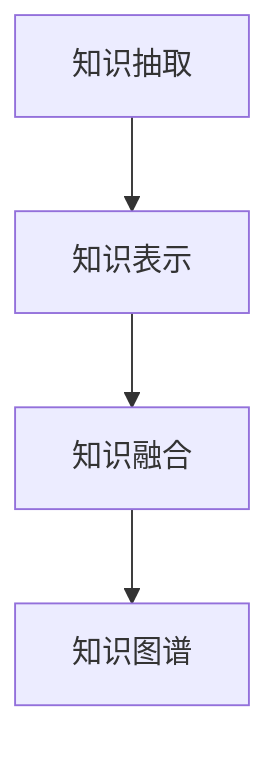
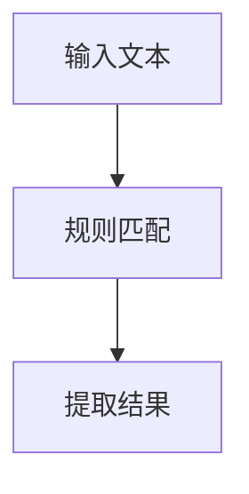
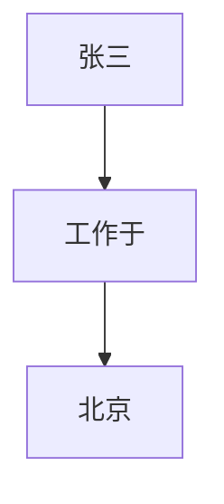
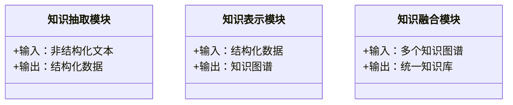
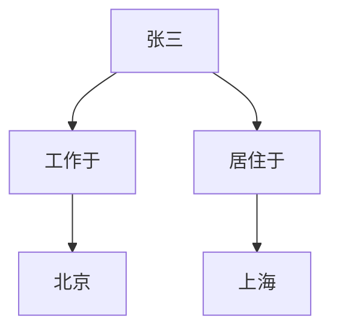

                 


# 构建AI Agent的知识获取Pipeline：从非结构化数据中学习

**关键词**：AI Agent、知识获取Pipeline、非结构化数据、知识抽取、知识表示、知识融合

**摘要**：  
本文详细探讨了构建AI Agent的知识获取Pipeline，从非结构化数据中提取和学习知识的核心方法。文章首先介绍了问题背景和目标，然后分析了知识抽取、表示和融合的核心概念，深入讲解了算法原理和数学模型，最后通过实际案例展示了系统的架构设计和实现。本文旨在为AI开发者和研究人员提供从非结构化数据中构建智能Agent的知识获取Pipeline的全面指导。

---

## 第1章: 知识获取Pipeline的背景与问题描述

### 1.1 问题背景
AI Agent是一种能够感知环境、执行任务并做出决策的智能体。其核心能力依赖于对知识的获取和理解。然而，现实世界中的数据大多以非结构化的形式存在，如文本、图像和视频，这些数据难以直接用于AI Agent的决策过程。因此，构建一个高效的非结构化数据知识获取Pipeline变得至关重要。

#### 1.1.1 AI Agent的概念与应用
AI Agent（智能体）是指能够感知环境、采取行动以实现目标的实体。它可以是一个软件系统，也可以是一个物理设备。AI Agent广泛应用于自然语言处理、推荐系统、自动驾驶等领域。例如，一个智能音箱（如Alexa）就是一个典型的AI Agent，它通过语音交互为用户提供服务。

#### 1.1.2 非结构化数据的挑战
非结构化数据（unstructured data）指的是没有明确结构，难以直接处理和分析的数据形式。例如，文本、图像和音频数据。这类数据占据了互联网上的绝大部分信息，但如何从中提取有用的知识是当前AI Agent面临的主要挑战。

#### 1.1.3 知识获取Pipeline的核心目标
知识获取Pipeline的目标是从非结构化数据中提取出可被AI Agent理解和使用的知识。例如，从一段自然语言文本中提取实体、关系和事件信息，构建知识图谱，从而为AI Agent提供决策支持。

### 1.2 问题描述
非结构化数据的复杂性和多样性使得知识获取过程面临诸多挑战。例如，文本中的歧义性、信息的不完整性和数据的多样性都可能影响知识获取的效果。

#### 1.2.1 非结构化数据的特点
非结构化数据的特点包括：
- **多样性**：数据形式多样，如文本、图像、音频等。
- **复杂性**：数据可能包含歧义、上下文依赖性强。
- **动态性**：数据不断变化，需要动态更新知识。

#### 1.2.2 知识获取Pipeline的目标
知识获取Pipeline的目标包括：
- **知识抽取**：从非结构化数据中提取实体、关系和属性。
- **知识表示**：将提取的知识转化为结构化的表示形式，如知识图谱。
- **知识融合**：将多个来源的知识进行整合，消除冲突，提高准确性。

#### 1.2.3 现有方法的局限性
现有的知识获取方法主要依赖于规则、统计和深度学习等技术。然而，这些方法在处理复杂、多样化的非结构化数据时仍存在以下局限性：
- 规则方法依赖人工设计，难以应对数据的动态变化。
- 统计方法受数据质量和数量的限制。
- 深度学习方法需要大量标注数据，且解释性较弱。

### 1.3 问题解决与边界
知识获取Pipeline的核心目标是将非结构化数据转化为结构化的知识，为AI Agent提供支持。因此，我们需要明确知识获取Pipeline的边界和核心要素。

#### 1.3.1 知识获取Pipeline的核心目标
- 从非结构化数据中提取实体、关系和事件。
- 构建结构化的知识图谱，支持AI Agent的决策和推理。

#### 1.3.2 边界与外延
知识获取Pipeline的边界包括：
- **输入**：非结构化数据（如文本、图像）。
- **输出**：结构化的知识表示（如知识图谱）。
- **外部依赖**：可能需要外部知识库（如词典、知识库）的支持。

#### 1.3.3 核心要素与组成
知识获取Pipeline的核心要素包括：
- **知识抽取模块**：从非结构化数据中提取信息。
- **知识表示模块**：将提取的信息转化为结构化的知识表示。
- **知识融合模块**：整合多源知识，消除冲突。

## 1.4 本章小结
本章介绍了AI Agent的知识获取Pipeline的背景和问题描述，分析了非结构化数据的特点和知识获取的核心目标。接下来，我们将深入探讨知识获取Pipeline的核心概念和原理。

---

## 第2章: 知识获取Pipeline的核心概念

### 2.1 核心概念原理
知识获取Pipeline的核心概念包括知识抽取、知识表示和知识融合。

#### 2.1.1 知识抽取
知识抽取是从非结构化数据中提取实体、关系和属性的过程。例如，从文本中提取人名、地名和组织名（NER任务）。

#### 2.1.2 知识表示
知识表示是将抽取的知识转化为结构化的形式，如知识图谱。例如，将“张三在北京工作”表示为（张三，工作于，北京）。

#### 2.1.3 知识融合
知识融合是将多个来源的知识进行整合，消除冲突，提高准确性。例如，从不同文本中提取的“张三”可能指的是同一个人，需要将这些信息整合起来。

### 2.2 核心概念对比
通过对比不同知识抽取方法的优劣，我们可以更好地理解它们的特点和适用场景。

#### 2.2.1 不同知识抽取方法的对比
| 方法       | 优点                           | 缺点                           |
|------------|--------------------------------|--------------------------------|
| 基于规则   | 简单易实现，适合特定场景       | 依赖人工设计，难以应对复杂场景 |
| 基于统计   | 可处理大量数据，结果概率化     | 结果不确定，难以解释           |
| 基于深度学习 | 高精度，可处理复杂模式         | 需要大量标注数据，解释性差     |

### 2.3 实体关系图
知识获取Pipeline的实体关系图如下：



### 2.4 本章小结
本章详细介绍了知识获取Pipeline的核心概念，包括知识抽取、知识表示和知识融合。通过对比不同方法的优劣，我们明确了它们的特点和适用场景。

---

## 第3章: 知识抽取算法原理

### 3.1 算法原理
知识抽取的主要算法包括基于规则、统计和深度学习的方法。

#### 3.1.1 基于规则的抽取
基于规则的抽取方法通过预定义的规则从文本中提取信息。例如，使用正则表达式提取电子邮件地址。

```python
import re
text = "Please contact me at alice@example.com"
email = re.search(r'\b[a-z0-9._%+-]+@[a-z0-9.-]+\.[a-z]{2,6}\b', text).group(0)
print(email)  # 输出: alice@example.com
```

#### 3.1.2 基于统计的抽取
基于统计的抽取方法利用统计模型从文本中提取信息。例如，使用条件随机场（CRF）进行命名实体识别。

#### 3.1.3 基于深度学习的抽取
基于深度学习的抽取方法利用神经网络模型（如BERT）从文本中提取信息。

### 3.2 数学模型
知识抽取的数学模型可以表示为：

$$P(y|x) = \prod_{i=1}^{n} P(y_i|x_i)$$

其中，$x$ 是输入文本，$y$ 是输出标签。

### 3.3 代码实现
以下是一个简单的基于规则的知识抽取示例：

```python
import re

def extract_emails(text):
    pattern = r'\b[a-z0-9._%+-]+@[a-z0-9.-]+\.[a-z]{2,6}\b'
    matches = re.findall(pattern, text)
    return matches

text = "Please contact me at alice@example.com or bob@example.net"
emails = extract_emails(text)
print(emails)  # 输出: ['alice@example.com', 'bob@example.net']
```

### 3.4 示例分析
以下是一个基于规则的抽取示例：



### 3.5 本章小结
本章详细介绍了知识抽取的算法原理，包括基于规则、统计和深度学习的方法，并给出了具体的代码实现和示例分析。

---

## 第4章: 知识表示与融合

### 4.1 知识表示
知识表示是将抽取的知识转化为结构化的形式。例如，将“张三在北京工作”表示为（张三，工作于，北京）。

#### 4.1.1 知识图谱
知识图谱是一种结构化的知识表示形式，由节点和边组成。例如：



### 4.2 知识融合
知识融合是将多个来源的知识进行整合，消除冲突。例如，从不同文本中提取的“张三”可能指的是同一个人，需要将这些信息整合起来。

#### 4.2.1 知识融合方法
知识融合的方法包括基于规则的融合和基于概率的融合。

### 4.3 本章小结
本章介绍了知识表示和融合的核心概念，包括知识图谱的表示形式和知识融合的方法。

---

## 第5章: 系统分析与架构设计

### 5.1 问题场景介绍
知识获取Pipeline的典型应用场景包括自然语言处理、推荐系统和自动驾驶等领域。

#### 5.1.1 系统目标
系统的目标是从非结构化数据中提取知识，构建知识图谱，支持AI Agent的决策和推理。

### 5.2 系统功能设计
系统的功能模块包括知识抽取、知识表示和知识融合。

#### 5.2.1 功能模块
- **知识抽取模块**：从非结构化数据中提取实体、关系和属性。
- **知识表示模块**：将提取的知识转化为结构化的知识图谱。
- **知识融合模块**：整合多源知识，消除冲突。

#### 5.2.2 系统架构
系统的架构设计如下：



### 5.3 接口设计
系统的接口设计包括输入接口和输出接口。

#### 5.3.1 输入接口
- **输入格式**：非结构化文本
- **输出格式**：结构化数据

#### 5.3.2 输出接口
- **输入格式**：结构化数据
- **输出格式**：知识图谱

### 5.4 本章小结
本章详细介绍了系统的架构设计和功能模块，包括知识抽取、知识表示和知识融合模块的接口设计。

---

## 第6章: 项目实战

### 6.1 环境安装
以下是项目所需的环境和工具：

```bash
pip install python3
pip install numpy
pip install networkx
pip install matplotlib
```

### 6.2 核心实现
以下是知识获取Pipeline的核心实现代码：

```python
import networkx as nx
import matplotlib.pyplot as plt

def build_knowledge_graph(text):
    # 知识抽取模块
    entities = extract_entities(text)
    relations = extract_relations(text)
    
    # 知识表示模块
    G = nx.DiGraph()
    for e in entities:
        G.add_node(e)
    for r in relations:
        G.add_edge(r[0], r[1], relation=r[2])
    
    return G

def extract_entities(text):
    # 示例：提取实体
    return ['张三', '北京']

def extract_relations(text):
    # 示例：提取关系
    return [('张三', '工作于', '北京')]

# 示例运行
text = "张三在北京工作"
G = build_knowledge_graph(text)
nx.draw(G, with_labels=True, node_color='lightblue', edge_color='red')
plt.show()
```

### 6.3 案例分析
以下是一个实际案例分析：



### 6.4 本章小结
本章通过实际案例展示了知识获取Pipeline的实现过程，包括环境安装、代码实现和案例分析。

---

## 第7章: 最佳实践与小结

### 7.1 最佳实践
以下是构建知识获取Pipeline的最佳实践：

- **数据预处理**：对数据进行清洗和预处理，提高抽取效果。
- **模型调优**：根据具体任务调整模型参数，优化性能。
- **知识图谱构建**：使用高效的图数据库（如Neo4j）存储和管理知识图谱。

### 7.2 小结
本章总结了构建知识获取Pipeline的关键点，包括数据预处理、模型调优和知识图谱构建。

---

## 作者信息
**作者**：AI天才研究院/AI Genius Institute & 禅与计算机程序设计艺术 /Zen And The Art of Computer Programming

---

通过以上内容，我们详细探讨了构建AI Agent的知识获取Pipeline，从非结构化数据中学习的核心方法。希望本文能为AI开发者和研究人员提供有价值的参考和启发。

