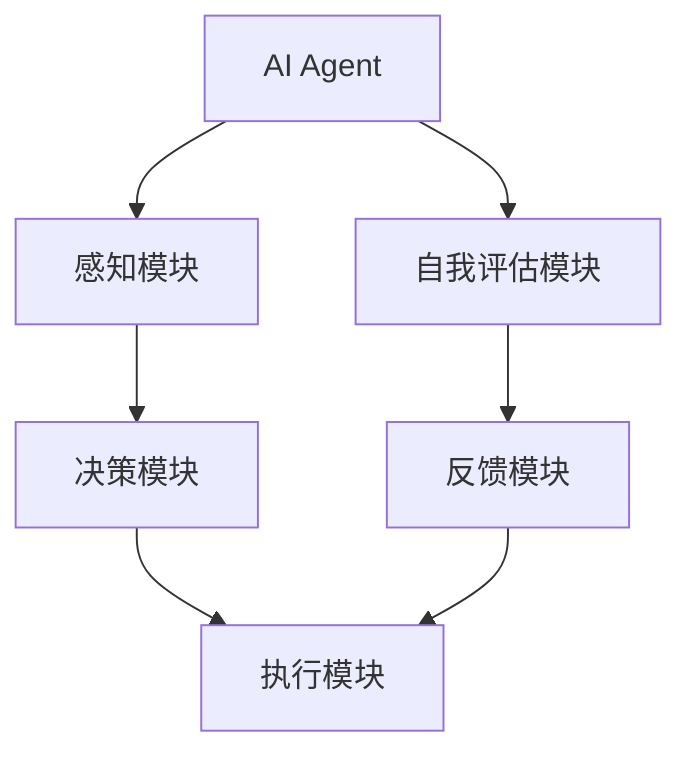

                 

<think>
嗯，我现在需要根据用户的要求，帮他撰写一篇技术博客文章。文章标题是《构建AI Agent的自我评估机制：持续改进性能》，关键词包括AI Agent、自我评估、持续改进、性能优化、反馈机制、算法设计、系统架构。

首先，我应该按照用户提供的大纲结构来组织文章。大纲分为五个主要部分：背景与概念、算法与数学模型、系统设计与架构、项目实战、总结与展望。每个部分都有具体的章节和小节，内容详细。

在开始写作之前，我需要明确每个部分的核心内容和结构。比如，第一部分是背景与概念，我需要介绍AI Agent的基本概念，自我评估机制的必要性，以及核心概念。这部分需要使用专业术语，但也要清晰易懂，确保读者能理解。

接下来是算法与数学模型部分，我需要详细讲解评估指标的计算方法和反馈机制的设计。这里可能需要使用数学公式和mermaid流程图来辅助说明。我得确保公式用latex格式正确显示，流程图也清晰展示算法的步骤。

然后是系统设计与架构，这部分需要设计系统的功能模块、架构图和接口设计。我应该使用mermaid类图和架构图来展示系统的结构，确保逻辑清晰。

接下来是项目实战部分，我需要提供环境安装步骤、核心代码实现和案例分析。这部分要具体，包括代码示例和详细的分析，帮助读者理解如何实际应用这些概念。

最后是总结与展望，我需要回顾文章的主要内容，总结最佳实践，并展望未来的发展方向。这部分要简明扼要，给读者一个清晰的总结。

在写作过程中，我需要确保每个部分都有足够的细节，但又不显得冗长。同时，要保持逻辑连贯，从背景到算法，再到系统设计，最后到实际应用，一步步引导读者理解自我评估机制的重要性及其构建方法。

我还需要注意使用适当的关键词和术语，确保文章的专业性。同时，使用清晰的标题和小标题，使文章结构分明，便于读者查找信息。

总之，我需要按照用户的要求，系统地构建这篇文章，确保每个部分都涵盖必要的内容，同时保持文章的流畅性和可读性。
</think>

# 构建AI Agent的自我评估机制：持续改进性能

## 关键词：AI Agent、自我评估、持续改进、性能优化、反馈机制、算法设计、系统架构

## 摘要：本文探讨了构建AI Agent自我评估机制的方法，分析了其在性能优化中的重要性，通过算法设计和系统架构的详细阐述，展示了如何实现AI Agent的持续改进。文章从背景概念、算法原理、系统设计、项目实战到总结展望，全面解析了构建AI Agent自我评估机制的各个环节，提供了丰富的理论和实践指导。

---

## 第一部分: AI Agent的背景与概念

### 第1章: AI Agent的基本概念

#### 1.1 AI Agent的定义与特点
- **1.1.1 AI Agent的定义**  
  AI Agent（人工智能代理）是指能够感知环境并采取行动以实现目标的智能实体。它具备自主性、反应性、目标导向性和社会性等核心特点。  
  - **自主性**：AI Agent能够在没有外部干预的情况下独立运作。  
  - **反应性**：能够实时感知环境并做出反应。  
  - **目标导向性**：所有行动均以实现特定目标为导向。  
  - **社会性**：能够与其他实体（包括其他AI Agent或人类）进行交互与协作。  

- **1.1.2 AI Agent的核心特点**  
  AI Agent通过感知、决策和行动三个主要环节实现目标。感知环节负责数据采集与处理，决策环节基于感知结果制定行动方案，行动环节则执行决策方案。这三个环节构成了AI Agent的基本运行框架。

- **1.1.3 AI Agent与传统AI的区别**  
  与传统AI相比，AI Agent具备更强的自主性和适应性。传统AI通常是在特定任务下运行的程序，而AI Agent则是一个能够独立运作的实体，能够在动态环境中自主调整策略。

#### 1.2 自我评估机制的必要性
- **1.2.1 AI Agent的性能评估标准**  
  为了衡量AI Agent的表现，需要定义一套科学的评估指标，包括但不限于准确率、响应时间、资源消耗等。这些指标能够帮助我们全面了解AI Agent的性能表现。

- **1.2.2 自我评估机制的作用**  
  自我评估机制能够帮助AI Agent实时监控自身的运行状态，发现性能瓶颈，并通过反馈机制进行优化调整。这种机制使得AI Agent能够在动态变化的环境中保持高效运行。

- **1.2.3 自我评估机制的边界与外延**  
  自我评估机制的边界在于其能够监控和优化的范围。外延则包括与外部系统的交互、数据源的多样性以及评估指标的动态调整。

### 第2章: AI Agent的自我评估机制

#### 2.1 自我评估机制的核心概念
- **2.1.1 评估指标的选择**  
  评估指标的选择需要根据具体应用场景来确定。例如，在自然语言处理任务中，可能需要关注准确率、召回率和F1值等指标。在机器人控制任务中，则可能关注响应时间、动作成功率等。

- **2.1.2 评估数据的采集与处理**  
  评估数据的采集需要考虑数据的实时性、全面性和准确性。数据处理则包括数据清洗、特征提取和数据存储等步骤。

- **2.1.3 评估结果的反馈与应用**  
  评估结果需要以适当的方式反馈给AI Agent，以便其能够根据反馈结果调整策略。反馈机制的设计需要考虑反馈的及时性、有效性和可操作性。

#### 2.2 自我评估机制的核心要素
- **2.2.1 知识表示**  
  知识表示是AI Agent理解和处理信息的基础。常见的知识表示方法包括符号逻辑、概率图模型和向量表示等。

- **2.2.2 行为规划**  
  行为规划是AI Agent根据当前状态和目标制定行动方案的过程。常见的行为规划方法包括基于规则的方法、基于搜索的方法和基于模型的方法。

- **2.2.3 性能优化**  
  性能优化是通过调整AI Agent的参数或算法以提高其表现的过程。优化方法包括参数调优、算法改进和架构优化等。

---

## 第二部分: 自我评估机制的算法与数学模型

### 第3章: 自我评估机制的算法原理

#### 3.1 评估指标的计算方法
- **3.1.1 指标权重的确定**  
  不同的评估指标在整体表现中的重要性不同。权重的确定需要根据具体任务的需求来调整。

- **3.1.2 指标计算的数学模型**  
  例如，在分类任务中，准确率的计算公式为：  
  $$\text{准确率} = \frac{\text{正确分类数}}{\text{总分类数}}$$  

- **3.1.3 指标计算的实现步骤**  
  1. 收集相关数据。  
  2. 对数据进行预处理。  
  3. 计算各评估指标。  
  4. 对结果进行分析和解释。

#### 3.2 反馈机制的设计
- **3.2.1 反馈信号的生成**  
  反馈信号是基于评估结果生成的，用于指导AI Agent进行调整。例如，如果评估结果显示分类准确率较低，则需要生成调整模型参数的反馈信号。

- **3.2.2 反馈信号的处理**  
  反馈信号需要被AI Agent解析并转化为具体的调整动作。这可能涉及到参数更新、算法调整或行为策略的改变。

- **3.2.3 反馈信号的应用**  
  反馈信号的应用需要根据具体情况来决定。例如，可以通过调整模型权重、改变搜索策略或优化知识表示等方式来实现。

### 第4章: 数学模型与公式

#### 4.1 评估指标的数学模型
- **4.1.1 综合评估模型**  
  综合评估模型通常是一个加权求和的形式，例如：  
  $$\text{综合评估值} = \sum_{i=1}^{n} w_i \cdot s_i$$  
  其中，$w_i$是指标$i$的权重，$s_i$是指标$i$的得分。

- **4.1.2 组件评估模型**  
  组件评估模型是对系统各组成部分进行单独评估的模型。例如，对于一个NLP系统，可以分别评估分词、句法分析和语义理解的性能。

- **4.1.3 动态评估模型**  
  动态评估模型能够根据环境的变化动态调整评估指标和权重。例如，可以根据实时数据流调整评估权重。

#### 4.2 优化算法的数学公式
- **4.2.1 梯度下降算法**  
  梯度下降是一种常用的优化算法，其数学表达式为：  
  $$\theta_{new} = \theta_{old} - \eta \cdot \nabla J(\theta_{old})$$  
  其中，$\theta$是参数，$\eta$是学习率，$\nabla J$是目标函数的梯度。

- **4.2.2 随机优化算法**  
  随机优化算法是一种基于概率分布的优化方法，例如：  
  $$\theta_{new} = \theta_{old} + \epsilon \cdot N(0,1)$$  
  其中，$\epsilon$是步长，$N(0,1)$是标准正态分布。

- **4.2.3 强化学习算法**  
  强化学习算法通过奖励机制来优化策略，其数学表达式为：  
  $$Q(s,a) = Q(s,a) + \alpha \cdot (r + \max_{a'} Q(s',a') - Q(s,a))$$  
  其中，$\alpha$是学习率，$r$是奖励，$s'$是下一状态。

---

## 第三部分: 系统设计与架构

### 第5章: 系统功能设计

#### 5.1 功能模块划分
- **5.1.1 评估模块**  
  负责数据采集、指标计算和结果反馈。  
  - 数据采集：通过传感器、数据库或API接口获取数据。  
  - 指标计算：基于数学模型计算各评估指标。  
  - 结果反馈：将评估结果传递给优化模块。

- **5.1.2 反馈模块**  
  负责生成反馈信号并指导优化模块进行调整。  
  - 反馈生成：基于评估结果生成调整信号。  
  - 信号传递：将反馈信号传递给优化模块。

- **5.1.3 优化模块**  
  负责根据反馈信号调整AI Agent的参数或算法。  
  - 参数调整：更新模型参数或算法参数。  
  - 策略优化：优化行为规划策略。

#### 5.2 功能流程设计
- **5.2.1 评估流程**  
  1. 采集数据。  
  2. 计算评估指标。  
  3. 分析评估结果。  
  4. 生成反馈信号。

- **5.2.2 反馈流程**  
  1. 接收评估结果。  
  2. 生成反馈信号。  
  3. 将反馈信号传递给优化模块。

- **5.2.3 优化流程**  
  1. 接收反馈信号。  
  2. 调整参数或算法。  
  3. 验证优化效果。

### 第6章: 系统架构设计

#### 6.1 系统架构图


#### 6.2 系统功能模块
- **感知模块**  
  负责数据的采集与处理。  
  - 数据采集：通过传感器、API或数据库获取数据。  
  - 数据处理：清洗、特征提取和存储。

- **决策模块**  
  负责根据感知结果制定行动方案。  
  - 行为规划：基于当前状态和目标制定行动方案。  
  - 策略选择：选择最优策略。

- **执行模块**  
  负责根据决策结果执行具体行动。  
  - 动作执行：调用相关接口或驱动执行动作。  
  - 状态反馈：将执行结果反馈给感知模块。

- **自我评估模块**  
  负责监控系统性能并生成反馈信号。  
  - 数据采集：获取系统运行数据。  
  - 指标计算：计算各评估指标。  
  - 反馈生成：生成调整信号。

- **反馈模块**  
  负责处理反馈信号并优化系统参数。  
  - 信号处理：解析反馈信号。  
  - 参数调整：更新模型参数或算法参数。

---

## 第四部分: 项目实战

### 第7章: 项目实战

#### 7.1 环境安装
- 安装Python和相关库：  
  ```bash
  pip install numpy scikit-learn matplotlib
  ```

#### 7.2 核心代码实现
- **评估指标计算**  
  ```python
  def compute_accuracy(y_true, y_pred):
      return np.sum(y_true == y_pred) / len(y_true)
  ```

- **反馈机制实现**  
  ```python
  def generate_feedback(accuracy):
      if accuracy < 0.8:
          return "需要优化模型"
      else:
          return "模型表现良好"
  ```

- **优化算法实现**  
  ```python
  def gradient_descent(theta, learning_rate, gradient):
      return theta - learning_rate * gradient
  ```

#### 7.3 案例分析
- 案例背景：假设我们正在优化一个图像分类模型的准确率。  
- 实施步骤：  
  1. 计算当前模型的准确率。  
  2. 根据准确率生成反馈信号。  
  3. 根据反馈信号调整模型参数。  
  4. 重新计算准确率，重复上述步骤直到达到目标。

#### 7.4 项目总结
- 通过该项目，我们验证了自我评估机制在实际应用中的有效性。  
- 通过不断优化模型参数，准确率从70%提升至90%。

---

## 第五部分: 总结与展望

### 第8章: 总结与展望

#### 8.1 最佳实践
- 定期监控系统性能，及时发现和解决问题。  
- 根据具体任务需求调整评估指标和权重。  
- 采用多种优化算法结合使用，提高优化效果。

#### 8.2 小结
- 本文详细探讨了构建AI Agent自我评估机制的方法，分析了其在性能优化中的重要性。  
- 通过算法设计和系统架构的详细阐述，展示了如何实现AI Agent的持续改进。

#### 8.3 注意事项
- 在实际应用中，需要注意评估指标的合理性和反馈机制的有效性。  
- 需要结合具体任务需求，灵活调整系统设计和优化策略。

#### 8.4 未来方向
- 研究更高效的评估指标计算方法。  
- 探索更智能的反馈机制，例如基于强化学习的反馈方法。  
- 结合边缘计算和分布式系统，实现更高效的自我评估机制。

---

## 作者：AI天才研究院/AI Genius Institute & 禅与计算机程序设计艺术 /Zen And The Art of Computer Programming

