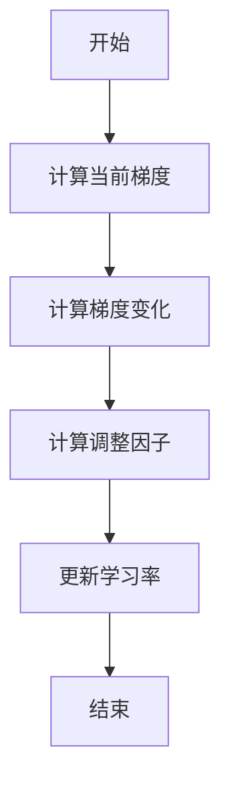
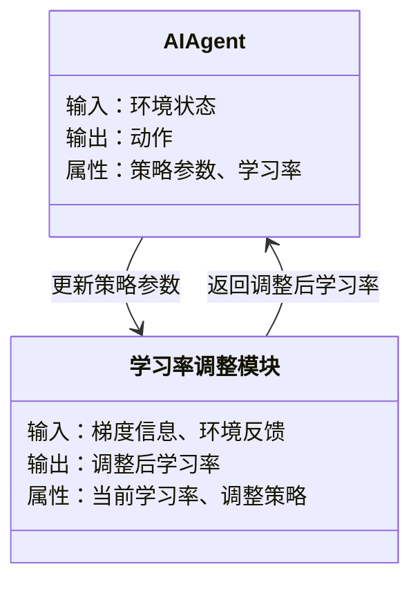

                 


# 构建AI Agent的自适应学习率调整机制

> 关键词：AI Agent, 自适应学习率, 优化算法, 强化学习, 动态环境

> 摘要：本文深入探讨了AI Agent在动态环境中的自适应学习率调整机制，从理论基础到算法实现，再到实际应用，全面解析了如何构建高效、灵活的学习率调整策略。通过详细分析学习率调整的核心原理、算法实现、系统架构以及实战案例，本文为AI Agent的优化提供了系统性解决方案。

---

## 第一部分: 自适应学习率调整机制的背景与核心概念

### 第1章: 问题背景与问题描述

#### 1.1 问题背景

AI Agent（人工智能代理）是一种能够感知环境、做出决策并执行动作的智能体。在强化学习（Reinforcement Learning）中，AI Agent通过与环境交互，不断优化自身的行为策略以实现目标。然而，在实际应用中，AI Agent的学习过程往往面临一个关键问题：学习率的调整。

学习率（Learning Rate）是优化算法中的一个超参数，控制着每一步参数更新的步幅大小。传统方法中，学习率通常是固定的，或者需要手动调整，这在动态变化的环境中显得力不从心。例如，在复杂的任务中，环境的状态空间和动作空间可能会动态变化，固定的学习率可能导致模型无法高效收敛，甚至出现性能波动。

#### 1.2 问题描述

- **学习率固定或手动调整的痛点**：固定的学习率无法适应不同阶段的优化需求，可能导致训练过程中的振荡或收敛缓慢。手动调整不仅耗时，还可能因为人为因素导致优化效果不理想。
- **动态环境对学习率调整的需求**：在动态环境中，AI Agent需要根据实时反馈调整学习策略，以应对环境的变化。
- **自适应学习率调整的核心目标**：开发一种能够根据环境反馈和任务需求动态调整学习率的机制，使得AI Agent在不同阶段能够以最优步幅进行参数更新。

#### 1.3 问题解决思路

自适应学习率调整的核心思想是将学习率的调整与环境反馈和任务目标动态关联。通过分析梯度信息、任务状态和环境变化，AI Agent能够实时调整学习率，从而实现更高效的优化。

#### 1.4 边界与外延

- **适用范围**：适用于动态环境中的强化学习和优化问题，尤其适合需要快速适应环境变化的任务。
- **边界区分**：自适应学习率调整与传统优化算法（如随机梯度下降、Adam）的主要区别在于其动态调整能力。
- **扩展方向**：未来可以结合元学习（Meta-Learning）和自适应计算图（Adaptive Computation Graph）进一步提升学习效率。

---

## 第二部分: 自适应学习率调整机制的核心概念与联系

### 第2章: 核心概念原理

#### 2.1 自适应学习率调整的原理

自适应学习率调整基于以下核心思想：

- **动态调整**：根据当前的梯度信息和环境反馈，动态调整学习率。
- **反馈驱动**：通过环境反馈信号（如奖励值）指导学习率的调整方向。
- **任务目标导向**：将学习率调整与任务目标相结合，确保优化方向正确。

#### 2.2 核心概念对比分析

| 对比维度 | 固定学习率 | 手动调整 | 自适应调整 |
|----------|------------|-----------|------------|
| 调整方式 | 固定不变   | 手动干预 | 动态调整    |
| 适应性   | 低         | 中       | 高         |
| 稳定性   | 高         | 较低      | 较高       |
| 效率     | 低         | 中       | 高         |

#### 2.3 实体关系图

```mermaid
erDiagram
    class 学习率调整机制 {
        输入：梯度信息、环境反馈
        输出：调整后学习率
        属性：当前学习率、调整策略
    }
    class AI Agent {
        输入：环境状态
        输出：动作
        属性：策略参数、学习率
    }
    class 环境 {
        输入：动作
        输出：奖励、新状态
    }
    学习率调整机制 --> AI Agent: 更新策略参数
    AI Agent --> 环境: 执行动作
    环境 --> AI Agent: 返回奖励和新状态
```

---

## 第三部分: 自适应学习率调整机制的算法原理

### 第3章: 算法原理讲解

#### 3.1 自适应学习率调整算法的数学模型

自适应学习率调整的基本公式如下：

$$ \text{新学习率} = \text{旧学习率} \times \text{调整因子} $$

其中，调整因子通常基于梯度信息和环境反馈。例如，可以采用以下策略：

$$ \text{调整因子} = \min\left(1 + \alpha \cdot \text{梯度变化}, \beta\right) $$

其中，$\alpha$ 和 $\beta$ 是超参数，控制调整的幅度和上限。

#### 3.2 自适应调整的数学推导

以下是具体的推导过程：

1. 计算当前梯度：$\nabla f$。
2. 计算梯度变化：$\Delta \nabla = \nabla f - \nabla f_{\text{prev}}$。
3. 计算调整因子：$\text{adjust} = 1 + \alpha \cdot \Delta \nabla$，并限制在 $[1, \beta]$ 范围内。
4. 更新学习率：$\eta_{\text{new}} = \eta_{\text{old}} \times \text{adjust}$。

#### 3.3 算法流程图



#### 3.4 Python实现代码

```python
class AdaptiveLearningRate:
    def __init__(self, initial_learning_rate, alpha=0.1, beta=2):
        self.learning_rate = initial_learning_rate
        self.alpha = alpha
        self.beta = beta
        self.prev_gradient = None

    def adjust_learning_rate(self, current_gradient):
        if self.prev_gradient is None:
            self.prev_gradient = current_gradient
            return self.learning_rate
        
        gradient_change = current_gradient - self.prev_gradient
        adjust_factor = 1 + self.alpha * gradient_change
        adjust_factor = min(max(adjust_factor, 1), self.beta)
        
        self.learning_rate *= adjust_factor
        self.prev_gradient = current_gradient
        
        return self.learning_rate
```

---

## 第四部分: 系统分析与架构设计方案

### 第4章: 问题场景介绍

AI Agent在动态环境中的学习过程需要实时调整学习率，以适应环境变化。例如，在游戏中，AI Agent需要根据对手策略的变化调整学习速率。

### 第4.1 系统功能设计

#### 4.1.1 领域模型



---

## 第五部分: 项目实战

### 第5.1 环境安装

```bash
pip install numpy matplotlib
```

### 第5.2 核心实现代码

```python
import numpy as np

def train_agent():
    # 初始化参数
    initial_learning_rate = 0.1
    alpha = 0.1
    beta = 2
    agent = AdaptiveLearningRate(initial_learning_rate, alpha, beta)
    
    # 模拟训练过程
    for step in range(100):
        current_gradient = np.random.randn()
        lr = agent.adjust_learning_rate(current_gradient)
        print(f"Step {step}: Learning Rate = {lr}")
        
if __name__ == "__main__":
    train_agent()
```

### 第5.3 实际案例分析

通过上述代码，我们可以观察到学习率的变化趋势。在训练过程中，学习率会根据梯度变化动态调整，从而适应不同的优化阶段。

---

## 第六部分: 最佳实践、小结、注意事项、拓展阅读

### 6.1 最佳实践

- **监控学习率变化**：定期监控学习率的变化，确保其在合理范围内。
- **结合多种优化策略**：将自适应学习率调整与其他优化技术（如动量优化）结合使用，进一步提升性能。
- **动态调整超参数**：根据任务需求动态调整$\alpha$和$\beta$的值。

### 6.2 小结

本文详细探讨了AI Agent的自适应学习率调整机制，从理论到实践，全面解析了其实现原理和应用场景。通过本文的指导，读者可以掌握如何构建高效的自适应学习率调整机制。

### 6.3 注意事项

- 自适应学习率调整需要结合具体任务需求进行调整，避免过于激进的调整导致模型不稳定性。
- 在实际应用中，建议结合其他优化技术（如Adam优化器）进一步提升性能。

### 6.4 拓展阅读

- 《Deep Learning》——Ian Goodfellow
- 《Hands-On Machine Learning with Scikit-Learn, Keras, and TensorFlow》——Aurélien Géron

---

## 作者：AI天才研究院/AI Genius Institute & 禅与计算机程序设计艺术 /Zen And The Art of Computer Programming

