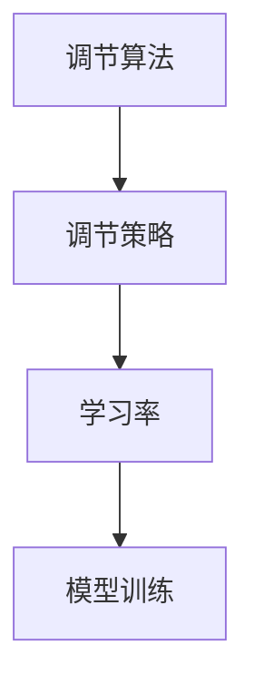
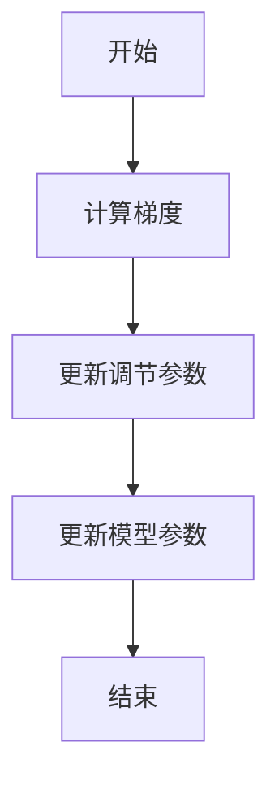
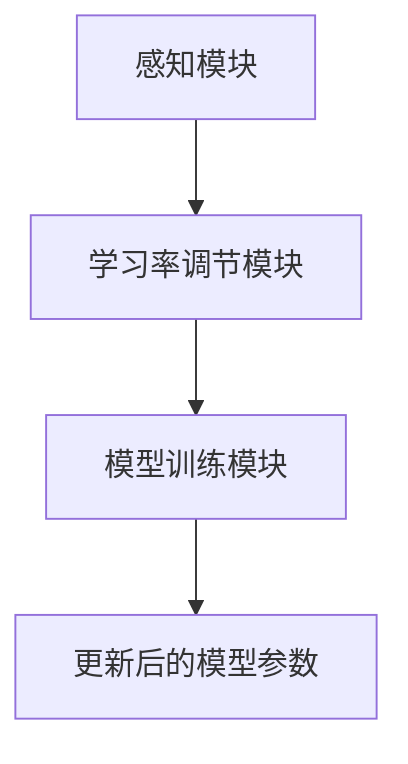
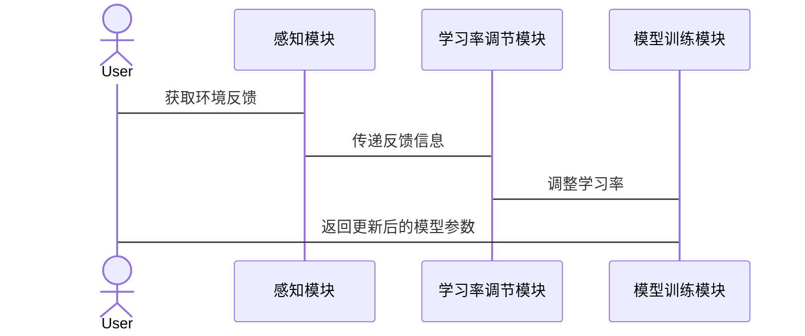

                 


# 构建AI Agent的自适应学习率调节系统

> 关键词：AI Agent，自适应学习率，优化算法，动态调节，机器学习

> 摘要：本文详细探讨了构建AI Agent自适应学习率调节系统的各个方面，从背景到核心概念，再到算法原理和系统设计。文章通过数学建模、算法流程图和系统架构图，深入分析了自适应学习率调节的原理和实现方法，并结合实际案例，展示了如何在AI Agent中实现高效的自适应学习率调节。

---

## 第一部分: AI Agent与自适应学习率调节系统概述

### 第1章: AI Agent与自适应学习率调节系统背景介绍

#### 1.1 AI Agent的基本概念

##### 1.1.1 AI Agent的定义与特点
AI Agent（人工智能代理）是指能够感知环境、自主决策并执行任务的智能实体。它具有以下特点：
- **自主性**：能够自主决策，无需外部干预。
- **反应性**：能够实时感知环境并做出反应。
- **目标导向**：具有明确的目标，通过行动实现目标。

##### 1.1.2 AI Agent的应用场景
AI Agent广泛应用于多个领域，包括：
- **自动驾驶**：通过感知环境并做出实时决策。
- **智能推荐系统**：根据用户行为推荐相关内容。
- **机器人控制**：实现机器人自主导航和任务执行。

##### 1.1.3 自适应学习率调节的重要性
在AI Agent的学习过程中，学习率（Learning Rate）是一个关键参数。传统的固定学习率在动态环境中往往无法适应变化，导致训练效率低下或模型性能不佳。自适应学习率调节能够根据环境动态调整学习率，提升学习效率和模型性能。

#### 1.2 自适应学习率调节的背景与问题背景

##### 1.2.1 传统学习率调节的局限性
传统的学习率调节方法（如固定学习率或手动调整）存在以下问题：
- **适应性差**：无法根据环境变化自动调整。
- **效率低**：需要反复试验和手动调节，耗时且效率低。

##### 1.2.2 动态数据环境下的挑战
在动态数据环境中，模型需要快速适应数据分布的变化。传统学习率调节方法难以应对这种动态变化，可能导致模型性能下降或训练过程不稳定。

##### 1.2.3 自适应学习率调节的必要性
自适应学习率调节能够根据环境动态调整学习率，提高模型的适应性和训练效率，是应对动态数据环境的重要手段。

#### 1.3 问题描述与目标

##### 1.3.1 问题背景分析
在AI Agent的学习过程中，学习率的调整直接影响模型的收敛速度和最终性能。如何在动态环境中自适应调整学习率，是当前研究的热点问题。

##### 1.3.2 问题的数学建模
学习率调节问题可以表示为一个优化问题。设模型参数为θ，目标函数为f(θ)，学习率为α。自适应学习率调节的目标是找到合适的α(t)序列，使得模型在t时刻的损失函数f(θ(t))达到最小。

##### 1.3.3 自适应学习率调节的目标与边界
目标：
- **快速收敛**：在动态环境中快速找到最优参数。
- **稳定性**：避免模型在训练过程中出现振荡或发散。

边界：
- **计算效率**：调整学习率的计算过程需要高效，不能显著增加计算开销。
- **实时性**：调整过程需要实时完成，适应动态环境的变化。

#### 1.4 核心概念与系统架构

##### 1.4.1 自适应学习率调节的核心要素
自适应学习率调节系统由以下核心要素组成：
- **学习率调节算法**：负责根据当前状态调整学习率。
- **模型状态**：包括当前模型参数、梯度信息等。
- **环境反馈**：包括任务目标、数据分布变化等。

##### 1.4.2 系统架构的组成与功能
系统架构包括以下模块：
- **感知模块**：感知环境变化，获取反馈信息。
- **学习率调节模块**：根据反馈信息调整学习率。
- **模型训练模块**：使用调整后的学习率更新模型参数。

##### 1.4.3 系统的输入输出与交互流程
输入：
- **环境反馈**：包括数据变化、任务目标等。
- **模型状态**：包括当前模型参数、梯度信息等。

输出：
- **调整后的学习率**：根据反馈和模型状态计算出新的学习率。
- **更新后的模型参数**：使用调整后的学习率更新模型参数。

交互流程：
1. 感知模块获取环境反馈。
2. 学习率调节模块根据反馈和模型状态调整学习率。
3. 模型训练模块使用调整后的学习率更新模型参数。
4. 重复上述步骤，直到达到目标或满足终止条件。

#### 1.5 本章小结
本章介绍了AI Agent的基本概念和应用场景，分析了自适应学习率调节的背景和必要性，提出了系统架构和交互流程。这些内容为后续章节的深入分析奠定了基础。

---

## 第二部分: 自适应学习率调节的核心原理

### 第2章: 自适应学习率调节的核心概念与联系

#### 2.1 自适应学习率调节的原理

##### 2.1.1 传统学习率调节方法
传统学习率调节方法包括：
- **固定学习率**：在整个训练过程中使用固定的学习率。
- **手动调整**：根据经验手动调整学习率。

##### 2.1.2 自适应学习率调节的创新点
自适应学习率调节的核心创新在于能够根据环境动态调整学习率，无需人工干预，具有更高的适应性和效率。

##### 2.1.3 自适应调节的核心机制
自适应学习率调节的核心机制包括：
- **梯度自适应**：根据梯度信息调整学习率。
- **动量优化**：引入动量机制加速收敛。

#### 2.2 核心概念的属性特征对比

##### 2.2.1 学习率与模型性能的关系
学习率的大小直接影响模型的收敛速度和最终性能：
- **小学习率**：收敛速度慢，但可能避免过拟合。
- **大学习率**：收敛速度快，但可能导致模型发散。

##### 2.2.2 自适应调节与其他优化算法的对比
对比自适应学习率调节与其他优化算法（如随机梯度下降、Adam优化器）的差异和优劣。

##### 2.2.3 调节策略的动态性分析
分析调节策略在动态环境中的变化规律和适应性。

#### 2.3 ER实体关系图与系统架构

##### 2.3.1 实体关系图的构建
通过ER图展示系统中的实体及其关系。
```mermaid
er
actor: 调节算法
role: 调节策略
entity: 学习率
```

##### 2.3.2 系统架构的模块划分
通过模块图展示系统架构。


#### 2.4 本章小结
本章分析了自适应学习率调节的核心原理，对比了传统方法和创新点，构建了系统的实体关系图和模块架构。

---

## 第三部分: 自适应学习率调节的算法原理

### 第3章: 自适应学习率调节的算法原理

#### 3.1 基于梯度的方法

##### 3.1.1 梯度下降法的数学模型
$$f(x) = x^2$$
$$\text{学习率} = \alpha = \frac{1}{1 + t}$$

##### 3.1.2 带动量的梯度下降法
$$v_t = \beta v_{t-1} + (1-\beta)g_t$$
$$\theta_{t} = \theta_{t-1} - \alpha v_t$$`

#### 3.2 自适应学习率调节算法

##### 3.2.1 Adam优化器的原理
$$m_t = \beta_1 m_{t-1} + (1-\beta_1)g_t$$
$$v_t = \beta_2 v_{t-1} + (1-\beta_2)g_t^2$$
$$\theta_{t} = \theta_{t-1} - \frac{\alpha}{\sqrt{v_t + \epsilon}} m_t$$`

##### 3.2.2 Adam优化器的优化步骤
1. 计算梯度：$g_t = \nabla f(\theta_{t-1})$
2. 更新动量：$m_t = \beta_1 m_{t-1} + (1-\beta_1)g_t$
3. 更新二阶动量：$v_t = \beta_2 v_{t-1} + (1-\beta_2)g_t^2$
4. 计算调整后的学习率：$\alpha_t = \frac{\alpha}{\sqrt{v_t + \epsilon}}$
5. 更新参数：$\theta_t = \theta_{t-1} - \alpha_t m_t$

#### 3.3 自适应学习率调节的流程图


#### 3.4 本章小结
本章详细讲解了自适应学习率调节的算法原理，包括基于梯度的方法和Adam优化器的优化步骤，并通过流程图展示了调节过程。

---

## 第四部分: 系统设计与实现

### 第4章: 自适应学习率调节系统的系统设计

#### 4.1 问题场景介绍
在动态数据环境中，模型需要快速适应数据分布的变化。传统的固定学习率方法难以应对这种变化，可能导致模型性能下降或训练过程不稳定。

#### 4.2 项目介绍
本项目旨在设计一个自适应学习率调节系统，能够根据环境动态调整学习率，提升模型的适应性和训练效率。

#### 4.3 系统功能设计

##### 4.3.1 系统架构设计
系统架构包括以下模块：
- **感知模块**：感知环境变化，获取反馈信息。
- **学习率调节模块**：根据反馈信息调整学习率。
- **模型训练模块**：使用调整后的学习率更新模型参数。

##### 4.3.2 系统架构图


#### 4.4 系统接口设计

##### 4.4.1 感知模块接口
```python
class PerceptionModule:
    def get_feedback(self):
        # 返回环境反馈
        pass
```

##### 4.4.2 学习率调节模块接口
```python
class LearningRateAdapter:
    def adjust_learning_rate(self, feedback, model_state):
        # 根据反馈和模型状态调整学习率
        pass
```

##### 4.4.3 模型训练模块接口
```python
class ModelTrainingModule:
    def train_model(self, learning_rate):
        # 使用给定学习率训练模型
        pass
```

#### 4.5 系统交互流程图


#### 4.6 本章小结
本章设计了一个自适应学习率调节系统的系统架构和接口，展示了系统的交互流程。

---

## 第五部分: 项目实战

### 第5章: 自适应学习率调节系统的实现

#### 5.1 环境安装与配置

##### 5.1.1 安装依赖
安装所需的库和工具，例如Python、TensorFlow、Keras等。

##### 5.1.2 配置开发环境
配置IDE和开发工具，确保环境能够运行AI Agent和自适应学习率调节系统。

#### 5.2 核心实现

##### 5.2.1 学习率调节算法实现
实现自适应学习率调节算法，例如Adam优化器。

##### 5.2.2 系统功能实现
实现系统功能模块，包括感知模块、学习率调节模块和模型训练模块。

#### 5.3 代码实现

##### 5.3.1 学习率调节算法代码
```python
class AdamOptimizer:
    def __init__(self, learning_rate=0.001, beta1=0.9, beta2=0.999, epsilon=1e-7):
        self.alpha = learning_rate
        self.beta1 = beta1
        self.beta2 = beta2
        self.epsilon = epsilon
        self.m = None
        self.v = None
        self.t = 0

    def update(self, params, grads):
        if self.m is None:
            self.m = [np.zeros_like(p) for p in params]
            self.v = [np.zeros_like(p) for p in params]
        self.t += 1
        for i in range(len(params)):
            self.m[i] = self.beta1 * self.m[i] + (1 - self.beta1) * grads[i]
            self.v[i] = self.beta2 * self.v[i] + (1 - self.beta2) * grads[i] ** 2
            alpha_t = self.alpha * np.sqrt(1 - self.beta2 ** self.t) / (1 - self.beta1 ** self.t)
            params[i] -= alpha_t * self.m[i] / (self.v[i] + self.epsilon)
        return params
```

##### 5.3.2 系统功能代码
```python
class System:
    def __init__(self):
        self.optimizer = AdamOptimizer()
        self.model = None
        self.feedback = None

    def perceive(self):
        # 获取环境反馈
        self.feedback = get_feedback()

    def adjust_learning_rate(self):
        # 根据反馈调整学习率
        self.optimizer.update(self.model.params, self.feedback)

    def train(self):
        # 训练模型
        self.model.train(self.feedback)
```

#### 5.4 代码应用与分析

##### 5.4.1 代码功能解读
- **AdamOptimizer类**：实现Adam优化算法，负责调整学习率。
- **System类**：实现系统功能，包括感知、调整学习率和训练模型。

##### 5.4.2 代码实现细节
- **Adam优化器**：通过动量和二阶动量的结合，实现自适应学习率调节。
- **系统交互**：感知模块获取环境反馈，学习率调节模块根据反馈调整学习率，模型训练模块使用调整后的学习率更新模型参数。

#### 5.5 实际案例分析

##### 5.5.1 案例场景描述
假设我们正在训练一个AI Agent进行图像分类任务，数据集不断更新，需要自适应调整学习率。

##### 5.5.2 实施步骤
1. 初始化系统。
2. 获取环境反馈。
3. 调整学习率。
4. 更新模型参数。
5. 重复步骤，直到达到目标。

##### 5.5.3 实施效果分析
通过自适应学习率调节，模型能够更快地适应数据分布的变化，提高分类准确率和训练效率。

#### 5.6 本章小结
本章通过具体实现展示了自适应学习率调节系统的功能和效果，为读者提供了实际应用的参考。

---

## 第六部分: 最佳实践与总结

### 第6章: 最佳实践与总结

#### 6.1 最佳实践

##### 6.1.1 系统设计建议
- **模块化设计**：将系统划分为独立的模块，便于维护和扩展。
- **实时性优化**：确保系统能够实时调整学习率，适应动态环境。

##### 6.1.2 代码实现建议
- **选择合适的框架**：使用TensorFlow或PyTorch等深度学习框架，方便实现自适应学习率调节。
- **优化算法选择**：根据具体任务选择合适的优化算法，如Adam、SGD等。

##### 6.1.3 系统测试与调优
- **单元测试**：对各模块进行单元测试，确保功能正常。
- **性能调优**：通过实验调整参数，找到最优配置。

#### 6.2 小结
自适应学习率调节系统能够显著提升AI Agent的训练效率和模型性能，是应对动态环境的重要工具。

#### 6.3 注意事项
- **计算效率**：调整学习率的过程需要高效，不能显著增加计算开销。
- **实时性**：系统需要实时调整学习率，适应动态环境的变化。

#### 6.4 拓展阅读
建议读者进一步阅读相关文献，深入了解自适应学习率调节的最新研究成果和技术进展。

---

## 作者信息

作者：AI天才研究院/AI Genius Institute & 禅与计算机程序设计艺术 /Zen And The Art of Computer Programming

---

以上是完整的《构建AI Agent的自适应学习率调节系统》技术博客文章的撰写过程。希望本文能够为读者提供清晰的思路和详细的实现方法，帮助他们在实际项目中更好地构建和优化自适应学习率调节系统。

