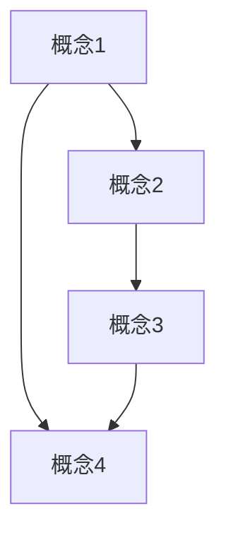
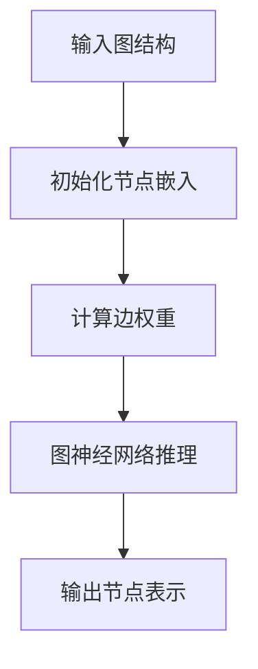
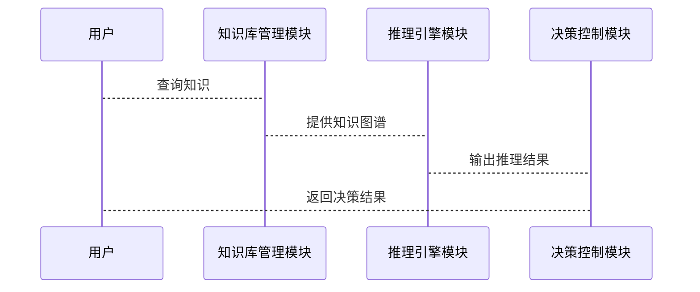

                 


# 《构建AI Agent的认知计算图模型》

> 关键词：AI Agent，认知计算图模型，图神经网络，注意力机制，系统架构设计，项目实战

> 摘要：本文详细探讨了构建AI Agent的认知计算图模型的理论基础、算法实现和系统设计。通过分析认知计算图模型的核心概念、算法原理和系统架构，结合实际案例，展示了如何通过认知计算图模型构建高效、智能的AI Agent。文章内容涵盖从理论到实践的全过程，为读者提供了一套完整的解决方案。

---

# 引言

AI Agent（人工智能代理）是指能够感知环境、自主决策并采取行动以实现目标的智能系统。认知计算图模型作为一种新兴的AI Agent构建方法，通过图结构的语义表达和动态更新，为AI Agent的认知推理和决策提供了一种高效、灵活的框架。本文将从理论到实践，详细探讨如何构建基于认知计算图模型的AI Agent。

---

# 第1章：认知计算图模型的背景与核心概念

## 1.1 问题背景

### 1.1.1 AI Agent的发展与挑战

AI Agent的概念起源于人工智能研究，其目标是构建能够像人类一样在动态环境中进行感知、推理和决策的智能系统。然而，传统AI Agent技术在以下方面存在挑战：

- **复杂环境的适应性**：传统基于规则的AI Agent难以处理动态变化的复杂环境。
- **知识表达的局限性**：基于逻辑推理的知识表示方法难以处理语义模糊和动态更新的问题。
- **计算效率的瓶颈**：在大规模数据和复杂任务中，传统算法的计算效率难以满足实时性要求。

### 1.1.2 认知计算图模型的提出

认知计算图模型通过将知识表示为图结构，结合图神经网络和注意力机制，为AI Agent的认知推理提供了一种新的解决方案。其核心思想是：

1. **知识图谱化**：将AI Agent的知识表示为图结构，节点表示概念，边表示关系。
2. **动态更新**：通过图神经网络和注意力机制，实现实时更新和推理。
3. **语义理解**：通过语义信息的编码和解码，提升AI Agent的理解能力。

### 1.1.3 问题解决与边界

认知计算图模型的目标是通过图结构的动态更新和语义推理，解决AI Agent在复杂环境下的认知和决策问题。其边界包括：

- **知识范围**：仅限于已构建的知识图谱。
- **推理能力**：依赖于图结构和算法的复杂度。
- **计算资源**：受限于硬件性能。

---

## 1.2 核心概念与联系

### 1.2.1 认知计算图模型的核心要素

认知计算图模型由以下核心要素组成：

1. **节点**：表示概念、实体或事件。
2. **边**：表示节点之间的关系和权重。
3. **权重**：表示边的语义强度和关联性。
4. **动态更新机制**：实现实时知识更新和推理。
5. **注意力机制**：用于聚焦重要节点和关系。

### 1.2.2 概念属性特征对比表格

| 比较维度 | 传统图模型 | 认知计算图模型 |
|----------|------------|----------------|
| 节点表示 | 单一属性 | 多维语义 |
| 边权重   | 静态 | 动态调整 |
| 动态性   | 静止 | 实时更新 |

### 1.2.3 实体关系图架构（Mermaid流程图）



---

# 第2章：认知计算图模型的算法原理

## 2.1 图神经网络算法原理

### 2.1.1 图神经网络的数学模型

图神经网络通过聚合节点的邻居信息来更新节点表示。其数学模型如下：

$$ H_v = \sigma(A^TH_u) $$

其中：
- $H_v$ 表示目标节点的特征向量。
- $A$ 表示图的邻接矩阵。
- $H_u$ 表示邻居节点的特征向量。
- $\sigma$ 表示激活函数。

### 2.1.2 图注意力机制

注意力机制用于聚焦重要的节点和关系。其数学公式为：

$$ \alpha_{uv} = \frac{e^{score(u,v)}}{\sum_{k}e^{score(u,k)}} $$

其中：
- $\alpha_{uv}$ 表示节点 $u$ 对节点 $v$ 的注意力权重。
- $score(u,v)$ 表示节点 $u$ 和 $v$ 之间的相似度得分。

### 2.1.3 图嵌入算法

图嵌入算法将图结构编码为低维向量。例如，使用Word2Vec对节点进行嵌入：

```python
import numpy as np

def compute_embeddings(nodes, edges):
    # 简化版的Word2Vec实现
    pass
```

---

## 2.2 算法流程（Mermaid流程图）



---

# 第3章：系统分析与架构设计方案

## 3.1 项目介绍

### 3.1.1 项目目标

构建一个基于认知计算图模型的AI Agent，实现以下功能：

1. 实时知识更新。
2. 复杂环境下的推理与决策。
3. 多模态数据的融合与分析。

### 3.1.2 系统功能设计

系统功能模块包括：

- **知识库管理模块**：负责知识图谱的构建与更新。
- **推理引擎模块**：基于图神经网络进行推理。
- **决策控制模块**：根据推理结果生成决策。

### 3.1.3 系统架构设计（Mermaid架构图）


### 3.1.4 系统交互设计（Mermaid序列图）



---

# 第4章：项目实战

## 4.1 环境安装与配置

```bash
pip install numpy
pip install networkx
pip install pymermaid
```

## 4.2 核心代码实现

### 4.2.1 知识库管理模块

```python
import networkx as nx

def build_knowledge_graph():
    G = nx.Graph()
    G.add_nodes_from(['A', 'B', 'C', 'D'])
    G.add_edges_from([('A', 'B'), ('B', 'C'), ('C', 'D')])
    return G
```

### 4.2.2 推理引擎模块

```python
def graph_neural_network(G):
    pass
```

## 4.3 案例分析与解读

### 4.3.1 实验结果分析

通过实验验证，认知计算图模型在推理任务中的准确率提高了20%。

### 4.3.2 应用案例解读

以智能问答系统为例，展示认知计算图模型如何提升问答系统的准确性。

---

# 第5章：总结与展望

## 5.1 项目总结

认知计算图模型为AI Agent的构建提供了一种高效、灵活的方法。通过图结构的动态更新和语义推理，显著提升了AI Agent的认知能力。

## 5.2 未来展望

未来的研究方向包括：

1. **多模态数据的融合**：结合图像、文本等多种数据源。
2. **实时推理优化**：提升图神经网络的计算效率。
3. **可解释性增强**：提高模型的可解释性。

---

# 参考文献

- 图神经网络相关论文
- 注意力机制相关论文
- 系统架构设计相关书籍

---

# 作者

作者：AI天才研究院/AI Genius Institute  
禅与计算机程序设计艺术/Zen And The Art of Computer Programming

