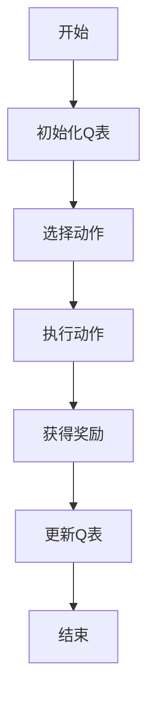
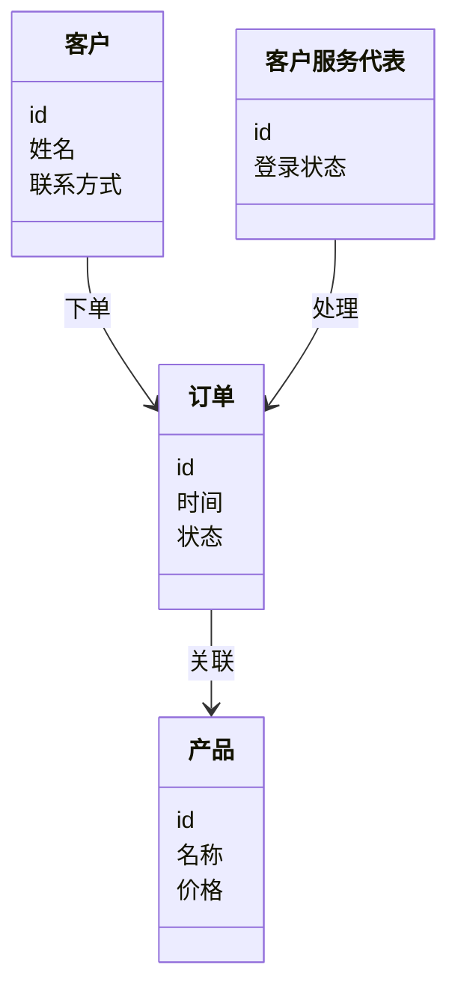
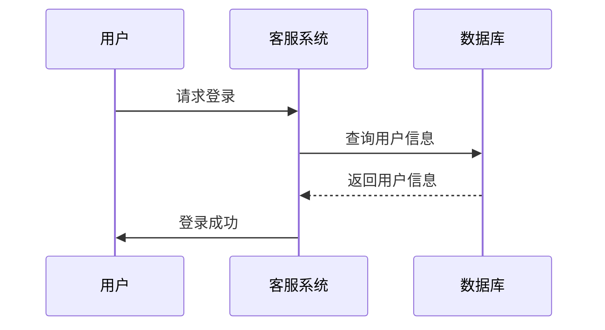

                 


# 构建AI Agent的认知计算模型

## 关键词：
- AI Agent
- 认知计算模型
- 强化学习
- 图神经网络
- 系统架构设计

## 摘要：
本文详细探讨了构建AI Agent的认知计算模型的理论与实践。从背景介绍、核心概念到算法原理，再到系统架构设计与项目实战，层层深入。文章通过具体的案例分析和代码实现，帮助读者理解认知计算模型在AI Agent中的应用，并提供了最佳实践建议，为构建高效智能的AI Agent提供了全面的指导。

---

## 第一部分: 构建AI Agent的认知计算模型背景介绍

### 第1章: AI Agent与认知计算模型概述

#### 1.1 AI Agent的基本概念
##### 1.1.1 什么是AI Agent
AI Agent（智能体）是指在环境中能够感知并自主行动以实现目标的实体。它能够通过传感器获取信息，利用计算模型进行推理，并通过执行器与环境交互。AI Agent的核心在于其智能性，能够适应复杂环境的变化。

##### 1.1.2 AI Agent的分类与特点
AI Agent可以分为以下几类：
1. **简单反射型Agent**：基于当前状态做出反应，无内部状态。
2. **基于模型的反射型Agent**：维护环境的状态模型，能够进行推理。
3. **目标驱动型Agent**：根据目标选择最优行动。
4. **效用驱动型Agent**：通过最大化效用函数来决策。

其特点包括自主性、反应性、目标导向性和学习能力。

##### 1.1.3 认知计算模型的定义
认知计算模型是对人类认知过程的模拟，包括感知、记忆、推理和决策等环节。它通过数学建模和算法实现，模拟人类的思维方式。

---

#### 1.2 认知计算模型的背景与应用
##### 1.2.1 认知科学与人工智能的结合
认知科学的研究成果为AI Agent提供了理论基础，特别是对感知、推理和决策过程的建模。

##### 1.2.2 认知计算模型在AI Agent中的作用
认知计算模型是AI Agent的核心，负责处理信息、做出决策并指导行动。

##### 1.2.3 认知计算模型的实际应用场景
- **智能客服**：通过自然语言处理和推理模型，提供个性化的服务。
- **自动驾驶**：利用认知模型处理实时数据，做出驾驶决策。
- **智能推荐系统**：基于用户行为建模，推荐个性化内容。

---

### 第2章: 认知计算模型的核心概念与联系

#### 2.1 认知计算模型的原理
##### 2.1.1 认知过程的数学建模
认知过程可以通过图模型、逻辑推理和强化学习等方法进行建模。

##### 2.1.2 感知、推理与决策的模型化
感知模块负责数据输入，推理模块进行逻辑推理，决策模块基于推理结果做出选择。

#### 2.2 核心概念对比表
| 概念 | 属性 | 特征 |
|------|------|------|
| 感知 | 数据输入 | 实时性 |
| 推理 | 逻辑分析 | 精确性 |
| 决策 | 行为选择 | 最优化 |

##### 2.2.2 ER实体关系图架构
```mermaid
erd
    客户
        id
        姓名
    订单
        id
        时间
    产品
        id
        名称
    客户-订单
        关联关系：1对多
    订单-产品
        关联关系：多对多
```

---

## 第二部分: 认知计算模型的算法原理

### 第3章: 基于强化学习的认知模型算法

#### 3.1 强化学习的基本原理
##### 3.1.1 状态、动作与奖励的定义
- **状态**：环境中的当前情况，例如游戏中的位置。
- **动作**：智能体采取的行为，例如移动方向。
- **奖励**：智能体采取动作后获得的反馈，例如得分。

##### 3.1.2 Q-learning算法的数学模型
$$ Q(s,a) = r + \gamma \max Q(s',a') $$

##### 3.1.3 动作空间与状态空间
- **动作空间**：所有可能的动作集合。
- **状态空间**：所有可能的状态集合。

#### 3.2 算法实现与案例分析
##### 3.2.1 算法流程图（Mermaid）


##### 3.2.2 Python实现代码
```python
import numpy as np

class QLearning:
    def __init__(self, state_space, action_space, gamma=0.9):
        self.state_space = state_space
        self.action_space = action_space
        self.gamma = gamma
        self.q_table = np.zeros((state_space, action_space))
    
    def choose_action(self, state, epsilon=0.1):
        if np.random.random() < epsilon:
            return np.random.randint(self.action_space)
        else:
            return np.argmax(self.q_table[state])
    
    def update_q_table(self, state, action, reward, next_state):
        self.q_table[state][action] = reward + self.gamma * np.max(self.q_table[next_state])
```

##### 3.2.3 实例分析
在迷宫问题中，智能体通过Q-learning算法学习路径，最终找到出口。

---

### 第4章: 基于图神经网络的认知模型算法

#### 4.1 图神经网络的基本原理
##### 4.1.1 图的表示
图由节点和边组成，节点表示实体，边表示关系。

##### 4.1.2 图卷积网络（GCN）
GCN通过聚合邻居节点的信息进行特征传播。

#### 4.2 算法实现与案例分析
##### 4.2.1 图神经网络的数学模型
$$ H = \text{GCN}(A, X) $$

##### 4.2.2 Python实现代码
```python
import torch
import torch.nn as nn
import torch.nn.functional as F

class GCN(nn.Module):
    def __init__(self, input_dim, hidden_dim, output_dim):
        super(GCN, self).__init__()
        self.fc1 = nn.Linear(input_dim, hidden_dim)
        self.fc2 = nn.Linear(hidden_dim, output_dim)
    
    def forward(self, x, adj):
        x = F.relu(torch.mm(adj, x))
        x = self.fc1(x)
        x = F.relu(torch.mm(adj, x))
        x = self.fc2(x)
        return x
```

##### 4.2.3 实例分析
在社交网络分析中，图神经网络用于节点分类和关系推理。

---

## 第三部分: 系统分析与架构设计方案

### 第5章: 项目背景与系统功能设计

#### 5.1 项目背景
以智能客服系统为例，设计一个基于认知计算模型的AI Agent。

#### 5.2 系统功能设计
##### 5.2.1 领域模型（Mermaid类图）


---

### 第6章: 系统架构设计

#### 6.1 分层架构设计（Mermaid架构图）


#### 6.2 系统接口设计
##### 6.2.1 接口描述
- `/api/login`：用户登录
- `/api/query_order`：查询订单状态
- `/api/update_status`：更新订单状态

##### 6.2.2 交互流程（Mermaid序列图）


---

## 第四部分: 项目实战

### 第7章: 项目实战与代码实现

#### 7.1 环境安装
安装Python和相关库：
```bash
pip install numpy torch matplotlib
```

#### 7.2 系统核心实现
##### 7.2.1 认知计算模型的实现
```python
class CognitiveModel:
    def __init__(self, input_dim, hidden_dim, output_dim):
        self.model = GCN(input_dim, hidden_dim, output_dim)
    
    def forward(self, x, adj):
        return self.model(x, adj)
    
    def backward(self, prediction, target):
        loss = F.cross_entropy(prediction, target)
        self.model.zero_grad()
        loss.backward()
        optimizer.step()
```

##### 7.2.2 系统调用流程
```python
def main():
    model = CognitiveModel(输入维度, 隐藏层维度, 输出维度)
    model.forward(输入数据, 图结构)
    model.backward(预测结果, 标签)
```

#### 7.3 案例分析与结果解读
在智能客服系统中，通过认知计算模型实现用户意图识别和问题解答。

#### 7.4 项目小结
项目实现了认知计算模型在智能客服中的应用，验证了模型的有效性。

---

## 第五部分: 最佳实践

### 第8章: 最佳实践与注意事项

#### 8.1 数据预处理与特征工程
- 数据清洗：处理缺失值和异常值。
- 特征提取：选择关键特征，降低维度。

#### 8.2 模型调优与优化
- 超参数调节：调整学习率、批次大小等参数。
- 模型评估：使用准确率、召回率等指标评估性能。

#### 8.3 拓展阅读
推荐书籍：
- 《深度学习》（Deep Learning）—— Ian Goodfellow
- 《强化学习》（Reinforcement Learning）—— Richard S. Sutton

---

## 结语

本文从理论到实践，全面探讨了构建AI Agent的认知计算模型。通过详细分析核心概念、算法原理和系统架构设计，为读者提供了系统的指导。希望本文能为AI领域的研究和应用提供有价值的参考。

---

## 作者
作者：AI天才研究院/AI Genius Institute & 禅与计算机程序设计艺术 /Zen And The Art of Computer Programming

