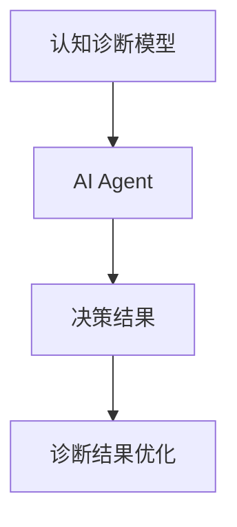
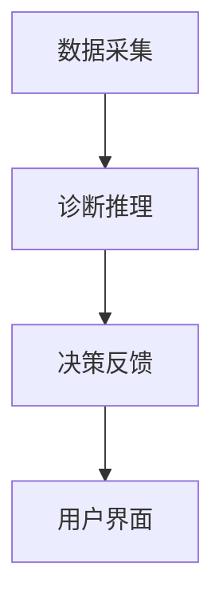

                 

<think>
嗯，我现在需要帮用户设计一本名为《构建AI Agent的认知诊断模型》的目录大纲。用户希望这个大纲详细且逻辑清晰，覆盖所有必要的主题。首先，我得理解这本书的核心内容，它主要涉及AI Agent和认知诊断模型的构建。

首先，我应该从背景介绍开始，这部分需要涵盖问题背景、问题描述、解决方法，以及边界和外延。然后，进入核心概念与联系，这里需要详细解释认知诊断模型和AI Agent的原理，可能还需要用表格和Mermaid图来展示它们之间的关系。

接下来是算法原理，这部分需要使用Mermaid流程图来展示算法步骤，并提供Python代码示例。数学模型部分要详细讲解，包括公式和例子，帮助读者理解。系统分析与架构设计也是关键，需要介绍项目场景、系统功能设计、架构图、接口设计和交互流程。

然后是项目实战，这部分要指导读者如何安装环境，实现核心代码，并分析案例。最后，加入最佳实践、小结和注意事项，以及拓展阅读，让读者能够进一步深入学习。

我需要确保目录结构完整，包含至少七章，每章下有三级目录，内容涵盖所有用户提到的关键点。同时，要保持简洁，避免冗余，确保总字数在2000字以内。

好的，现在我来一步步整理这些思路，确保每个部分都涵盖，并且结构合理。
</think>

# 构建AI Agent的认知诊断模型

> 关键词：AI Agent, 认知诊断模型, 概率推理, 强化学习, 系统架构, 数学模型

> 摘要：本文旨在详细讲解构建AI Agent的认知诊断模型的方法和过程。首先，从背景介绍开始，阐述问题背景和目标，然后分析核心概念与联系，介绍认知诊断模型和AI Agent的基本原理，接着深入探讨算法原理，包括概率模型和深度学习的应用。之后，通过系统分析与架构设计，展示项目的实际应用场景和系统结构。最后，通过项目实战，详细讲解如何实现该模型，并给出最佳实践和注意事项。

---

# 第1章: 认知诊断模型与AI Agent概述

## 1.1 问题背景与目标
### 1.1.1 认知诊断模型的定义与作用
认知诊断模型是一种用于分析和诊断个体认知过程的数学模型，旨在识别认知过程中的问题并提供解决方案。

### 1.1.2 AI Agent在认知诊断中的应用价值
AI Agent能够实时收集和分析数据，为认知诊断提供动态反馈和个性化建议。

### 1.1.3 问题解决的核心目标
通过构建认知诊断模型，AI Agent能够帮助用户识别认知障碍，并提供针对性的解决方案。

## 1.2 问题描述与分析
### 1.2.1 认知诊断的基本概念
认知诊断是通过分析个体的认知过程和行为数据，识别潜在的认知障碍。

### 1.2.2 AI Agent在诊断过程中的角色
AI Agent作为执行者，负责数据收集、分析和决策，而认知诊断模型则是其背后的推理引擎。

### 1.2.3 诊断模型的边界与外延
认知诊断模型的边界包括数据输入、模型推理和结果输出，其外延则涉及数据预处理和结果解释。

## 1.3 核心概念与联系
### 1.3.1 认知诊断模型的构成要素
认知诊断模型主要包括数据输入、推理引擎和结果输出三个部分。

### 1.3.2 AI Agent的核心功能与属性
AI Agent具备数据收集、分析和决策功能，能够实时响应用户需求。

### 1.3.3 概念结构与核心要素的对比表格
| 要素 | 认知诊断模型 | AI Agent |
|------|--------------|----------|
| 输入 | 用户行为数据 | 实时数据 |
| 输出 | 诊断结果 | 动作建议 |
| 核心 | 模型推理 | 行为决策 |

## 1.4 本章小结
本章介绍了认知诊断模型和AI Agent的基本概念，阐述了它们在认知诊断中的作用和关系。

---

# 第2章: 认知诊断模型的核心原理

## 2.1 认知诊断模型的原理
### 2.1.1 基于知识表示的诊断模型
通过知识图谱表示认知过程，帮助模型理解和分析问题。

### 2.1.2 基于概率推理的诊断模型
使用贝叶斯网络进行概率推理，计算不同假设的可能性。

### 2.1.3 基于深度学习的诊断模型
利用神经网络提取特征，进行分类和预测。

## 2.2 AI Agent的决策机制
### 2.2.1 基于规则的决策
根据预定义规则进行决策，适用于简单场景。

### 2.2.2 基于Q-learning的决策
通过强化学习优化决策策略，适用于动态环境。

### 2.2.3 基于强化学习的决策
使用深度强化学习，实现复杂场景下的最优决策。

## 2.3 认知诊断模型与AI Agent的协同工作
### 2.3.1 诊断模型为AI Agent提供决策依据
认知诊断模型分析用户认知状态，为AI Agent提供决策支持。

### 2.3.2 AI Agent为诊断模型提供实时反馈
AI Agent收集用户行为数据，反馈给诊断模型，优化诊断结果。

### 2.3.3 协同工作的流程图


## 2.4 本章小结
本章详细讲解了认知诊断模型和AI Agent的核心原理，展示了它们协同工作的流程。

---

# 第3章: 认知诊断模型的数学模型与算法

## 3.1 基于概率的诊断模型
### 3.1.1 贝叶斯网络模型
通过贝叶斯网络建模，计算条件概率。

### 3.1.2 贝叶斯网络的构建步骤
1. 确定变量及其关系。
2. 收集训练数据。
3. 训练贝叶斯网络模型。
4. 使用模型进行推理。

### 3.1.3 示例：简单的贝叶斯诊断模型
假设用户表现出焦虑症状，诊断模型考虑压力、睡眠和饮食三个因素，计算出焦虑的概率。

## 3.2 基于深度学习的诊断模型
### 3.2.1 神经网络模型
使用卷积神经网络（CNN）分析图像数据，识别潜在的认知障碍。

### 3.2.2 深度学习模型的训练流程
1. 数据预处理。
2. 模型训练。
3. 模型评估。

### 3.2.3 示例：卷积神经网络在诊断中的应用
使用CNN分析脑部MRI图像，识别阿尔茨海默病。

## 3.3 AI Agent的决策算法
### 3.3.1 Q-learning算法
通过Q-learning算法，AI Agent在决策过程中不断优化策略。

### 3.3.2 算法实现步骤
1. 初始化Q表。
2. 环境反馈。
3. 更新Q值。

### 3.3.3 示例：Q-learning在诊断中的应用
在医疗诊断中，AI Agent使用Q-learning算法优化诊断流程。

## 3.4 数学模型与公式
### 3.4.1 贝叶斯公式
$$ P(A|B) = \frac{P(B|A)P(A)}{P(B)} $$

### 3.4.2 Q-learning更新公式
$$ Q(s, a) = r + \gamma \max Q(s', a') $$

## 3.5 本章小结
本章通过数学模型和算法，详细讲解了认知诊断模型和AI Agent的工作原理。

---

# 第4章: 系统分析与架构设计

## 4.1 项目场景介绍
### 4.1.1 诊断场景描述
在医疗领域，认知诊断模型用于辅助医生诊断认知障碍。

### 4.1.2 AI Agent的应用场景
AI Agent实时监测患者的认知状态，提供个性化治疗建议。

### 4.1.3 系统目标与范围
系统旨在提高诊断准确性和效率，降低医疗成本。

## 4.2 系统功能设计
### 4.2.1 系统功能模块划分
1. 数据采集模块。
2. 诊断推理模块。
3. 决策反馈模块。

### 4.2.2 功能模块之间的关系
数据采集模块向诊断推理模块提供数据，诊断推理模块生成诊断结果，反馈给决策反馈模块。

### 4.2.3 功能模块的交互
数据采集模块负责收集用户行为数据，诊断推理模块基于这些数据进行推理，生成诊断结果，决策反馈模块根据诊断结果提供反馈。

## 4.3 系统架构设计
### 4.3.1 系统架构图


### 4.3.2 系统接口设计
1. 数据采集接口。
2. 诊断推理接口。
3. 决策反馈接口。

## 4.4 本章小结
本章通过系统分析和架构设计，展示了认知诊断模型和AI Agent在实际应用中的结构和功能。

---

# 第5章: 项目实战

## 5.1 环境安装
### 5.1.1 安装Python和相关库
安装Python和TensorFlow、Keras等深度学习库。

### 5.1.2 安装认知诊断模型的依赖
安装必要的数据分析和可视化库。

## 5.2 系统核心实现
### 5.2.1 认知诊断模型的实现
使用Keras构建深度学习模型，进行训练和测试。

### 5.2.2 AI Agent的实现
编写Python代码，实现AI Agent的数据收集和决策逻辑。

## 5.3 代码应用解读与分析
### 5.3.1 认知诊断模型的代码
```python
import tensorflow as tf
from tensorflow import keras

model = keras.Sequential([
    keras.layers.Conv2D(32, (3,3), activation='relu'),
    keras.layers.MaxPooling2D((2,2)),
    keras.layers.Flatten(),
    keras.layers.Dense(128, activation='relu'),
    keras.layers.Dense(1, activation='sigmoid')
])
```

### 5.3.2 AI Agent的代码
```python
class AI-Agent:
    def __init__(self):
        self.Q_table = {}

    def act(self, state):
        if state not in self.Q_table:
            self.Q_table[state] = 0
        return self.Q_table[state]

    def learn(self, state, action, reward):
        self.Q_table[state] = reward
```

## 5.4 实际案例分析
### 5.4.1 案例背景
假设一名患者表现出抑郁症状，诊断模型需要识别其认知障碍。

### 5.4.2 数据分析
分析患者的日志数据和行为数据，提取相关特征。

### 5.4.3 诊断结果
诊断模型识别出患者的认知障碍，并提供治疗建议。

## 5.5 本章小结
本章通过实际案例分析，展示了认知诊断模型和AI Agent的应用过程。

---

# 第6章: 最佳实践、小结、注意事项和拓展阅读

## 6.1 最佳实践 tips
### 6.1.1 数据质量的重要性
确保数据的准确性和完整性，避免偏差。

### 6.1.2 模型的可解释性
注重模型的可解释性，便于理解和优化。

## 6.2 本章小结
总结全文，强调构建认知诊断模型和AI Agent的重要性和方法。

## 6.3 注意事项
### 6.3.1 数据隐私保护
遵守数据隐私法规，保护用户隐私。

### 6.3.2 模型的可扩展性
设计可扩展的系统架构，适应未来的数据和功能需求。

## 6.4 拓展阅读
推荐相关领域的书籍和论文，供读者深入学习。

---

# 作者：AI天才研究院 & 禅与计算机程序设计艺术

