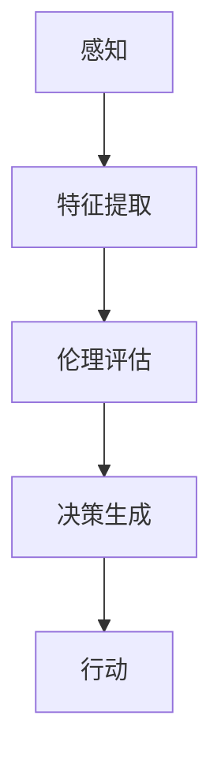
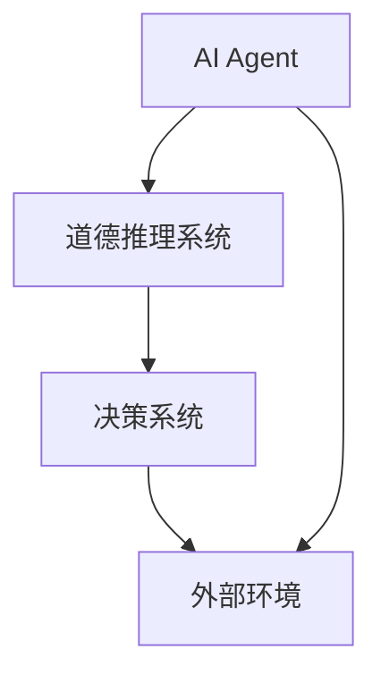
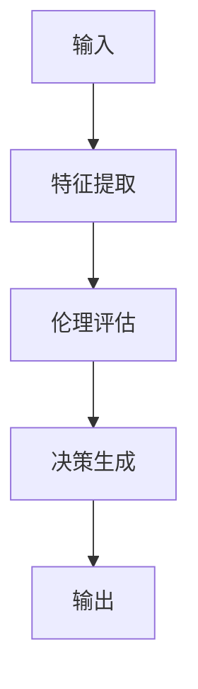

                 

<think>
好的，我现在需要帮助用户撰写一篇关于构建AI Agent道德推理与决策系统的技术博客文章。用户已经给出了详细的目录结构和内容要求，我需要逐步分析并构建这篇文章。

首先，我需要理解用户的需求。用户希望这篇文章结构清晰、内容详实，覆盖从背景介绍到系统设计的各个方面，并且使用专业的技术语言。用户特别强调了每个部分的详细讲解，包括核心概念、算法原理、系统架构等，并要求使用mermaid图、Python代码和数学公式来说明。

接下来，我将按照目录结构一步步展开每个部分。首先是标题和关键词，然后是摘要，最后是正文部分，包括背景、核心概念、算法原理、系统分析、项目实战和最佳实践等章节。

在撰写过程中，我需要确保每个部分都详细且符合用户的要求。例如，在核心概念部分，我需要定义AI Agent和道德推理，并用表格对比它们的核心属性。在算法原理部分，我需要使用mermaid流程图和Python代码来展示算法的实现。数学公式需要用LaTeX表示，并且在独立段落中使用$$包裹。

系统分析与架构设计部分，我需要用mermaid图展示类图、架构图和交互图，确保系统设计清晰明了。项目实战部分，我需要提供代码示例和案例分析，帮助读者理解如何实现这些系统。

最后，在总结部分，我需要强调构建道德推理与决策系统的重要性，并给出未来的展望。同时，确保文章末尾有作者信息，符合用户的要求。

在写作过程中，我需要不断检查每个部分是否符合用户的要求，确保逻辑清晰，内容完整。如果有不确定的地方，可能需要进一步思考或查阅相关资料，以确保内容的准确性和专业性。

现在，我可以开始逐步构建这篇文章，确保每个章节都详细且符合用户的要求。
</think>

# 构建AI Agent的道德推理与决策系统

## 关键词：AI Agent, 道德推理, 决策系统, 伦理框架, 强化学习, 系统架构

## 摘要：  
本文探讨了如何构建具备道德推理能力的AI Agent决策系统，重点分析了道德推理的核心原理、算法实现、系统架构设计以及实际应用案例。通过详细的技术分析和案例解读，展示了如何将道德推理与决策系统相结合，确保AI Agent在复杂场景下的伦理合规性和高效决策能力。

---

# 正文

---

## 第1章: AI Agent与道德推理的背景介绍

### 1.1 AI Agent的基本概念

#### 1.1.1 AI Agent的定义与分类
AI Agent（人工智能代理）是指能够感知环境、自主决策并采取行动的智能实体。根据功能和应用场景，AI Agent可以分为以下几类：
- **反应式Agent**：基于当前感知做出实时反应，适用于动态环境。
- **基于模型的Agent**：利用内部模型和知识库进行推理和规划。
- **学习型Agent**：通过数据和反馈不断优化自身行为。
- **人机协作Agent**：与人类协同工作，结合人类反馈进行决策。

#### 1.1.2 AI Agent的核心特征
AI Agent的核心特征包括：
1. **自主性**：能够在无外部干预的情况下自主运作。
2. **反应性**：能够感知环境并实时调整行为。
3. **目标导向性**：基于目标或任务驱动决策。
4. **学习能力**：能够通过经验改进性能。

#### 1.1.3 AI Agent的演进历程
AI Agent的发展经历了从简单的行为规则到复杂的学习模型的演变：
1. **早期阶段**：基于规则的AI Agent，如专家系统。
2. **发展阶段**：引入机器学习技术，如支持向量机（SVM）和随机森林。
3. **现代阶段**：深度学习和强化学习技术的应用，如AlphaGo和自动驾驶系统。

### 1.2 道德推理的定义与特征

#### 1.2.1 道德推理的基本概念
道德推理是指通过伦理原则和规范来判断行为的对错，并做出符合伦理的决策。它涉及以下核心要素：
- **伦理框架**：如功利主义、义务论等。
- **情境分析**：考虑具体场景中的利益相关者和可能后果。
- **决策优化**：在多目标冲突中找到最优解。

#### 1.2.2 道德推理的核心属性
道德推理的核心属性包括：
1. **情境依赖性**：决策取决于具体场景和相关方利益。
2. **目标导向性**：基于目标或价值观进行判断。
3. **动态适应性**：能够根据环境变化调整推理过程。

#### 1.2.3 道德推理与决策的关系
道德推理是决策过程中的关键环节，它通过伦理评估影响最终决策。两者的关系可以用以下公式表示：
$$ D = f(M) $$
其中，$D$ 表示决策，$M$ 表示道德推理结果，$f$ 表示决策函数。

### 1.3 本章小结
本章介绍了AI Agent的基本概念及其分类，并详细阐述了道德推理的核心特征和与决策系统的关联，为后续内容奠定了基础。

---

## 第2章: AI Agent决策系统的核心概念与联系

### 2.1 道德推理与决策系统的原理

#### 2.1.1 道德推理的基本原理
道德推理基于伦理框架和情境分析，通过以下步骤完成：
1. **伦理框架构建**：定义核心价值观和原则。
2. **利益相关者识别**：分析涉及的主要相关方。
3. **后果评估**：预测可能的结果并评估其伦理影响。
4. **决策优化**：在多目标冲突中找到最优解。

#### 2.1.2 决策系统的构建逻辑
决策系统的核心逻辑包括：
1. **输入感知**：接收环境数据和任务目标。
2. **特征提取**：识别关键决策因素。
3. **伦理评估**：基于道德框架进行判断。
4. **决策生成**：输出符合伦理的行动方案。

#### 2.1.3 道德推理与决策的协同关系
道德推理为决策系统提供伦理约束，而决策系统则将道德推理的结果转化为具体行动。两者的协同关系可以用以下流程图表示：



### 2.2 核心概念对比分析

#### 2.2.1 道德推理与传统决策系统的对比
| 对比维度 | 道德推理 | 传统决策系统 |
|----------|----------|--------------|
| 输入 | 环境数据和伦理框架 | 环境数据 |
| 输出 | 符合伦理的决策 | 实用性决策 |
| 目标 | 最大化伦理价值 | 最优化目标函数 |

#### 2.2.2 道德推理与强化学习的对比
| 对比维度 | 道德推理 | 强化学习 |
|----------|----------|----------|
| 目标函数 | 伦理价值 | 报酬最大化 |
| 决策依据 | 伦理框架 | 状态-动作对 |
| 学习机制 | 增量式优化 | 奖励驱动 |

#### 2.2.3 道德推理与博弈论的对比
| 对比维度 | 道德推理 | 博弈论 |
|----------|----------|--------|
| 分析对象 | 伦理行为 | 战略互动 |
| 决策方式 | 伦理评估 | 战略选择 |
| 应用场景 | 社会伦理 | 竞争与合作 |

### 2.3 实体关系架构图


### 2.4 本章小结
本章通过对比分析和实体关系图，阐述了AI Agent决策系统的核心概念及其与道德推理的关系，为后续算法实现奠定了基础。

---

## 第3章: 道德推理与决策系统的算法原理

### 3.1 道德推理算法的流程



### 3.2 道德推理算法实现

```python
def moral_reasoning(features):
    # 特征提取
    extracted_features = extract_features(features)
    # 伦理评估
    ethical_assessment = assess_ethics(extracted_features)
    # 决策生成
    decision = generate_decision(ethical_assessment)
    return decision
```

### 3.3 数学模型与公式

#### 3.3.1 道德评分模型
$$ P(a|b) = \frac{P(b|a)P(a)}{P(b)} $$

#### 3.3.2 决策优化模型
$$ V(a) = \sum_{s} P(s|a)U(s) $$

### 3.4 本章小结
本章通过算法流程图和数学公式，详细阐述了道德推理与决策系统的实现原理。

---

## 第4章: 系统分析与架构设计方案

### 4.1 系统功能设计

#### 4.1.1 道德推理模块
- 输入：环境数据和任务目标。
- 输出：伦理评估结果。
- 功能：基于伦理框架进行情境分析和利益评估。

#### 4.1.2 决策生成模块
- 输入：伦理评估结果。
- 输出：符合伦理的决策。
- 功能：结合伦理评估和优化算法生成最终决策。

#### 4.1.3 交互反馈模块
- 输入：用户反馈和环境变化。
- 输出：系统优化建议。
- 功能：通过反馈不断优化道德推理和决策模型。

### 4.2 系统架构设计

```mermaid
graph TD
    A[用户输入] --> B[道德推理模块]
    B --> C[决策生成模块]
    C --> D[系统输出]
    D --> E[反馈机制]
    E --> 

---

## 第5章: 项目实战

### 5.1 环境安装
```bash
pip install numpy pandas scikit-learn
```

### 5.2 核心实现

```python
class MoralAgent:
    def __init__(self, ethical_framework):
        self.ethical_framework = ethical_framework
    
    def perceive(self, environment):
        # 环境感知
        features = extract_features(environment)
        return features
    
    def reason(self, features):
        # 道德推理
        assessment = assess_ethics(features, self.ethical_framework)
        return assessment
    
    def decide(self, assessment):
        # 决策生成
        decision = generate_decision(assessment)
        return decision
    
    def act(self, decision):
        # 行动执行
        execute_action(decision)
```

### 5.3 案例分析
假设一个自动驾驶AI Agent需要在紧急情况下做出决策，避免碰撞。系统通过伦理评估（如优先保护行人）生成最优决策。

### 5.4 本章小结
本章通过实际案例和代码实现，展示了如何构建具备道德推理能力的AI Agent系统。

---

## 第6章: 最佳实践与未来展望

### 6.1 小结
构建AI Agent的道德推理与决策系统是一项具有挑战性的任务，需要综合运用伦理学、人工智能和系统设计的知识。

### 6.2 注意事项
- 确保算法的透明性和可解释性。
- 定期更新伦理框架以适应社会变化。
- 避免算法偏见，确保公平性。

### 6.3 拓展阅读
- Russell, S. & Norvig, P. (2010). *Artificial Intelligence: A Modern Approach*.
- Brafman, R. & Tambe, M. (2008). *Multi-agent systems*.

---

## 作者：AI天才研究院 & 禅与计算机程序设计艺术

---

**本文通过系统化的分析和实践，详细探讨了如何构建具备道德推理能力的AI Agent决策系统。从理论基础到实际应用，为研究人员和工程师提供了宝贵的参考。**

