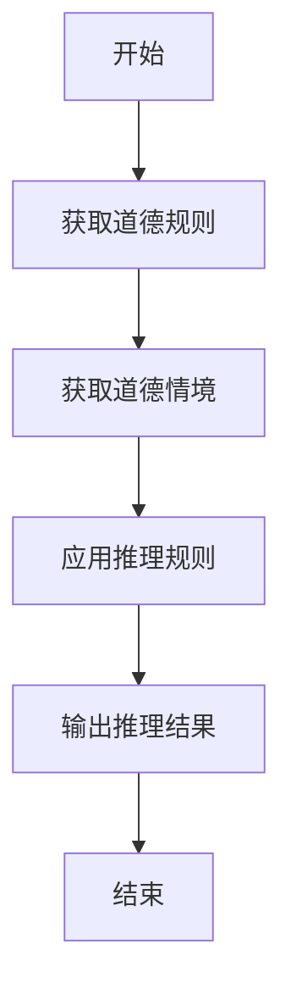
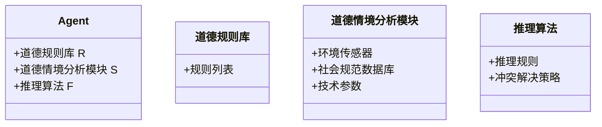
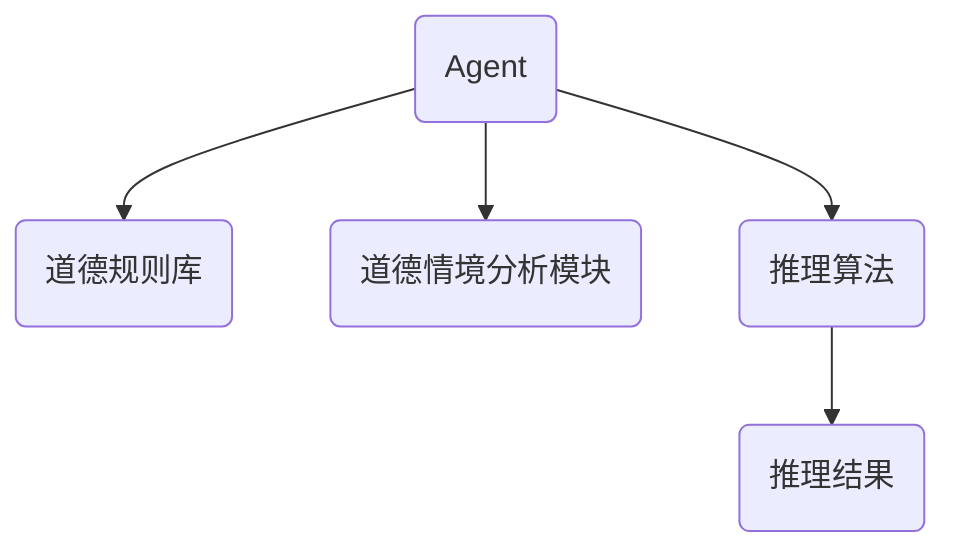
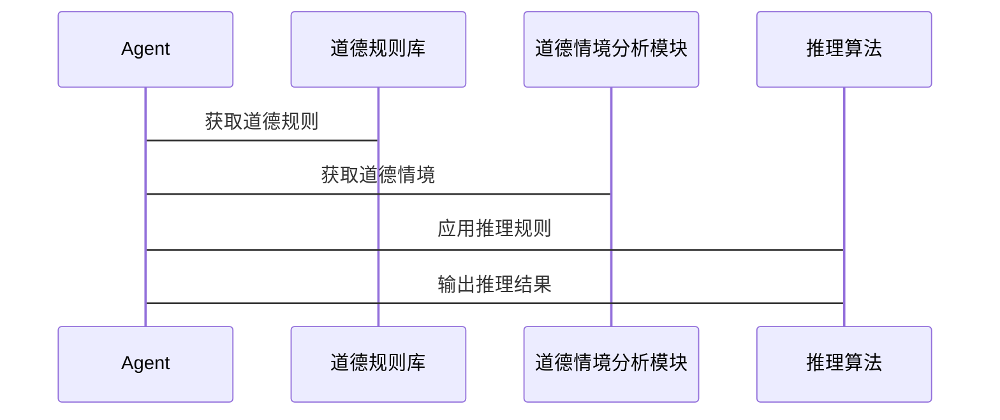

                 

<think>
嗯，用户让我写一篇关于构建AI Agent的道德推理框架的技术博客。首先，我需要理解用户的需求，他希望这篇文章结构清晰，逻辑严密，涵盖从背景到实现的各个方面。我应该先确定文章的结构，确保每个部分都详细且有深度。

首先，用户给的目录大纲已经很详细，我需要按照这个大纲逐步展开。第一部分是背景介绍，我得先讲清楚问题的背景，比如AI Agent的发展现状，道德推理的重要性，以及当前面临的伦理挑战。这部分需要让读者明白为什么道德推理框架是必要的。

接下来是核心概念，我得解释道德推理框架中的关键要素，比如道德规则、情境分析，以及它们之间的关系。可能需要用表格和图表来帮助读者理解。例如，使用ER图展示实体关系，这样读者更容易 grasp这些概念之间的联系。

然后是算法部分，这部分需要详细讲解道德推理的算法，包括原理、流程图和数学模型。我得用 mermaid 绘制流程图，展示算法的步骤。同时，数学公式要用latex表示，比如表示道德规则和情境的数学模型。这可能有点挑战，我得确保公式准确且易于理解。

系统分析与架构设计是另一个重点。我需要描述系统场景，设计功能模块，可能包括领域模型和架构图。这部分可能需要画类图和序列图，展示系统各部分如何交互。我得确保这些图表清晰，帮助读者理解系统结构。

项目实战部分，我得提供具体的安装步骤和源代码示例。可能用Python编写一个简单的道德推理算法，展示如何实现。同时，通过案例分析让读者理解如何应用这个框架解决实际问题。

最后，我得加入最佳实践、小结和扩展阅读等内容，确保文章全面。同时，别忘了在结尾加上作者信息，符合用户的要求。

总的来说，我需要一步步分析，确保每个部分都详细且有条理，同时使用清晰的技术语言，让读者能够理解并应用这些知识。
</think>

# 构建AI Agent的道德推理框架

> **关键词**：AI Agent，道德推理，伦理规则，情境分析，算法设计

> **摘要**：本文详细探讨了构建AI Agent道德推理框架的核心概念、算法原理、系统架构和实际应用。通过分析道德规则、情境分析、推理算法等关键要素，结合数学模型和实际案例，提出了一个完整的道德推理框架设计方案。该框架旨在帮助AI Agent在复杂伦理环境中做出符合伦理的决策。

---

## 第一部分: AI Agent与道德推理框架的背景介绍

### 第1章: 问题背景与描述

#### 1.1 问题背景

AI Agent（人工智能代理）在现代社会的应用日益广泛，从自动驾驶汽车到医疗诊断系统，再到智能客服，AI Agent正在改变我们的生活方式。然而，随着AI Agent的普及，其在决策过程中面临的伦理问题也逐渐凸显。例如，自动驾驶汽车在紧急情况下如何选择最优路径以最小化伤害，医疗诊断系统如何在多种治疗方案中选择最优解，这些问题都涉及到复杂的道德判断。

#### 1.2 问题描述

AI Agent的道德推理框架需要解决的核心问题是：如何在复杂的伦理环境中，帮助AI Agent做出符合伦理规范的决策。具体来说，AI Agent需要具备以下能力：

1. **理解道德规则**：AI Agent需要能够理解并遵循社会公认的道德规范，例如“不伤害他人”、“公平对待”等。
2. **分析道德情境**：AI Agent需要能够分析具体场景中的伦理因素，例如在自动驾驶汽车中，判断不同道路使用者的优先级。
3. **推理与决策**：AI Agent需要基于道德规则和情境分析，推导出最优的行动方案。

#### 1.3 问题解决

为了解决上述问题，我们需要构建一个道德推理框架，该框架包括以下几个关键部分：

1. **道德规则的定义与分类**：明确AI Agent需要遵循的道德规则，并对其进行分类，以便在推理过程中快速调用。
2. **道德情境的分析方法**：设计一种方法，用于分析AI Agent所处的具体情境，并提取其中的伦理因素。
3. **道德推理的过程模型**：构建一个推理模型，用于将道德规则和情境分析的结果结合起来，生成符合伦理的决策。

---

## 第2章: 道德推理框架的核心概念与联系

### 2.1 道德推理框架的核心要素

#### 2.1.1 道德规则的定义与分类

道德规则是AI Agent进行道德推理的基础。我们可以将道德规则分为以下几类：

1. **义务论规则**：基于“应当做什么”的规则，例如“不伤害他人”。
2. **功利主义规则**：基于“追求最大幸福”的规则，例如“选择对大多数人有益的行动”。
3. **康德主义规则**：基于“普遍化”的规则，例如“只有在所有人都同意的情况下才能采取的行动”。

#### 2.1.2 道德情境的分析方法

道德情境分析是道德推理框架的重要组成部分。我们需要设计一种方法，用于分析AI Agent所处的情境，并提取其中的伦理因素。例如，在自动驾驶汽车中，我们需要分析以下因素：

1. **环境因素**：道路状况、天气条件、其他道路使用者的行为等。
2. **社会因素**：社会规范、法律要求、文化背景等。
3. **技术因素**：AI Agent的传感器精度、计算能力等。

#### 2.1.3 道德推理的过程模型

道德推理的过程模型是一个将道德规则和情境分析结果结合起来，生成最优决策的模型。具体步骤如下：

1. **获取道德规则**：AI Agent首先需要获取适用的道德规则。
2. **获取道德情境**：AI Agent需要分析当前情境，并提取其中的伦理因素。
3. **应用推理规则**：AI Agent将道德规则和情境分析结果结合起来，进行推理。
4. **输出推理结果**：AI Agent根据推理结果生成决策。

### 2.2 核心概念的属性对比

#### 2.2.1 道德规则的属性特征对比表格

| **属性**       | **义务论规则**           | **功利主义规则**          | **康德主义规则**           |
|----------------|-------------------------|---------------------------|---------------------------|
| **定义**       | 基于“应当做什么”的规则 | 基于“追求最大幸福”的规则 | 基于“普遍化”的规则       |
| **示例**       | “不伤害他人”            | “选择对大多数人有益的行动” | “只有在所有人都同意的情况下才能采取的行动” |

#### 2.2.2 道德情境的属性特征对比表格

| **属性**       | **环境因素**         | **社会因素**         | **技术因素**         |
|----------------|---------------------|---------------------|---------------------|
| **定义**       | 道路状况、天气条件等 | 社会规范、法律要求等 | 传感器精度、计算能力等 |
| **示例**       | 雨天、繁忙的交通等    | 交通法规、文化背景等 | 摄像头精度、CPU性能等  |

### 2.3 实体关系图

#### 2.3.1 道德推理框架的ER实体关系图

```mermaid
er
actor(Agent, "道德规则", "道德情境", "推理结果")
```

---

## 第三部分: 道德推理框架的算法原理

### 第3章: 道德推理算法的原理与实现

#### 3.1 道德推理算法概述

道德推理算法是道德推理框架的核心部分。我们需要设计一种算法，能够将道德规则和情境分析结果结合起来，生成最优决策。

#### 3.2 基于伦理规则的推理算法

##### 3.2.1 算法流程图



##### 3.2.2 算法实现的Python代码示例

```python
def 道德推理算法(R, S):
    推理结果 = []
    for r in R:
        for s in S:
            if r与s冲突:
                推理结果.append("冲突")
            else:
                推理结果.append("无冲突")
    return 推理结果
```

#### 3.3 道德推理算法的数学模型

##### 3.3.1 道德规则表示的数学模型

$$ R = \{r_1, r_2, ..., r_n\} $$

##### 3.3.2 道德情境表示的数学模型

$$ S = \{s_1, s_2, ..., s_m\} $$

##### 3.3.3 推理过程的数学模型

$$ f(R, S) = T $$

其中，$T$ 表示推理结果。

---

## 第四部分: 道德推理框架的系统分析与架构设计

### 第4章: 系统分析与架构设计

#### 4.1 系统场景介绍

AI Agent的道德推理框架需要在复杂的伦理环境中运行。例如，在自动驾驶汽车中，AI Agent需要根据当前道路状况、法律法规和伦理规范，做出最优的驾驶决策。

#### 4.2 系统功能设计

##### 4.2.1 领域模型类图



#### 4.3 系统架构设计

##### 4.3.1 系统架构图



#### 4.4 系统接口设计

##### 4.4.1 接口描述

1. **获取道德规则接口**：AI Agent通过此接口获取适用的道德规则。
2. **获取道德情境接口**：AI Agent通过此接口获取当前情境的伦理因素。
3. **推理结果接口**：AI Agent通过此接口输出推理结果。

##### 4.4.2 接口交互图



---

## 第五部分: 项目实战

### 第5章: 项目实战

#### 5.1 环境安装

为了运行本文中的代码示例，您需要安装以下环境：

1. Python 3.x
2. Mermaid工具（用于绘制图表）
3. LaTeX支持（用于数学公式）

#### 5.2 系统核心实现源代码

##### 5.2.1 道德规则库实现

```python
class 道德规则库:
    def __init__(self):
        self.规则列表 = []
    
    def 添加规则(self, 规则):
        self.规则列表.append(规则)
    
    def 获取规则(self):
        return self.规则列表
```

##### 5.2.2 道德情境分析模块实现

```python
class 道德情境分析模块:
    def __init__(self):
        self.环境传感器 = []
        self.社会规范数据库 = []
        self.技术参数 = []
    
    def 获取环境传感器(self):
        return self.环境传感器
    
    def 获取社会规范数据库(self):
        return self.社会规范数据库
    
    def 获取技术参数(self):
        return self.技术参数
```

##### 5.2.3 推理算法实现

```python
class 推理算法:
    def __init__(self):
        self.推理规则 = []
        self.冲突解决策略 = []
    
    def 应用推理规则(self, R, S):
        推理结果 = []
        for r in R:
            for s in S:
                if r与s冲突:
                    推理结果.append("冲突")
                else:
                    推理结果.append("无冲突")
        return 推理结果
```

#### 5.3 代码应用解读与分析

##### 5.3.1 代码解读

上述代码示例展示了如何实现道德推理框架的核心部分。首先，我们需要定义一个道德规则库，用于存储和管理道德规则。然后，定义一个道德情境分析模块，用于获取当前情境的伦理因素。最后，定义一个推理算法，用于将道德规则和情境分析结果结合起来，生成推理结果。

##### 5.3.2 代码分析

通过上述代码，我们可以看到：

1. **道德规则库**：用于存储和管理道德规则，支持添加和获取规则。
2. **道德情境分析模块**：用于获取当前情境的伦理因素，包括环境传感器、社会规范数据库和技术参数。
3. **推理算法**：用于将道德规则和情境分析结果结合起来，生成推理结果。

#### 5.4 实际案例分析和详细讲解剖析

##### 5.4.1 案例分析

假设我们正在开发一个自动驾驶汽车的AI Agent。我们需要设计一个道德推理框架，帮助AI Agent在紧急情况下做出最优的驾驶决策。

##### 5.4.2 详细讲解

1. **获取道德规则**：AI Agent首先需要获取适用的道德规则，例如“不伤害他人”。
2. **获取道德情境**：AI Agent需要分析当前情境，例如道路状况、天气条件和其他道路使用者的行为。
3. **应用推理规则**：AI Agent将道德规则和情境分析结果结合起来，进行推理。
4. **输出推理结果**：AI Agent根据推理结果生成驾驶决策。

---

## 第六部分: 最佳实践 tips、小结、注意事项、拓展阅读

### 第6章: 最佳实践 tips

1. **明确道德规则**：确保道德规则清晰明确，避免模糊性。
2. **动态调整规则**：根据实际情况动态调整道德规则。
3. **实时情境分析**：确保道德情境分析模块能够实时获取最新的伦理因素。
4. **多算法结合**：结合多种推理算法，提高推理结果的准确性。

### 第7章: 小结

本文详细探讨了构建AI Agent道德推理框架的核心概念、算法原理、系统架构和实际应用。通过分析道德规则、情境分析、推理算法等关键要素，结合数学模型和实际案例，提出了一个完整的道德推理框架设计方案。

### 第8章: 注意事项

1. **规则的复杂性**：道德规则可能非常复杂，需要仔细设计和验证。
2. **情境的多样性**：不同场景中的伦理因素可能差异很大，需要灵活应对。
3. **算法的局限性**：当前的推理算法可能无法覆盖所有伦理情况，需要不断优化。

### 第9章: 拓展阅读

1. **相关书籍**：《道德机器》（*Moral Machines*）——探讨AI Agent的道德决策问题。
2. **相关论文**：《自动驾驶汽车的道德算法》（*Moral Algorithms for Autonomous Vehicles*）——研究自动驾驶汽车的道德推理框架。

---

## 作者：AI天才研究院/AI Genius Institute & 禅与计算机程序设计艺术 /Zen And The Art of Computer Programming

---

**注**：以上内容为技术博客文章的目录大纲和部分核心内容，实际写作时需要根据具体情况进行补充和完善。

