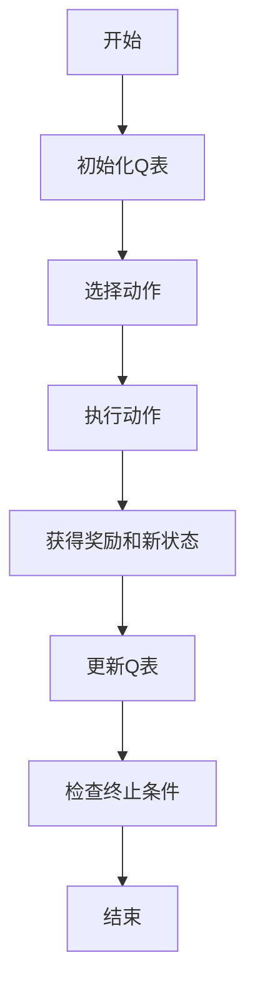
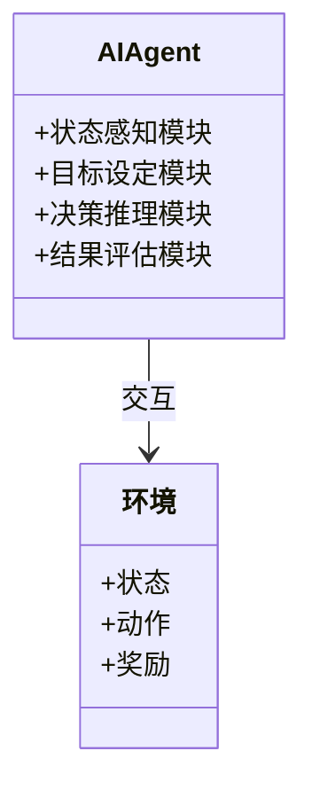

                 


# 构建AI Agent的长期规划与决策系统

> 关键词：AI Agent, 长期规划, 决策系统, 强化学习, 系统架构, 项目实战

> 摘要：本文详细探讨了构建AI Agent的长期规划与决策系统的关键技术与方法。从核心概念到算法原理，从系统架构到项目实战，系统性地分析了AI Agent在长期规划与决策方面的技术实现。文章结合理论与实践，提供了丰富的案例和代码示例，帮助读者深入理解并掌握构建此类系统的核心技能。

---

# 第一部分: AI Agent的背景与核心概念

## 第1章: AI Agent的定义与背景

### 1.1 AI Agent的基本概念

AI Agent（人工智能代理）是指能够感知环境、自主决策并采取行动的智能体。它通过与环境的交互，实现特定目标。AI Agent的核心特征包括：

1. **自主性**：能够在没有外部干预的情况下自主运行。
2. **反应性**：能够实时感知环境并做出反应。
3. **目标导向性**：基于目标进行决策和行动。
4. **学习能力**：通过经验改进自身的决策能力。

AI Agent的应用场景广泛，包括自动驾驶、智能助手、机器人控制、游戏AI等。

---

### 1.2 长期规划与决策的必要性

长期规划与决策是AI Agent实现复杂任务的关键能力。以下是其重要性的体现：

1. **目标导向性**：AI Agent需要在复杂环境中制定长期目标，并分解为短期行动。
2. **复杂任务处理**：在自动驾驶中，AI Agent需要规划从起点到终点的路径，并考虑交通规则、障碍物等复杂因素。
3. **动态环境适应**：AI Agent需要能够根据环境的变化调整规划，确保决策的最优性。

---

### 1.3 问题背景与挑战

AI Agent在长期规划与决策过程中面临诸多挑战：

1. **状态空间复杂性**：复杂环境中的状态空间巨大，难以穷举所有可能。
2. **决策的不确定性**：环境中的不确定性导致决策的复杂性增加。
3. **计算资源限制**：在实时应用中，AI Agent需要在有限的计算资源内完成高效的决策。

---

## 第2章: AI Agent的类型与特点

### 2.1 基于知识的AI Agent

基于知识的AI Agent依赖于知识库中的信息进行决策。其特点包括：

1. **知识表示**：通过逻辑规则、语义网络等方式表示知识。
2. **知识推理**：通过推理引擎进行逻辑推理，得出决策。
3. **知识驱动**：依赖知识的完整性和准确性。

---

### 2.2 基于模型的AI Agent

基于模型的AI Agent依赖于环境模型进行规划。其特点包括：

1. **模型构建**：通过感知和学习构建环境模型。
2. **模型更新**：实时更新模型以适应环境变化。
3. **模型驱动**：基于模型进行决策优化。

---

### 2.3 基于数据驱动的AI Agent

基于数据驱动的AI Agent通过数据学习进行决策。其特点包括：

1. **数据驱动**：依赖大量数据进行训练。
2. **在线学习**：能够实时更新模型。
3. **数据优化**：通过数据优化决策策略。

---

### 2.4 核心概念对比表

以下是不同类型AI Agent的对比分析：

| 类型       | 知识驱动 | 模型驱动 | 数据驱动 |
|------------|----------|----------|----------|
| 基于知识的 | √        | ×        | ×        |
| 基于模型的 | ×        | √        | ×        |
| 基于数据的 | ×        | ×        | √        |

---

# 第二部分: AI Agent的长期规划与决策系统

## 第3章: 长期规划的核心算法

### 3.1 马尔可夫决策过程（MDP）

马尔可夫决策过程是一种用于建模决策问题的数学框架。其核心思想是基于当前状态和动作的奖励，最大化累积奖励。

#### 3.1.1 MDP的定义

马尔可夫决策过程由以下要素组成：

- **状态空间（S）**：系统可能处于的所有状态。
- **动作空间（A）**：系统在每个状态下可以执行的动作。
- **转移概率（P）**：从一个状态执行一个动作后转移到另一个状态的概率。
- **奖励函数（R）**：执行动作后获得的奖励。

---

### 3.2 强化学习（Reinforcement Learning）

强化学习是一种通过试错学习来优化决策策略的方法。AI Agent通过与环境交互，学习最优策略。

#### 3.2.1 Q-Learning算法

Q-Learning是一种经典的强化学习算法，其核心公式为：

$$ Q(s, a) = Q(s, a) + \alpha [r + \gamma \max Q(s', a') - Q(s, a)] $$

其中：
- \( \alpha \)：学习率。
- \( \gamma \)：折扣因子。
- \( r \)：奖励。

#### 3.2.2 算法流程图



---

## 第4章: 系统架构与设计

### 4.1 系统功能设计

AI Agent的长期规划与决策系统需要实现以下功能模块：

- **状态感知**：感知当前环境状态。
- **目标设定**：根据状态设定目标。
- **决策推理**：基于目标制定决策。
- **结果评估**：评估决策结果并更新策略。

#### 4.1.1 系统架构图



---

## 第5章: 项目实战与实现

### 5.1 项目背景

以智能助手为例，设计一个基于长期规划的AI Agent，实现用户任务的自动化执行。

---

### 5.2 核心代码实现

以下是AI Agent的核心代码示例：

```python
import random

class AI_Agent:
    def __init__(self, state_space, action_space):
        self.state_space = state_space
        self.action_space = action_space
        self.Q_table = {s: {a: 0 for a in action_space} for s in state_space}

    def perceive(self, state):
        return state

    def choose_action(self, state, epsilon=0.1):
        if random.random() < epsilon:
            return random.choice(self.action_space)
        return max(self.Q_table[state], key=lambda k: self.Q_table[state][k])

    def learn(self, state, action, reward, next_state):
        current_q = self.Q_table[state][action]
        next_max_q = max(self.Q_table[next_state].values())
        self.Q_table[state][action] = current_q + 0.1 * (reward + 0.99 * next_max_q - current_q)

    def run(self):
        while True:
            state = self.perceive(current_state)
            action = self.choose_action(state)
            next_state, reward = environment.execute(action)
            self.learn(state, action, reward, next_state)
```

---

## 第6章: 最佳实践与注意事项

### 6.1 最佳实践

1. **数据预处理**：确保数据的准确性和完整性。
2. **算法选择**：根据任务特点选择合适的算法。
3. **系统优化**：通过并行计算和缓存优化提升性能。

---

### 6.2 小结与展望

本文系统性地探讨了构建AI Agent的长期规划与决策系统的关键技术与方法。从理论到实践，详细介绍了AI Agent的核心概念、算法原理、系统架构和项目实现。未来的研究方向可以聚焦于更高效的算法设计和更复杂的任务处理。

---

# 作者

作者：AI天才研究院/AI Genius Institute & 禅与计算机程序设计艺术 /Zen And The Art of Computer Programming

