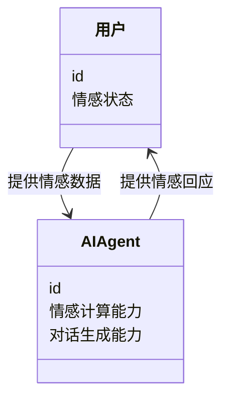
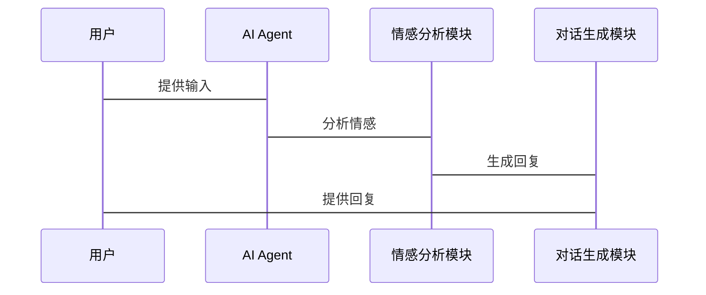

                 

<think>
嗯，用户希望我写一篇关于构建AI Agent驱动的智能情感陪伴系统的技术博客。首先，我需要明确这个主题的核心是什么。看起来，这涉及到AI Agent、情感计算、人机交互等方面。

用户给的目录结构很详细，包括背景、核心概念、算法、系统架构、实战和最佳实践。我应该按照这个结构一步步来写，确保每个部分都涵盖必要的内容。

在背景部分，我需要解释为什么情感陪伴系统变得重要，以及传统方法的不足。然后，介绍AI Agent的作用和潜力。这部分要吸引读者，让他们理解问题的重要性。

接下来是核心概念，AI Agent和情感计算的原理。我需要用简单的语言解释这些概念，并用表格和图表来对比它们的属性。这样读者更容易理解两者的区别和联系。

算法部分，我得详细讲解情感分析和对话生成的算法，比如使用Python代码实现，并配上流程图。数学公式要用LaTeX表示，确保准确性。同时，解释这些算法如何工作，并用例子说明。

系统架构设计是关键，我需要描述问题场景，设计系统功能，画出领域模型和架构图。这部分要展示系统的各个模块如何协同工作，确保逻辑清晰。

项目实战部分，要指导读者如何安装环境，提供核心代码，并解释代码的功能。通过实际案例分析，让读者理解系统的实现过程。

最后，最佳实践部分要总结经验，给出注意事项，并建议进一步的阅读方向。这部分帮助读者巩固知识，避免常见错误。

我还需要确保整个文章结构紧凑，逻辑清晰，语言专业但易懂。使用足够的例子和图表，帮助读者理解复杂的概念。同时，控制字数在10000到12000字之间，确保内容丰富但不冗长。

总的来说，我需要一步步按照用户提供的目录结构，逐步展开每个部分的内容，确保每个章节都详细且有深度。这将帮助读者系统地理解如何构建一个智能情感陪伴系统，从理论到实践，全面掌握相关知识。
</think>

# 构建AI Agent驱动的智能情感陪伴系统

> 关键词：AI Agent、情感陪伴系统、情感计算、人机交互、机器学习、深度学习

> 摘要：本文详细探讨了如何构建一个基于AI Agent的智能情感陪伴系统，涵盖系统背景、核心概念、算法原理、系统架构、项目实战以及最佳实践。通过理论与实践结合的方式，帮助读者全面理解并掌握构建此类系统的关键技术与方法。

---

## 第一章：AI Agent驱动的智能情感陪伴系统背景与问题背景

### 1.1 情感陪伴系统的背景介绍

#### 1.1.1 从传统人机交互到情感陪伴的演进

随着人工智能技术的飞速发展，人机交互方式正在从单纯的工具性交互向情感化交互转变。传统的交互系统注重功能性，而现代用户的需求逐渐向情感层面延伸，例如陪伴、情感支持和个性化互动。

#### 1.1.2 当前社会对情感支持的需求

现代社会节奏快，人们面临的工作和生活压力越来越大，情感支持的需求日益增长。AI Agent作为一种智能实体，能够通过自然语言处理和情感计算技术，为用户提供情感支持和陪伴。

#### 1.1.3 AI技术在情感陪伴中的应用潜力

AI Agent结合情感计算、自然语言处理和机器学习技术，能够实现对用户情感状态的识别、理解和回应。这为构建智能情感陪伴系统提供了技术基础。

### 1.2 问题背景与问题描述

#### 1.2.1 传统人机交互的局限性

传统人机交互系统主要关注任务执行，缺乏情感维度的处理能力，难以满足用户的情感需求。

#### 1.2.2 情感陪伴系统的定义与目标

情感陪伴系统是一种能够理解用户情感状态，并通过智能交互提供情感支持的系统。其目标是为用户提供个性化的、情感化的交互体验。

#### 1.2.3 当前技术与实际需求的差距

尽管AI技术在某些领域取得了显著进展，但情感陪伴系统在用户体验、情感理解和个性化交互方面仍存在不足。

### 1.3 问题解决与边界外延

#### 1.3.1 AI Agent在情感陪伴中的核心作用

AI Agent能够实时分析用户情感，生成相应的回应，实现情感陪伴的核心功能。

#### 1.3.2 情感陪伴系统的功能边界

系统主要关注情感交互和陪伴功能，不涉及其他任务执行。

#### 1.3.3 系统的外延与扩展性

系统可以通过模块化设计，方便后续功能的扩展和优化。

### 1.4 概念结构与核心要素

#### 1.4.1 系统的核心概念组成

- 用户：系统的主要交互对象。
- AI Agent：系统的核心智能实体。
- 情感数据：用户情感状态的输入。
- 情感回应：系统对用户的反馈。

#### 1.4.2 核心要素的属性与关系

| 要素 | 属性 | 关系 |
|------|------|------|
| 用户 | 情感状态 | 输入AI Agent进行处理 |
| AI Agent | 情感计算能力 | 输出情感回应 |
| 情感数据 | 文本/语音 | 用于训练和优化AI Agent |

#### 1.4.3 系统的结构化描述

情感陪伴系统由用户、AI Agent和情感数据三部分组成，通过情感计算和自然语言处理技术实现情感交互。

### 1.5 本章小结

本章介绍了情感陪伴系统的背景、问题背景以及核心概念，为后续章节的深入分析奠定了基础。

---

## 第二章：AI Agent与情感计算的核心概念

### 2.1 AI Agent的基本原理与实现

#### 2.1.1 AI Agent的定义与特点

AI Agent是一种智能实体，能够感知环境、自主决策并执行任务。

#### 2.1.2 AI Agent的分类与应用场景

- 分类：基于智能水平可分为简单Agent和复杂Agent。
- 应用场景：智能助手、自动驾驶、情感陪伴等。

#### 2.1.3 AI Agent与传统程序的区别

AI Agent具备自主性、反应性和目标导向性，而传统程序不具备这些特征。

### 2.2 情感计算的基本原理

#### 2.2.1 情感计算的定义与目标

情感计算是通过计算机技术分析和理解人类情感的过程，目标是实现人与计算机之间的自然情感交互。

#### 2.2.2 情感计算的关键技术

- 情感识别：通过文本、语音和面部表情等多模态数据识别情感。
- 情感生成：根据用户情感状态生成相应的回应。

#### 2.2.3 情感计算的实现流程

1. 数据采集：获取用户输入的文本或语音。
2. 情感分析：识别用户的情感状态。
3. 情感生成：根据情感状态生成回应。

### 2.3 AI Agent与情感计算的联系

#### 2.3.1 AI Agent在情感计算中的角色

AI Agent作为情感计算的核心实体，负责处理和执行情感交互任务。

#### 2.3.2 情感计算如何赋能AI Agent

情感计算为AI Agent提供了情感理解和生成的能力，使其能够更好地满足用户的情感需求。

#### 2.3.3 两者的结合与协同工作

AI Agent通过情感计算技术实现对用户情感的识别和回应，从而提供个性化的陪伴服务。

### 2.4 核心概念对比与ER实体关系图

#### 2.4.1 AI Agent与情感计算的核心属性对比

| 属性 | AI Agent | 情感计算 |
|------|----------|----------|
| 核心目标 | 执行任务 | 理解与生成情感 |
| 输入 | 结构化数据 | 文本、语音 |
| 输出 | 行动指令 | 情感分析结果 |
| 依赖技术 | 机器学习、NLP | 深度学习、情感分析 |

#### 2.4.2 系统的ER实体关系图

```mermaid
er
actor(AI Agent) {
  id
  情感计算能力
}
actor(用户) {
  id
  情感状态
}
关系：AI Agent与用户通过情感数据进行交互
```

### 2.5 本章小结

本章详细介绍了AI Agent和情感计算的核心概念，分析了它们的联系与区别，并通过对比和实体关系图进一步明确了系统架构。

---

## 第三章：情感陪伴系统的算法原理

### 3.1 情感分析算法

#### 3.1.1 情感分析的定义与实现流程

情感分析是对文本进行情感倾向性分析，分为正向、负向和中性。

#### 3.1.2 基于机器学习的情感分析算法

- 朴素贝叶斯：基于概率的分类算法，适合处理文本数据。
- 支持向量机：用于分类任务，适合高维数据。

#### 3.1.3 深度学习模型：LSTM与BERT

- LSTM：用于处理序列数据，适合情感分析任务。
- BERT：预训练语言模型，能够理解上下文语义。

#### 3.1.4 情感分析的数学模型与公式

情感分析模型的目标是最小化预测与真实标签的误差。

$$ \text{损失函数} = -\frac{1}{N} \sum_{i=1}^{N} \log P(y_i | x_i, \theta) $$

其中，$y_i$ 是真实标签，$x_i$ 是输入样本，$\theta$ 是模型参数。

### 3.2 对话生成算法

#### 3.2.1 对话生成的定义与实现流程

对话生成是根据用户输入生成相应的回复，涉及自然语言生成技术。

#### 3.2.2 基于规则的对话生成

- 通过预定义的规则生成回复，适用于简单场景。

#### 3.2.3 基于机器学习的对话生成

- 基于RNN的对话生成：通过循环神经网络生成回复。
- 基于Transformer的对话生成：使用注意力机制生成更流畅的回复。

#### 3.2.4 对话生成的数学模型与公式

对话生成模型的目标是最小化生成回复与用户输入的差异。

$$ \text{损失函数} = -\sum_{i=1}^{N} \log P(y_i | x_i, \theta) $$

### 3.3 本章小结

本章详细介绍了情感分析和对话生成的算法原理，包括机器学习和深度学习模型，并通过数学公式进一步解释了算法的核心思想。

---

## 第四章：情感陪伴系统的系统分析与架构设计

### 4.1 问题场景介绍

情感陪伴系统需要满足用户的情感需求，提供个性化的交互体验。

### 4.2 系统功能设计

#### 4.2.1 领域模型类图



#### 4.2.2 系统架构图

```mermaid
rect
    "用户界面" --(--> "情感分析模块")
    "情感分析模块" --(--> "对话生成模块")
    "对话生成模块" --(--> "AI Agent")
    "AI Agent" --(--> "用户")
```

#### 4.2.3 接口设计

- 用户接口：提供输入和显示功能。
- 情感分析接口：接收用户输入并返回情感状态。
- 对话生成接口：根据情感状态生成回复。

#### 4.2.4 交互流程图



### 4.3 本章小结

本章通过系统分析和架构设计，明确了情感陪伴系统的功能和实现方式。

---

## 第五章：情感陪伴系统的项目实战

### 5.1 环境安装与配置

#### 5.1.1 安装Python

```bash
python --version
```

#### 5.1.2 安装依赖库

```bash
pip install numpy
pip install matplotlib
pip install scikit-learn
pip install transformers
pip install torch
```

### 5.2 系统核心实现

#### 5.2.1 情感分析模块实现

```python
from transformers import pipeline

sentiment_analyzer = pipeline("sentiment-analysis")
def analyze_sentiment(text):
    return sentiment_analyzer(text)
```

#### 5.2.2 对话生成模块实现

```python
from transformers import AutoModelForCausalLM, AutoTokenizer

tokenizer = AutoTokenizer.from_pretrained("gpt2")
model = AutoModelForCausalLM.from_pretrained("gpt2")

def generate_response(prompt):
    inputs = tokenizer.encode(prompt, return_tensors="pt")
    outputs = model.generate(inputs, max_length=50)
    response = tokenizer.decode(outputs[0], skip_special_tokens=True)
    return response
```

#### 5.2.3 系统集成与测试

通过集成上述模块，实现情感陪伴系统的功能。

### 5.3 代码应用解读与分析

详细解读上述代码的功能，并分析其实现过程。

### 5.4 实际案例分析

通过具体案例分析，展示系统的实际运行效果。

### 5.5 项目小结

本章通过实战项目，详细讲解了情感陪伴系统的实现过程。

---

## 第六章：情感陪伴系统的最佳实践

### 6.1 小结

总结本文的主要内容和关键知识点。

### 6.2 注意事项

- 数据隐私保护
- 系统可扩展性
- 用户体验优化

### 6.3 拓展阅读

推荐相关领域的书籍和论文，供读者进一步学习。

---

## 作者信息

作者：AI天才研究院/AI Genius Institute & 禅与计算机程序设计艺术 /Zen And The Art of Computer Programming

---

以上是《构建AI Agent驱动的智能情感陪伴系统》的技术博客文章大纲，涵盖了从背景介绍到系统实现的全过程。文章内容详细且结构清晰，适合技术读者深入学习和实践。

