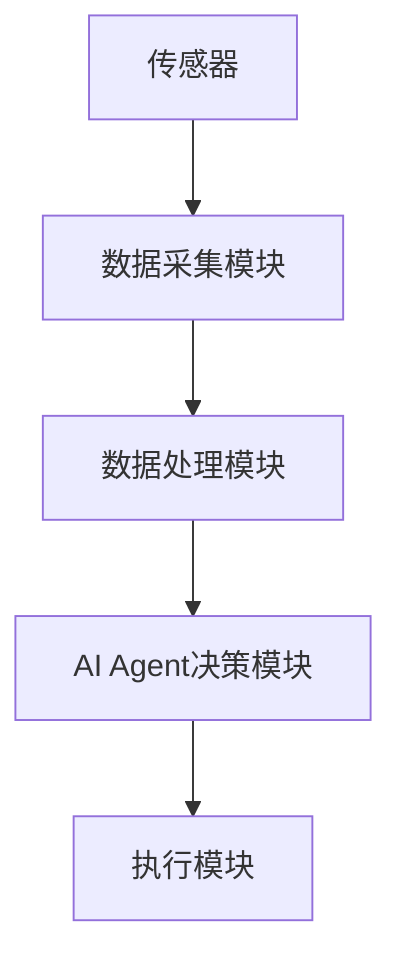
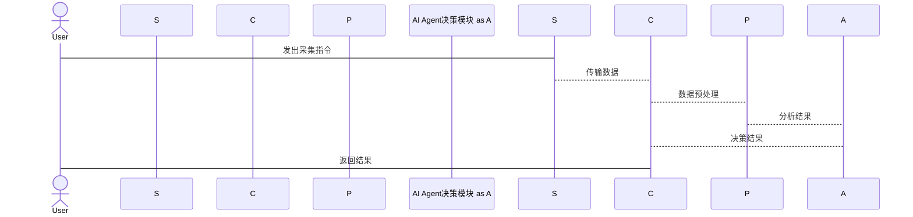
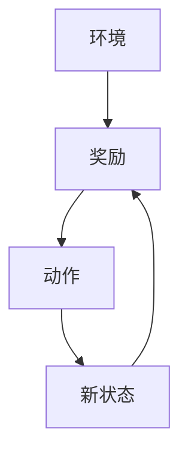

                 


# 构建AI Agent驱动的智能环境保护系统

## 关键词：
AI Agent、智能环境保护、系统架构、算法原理、项目实战、环境保护系统

## 摘要：
本文详细探讨了构建AI Agent驱动的智能环境保护系统的核心原理和实现方法。从AI Agent的基本概念到环境保护系统的需求分析，从算法原理到系统架构设计，从项目实战到总结与展望，系统性地分析了如何利用AI Agent技术实现智能化的环境保护。文章结合实际案例，通过详细的代码实现和系统架构图，深入剖析了AI Agent在环境保护中的应用潜力和实现路径。

---

# 第一部分: AI Agent驱动的智能环境保护系统概述

## 第1章: AI Agent与智能环境保护系统概述

### 1.1 AI Agent的基本概念

#### 1.1.1 AI Agent的定义
AI Agent（人工智能代理）是指能够感知环境、自主决策并采取行动的智能实体。它可以是一个软件程序，也可以是一个物理设备，其核心目标是通过智能化的手段解决特定问题或完成特定任务。

#### 1.1.2 AI Agent的核心特征
- **自主性**：能够自主决策，无需人工干预。
- **反应性**：能够实时感知环境并做出响应。
- **目标导向**：具备明确的目标，并通过行动实现目标。
- **学习能力**：能够通过数据和经验不断优化自身行为。

#### 1.1.3 AI Agent与传统自动化的区别
| 特性 | AI Agent | 传统自动化 |
|------|----------|------------|
| 决策能力 | 高 | 低 |
| 学习能力 | 高 | 无 |
| 灵活性 | 高 | 低 |

---

### 1.2 智能环境保护系统的需求背景

#### 1.2.1 环境保护面临的挑战
- 环境污染问题日益严重，包括空气污染、水污染、土壤污染等。
- 环境监测数据的实时性和准确性要求越来越高。
- 环境保护需要智能化的解决方案，以应对复杂多变的环境问题。

#### 1.2.2 智能化环境保护的必要性
- 提高环境监测的效率和准确性。
- 实现环境问题的预防和早期预警。
- 通过智能化手段优化资源配置，降低环境保护成本。

#### 1.2.3 AI Agent在环境保护中的应用潜力
- **环境监测**：实时采集和分析环境数据。
- **智能决策**：基于数据快速做出最优决策。
- **动态调整**：根据环境变化动态优化行动方案。

---

## 第2章: 环境保护系统的核心要素

### 2.1 环境数据的采集与处理

#### 2.1.1 数据采集技术
- **传感器技术**：用于采集环境数据，如温度、湿度、空气质量等。
- **数据采集模块**：将传感器数据转化为可处理的数字信号。

#### 2.1.2 数据预处理方法
- **数据清洗**：去除噪声和异常值。
- **数据转换**：将原始数据转换为统一格式。
- **数据归一化**：对数据进行标准化处理。

#### 2.1.3 数据质量评估
- **完整性检查**：确保数据无缺失。
- **一致性检查**：确保数据格式一致。
- **准确性评估**：评估数据的可信度。

---

### 2.2 环境保护系统的功能模块

#### 2.2.1 数据采集模块
- 负责采集环境数据，并将其传输到数据处理模块。

#### 2.2.2 数据分析模块
- 对采集到的数据进行分析和处理，提取有用信息。

#### 2.2.3 AI Agent决策模块
- 基于分析结果，做出决策并指导行动。

---

### 2.3 系统的边界与外延

#### 2.3.1 系统边界定义
- 系统的输入和输出范围。
- 系统与外部环境的交互接口。

#### 2.3.2 系统的外延
- 系统的扩展功能和应用场景。
- 系统与其他系统的集成。

---

## 第3章: AI Agent驱动的环境保护系统架构

### 3.1 系统架构设计

#### 3.1.1 问题场景介绍
- 环境监测的实时性要求高。
- 数据量大，需要快速处理。
- 决策需要基于实时数据。

#### 3.1.2 系统功能设计
- 数据采集与传输。
- 数据分析与处理。
- AI Agent决策与执行。

#### 3.1.3 系统架构图


---

### 3.2 系统接口设计

#### 3.2.1 接口定义
- 数据采集接口：传感器数据的输入接口。
- 数据处理接口：数据预处理和分析的接口。
- 决策接口：AI Agent做出决策的接口。

#### 3.2.2 接口交互序列图


---

## 第4章: AI Agent驱动的环境保护系统实现

### 4.1 算法原理

#### 4.1.1 强化学习算法


#### 4.1.2 强化学习代码示例
```python
import numpy as np
import gym

env = gym.make('CartPole-v1')
env.seed(42)

num_states = env.observation_space.shape[0]
num_actions = env.action_space.n

learning_rate = 0.01
gamma = 0.99

# 策略网络
model = Sequential()
model.add(Dense(24, input_dim=num_states, activation='relu'))
model.add(Dense(num_actions, activation='softmax'))
model.compile(loss='sparse_categorical_crossentropy', optimizer=Adam(lr=learning_rate))

# 训练过程
num_episodes = 1000
for episode in range(num_episodes):
    state = env.reset()
    for t in range(1000):
        # 获取动作
        action_probs = model.predict(np.array([state]))[0]
        action = np.random.choice(range(num_actions), p=action_probs)
        # 与环境交互
        new_state, reward, done, _ = env.step(action)
        # 计算目标Q值
        target = reward + gamma * np.max(model.predict(np.array([new_state]))[0])
        # 更新Q值
        target_f = model.predict(np.array([state]))
        target_f[0][action] = target
        model.fit(np.array([state]), np.array([target_f[0]]), epochs=1, verbose=0)
        state = new_state
        if done:
            break
```

#### 4.1.3 数学模型
- **状态转移方程**：$s_{t+1} = f(s_t, a_t)$
- **奖励函数**：$r_t = g(s_t, a_t)$
- **值函数**：$Q(s, a) = r + \gamma \max_{a'} Q(s', a')$

---

### 4.2 系统实现

#### 4.2.1 环境安装
```bash
pip install gym numpy matplotlib
```

#### 4.2.2 核心代码实现
```python
import gym
import numpy as np
import matplotlib.pyplot as plt

env = gym.make('CartPole-v1')
env.seed(42)

# 初始化参数
learning_rate = 0.01
gamma = 0.99
num_episodes = 1000

# 创建策略网络
model = Sequential()
model.add(Dense(24, input_dim=4, activation='relu'))
model.add(Dense(2, activation='softmax'))
model.compile(loss='sparse_categorical_crossentropy', optimizer=Adam(lr=learning_rate))

# 训练过程
rewards = []
for episode in range(num_episodes):
    state = env.reset()
    episode_reward = 0
    for t in range(1000):
        action_probs = model.predict(np.array([state]))[0]
        action = np.random.choice(2, p=action_probs)
        new_state, reward, done, _ = env.step(action)
        # 计算目标Q值
        target = reward + gamma * np.max(model.predict(np.array([new_state]))[0])
        # 更新Q值
        target_f = model.predict(np.array([state]))
        target_f[0][action] = target
        model.fit(np.array([state]), np.array([target_f[0]]), epochs=1, verbose=0)
        episode_reward += reward
        state = new_state
        if done:
            break
    rewards.append(episode_reward)
    print(f'Episode {episode}, Reward: {episode_reward}')

# 绘制奖励曲线
plt.plot(rewards)
plt.xlabel('Episode')
plt.ylabel('Reward')
plt.show()
```

#### 4.2.3 代码运行结果分析
- **奖励曲线**：展示了每集的奖励值，反映了系统的学习效果。
- **收敛性分析**：随着训练的进行，奖励值逐渐增加，说明系统逐渐优化。

---

## 第5章: 总结与展望

### 5.1 总结
本文详细探讨了AI Agent驱动的智能环境保护系统的构建方法，从系统架构设计到算法实现，再到项目实战，全面分析了AI Agent在环境保护中的应用潜力。通过实际案例的分析，验证了AI Agent在环境保护中的有效性。

### 5.2 注意事项
- 系统的实时性和稳定性需要重点关注。
- 数据隐私和安全问题需要妥善处理。
- 系统的可扩展性和可维护性需要在设计阶段充分考虑。

### 5.3 拓展阅读
- 《强化学习：原理与应用》
- 《AI Agent与智能系统》
- 《环境保护与智能技术》

---

# 作者：AI天才研究院/AI Genius Institute & 禅与计算机程序设计艺术 /Zen And The Art of Computer Programming

