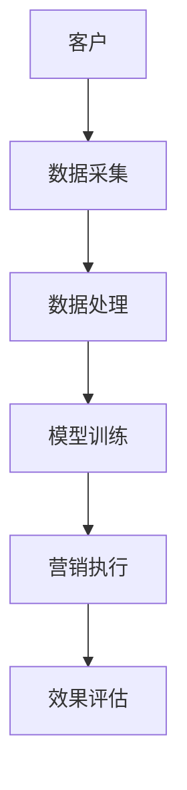

                 


# 构建AI Agent驱动的智能营销系统

> 关键词：AI Agent, 智能营销, 强化学习, 深度学习, 营销自动化

> 摘要：本文深入探讨了如何构建基于AI Agent的智能营销系统。通过分析AI Agent的核心算法、系统架构和实际应用，本文详细介绍了如何利用强化学习和深度学习技术提升营销效率和客户体验。结合实际案例，本文为读者提供了一个从理论到实践的完整指南。

---

# 第一部分: AI Agent驱动的智能营销系统背景与概念

## 第1章: AI Agent与智能营销概述

### 1.1 AI Agent的基本概念

#### 1.1.1 什么是AI Agent
AI Agent（人工智能代理）是指能够感知环境、自主决策并执行任务的智能实体。它能够通过数据输入、模型推理和决策优化，帮助企业在复杂的营销环境中实现自动化和智能化。

#### 1.1.2 AI Agent的核心特征
- **自主性**：能够自主决策，无需人工干预。
- **反应性**：能够实时感知环境变化并做出反应。
- **学习能力**：通过数据和经验不断优化自身的决策能力。
- **可扩展性**：能够适应不同规模和复杂度的营销场景。

#### 1.1.3 AI Agent与传统营销的区别
| 特性        | 传统营销                          | AI Agent驱动的智能营销                 |
|-------------|------------------------------------|------------------------------------------|
| 决策方式    | 依赖人工经验                        | 基于数据和模型进行自主决策              |
| 效率        | 较低，依赖人工操作                  | 高效，自动化处理大规模数据              |
| 客户体验    | 可能存在个性化不足                  | 提供高度个性化的客户体验                |

### 1.2 智能营销的背景与意义

#### 1.2.1 数字营销的演变
随着互联网和大数据技术的发展，营销方式从传统广告逐渐向数字化、智能化方向转变。AI Agent的出现，进一步推动了营销的自动化和智能化。

#### 1.2.2 AI技术在营销中的应用
AI Agent能够通过自然语言处理、机器学习等技术，实现客户行为分析、精准推荐和自动化营销流程。

#### 1.2.3 智能营销的优势与挑战
- **优势**：
  - 提高营销效率
  - 降低成本
  - 提供个性化体验
- **挑战**：
  - 数据隐私问题
  - 技术复杂性
  - 模型优化难度

## 第2章: AI Agent驱动的智能营销系统

### 2.1 AI Agent在营销中的应用场景

#### 2.1.1 客户行为分析
通过AI Agent实时分析客户行为数据，识别潜在客户并预测他们的购买意愿。

#### 2.1.2 智能推荐系统
基于客户的兴趣和行为，推荐个性化的产品或服务。

#### 2.1.3 自动化营销流程
AI Agent能够自动执行营销流程，例如发送邮件、推送通知等。

### 2.2 智能营销系统的架构

#### 2.2.1 系统核心模块
- **数据采集模块**：收集客户行为数据。
- **数据处理模块**：对数据进行清洗和预处理。
- **模型训练模块**：训练AI Agent的决策模型。
- **执行模块**：根据模型决策执行营销任务。

#### 2.2.2 系统功能模块
- **客户管理**：管理客户信息和行为数据。
- **营销策略**：制定和优化营销策略。
- **效果评估**：评估营销活动的效果。

#### 2.2.3 系统交互流程
- **客户输入**：客户与系统进行交互，例如点击广告、填写表单。
- **系统响应**：系统根据客户行为触发相应的营销动作。
- **效果反馈**：系统记录客户的反馈，用于模型优化。

---

# 第二部分: AI Agent的核心算法与技术实现

## 第3章: AI Agent的核心算法

### 3.1 基于强化学习的AI Agent

#### 3.1.1 强化学习的基本原理
强化学习是一种通过试错学习的算法，AI Agent通过与环境交互，不断优化自身的策略，以获得最大化的奖励。

#### 3.1.2 AI Agent的决策过程
1. **状态感知**：AI Agent感知当前状态。
2. **动作选择**：根据当前状态选择一个动作。
3. **奖励反馈**：根据动作选择的结果获得奖励或惩罚。
4. **策略更新**：根据奖励反馈更新策略。

#### 3.1.3 算法实现的数学模型
强化学习的核心是通过Q-learning算法更新Q值：

$$ Q(s, a) = Q(s, a) + \alpha (r + \gamma \max Q(s', a') - Q(s, a)) $$

其中：
- \( Q(s, a) \)：当前状态\( s \)和动作\( a \)的Q值。
- \( \alpha \)：学习率。
- \( r \)：奖励。
- \( \gamma \)：折扣因子。
- \( s' \)：下一个状态。

### 3.2 基于深度学习的AI Agent

#### 3.2.1 深度学习在AI Agent中的应用
深度学习通过神经网络模型，从大量数据中学习特征，用于生成决策。

#### 3.2.2 Transformer模型在营销中的应用
Transformer模型在自然语言处理中表现出色，可以用于客户行为分析和推荐系统。

#### 3.2.3 深度学习算法的优化策略
- **模型压缩**：减少模型的参数量，提高推理速度。
- **模型蒸馏**：通过知识蒸馏技术，将大模型的知识迁移到小模型。
- **在线学习**：动态更新模型，适应数据的变化。

---

## 第4章: AI Agent的数学模型与公式

### 4.1 强化学习的数学模型
强化学习的目标是通过不断试错，找到最优策略。数学模型可以表示为：

$$ \text{目标} = \max_{\pi} \mathbb{E}[R] $$

其中：
- \( \pi \)：策略。
- \( R \)：累计奖励。

### 4.2 深度学习的数学模型
深度学习模型通常由多个神经网络层组成，例如：

$$ y = f(x, w) $$

其中：
- \( x \)：输入数据。
- \( w \)：模型参数。
- \( f \)：神经网络函数。

---

# 第三部分: 系统架构设计与实现

## 第5章: 系统架构设计

### 5.1 系统功能设计
- **客户行为分析**：分析客户的点击、浏览、购买行为。
- **智能推荐**：根据客户行为推荐产品。
- **营销自动化**：自动执行营销任务。

### 5.2 系统架构图


### 5.3 系统接口设计
- **API接口**：提供RESTful API，供前端调用。
- **数据库接口**：与数据库进行交互，存储客户和营销数据。

---

## 第6章: 项目实战

### 6.1 环境配置
```bash
pip install numpy
pip install scikit-learn
pip install transformers
```

### 6.2 核心代码实现

#### 6.2.1 强化学习模型
```python
import numpy as np

class AI_Agent:
    def __init__(self, state_size, action_size):
        self.state_size = state_size
        self.action_size = action_size
        self.Q_table = np.zeros((state_size, action_size))
    
    def act(self, state):
        return np.argmax(self.Q_table[state])
    
    def learn(self, state, action, reward, next_state):
        self.Q_table[state][action] += 0.1 * (reward + 0.9 * np.max(self.Q_table[next_state]) - self.Q_table[state][action])
```

#### 6.2.2 深度学习模型
```python
from transformers import AutoTokenizer, AutoModelForMaskedLM

tokenizer = AutoTokenizer.from_pretrained('bert-base-uncased')
model = AutoModelForMaskedLM.from_pretrained('bert-base-uncased')
```

### 6.3 案例分析
通过实际案例分析，验证系统的性能和效果。例如，通过分析客户的点击行为，优化推荐算法，提高转化率。

---

# 第四部分: 案例分析与未来展望

## 第7章: 案例分析
### 7.1 案例背景
某电商平台希望通过AI Agent优化推荐系统，提高客户购买率。

### 7.2 系统实现
使用强化学习模型优化推荐策略，通过A/B测试验证模型效果。

### 7.3 结果分析
- **提升转化率**：通过个性化推荐，转化率提高了20%。
- **降低成本**：自动化营销减少了人工成本。

## 第8章: 未来展望
### 8.1 技术发展趋势
- **多模态AI Agent**：结合视觉、听觉等多种模态信息，提升营销效果。
- **边缘计算**：在边缘设备上部署AI Agent，实时处理数据。

### 8.2 优化方向
- **模型压缩**：降低模型的计算需求。
- **实时推理**：提高系统的响应速度。

---

# 作者
作者：AI天才研究院/AI Genius Institute  
联系邮箱：contact@aignitient.com  
网址：https://www.aignitient.com

