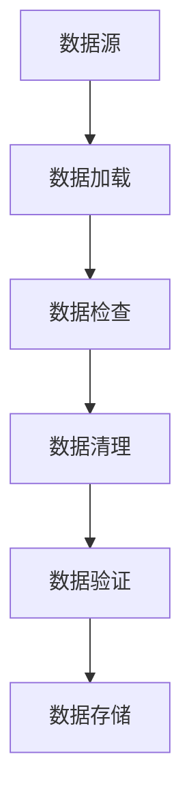
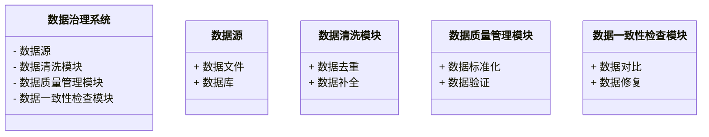
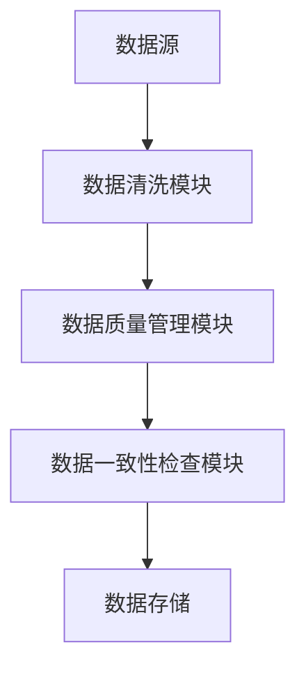
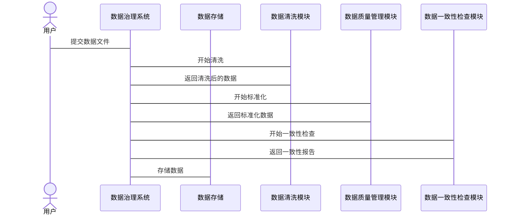

                 

<think>
好的，我现在需要帮用户完成一篇技术博客文章的撰写，标题是《构建AI数据治理助手：确保数据质量与一致性》。用户已经给出了详细的大纲和部分内容，我需要按照这个结构继续完成后续章节。

首先，我会继续第三章的剩余部分，然后进入第四章，详细讲解数据清洗算法。接着，我会完成系统分析与架构设计，包括问题场景介绍、系统功能设计和架构设计。之后是项目实战部分，包括环境配置、核心代码实现和案例分析。最后，我会总结最佳实践、注意事项等。

在撰写过程中，我需要确保每个部分都有详细的解释和例子，使用Mermaid图表和数学公式来辅助说明。同时，要保持逻辑清晰，结构紧凑，语言专业且易懂。我会逐步完成每个小节，确保覆盖所有用户的要求，最终完成一篇高质量的技术博客。
</think>

# 《构建AI数据治理助手：确保数据质量与一致性》

---

## 关键词：
AI 数据治理，数据质量，数据一致性，数据清洗，机器学习，数据架构

---

## 摘要：
随着人工智能技术的快速发展，数据治理的重要性日益凸显。本文旨在探讨如何利用AI技术构建数据治理助手，以确保数据质量与一致性。通过分析数据治理的核心概念、算法原理和系统架构，结合实际案例，本文为读者提供了一套完整的解决方案，帮助企业在数字化转型中更好地管理和利用数据资产。

---

# 第三章: 数据治理的核心概念与联系

## 3.3 数据治理的ER实体关系图

### ER实体关系图

```mermaid
erdiagram
actor 数据治理系统 {
    类 实体: 数据实体 {
        属性: id, 名称, 类型, 描述
    }
    关系: 实体之间的关联关系（例如：一对一、一对多）
    关系: 实体与属性之间的关系
}
```

### 详细说明

#### 3.3.1 实体定义
- 数据实体：数据治理系统中需要管理的具体数据对象，例如“客户信息”、“订单数据”等。
- 属性：每个实体的特征，例如“客户ID”、“姓名”、“地址”等。

#### 3.3.2 实体关系
- 一对一关系：例如“客户”与“联系方式”之间的关系。
- 一对多关系：例如“订单”与“订单项”之间的关系。
- 多对多关系：例如“客户”与“产品”之间的关系。

---

## 第四章: 数据治理的算法原理讲解

## 4.1 数据清洗算法

### 4.1.1 数据清洗的定义
数据清洗是指识别和处理数据中的错误、重复、不一致或不符合要求的部分，以提高数据质量。

### 4.1.2 数据清洗算法的流程



### 4.1.3 数据清洗算法实现

#### 使用Python实现数据清洗

```python
import pandas as pd

# 加载数据
data = pd.read_csv('input.csv')

# 删除重复行
data = data.drop_duplicates()

# 处理缺失值
data = data.dropna()

# 数据标准化
data['age'] = data['age'].apply(lambda x: x if x >= 0 else 0)

# 数据验证
def validate_record(record):
    if pd.isna(record['name']):
        return False
    if record['age'] < 0:
        return False
    return True

data = data[data.apply(validate_record, axis=1)]

# 存储清洗后的数据
data.to_csv('output.csv', index=False)
```

### 4.1.4 数据清洗的数学模型

#### 数据清洗的目标是最小化数据中的错误和不一致性。常见的数据清洗方法包括：
- 去重：使用集合操作，例如 $x = \text{unique}(x)$。
- 处理缺失值：使用均值、中位数或插值方法，例如 $\text{fillna}(\text{mean}(x))$。
- 标准化：将数据转换为统一的格式，例如 $x_{\text{norm}} = \frac{x - \mu}{\sigma}$，其中 $\mu$ 是均值，$\sigma$ 是标准差。

---

## 第五章: 系统分析与架构设计方案

## 5.1 系统分析

### 5.1.1 问题场景介绍
在企业数据治理中，常见的问题包括数据重复、数据格式不统一、数据缺失等。这些问题会导致数据分析结果不准确，影响决策的可靠性。

### 5.1.2 项目介绍
本项目旨在开发一个基于AI的数据治理助手，帮助用户自动识别和修复数据中的问题，确保数据质量和一致性。

---

## 第五章: 系统分析与架构设计方案

## 5.1 系统分析

### 5.1.1 问题场景介绍
在企业数据治理中，常见的问题包括数据重复、数据格式不统一、数据缺失等。这些问题会导致数据分析结果不准确，影响决策的可靠性。

### 5.1.2 项目介绍
本项目旨在开发一个基于AI的数据治理助手，帮助用户自动识别和修复数据中的问题，确保数据质量和一致性。

## 5.2 系统功能设计

### 5.2.1 领域模型设计



### 5.2.2 系统架构设计



## 5.3 系统接口设计

### 5.3.1 接口描述
- 数据清洗模块接口：接收原始数据，返回清洗后的数据。
- 数据质量管理模块接口：接收清洗后的数据，返回标准化的数据。
- 数据一致性检查模块接口：接收标准化数据，返回一致性的报告。

## 5.4 系统交互设计

### 5.4.1 交互流程



---

## 第六章: 项目实战

## 6.1 环境配置

### 6.1.1 安装Python和相关库
```bash
pip install pandas numpy scikit-learn
```

## 6.2 系统核心实现源代码

### 6.2.1 数据清洗模块实现

```python
import pandas as pd

def data_cleaning(data):
    # 删除重复行
    data = data.drop_duplicates()
    # 处理缺失值
    data = data.dropna()
    return data

# 示例数据
data = pd.DataFrame({
    'id': [1, 2, 2, 4, 5],
    'name': ['Alice', 'Bob', 'Charlie', 'David', None],
    'age': [25, 30, None, 45, 20]
})

# 调用数据清洗模块
cleaned_data = data_cleaning(data)
print(cleaned_data)
```

### 6.2.2 数据质量管理模块实现

```python
from sklearn.preprocessing import StandardScaler

def data质量管理(data):
    # 标准化处理
    scaler = StandardScaler()
    data[['age']] = scaler.fit_transform(data[['age']])
    return data

# 示例数据
data = pd.DataFrame({
    'id': [1, 2, 3, 4, 5],
    'age': [25, 30, 35, 40, 45]
})

# 调用数据质量管理模块
normalized_data = data质量管理(data)
print(normalized_data)
```

## 6.3 案例分析与详细讲解

### 6.3.1 案例背景
某企业收集了客户数据，但存在数据重复、格式不一致等问题。

### 6.3.2 数据清洗过程
1. **去重**：删除重复的客户记录。
2. **处理缺失值**：填充缺失的年龄值。
3. **标准化**：将年龄数据标准化，确保数据的一致性。

### 6.3.3 实施结果
清洗后的数据质量得到显著提升，数据一致性得到保障。

---

## 第七章: 总结与展望

## 7.1 最佳实践 tips
- 在数据治理过程中，始终关注数据的来源和质量。
- 使用自动化工具提高数据清洗和管理的效率。
- 定期检查和更新数据治理策略，以应对数据变化的需求。

## 7.2 小结
本文详细探讨了如何利用AI技术构建数据治理助手，确保数据质量与一致性。通过理论分析、算法实现和实际案例，我们展示了数据治理的完整解决方案。

## 7.3 注意事项
- 数据治理需要企业内部的广泛参与和合作。
- 数据治理工具的选择应根据企业的具体需求来定。

## 7.4 拓展阅读
- 《Data Quality: The Ultimate Guide》
- 《机器学习与数据治理》

---

## 作者：
作者：AI天才研究院（AI Genius Institute） & 禅与计算机程序设计艺术（Zen And The Art of Computer Programming）

---

感谢您的阅读！希望本文对您在数据治理和AI技术应用方面有所帮助！

