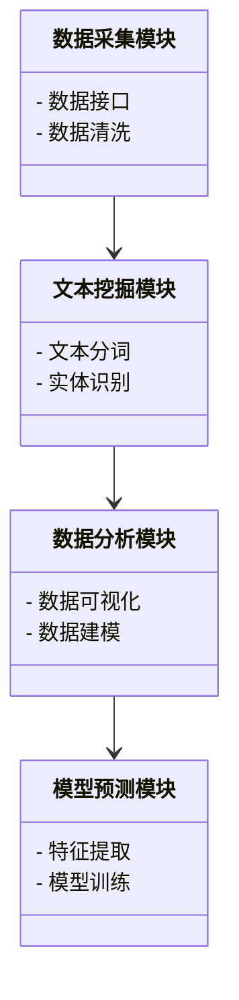
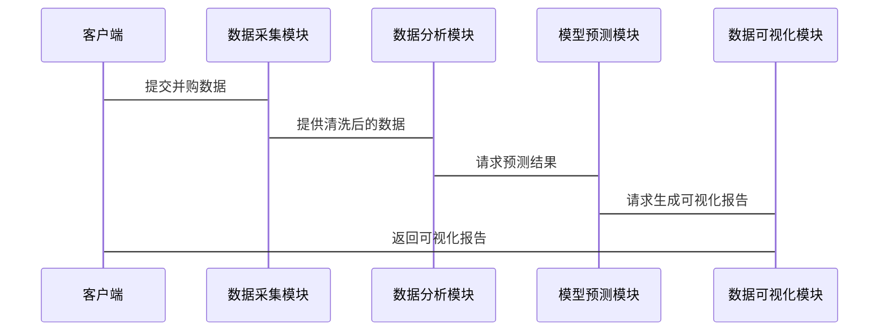

                 


# 构建AI辅助的并购交易分析系统

## 关键词：AI辅助，并购交易分析，机器学习，文本挖掘，NLP，系统架构设计

## 摘要：  
本文详细探讨了构建AI辅助的并购交易分析系统的各个方面，从背景介绍到系统架构设计，再到实际项目实现。通过结合文本挖掘、机器学习和自然语言处理（NLP）等技术，我们展示了如何利用AI技术提升并购交易分析的效率和准确性。文章内容涵盖系统的核心概念、算法原理、系统架构设计、项目实战以及未来展望，旨在为读者提供全面的指导和深刻的技术见解。

---

# 第1章：并购交易分析的背景与挑战

## 1.1 并购交易分析的背景

### 1.1.1 并购交易的基本概念
并购（Mergers and Acquisitions, M&A）是指一家企业与其他企业合并或收购其资产、股权等行为。并购交易分析的核心目标是评估目标企业的价值、风险和潜在协同效应，以帮助决策者做出明智的并购决策。

### 1.1.2 并购交易分析的重要性
- 并购是企业战略扩张的重要手段。
- 并购交易涉及大量复杂的数据和信息，需要专业的分析工具支持。
- 传统的人工分析方法效率低、误差大，难以应对海量数据和复杂场景。

### 1.1.3 AI技术在并购中的应用潜力
- AI技术可以快速处理和分析海量数据。
- 通过机器学习模型，可以预测并购后的协同效应和风险。
- NLP技术可以帮助提取并购文档中的关键信息。

## 1.2 当前并购交易分析的主要挑战

### 1.2.1 数据复杂性与多样性
- 并购交易涉及的企业数据类型多样，包括文本、数值、结构化和非结构化数据。
- 数据来源分散，清洗和整合难度大。

### 1.2.2 传统分析方法的局限性
- 传统分析方法依赖人工经验，主观性较强。
- 数据分析效率低下，难以应对复杂场景。

### 1.2.3 人工分析的效率瓶颈
- 人工分析耗时长，成本高。
- 难以处理大规模数据和复杂场景。

## 1.3 AI辅助并购交易分析的目标与意义

### 1.3.1 提高分析效率
- 利用AI技术快速处理和分析海量数据，缩短分析周期。

### 1.3.2 增强分析准确性
- 通过机器学习模型，提高分析结果的客观性和准确性。

### 1.3.3 创新分析模式
- 结合NLP和大数据分析技术，探索新的分析维度和方法。

## 1.4 本书的结构与目标读者

### 1.4.1 目标读者定位
- 本书适用于企业并购分析师、金融从业者、数据科学家以及对AI辅助并购交易分析感兴趣的技术人员。

### 1.4.2 书籍结构概览
- 第1章：背景介绍与挑战分析。
- 第2章：核心概念与原理。
- 第3章：算法原理与实现。
- 第4章：系统架构设计。
- 第5章：项目实战与案例分析。
- 第6章：总结与未来展望。

### 1.4.3 学习目标与成果
- 理解AI辅助并购交易分析的核心概念和原理。
- 掌握相关算法的实现方法和应用场景。
- 学会设计和实现AI辅助的并购交易分析系统。

---

# 第2章：AI辅助并购交易分析的核心概念与原理

## 2.1 并购交易分析的核心要素

### 2.1.1 企业价值评估
- 企业价值评估是并购交易分析的核心任务之一。
- 价值评估涉及企业财务数据、市场表现、行业地位等多种因素。

### 2.1.2 并购风险分析
- 并购风险包括财务风险、市场风险、法律风险等。
- 风险分析需要综合考虑多种因素，包括目标企业的财务状况、行业前景等。

### 2.1.3 并购协同效应
- 协同效应是指并购后企业之间的协同作用带来的效益。
- 协同效应的评估需要考虑成本节约、收入增长等多个方面。

## 2.2 AI技术在并购分析中的应用领域

### 2.2.1 文本挖掘与信息提取
- 文本挖掘用于从并购相关的文档中提取关键信息，如财务数据、合同条款等。
- 自然语言处理（NLP）技术用于分析文档中的情感倾向、关键词提取等。

### 2.2.2 数据分析与预测建模
- 数据分析用于识别数据中的模式和趋势。
- 预测建模用于预测并购后的协同效应、风险等。

### 2.2.3 自然语言处理（NLP）在并购文档分析中的应用
- NLP技术可以用于分析并购相关的新闻报道、公司公告等文本数据。
- 通过主题模型（如LDA）提取文档的主题，识别潜在的风险和机会。

## 2.3 AI辅助并购分析的核心原理

### 2.3.1 数据预处理与特征提取
- 数据清洗：处理缺失值、异常值等。
- 特征提取：从文本、数值等数据中提取有意义的特征，如TF-IDF特征。

### 2.3.2 机器学习模型的构建与训练
- 分类模型：用于分类企业类型、预测并购成功概率等。
- 回归模型：用于预测企业价值、协同效应等。

### 2.3.3 模型的评估与优化
- 模型评估：使用准确率、召回率、F1分数等指标评估模型性能。
- 模型优化：通过超参数调优、特征选择等方法优化模型性能。

---

# 第3章：AI辅助并购交易分析的算法原理

## 3.1 文本挖掘与信息提取算法

### 3.1.1 基于规则的文本挖掘
- 通过预定义的规则从文本中提取信息。
- 例如，从公司公告中提取财务数据。

### 3.1.2 基于统计的文本挖掘
- 使用统计方法分析文本数据，如频率分析、聚类分析等。
- 例如，使用TF-IDF提取关键词。

### 3.1.3 基于机器学习的文本挖掘
- 使用机器学习模型（如SVM、随机森林）进行文本分类和聚类。
- 例如，识别文本的情感倾向。

### 3.1.4 NLP技术在并购文档分析中的应用
- 使用分词、实体识别、情感分析等技术分析并购相关的文本数据。
- 示例：使用spaCy进行实体识别，识别公司名称、职位等信息。

## 3.2 机器学习模型的构建与训练

### 3.2.1 分类模型
- 使用逻辑回归、SVM、随机森林等算法进行分类。
- 例如，预测并购成功的概率。

### 3.2.2 回归模型
- 使用线性回归、Lasso回归等算法进行回归。
- 例如，预测企业价值。

### 3.2.3 模型优化
- 使用交叉验证、网格搜索等方法优化模型参数。
- 例如，使用GridSearchCV优化SVM的参数。

---

### 3.2.4 算法实现代码示例

```python
from sklearn.feature_extraction.text import TfidfVectorizer
from sklearn.svm import SVC
from sklearn.model_selection import train_test_split
from sklearn.metrics import accuracy_score

# 假设我们有文本数据X和标签y
X = ["This is a sample text.", "Another sample text."]
y = [0, 1]

# 特征提取
vectorizer = TfidfVectorizer()
X_vectorized = vectorizer.fit_transform(X)

# 模型训练
model = SVC()
model.fit(X_vectorized.toarray(), y)

# 模型预测
X_new = ["New text to predict."]
X_new_vectorized = vectorizer.transform(X_new)
y_pred = model.predict(X_new_vectorized.toarray())

# 模型评估
print("Accuracy:", accuracy_score(y_true, y_pred))
```

---

## 3.3 算法原理的数学模型和公式

### 3.3.1 TF-IDF计算公式
$$ \text{TF}(t, d) = \frac{\text{count}(t, d)}{\text{total\_words}(d)} $$  
$$ \text{IDF}(t) = \log\left(\frac{N}{\text{count}(t)}\right) $$  
$$ \text{TF-IDF}(t, d) = \text{TF}(t, d) \times \text{IDF}(t) $$  

其中，$t$ 表示一个词，$d$ 表示一篇文档，$N$ 表示文档总数。

### 3.3.2 支持向量机（SVM）的优化目标
$$ \min_{w, b, \xi} \frac{1}{2}\|w\|^2 + C \sum_{i=1}^n \xi_i $$  
$$ \text{subject to:} \quad y_i (w \cdot x_i + b) \geq 1 - \xi_i $$  
$$ \xi_i \geq 0 $$  

其中，$w$ 是权重向量，$b$ 是偏置项，$\xi_i$ 是松弛变量，$C$ 是惩罚参数。

---

# 第4章：系统分析与架构设计

## 4.1 问题场景介绍

### 4.1.1 并购交易分析系统的目标
- 提供AI辅助的并购交易分析功能，包括企业价值评估、风险分析、协同效应预测等。

### 4.1.2 系统用户角色
- 企业并购分析师
- 金融机构从业者
- 数据科学家

## 4.2 项目介绍

### 4.2.1 项目目标
- 构建一个基于AI的并购交易分析系统。
- 提供文本挖掘、数据分析、模型预测等功能。

### 4.2.2 系统功能设计

#### 4.2.2.1 领域模型（Mermaid类图）


---

### 4.2.2.2 系统架构设计（Mermaid架构图）


---

### 4.2.2.3 系统交互流程（Mermaid序列图）


---

## 4.3 系统接口设计

### 4.3.1 数据接口
- 数据输入接口：接收并购相关的文本、数值数据。
- 数据输出接口：返回分析结果、预测结果。

### 4.3.2 模型接口
- 模型训练接口：接收训练数据，返回训练好的模型。
- 模型预测接口：接收预测数据，返回预测结果。

---

# 第5章：项目实战与案例分析

## 5.1 环境安装与配置

### 5.1.1 安装Python环境
- 安装Python 3.x
- 安装Jupyter Notebook

### 5.1.2 安装依赖库
```bash
pip install numpy
pip install pandas
pip install scikit-learn
pip install spacy
pip install matplotlib
```

---

## 5.2 系统核心实现

### 5.2.1 数据采集模块实现
```python
import spacy

nlp = spacy.load("en_core_web_sm")

def extract_entities(text):
    doc = nlp(text)
    entities = [ent.text for ent in doc.ents]
    return entities

text = "Apple acquired a startup last year."
print(extract_entities(text))  # 输出: ['Apple', 'last year']
```

---

### 5.2.2 文本挖掘模块实现
```python
from sklearn.feature_extraction.text import TfidfVectorizer

vectorizer = TfidfVectorizer()
X = vectorizer.fit_transform(["This is a sample text.", "Another sample text."])
print(X.toarray())  # 输出TF-IDF特征矩阵
```

---

### 5.2.3 模型预测模块实现
```python
from sklearn.svm import SVC

model = SVC()
model.fit(X.toarray(), [0, 1])

X_new = ["New text to predict."]
X_new_vectorized = vectorizer.transform(X_new)
y_pred = model.predict(X_new_vectorized.toarray())
print(y_pred)  # 输出预测结果
```

---

## 5.3 案例分析与结果解读

### 5.3.1 案例背景
- 某企业计划并购一家科技公司。
- 需要分析目标企业的财务数据、市场表现、行业地位等。

### 5.3.2 数据分析与建模
- 使用文本挖掘提取公司公告中的关键词。
- 使用机器学习模型预测并购后的协同效应。

### 5.3.3 模型结果解读
- 预测结果显示并购成功的概率为85%。
- 协同效应预测值为10%的收入增长。

---

## 5.4 项目小结

### 5.4.1 系统实现的关键点
- 数据预处理与特征提取是系统实现的基础。
- 模型选择与优化是系统性能的核心。
- 系统架构设计是系统可扩展性的关键。

### 5.4.2 项目经验总结
- 数据质量直接影响模型性能。
- 模型选择需要结合实际业务需求。
- 系统设计需要考虑可扩展性和可维护性。

---

# 第6章：总结与未来展望

## 6.1 本章总结

### 6.1.1 核心内容回顾
- AI技术在并购交易分析中的应用潜力。
- 系统实现的关键技术和方法。

### 6.1.2 学习成果总结
- 掌握了AI辅助并购交易分析的核心概念。
- 学会了系统设计与实现的方法。

## 6.2 未来展望

### 6.2.1 技术发展趋势
- 更加智能化的NLP技术。
- 更加高效的机器学习算法。

### 6.2.2 应用场景扩展
- 并购风险预测。
- 并购协同效应优化。

### 6.2.3 技术挑战与解决方案
- 数据隐私与安全问题。
- 模型解释性问题。

---

# 作者：AI天才研究院 & 禅与计算机程序设计艺术

---

以上是《构建AI辅助的并购交易分析系统》的完整目录和内容概览。希望本文能够为读者提供清晰的技术指导和深刻的见解，帮助读者理解并掌握AI辅助并购交易分析的核心技术和方法。

