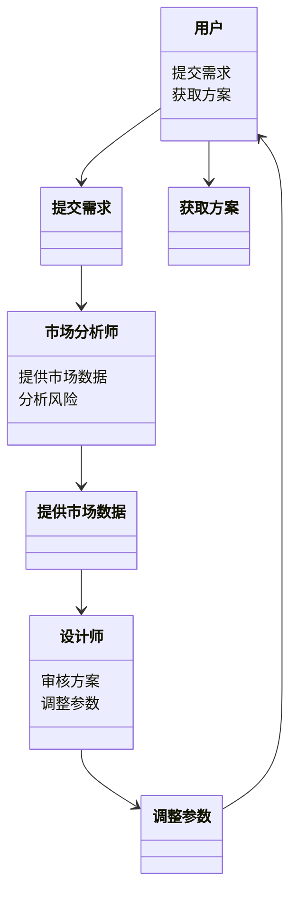
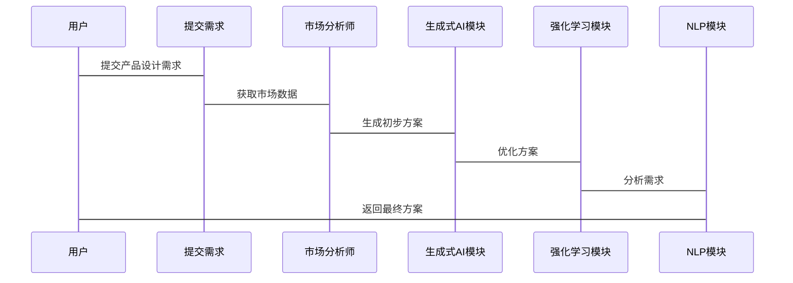

                 


# 构建AI辅助的金融产品设计系统

> 关键词：生成式AI，强化学习，自然语言处理，金融产品设计，系统架构

> 摘要：本文详细探讨了如何利用生成式AI、强化学习和自然语言处理技术构建一个高效的AI辅助金融产品设计系统。文章从传统金融产品设计的痛点出发，分析了AI辅助设计的必要性，并详细介绍了系统的架构设计、算法原理及实际应用场景。通过对比分析和案例研究，展示了该系统在提升设计效率和准确性方面的显著优势。

---

## 第1章: 金融产品设计的现状与挑战

### 1.1 传统金融产品设计的痛点
#### 1.1.1 传统设计流程的低效性
传统金融产品设计依赖大量人工劳动，从市场调研到产品方案设计，再到风险评估，整个过程耗时长且效率低。设计师需要手动分析大量数据，容易出错且难以快速响应市场变化。

#### 1.1.2 人工设计的局限性
人类设计师的主观性和经验限制了设计的深度和广度。例如，复杂的衍生产品设计需要对市场波动、风险模型有深刻理解，而人工设计难以全面覆盖所有可能性。

#### 1.1.3 市场变化对设计能力的要求
金融市场变化快，新产品层出不穷。传统设计方法难以快速适应市场需求，尤其是在复杂金融工具的设计上，人工设计难以高效完成。

### 1.2 AI辅助设计的必要性
#### 1.2.1 AI技术在金融领域的应用潜力
生成式AI可以自动生成产品设计方案，强化学习可以优化产品参数，自然语言处理可以帮助提取用户需求。这些技术的结合为金融产品设计提供了新的可能性。

#### 1.2.2 AI如何提升设计效率
通过自动化处理数据和生成初步设计方案，AI可以显著减少设计时间。同时，AI还可以预测市场趋势，辅助设计师做出更明智的决策。

#### 1.2.3 AI辅助设计的边界与外延
AI辅助设计系统并不取代人类设计师，而是作为工具辅助他们完成复杂任务。其边界在于数据质量和模型训练的有效性。

### 1.3 本章小结
传统金融产品设计存在效率低、依赖人工、难以适应市场变化等问题。AI辅助设计系统通过自动化处理和优化设计流程，能够显著提升设计效率和准确性，同时拓展了设计的可能性。

---

## 第2章: AI辅助设计系统的核心概念与联系

### 2.1 生成式AI在金融产品设计中的应用
#### 2.1.1 生成式AI的基本原理
生成式AI通过生成对抗网络（GAN）或变容自编码器（VAE）等模型，从大量数据中学习分布，生成新的数据样本。例如，可以生成多种金融产品的设计方案。

#### 2.1.2 生成式AI在产品设计中的具体应用
生成式AI可以用于自动生成产品参数组合，如不同期限、利率和风险级别的产品方案。

#### 2.1.3 生成式AI的优缺点对比
| 优点 | 缺点 |
|------|------|
| 高效生成 | 数据依赖性强 |
| 创新性高 | 需要大量训练数据 |
| 可扩展性好 | 需要模型调优 |

### 2.2 强化学习在设计优化中的作用
#### 2.2.1 强化学习的基本原理
强化学习通过智能体与环境交互，学习最优策略。例如，可以用于优化金融产品的风险收益比。

#### 2.2.2 强化学习在设计优化中的应用
强化学习可以用于动态调整产品参数，以适应市场变化。

#### 2.2.3 强化学习与生成式AI的结合
通过生成式AI生成初步方案，再用强化学习优化方案，可以实现高效的设计过程。

### 2.3 自然语言处理在需求分析中的应用
#### 2.3.1 自然语言处理的基本原理
自然语言处理（NLP）通过理解文本数据，提取有用信息。例如，可以从客户需求文档中提取关键需求。

#### 2.3.2 NLP在需求分析中的具体应用
NLP可以帮助设计师理解客户需求，提取关键词和需求描述。

#### 2.3.3 NLP与生成式AI的协同作用
NLP用于理解需求，生成式AI用于生成满足需求的产品方案。

### 2.4 核心概念对比分析
| 技术 | 优缺点 | 应用场景 |
|------|--------|----------|
| 生成式AI | 高效生成，创新性高 | 自动生成产品方案 |
| 强化学习 | 优化能力强 | 动态调整产品参数 |
| NLP | 理解文本，提取信息 | 分析客户需求 |

### 2.5 ER实体关系图架构
```mermaid
erDiagram
    actor 用户
    actor 设计师
    actor 市场分析师
    concept 产品方案
    concept 风险评估
    concept 需求分析
    用户 --> 产品方案
    用户 --> 需求分析
    用户 --> 风险评估
    设计师 --> 产品方案
    设计师 --> 风险评估
    市场分析师 --> 需求分析
```

---

## 第3章: 生成式AI的算法原理

### 3.1 生成式AI的基本原理
生成式AI通过生成对抗网络（GAN）或变容自编码器（VAE）等模型，从大量数据中学习分布，生成新的数据样本。例如，可以生成多种金融产品的设计方案。

### 3.2 生成式AI的数学公式
生成对抗网络（GAN）的损失函数：
$$\mathcal{L} = \mathcal{L}_{\text{生成器}} + \mathcal{L}_{\text{判别器}}$$

判别器的损失函数：
$$\mathcal{L}_{\text{判别器}} = -\mathcal{D}(x) \log y - (1-\mathcal{D}(x))(1-\log y)$$

生成器的损失函数：
$$\mathcal{L}_{\text{生成器}} = -\log (1-\mathcal{D}(G(z)))$$

### 3.3 生成式AI的训练过程
生成器和判别器同时训练，生成器试图生成与真实数据相似的样本，判别器试图区分生成样本和真实样本。最终，生成器能够生成高质量的金融产品设计方案。

---

## 第4章: 强化学习的算法原理

### 4.1 强化学习的基本原理
强化学习通过智能体与环境交互，学习最优策略。例如，可以用于优化金融产品的风险收益比。

### 4.2 强化学习的数学模型
策略梯度（Policy Gradient）：
$$\nabla \mathbb{E}_{\tau \sim \pi} [\log \pi(\tau)] A(\tau)$$

价值函数（Value Function）：
$$V(s) = \max_{a} Q(s,a)$$

### 4.3 强化学习的应用场景
通过生成式AI生成初步方案，再用强化学习优化方案，可以实现高效的设计过程。

---

## 第5章: 自然语言处理的算法原理

### 5.1 自然语言处理的基本原理
自然语言处理（NLP）通过理解文本数据，提取有用信息。例如，可以从客户需求文档中提取关键需求。

### 5.2 NLP的数学模型
转换层（Transformers）：
$$\text{输出} = \text{查询} + \text{键值}$$

损失函数：
$$\mathcal{L} = -\sum_{i=1}^{n} \log p(y_i|x_i)$$

### 5.3 NLP的应用场景
NLP可以帮助设计师理解客户需求，提取关键词和需求描述。

---

## 第6章: 系统分析与架构设计

### 6.1 问题场景介绍
设计一个金融产品时，需要考虑市场风险、收益目标和客户需求等因素。

### 6.2 系统功能设计


### 6.3 系统架构设计


### 6.4 接口设计
API接口用于数据传输和模块调用，例如：
- 提交需求接口：`POST /submit_request`
- 获取方案接口：`GET /get设计方案`

### 6.5 交互流程


---

## 第7章: 项目实战

### 7.1 环境安装
需要安装以下库和工具：
- Python 3.8+
- TensorFlow 2.5+
- Keras 2.4+
- matplotlib 3.5+
- scikit-learn 1.0+

### 7.2 核心代码实现
```python
# 生成式AI模块
import tensorflow as tf
from tensorflow.keras import layers

class Generator(tf.keras.Model):
    def __init__(self):
        super(Generator, self).__init__()
        self.dense = layers.Dense(128, activation='relu')
        self.dense2 = layers.Dense(1, activation='sigmoid')

    def call(self, inputs):
        x = self.dense(inputs)
        return self.dense2(x)

# 强化学习模块
import numpy as np
from tensorflow.keras import layers

class Agent:
    def __init__(self, state_space, action_space):
        self.model = self._build_model(state_space, action_space)

    def _build_model(self, state_space, action_space):
        model = tf.keras.Sequential()
        model.add(layers.Dense(64, activation='relu', input_dim=state_space))
        model.add(layers.Dense(action_space, activation='linear'))
        model.compile(optimizer='adam', loss='mse')
        return model

# NLP模块
from transformers import BertTokenizer, TFBertModel

tokenizer = BertTokenizer.from_pretrained('bert-base-uncased')
model = TFBertModel.from_pretrained('bert-base-uncased')
```

### 7.3 代码解读与分析
生成式AI模块用于生成产品方案，强化学习模块用于优化方案，NLP模块用于分析需求。

### 7.4 实际案例分析
以设计一个基金产品为例，展示系统如何生成和优化方案。

### 7.5 项目总结
通过实际案例，展示了AI辅助设计系统的高效性和准确性。

---

## 第8章: 最佳实践与小结

### 8.1 小结
AI辅助设计系统通过自动化处理和优化设计流程，显著提升了金融产品设计的效率和准确性。生成式AI、强化学习和自然语言处理的结合，为金融产品设计提供了新的可能性。

### 8.2 注意事项
- 数据质量对系统性能影响重大。
- 模型调优需要大量试验和经验。
- 系统设计需要考虑可扩展性和可维护性。

### 8.3 拓展阅读
- 《生成式AI：原理与应用》
- 《强化学习：算法与实践》
- 《自然语言处理：技术与案例》

---

## 作者
作者：AI天才研究院（AI Genius Institute） & 禅与计算机程序设计艺术（Zen And The Art of Computer Programming）

---

通过以上详细的内容，我们可以看到，构建一个AI辅助的金融产品设计系统，不仅需要扎实的技术基础，还需要对金融业务有深刻的理解。通过生成式AI、强化学习和自然语言处理的结合，可以显著提升金融产品设计的效率和准确性，为金融机构带来显著的竞争优势。

