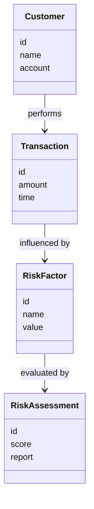
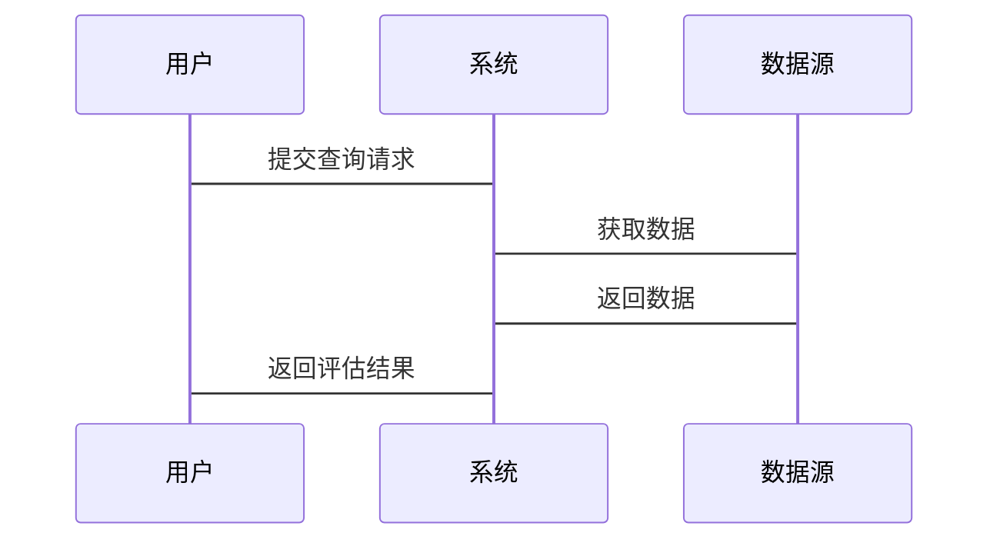

                 


# 构建AI辅助的金融风险度量系统

> 关键词：AI辅助，金融风险，风险度量，机器学习，系统架构

> 摘要：本文将详细介绍如何构建一个基于人工智能的金融风险度量系统。首先，我们将从金融风险度量的背景与挑战入手，探讨传统方法的局限性以及AI技术在其中的应用潜力。接着，我们将深入分析AI与金融风险度量的核心概念，包括相关算法的原理与实现。然后，我们从系统架构的角度，详细设计并实现一个完整的AI辅助金融风险度量系统。最后，我们将通过实际案例分析，验证系统的有效性和实用性，总结经验并展望未来发展。

---

## 第1章: 金融风险度量的背景与挑战

### 1.1 金融风险度量的背景

#### 1.1.1 金融市场的风险特征
金融市场是一个高度动态和不确定的环境，投资者和金融机构需要准确评估和管理各种风险。金融风险主要包括市场风险、信用风险、流动性风险等。这些风险可能对投资者的收益或金融机构的稳定性产生重大影响。

#### 1.1.2 传统金融风险度量方法的局限性
传统金融风险度量方法主要依赖于统计模型，如VaR（Value at Risk）和CVaR（Conditional Value at Risk）。然而，这些方法在处理非线性关系、复杂依赖性和高维数据时表现有限，且难以捕捉金融市场中的复杂模式。

#### 1.1.3 AI技术在金融领域的应用潜力
人工智能技术，特别是机器学习和深度学习，能够从海量数据中提取复杂的模式和关系。AI技术可以帮助金融机构更准确地预测市场走势、评估信用风险，并优化投资组合。

### 1.2 问题背景与目标

#### 1.2.1 金融风险度量的核心问题
金融风险度量的核心问题是如何准确预测和评估潜在的损失，以便采取有效的风险管理措施。传统的统计方法在面对复杂和动态的金融市场时显得力不从心。

#### 1.2.2 问题解决的必要性
随着金融市场的日益复杂化，传统的风险度量方法已无法满足需求。引入AI技术可以提高风险预测的准确性和实时性，从而帮助金融机构更好地应对风险。

#### 1.2.3 系统的目标与边界
本系统的目标是构建一个基于AI的金融风险度量系统，能够实时分析金融市场数据，预测潜在风险，并提供相应的预警和建议。系统的边界包括数据输入、模型训练、风险评估和结果输出。

---

## 第2章: AI与金融风险度量的核心概念

### 2.1 AI技术的基本概念

#### 2.1.1 人工智能的定义与特点
人工智能（AI）是指计算机系统模拟人类智能的能力，包括学习、推理和自适应等能力。AI的核心特点包括数据驱动、自动化和高维度特征提取。

#### 2.1.2 机器学习的核心原理
机器学习是一种通过数据训练模型的技术，模型能够从数据中学习到模式和规律，并用于预测或分类任务。常用的机器学习算法包括线性回归、支持向量机（SVM）和随机森林等。

#### 2.1.3 深度学习的典型模型
深度学习是一种基于人工神经网络的机器学习技术，常用的模型包括卷积神经网络（CNN）、循环神经网络（RNN）和长短期记忆网络（LSTM）。

### 2.2 金融风险度量的数学模型

#### 2.2.1 风险度量的数学公式
常见的风险度量公式包括VaR和CVaR。VaR是指在一定置信水平下，资产组合可能遭受的最大损失。CVaR是VaR的扩展，考虑了尾部风险。

#### 2.2.2 风险模型的分类与对比
风险模型可以分为传统统计模型和机器学习模型。传统统计模型包括线性回归和时间序列分析，机器学习模型包括随机森林和神经网络。

#### 2.2.3 风险度量的核心要素
风险度量的核心要素包括数据输入、模型选择、参数设置和结果输出。这些要素共同决定了风险度量的准确性和可靠性。

### 2.3 AI与金融风险度量的结合

#### 2.3.1 AI在风险预测中的应用
AI可以通过分析历史数据和市场动态，预测未来市场的风险。例如，使用LSTM模型预测股票价格波动。

#### 2.3.2 数据驱动的风险度量方法
数据驱动的方法依赖于大量历史数据，通过机器学习算法提取特征并训练模型。这种方法能够捕捉复杂的数据模式，提高风险预测的准确性。

#### 2.3.3 系统设计的核心要素
AI辅助的金融风险度量系统需要具备高效的数据处理能力、强大的模型训练能力和实时的风险评估能力。这些能力共同确保系统的实用性和可靠性。

### 2.4 核心概念对比表

| 比较维度 | 传统统计模型 | 机器学习模型 |
|----------|--------------|--------------|
| 数据需求 | 需要大量结构化数据 | 需要大量非结构化数据 |
| 模型复杂度 | 简单，易于解释 | 复杂，难于解释 |
| 性能 | 适用于线性关系 | 适用于非线性关系 |

### 2.5 ER实体关系图

```mermaid
erDiagram
    customer[客户]
    transaction[交易]
    risk_factor[风险因素]
    risk_assessment[风险评估]
    customer --> transaction : 参与
    transaction --> risk_factor : 受影响
    risk_factor --> risk_assessment : 评估
```

---

## 第3章: 常见算法原理与实现

### 3.1 线性回归算法

#### 3.1.1 线性回归的基本原理
线性回归是一种简单且常用的回归分析方法，用于预测目标变量与一个或多个解释变量之间的关系。

#### 3.1.2 线性回归的数学公式
线性回归的损失函数为：
$$L = \sum_{i=1}^{n} (y_i - \beta_0 - \beta_1x_i)^2$$
其中，$\beta_0$是截距，$\beta_1$是回归系数，$x_i$是解释变量，$y_i$是目标变量。

#### 3.1.3 线性回归的实现步骤
1. 数据预处理：标准化或归一化数据。
2. 模型训练：使用最小二乘法优化回归系数。
3. 模型评估：计算R²值，评估模型拟合优度。

#### 3.1.4 线性回归的优缺点
优点：简单易懂，计算速度快。
缺点：只能处理线性关系，无法捕捉复杂模式。

#### 3.1.5 线性回归代码实现
```python
import numpy as np
from sklearn.linear_model import LinearRegression

# 示例数据
X = np.array([[1], [2], [3], [4], [5]])
y = np.array([2, 4, 5, 4, 6])

# 训练模型
model = LinearRegression()
model.fit(X, y)

# 预测
print(model.predict([[6]]))
```

### 3.2 随机森林算法

#### 3.2.1 随机森林的基本原理
随机森林是一种基于决策树的集成学习算法，通过随机采样数据和特征，生成多个决策树，并通过投票或平均的方式得到最终结果。

#### 3.2.2 随机森林的数学公式
随机森林的预测结果为：
$$y = \frac{1}{N}\sum_{i=1}^{N} y_i$$
其中，$y_i$是第$i$棵决策树的预测结果，$N$是决策树的数量。

#### 3.2.3 随机森林的实现步骤
1. 数据预处理：处理缺失值和异常值。
2. 模型训练：生成多棵决策树，并进行投票或平均。
3. 模型评估：计算准确率和F1分数。

#### 3.2.4 随机森林的优缺点
优点：能够处理非线性关系，鲁棒性强。
缺点：计算复杂度较高。

#### 3.2.5 随机森林代码实现
```python
from sklearn.ensemble import RandomForestRegressor

# 示例数据
X = np.array([[1], [2], [3], [4], [5]])
y = np.array([2, 4, 5, 4, 6])

# 训练模型
model = RandomForestRegressor(n_estimators=100)
model.fit(X, y)

# 预测
print(model.predict([[6]]))
```

---

## 第4章: 系统架构与设计

### 4.1 系统功能设计

#### 4.1.1 风险数据采集模块
负责从多个数据源采集金融数据，包括股票价格、市场指数和经济指标等。

#### 4.1.2 风险模型构建模块
使用机器学习算法训练风险预测模型，生成风险评估结果。

#### 4.1.3 风险评估与预警模块
根据模型预测结果，生成风险评估报告，并设置预警机制。

### 4.2 系统架构设计

#### 4.2.1 领域模型


#### 4.2.2 系统架构图
```mermaid
archiDiagram
    component Web前端 {
        Gui
        Controller
    }
    component 后端服务 {
        Logic
        Database
    }
    component 第三方API {
        Data API
        Model API
    }
    Web前端 --> 后端服务 : 请求
    后端服务 --> 第三方API : 数据调用
```

#### 4.2.3 系统交互图


### 4.3 系统接口设计

#### 4.3.1 API接口定义
使用RESTful API设计接口，例如：
- `GET /api/risk/assessment`：获取风险评估结果
- `POST /api/risk/train`：训练风险模型

#### 4.3.2 接口实现
```python
from flask import Flask
from flask_restful import Resource, Api

app = Flask(__name__)
api = Api(app)

class RiskAssessment(Resource):
    def get(self):
        return {"status": "success", "result": "low risk"}

api.add_resource(RiskAssessment, '/api/risk/assessment')

if __name__ == '__main__':
    app.run(debug=True)
```

---

## 第5章: 项目实战与案例分析

### 5.1 环境配置

#### 5.1.1 安装Python和相关库
安装Python和以下库：
- `numpy`
- `pandas`
- `scikit-learn`
- `tensorflow`

#### 5.1.2 数据准备
准备金融数据，例如股票价格数据和经济指标。

### 5.2 系统核心实现

#### 5.2.1 数据预处理
处理缺失值和标准化数据。

#### 5.2.2 模型训练
使用随机森林算法训练风险预测模型。

#### 5.2.3 结果输出
生成风险评估报告，并设置预警机制。

### 5.3 实际案例分析

#### 5.3.1 数据分析
分析历史股票价格数据，提取特征并训练模型。

#### 5.3.2 模型评估
计算模型的准确率和F1分数，验证模型的有效性。

#### 5.3.3 结果解读
根据模型预测结果，生成风险评估报告，并制定相应的风险管理策略。

---

## 第6章: 总结与展望

### 6.1 总结
本文详细介绍了如何构建一个基于AI的金融风险度量系统，涵盖了从背景分析到系统实现的全过程。通过引入机器学习算法和复杂系统架构，系统能够准确预测和评估金融市场风险，为金融机构提供有力支持。

### 6.2 展望
未来，随着AI技术的不断发展，金融风险度量系统将更加智能化和自动化。我们可以期待更多基于深度学习和强化学习的创新方法，进一步提高风险预测的准确性和实时性。

---

## 最佳实践 Tips

- **数据处理**：确保数据的完整性和准确性，避免缺失值和异常值对模型的影响。
- **模型选择**：根据具体问题选择合适的算法，线性回归适合线性关系，随机森林适合复杂模式。
- **系统优化**：通过并行计算和分布式架构优化系统性能，提高处理能力。
- **风险管理**：设置合理的预警机制，及时应对潜在风险。

---

## 作者信息

作者：AI天才研究院/AI Genius Institute & 禅与计算机程序设计艺术 /Zen And The Art of Computer Programming

---

以上是《构建AI辅助的金融风险度量系统》的技术博客文章目录和内容概要。通过系统的分析和详细的讲解，相信读者能够全面理解AI技术在金融风险度量中的应用，并掌握构建类似系统的相关知识。

