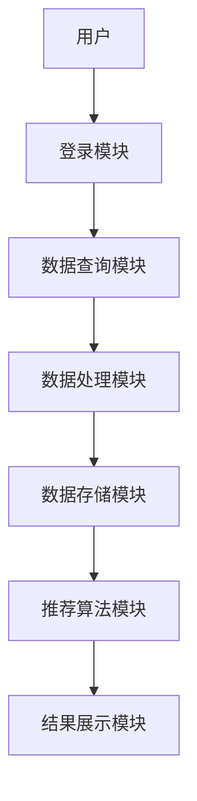

                 


# 构建AI驱动的企业人才发展与继任计划系统

> 关键词：人工智能，人才发展，继任计划，企业系统，机器学习，深度学习，人才管理

> 摘要：随着企业对高效人才管理需求的不断增长，AI技术在人才发展与继任计划中的应用日益重要。本文详细探讨了如何构建一个基于AI的系统，通过数据分析和智能推荐算法，优化企业的人才培养和职位继任过程。文章从系统背景、核心概念、算法原理、系统架构到项目实战，全面分析了AI驱动人才管理系统的构建过程，并提供了实用的实施建议和最佳实践。

---

# 第一部分: AI驱动的企业人才发展与继任计划系统背景

# 第1章: 企业人才发展与继任计划的AI驱动需求

## 1.1 企业人才发展与继任计划的现状与挑战

### 1.1.1 传统人才发展与继任计划的痛点
- 传统人才管理依赖主观判断，缺乏数据支持。
- 继任计划的准确性低，难以匹配合适的人才。
- 人才发展计划缺乏个性化，难以满足员工的职业需求。

### 1.1.2 数字化转型对企业人才管理的要求
- 数据驱动的决策需求增加。
- 对人才的实时追踪和动态评估能力要求提高。
- 需要自动化的人才匹配和推荐系统。

### 1.1.3 AI技术在人才管理中的应用潜力
- 利用机器学习进行人才数据分析和预测。
- 基于深度学习的自然语言处理技术用于简历筛选和能力评估。
- AI推荐算法优化人才匹配和继任计划。

## 1.2 AI驱动人才发展与继任计划的必要性

### 1.2.1 数据驱动的人才分析需求
- 通过数据分析识别高潜力员工。
- 基于绩效数据预测员工未来表现。

### 1.2.2 AI在人才匹配与预测中的优势
- 精准匹配员工与职位需求。
- 提供个性化的职业发展路径建议。
- 预测员工流失风险，提前制定应对策略。

### 1.2.3 企业人才战略的智能化转型
- AI技术推动人才管理从经验驱动向数据驱动转变。
- 提高人才管理效率，降低企业运营成本。
- 增强员工体验，提升员工满意度和忠诚度。

## 1.3 本章小结

---

# 第二部分: AI驱动人才发展与继任计划的核心概念

# 第2章: 人才发展与继任计划系统的核心要素

## 2.1 人才发展系统的核心概念

### 2.1.1 人才发展的定义与目标
- 定义：通过培训和发展计划提升员工技能和能力。
- 目标：帮助员工实现职业成长，匹配企业战略需求。

### 2.1.2 人才发展的关键维度
- 技能评估：基于岗位要求评估员工现有能力。
- 职业路径规划：为员工设计个性化的职业发展路径。
- 培训计划制定：根据员工需求设计针对性的培训方案。

### 2.1.3 人才发展系统的功能模块
- 员工能力评估模块：基于数据和模型评估员工能力。
- 职业路径规划模块：为员工提供个性化的职业发展建议。
- 培训计划管理模块：管理培训资源和执行计划。

## 2.2 继任计划系统的核心要素

### 2.2.1 继任计划的定义与目标
- 定义：通过识别和培养潜在接班人，确保关键职位的顺利交接。
- 目标：降低人才流失风险，确保企业核心岗位的稳定性。

### 2.2.2 继任计划的关键维度
- 高潜力员工识别：基于数据分析和模型预测，识别具有潜力的员工。
- 继任者培养计划：为潜在接班人制定针对性的发展计划。
- 继任者评估与调整：定期评估继任者的成长情况，并进行动态调整。

### 2.2.3 继任计划系统的功能模块
- 高潜力员工识别模块：基于AI算法筛选潜在接班人。
- 继任者培养计划模块：制定和管理继任者的培训和发展计划。
- 继任者评估模块：定期评估继任者的能力和潜力。

## 2.3 人才发展与继任计划的关联性

### 2.3.1 人才发展与继任计划的协同关系
- 人才发展为继任计划提供能力评估和职业路径规划的支持。
- 继任计划为人才发展提供目标导向和资源分配的依据。

### 2.3.2 系统集成的必要性
- 统一平台整合人才发展和继任计划功能。
- 数据共享和信息互通，提高系统整体效率。

### 2.3.3 统一系统架构的设计思路
- 采用模块化设计，便于功能扩展和维护。
- 确保数据安全和隐私保护，符合企业合规要求。

## 2.4 本章小结

---

# 第三部分: AI驱动人才发展与继任计划的算法原理

# 第3章: 基于AI的推荐算法原理

## 3.1 推荐算法的分类与选择

### 3.1.1 基于协同过滤的推荐算法

#### 3.1.1.1 协同过滤算法的定义与特点
- 定义：基于用户行为数据的相似性推荐。
- 特点：简单易实现，适合中小规模数据。

#### 3.1.1.2 协同过滤算法的实现步骤
1. 收集用户行为数据。
2. 计算用户相似度或物品相似度。
3. 基于相似度生成推荐列表。

#### 3.1.1.3 协同过滤算法的优缺点
- 优点：计算简单，易于解释。
- 缺点：冷启动问题，推荐结果可能不够精准。

#### 3.1.1.4 协同过滤算法的数学模型
- 相似度计算公式：
  $$ \text{相似度}(u, v) = \frac{\sum_{i} (u_i - \bar{u})(v_i - \bar{v})}{\sqrt{\sum_{i} (u_i - \bar{u})^2} \cdot \sqrt{\sum_{i} (v_i - \bar{v})^2}} $$
- 其中，$$ \bar{u} $$ 表示用户u的平均评分，$$ \bar{v} $$ 表示用户v的平均评分。

### 3.1.2 基于内容的推荐算法

#### 3.1.2.1 基于内容的推荐算法的定义与特点
- 定义：基于物品的属性特征进行推荐。
- 特点：推荐结果更精准，但实现复杂度较高。

#### 3.1.2.2 基于内容的推荐算法的实现步骤
1. 提取物品特征向量。
2. 计算用户与物品的匹配度。
3. 基于匹配度生成推荐列表。

#### 3.1.2.3 基于内容的推荐算法的优缺点
- 优点：推荐结果更具个性化，适合垂直领域。
- 缺点：特征提取难度大，计算成本高。

### 3.1.3 混合推荐算法的优缺点

#### 3.1.3.1 混合推荐算法的定义与特点
- 定义：结合协同过滤和内容推荐的混合模型。
- 特点：综合了两种算法的优势，推荐结果更准确。

#### 3.1.3.2 混合推荐算法的实现步骤
1. 结合协同过滤和内容推荐的结果。
2. 使用加权融合的方法生成最终推荐列表。
3. 根据反馈调整权重，优化推荐效果。

#### 3.1.3.3 混合推荐算法的优缺点
- 优点：推荐结果准确，用户体验好。
- 缺点：实现复杂，需要更多的计算资源。

## 3.2 基于深度学习的推荐模型

### 3.2.1 神经网络在推荐系统中的应用

#### 3.2.1.1 神经网络推荐模型的定义与特点
- 定义：基于深度学习的推荐系统。
- 特点：能够捕捉数据中的非线性关系，推荐效果更佳。

#### 3.2.1.2 神经网络推荐模型的实现步骤
1. 数据预处理：归一化和特征提取。
2. 构建神经网络模型：设计网络结构，选择激活函数和优化器。
3. 训练模型：使用训练数据进行监督学习。
4. 模型评估：基于验证集调整超参数，优化模型性能。

#### 3.2.1.3 神经网络推荐模型的优缺点
- 优点：推荐效果好，能够处理高维数据。
- 缺点：实现复杂，需要大量计算资源。

### 3.2.2 基于Transformer的推荐模型

#### 3.2.2.1 Transformer模型的定义与特点
- 定义：基于自注意力机制的推荐模型。
- 特点：能够捕捉到长距离依赖关系，推荐结果更精准。

#### 3.2.2.2 Transformer推荐模型的实现步骤
1. 数据预处理：将序列数据转换为输入格式。
2. 构建Transformer模型：设计编码器和解码器结构。
3. 训练模型：使用大规模数据进行无监督或有监督训练。
4. 模型评估：基于测试数据调整超参数，优化性能。

#### 3.2.2.3 Transformer推荐模型的优缺点
- 优点：推荐效果优异，适合大规模数据。
- 缺点：计算资源消耗大，实现复杂度高。

### 3.2.3 深度学习推荐模型的训练流程

#### 3.2.3.1 数据预处理
- 数据清洗：去除缺失值和异常值。
- 特征工程：提取有用的特征，进行归一化处理。

#### 3.2.3.2 模型训练
- 网络结构设计：选择合适的层数和节点数。
- 优化器选择：常用Adam优化器。
- 损失函数设计：使用交叉熵损失函数。

#### 3.2.3.3 模型调优
- 超参数调整：学习率、批量大小等。
- 正则化处理：防止过拟合。
- 模型评估：使用准确率、召回率等指标评估性能。

## 3.3 人才推荐算法的数学模型

### 3.3.1 人才推荐算法的数学模型

#### 3.3.1.1 基于相似度的推荐公式
- 余弦相似度公式：
  $$ \text{相似度}(u, v) = \frac{\sum_{i} u_i v_i}{\sqrt{\sum_{i} u_i^2} \cdot \sqrt{\sum_{i} v_i^2}} $$
- 其中，$$ u_i $$ 和 $$ v_i $$ 分别是用户u和v在第i个特征上的得分。

#### 3.3.1.2 基于概率的推荐公式
- 朴素贝叶斯推荐公式：
  $$ P(r|u) = \frac{P(u|r) \cdot P(r)}{P(u)} $$
- 其中，$$ P(r|u) $$ 是在用户u的情况下推荐物品r的概率。

#### 3.3.1.3 基于矩阵分解的推荐公式
- 矩阵分解公式：
  $$ R = U \cdot V^T $$
- 其中，$$ R $$ 是评分矩阵，$$ U $$ 和 $$ V $$ 是低维隐向量矩阵。

## 3.4 本章小结

---

# 第四部分: AI驱动人才发展与继任计划的系统架构设计

# 第4章: 系统分析与架构设计方案

## 4.1 问题场景介绍

### 4.1.1 人才发展与继任计划系统的需求分析
- 数据需求：员工绩效数据、能力评估数据、培训数据等。
- 功能需求：人才匹配、职业路径规划、继任者识别与培养等。
- 性能需求：高并发处理能力，实时反馈能力。

### 4.1.2 项目介绍
- 项目目标：构建一个智能化的人才发展与继任计划系统。
- 项目范围：涵盖人才评估、发展、继任计划制定和执行的全过程。
- 项目团队：数据科学家、软件开发人员、人力资源专家等。

## 4.2 系统功能设计

### 4.2.1 领域模型设计

#### 4.2.1.1 人才评估模块
- 功能：基于员工绩效数据和能力评估数据，生成员工能力报告。
- 输入：员工绩效数据、能力评估数据。
- 输出：员工能力评估报告、员工潜力评分。

#### 4.2.1.2 职业路径规划模块
- 功能：根据员工能力评估和企业战略需求，生成个性化的职业发展路径。
- 输入：员工能力评估报告、企业战略目标。
- 输出：职业发展路径建议、培训计划建议。

#### 4.2.1.3 继任者识别与培养模块
- 功能：基于高潜力员工识别模型，制定继任者培养计划。
- 输入：高潜力员工名单、继任者需求。
- 输出：继任者培养计划、继任者评估报告。

### 4.2.2 系统架构设计

#### 4.2.2.1 系统架构设计概述
- 分层架构：数据层、业务逻辑层、用户界面层。
- 模块划分：数据采集模块、数据处理模块、推荐算法模块、用户界面模块。

#### 4.2.2.2 数据流设计
- 数据采集：从企业ERP系统、CRM系统中获取员工数据。
- 数据处理：清洗、转换、建模。
- 数据存储：存储员工数据、模型结果、推荐结果。

#### 4.2.2.3 交互流程设计
- 用户登录：输入用户名和密码。
- 数据查询：用户输入查询条件，系统返回结果。
- 系统反馈：系统根据用户操作返回相应反馈信息。

## 4.3 系统架构设计

### 4.3.1 系统架构设计概述

#### 4.3.1.1 系统架构图


#### 4.3.1.2 模块划分
- 用户模块：负责用户身份验证和权限管理。
- 数据查询模块：接收用户查询请求，调用数据处理模块。
- 数据处理模块：处理数据，生成推荐结果。
- 数据存储模块：存储数据和推荐结果。
- 推荐算法模块：基于AI算法生成推荐结果。
- 结果展示模块：将推荐结果以可视化形式展示给用户。

### 4.3.2 系统架构设计细节

#### 4.3.2.1 数据流设计
- 用户发起查询请求。
- 数据查询模块接收请求，调用数据处理模块。
- 数据处理模块调用推荐算法模块，生成推荐结果。
- 数据存储模块存储数据和推荐结果。
- 结果展示模块将推荐结果展示给用户。

#### 4.3.2.2 交互流程设计
- 用户登录系统。
- 用户输入查询条件。
- 系统根据查询条件调用数据处理模块。
- 数据处理模块调用推荐算法模块生成推荐结果。
- 推荐结果返回给用户。

## 4.4 本章小结

---

# 第五部分: AI驱动人才发展与继任计划的项目实战

# 第5章: 项目实战

## 5.1 环境安装与配置

### 5.1.1 安装Python环境
- 使用Anaconda安装Python 3.8或更高版本。
- 安装必要的Python库：numpy、pandas、scikit-learn、tensorflow、keras、pymermaid。

### 5.1.2 安装Jupyter Notebook
- 安装Jupyter Notebook用于数据可视化和算法实现。
- 配置Jupyter Notebook的默认Python内核。

## 5.2 系统核心实现

### 5.2.1 数据预处理

#### 5.2.1.1 数据清洗
- 删除缺失值和异常值。
- 处理重复数据和冗余数据。

#### 5.2.1.2 特征提取
- 基于员工绩效数据提取特征。
- 基于简历数据提取特征。

#### 5.2.1.3 数据归一化
- 使用标准化或归一化方法处理数据。

### 5.2.2 模型训练

#### 5.2.2.1 模型选择
- 选择合适的推荐算法：协同过滤、深度学习模型等。
- 根据数据规模和计算资源选择模型。

#### 5.2.2.2 模型训练
- 使用训练数据训练模型。
- 调整超参数，优化模型性能。

### 5.2.3 系统部署

#### 5.2.3.1 系统部署概述
- 部署推荐系统到服务器。
- 配置数据库和API接口。

#### 5.2.3.2 系统接口设计
- 设计RESTful API接口。
- 使用Flask或Django框架部署系统。

#### 5.2.3.3 系统监控与维护
- 监控系统运行状态。
- 定期更新模型和数据。

## 5.3 代码实现

### 5.3.1 数据预处理代码
```python
import pandas as pd
import numpy as np

# 数据清洗
df = pd.read_csv('employee_data.csv')
df.dropna(inplace=True)
df.drop_duplicates(inplace=True)

# 特征提取
features = df[['performance', 'potential', 'experience']]
```

### 5.3.2 模型训练代码
```python
from sklearn.model_selection import train_test_split
from sklearn.metrics.pairwise import cosine_similarity

# 数据分割
X_train, X_test = train_test_split(features, test_size=0.2)

# 计算余弦相似度
similarity = cosine_similarity(X_train)
```

### 5.3.3 系统部署代码
```python
from flask import Flask, request, jsonify

app = Flask(__name__)

@app.route('/recommend', methods=['POST'])
def recommend():
    data = request.json
    # 处理请求数据
    # 返回推荐结果
    return jsonify({'result': '推荐结果'})

if __name__ == '__main__':
    app.run()
```

## 5.4 项目实战总结

### 5.4.1 项目实现的关键点
- 数据预处理的准确性。
- 模型选择和调优的效果。
- 系统部署和接口设计的合理性。

### 5.4.2 项目小结
- 成功实现了AI驱动的人才发展与继任计划系统。
- 通过项目实战验证了算法的有效性和系统的可行性。

---

# 第六部分: AI驱动人才发展与继任计划系统的最佳实践

# 第6章: 最佳实践

## 6.1 实施中的注意事项

### 6.1.1 数据隐私与安全
- 确保员工数据的隐私和安全。
- 遵守相关法律法规，保护员工个人信息。

### 6.1.2 系统可扩展性
- 设计模块化架构，便于功能扩展。
- 使用容器化技术，提高系统的可扩展性。

### 6.1.3 模型维护与更新
- 定期更新模型，保持推荐算法的有效性。
- 根据反馈调整模型参数，优化推荐效果。

## 6.2 小结与总结

### 6.2.1 小结
- 本文详细探讨了AI驱动的人才发展与继任计划系统的构建过程。
- 从系统背景、核心概念、算法原理到系统架构和项目实战，全面分析了系统的构建过程。

### 6.2.2 总结
- AI技术的应用大大提升了企业人才管理的效率和精准度。
- 基于AI的推荐算法为人才发展与继任计划提供了强有力的支持。
- 未来，随着AI技术的不断发展，人才管理系统的智能化水平将不断提高。

## 6.3 未来展望

### 6.3.1 AI在人才管理中的未来发展方向
- 更加智能化的人才匹配与推荐系统。
- 基于自然语言处理的简历筛选和能力评估。
- 结合区块链技术的透明化人才管理系统。

### 6.3.2 企业人才管理的智能化转型
- 进一步推动企业人才管理的数字化和智能化。
- 利用AI技术优化企业组织结构和人才配置。
- 提高员工体验，增强企业竞争力。

---

# 作者：AI天才研究院/AI Genius Institute & 禅与计算机程序设计艺术 /Zen And The Art of Computer Programming

