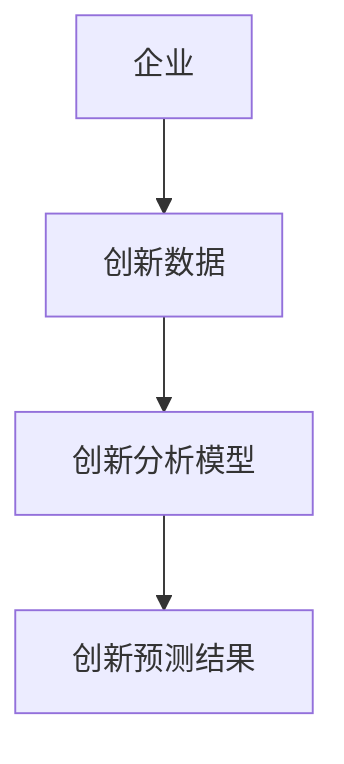
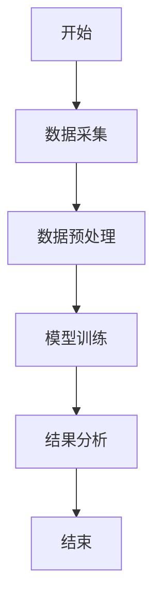
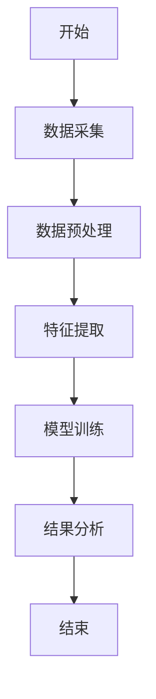
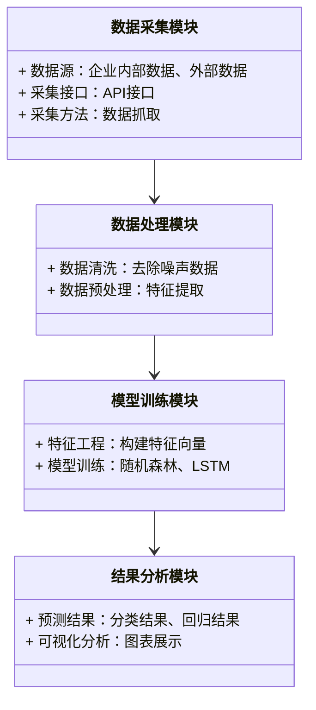
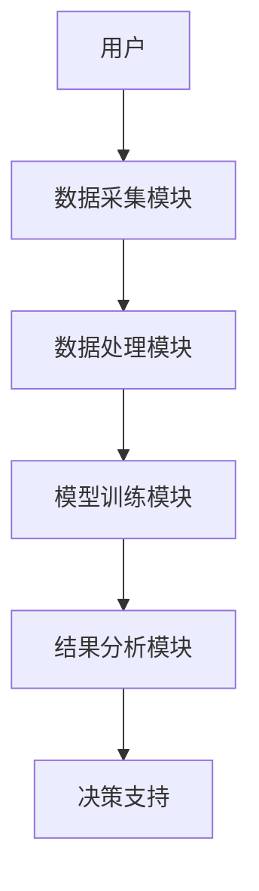
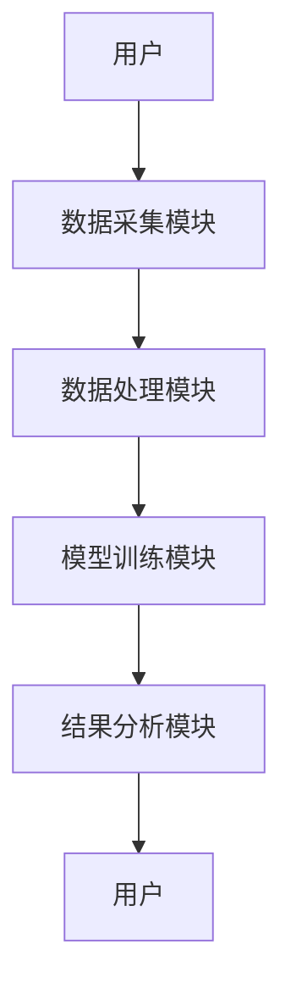

                 


# 构建AI驱动的企业创新生态系统分析平台

## 关键词：AI，企业创新生态系统，数据分析，机器学习，创新预测

## 摘要：  
随着企业创新的加速，传统的创新分析模式逐渐暴露出效率低下、数据孤岛和难以预测等问题。本文将从AI驱动的企业创新生态系统分析平台的构建出发，详细阐述其核心概念、算法原理、系统架构设计以及项目实战。通过系统化的分析和实践，为读者提供一套完整的解决方案，帮助企业在数字化转型中快速实现创新生态系统的智能化分析与优化。

---

## 正文

---

### 第一部分: AI驱动的企业创新生态系统分析平台概述

#### 第1章: 企业创新生态系统与AI驱动平台的背景

##### 1.1 企业创新生态系统的基本概念

###### 1.1.1 企业创新生态系统的定义  
企业创新生态系统是指由企业内部员工、外部合作伙伴（如供应商、客户、合作伙伴）、创新机构（如孵化器、创投基金）以及创新数据（如专利、论文、市场反馈）等组成的复杂系统。它通过数据驱动的方式，实现企业内外部资源的高效协同，推动企业创新的可持续发展。

###### 1.1.2 企业创新生态系统的核心要素  
企业创新生态系统的核心要素包括：  
- **创新主体**：企业内部员工、外部合作伙伴、创新机构等。  
- **创新资源**：技术、数据、资金、人才等。  
- **创新网络**：企业内外部的协作网络，如供应链、合作伙伴网络等。  
- **创新数据**：专利、论文、市场反馈、用户行为数据等。  

###### 1.1.3 企业创新生态系统与传统企业创新模式的区别  
与传统企业创新模式相比，AI驱动的创新生态系统具有以下特点：  
- 数据驱动：通过AI技术分析海量数据，发现潜在的创新机会。  
- 实时性：能够实时捕捉市场动态和用户需求，快速调整创新方向。  
- 智能化：通过机器学习算法预测创新趋势，优化创新资源的分配。  

##### 1.2 AI驱动的企业创新生态系统分析平台的背景  

###### 1.2.1 传统企业创新分析的局限性  
传统的企业创新分析方法依赖于人工数据收集和分析，存在以下问题：  
- 数据分散：企业内部和外部的数据分散在不同部门或系统中，难以整合。  
- 分析效率低：人工分析耗时长，难以满足实时性需求。  
- 预测能力弱：传统分析方法难以捕捉数据中的复杂关系，预测能力有限。  

###### 1.2.2 AI技术在企业创新分析中的优势  
AI技术通过以下方式提升了企业创新分析的能力：  
- **数据处理能力**：AI能够快速处理海量数据，发现数据中的隐藏规律。  
- **实时分析**：AI可以实时监控市场动态和用户行为，提供实时反馈。  
- **智能预测**：通过机器学习算法，AI能够预测创新趋势和潜在机会。  

###### 1.2.3 当前企业创新生态系统分析的痛点与挑战  
当前企业在构建创新生态系统分析平台时面临以下痛点：  
- 数据孤岛问题：企业内部和外部数据难以整合。  
- 数据质量问题：数据不完整或不准确，影响分析结果。  
- 技术门槛高：AI技术的复杂性对企业技术能力提出了更高要求。  

---

### 第二部分: AI驱动的企业创新生态系统分析平台的核心概念与联系

#### 第2章: 核心概念与原理  

##### 2.1 企业创新生态系统分析平台的核心概念  

###### 2.1.1 创新数据的定义与分类  
创新数据是企业创新生态系统分析的基础，主要包括以下几类：  
- **专利数据**：包括专利申请数量、专利技术领域等。  
- **论文数据**：包括学术论文的数量、研究领域等。  
- **市场数据**：包括市场规模、市场趋势、用户行为数据等。  

###### 2.1.2 创新分析模型的构建  
创新分析模型是基于AI技术构建的数学模型，用于分析创新数据并生成预测结果。常见的创新分析模型包括：  
- **聚类分析模型**：用于识别创新领域的热点和趋势。  
- **回归分析模型**：用于预测创新项目的成功概率。  
- **深度学习模型**：用于分析非结构化数据（如文本数据）。  

###### 2.1.3 AI驱动的创新预测机制  
AI驱动的创新预测机制通过以下步骤实现：  
1. **数据采集**：从企业内部和外部获取创新数据。  
2. **数据预处理**：清洗数据，消除噪声。  
3. **模型训练**：基于机器学习算法训练创新预测模型。  
4. **结果分析**：生成预测结果并进行可视化分析。  

##### 2.2 核心概念的属性特征对比  

###### 2.2.1 数据特征对比表格  
| 数据类型   | 特征                | 示例                     |
|------------|---------------------|--------------------------|
| 专利数据   | 数量、技术领域       | 专利申请数量为1000，技术领域为人工智能。 |
| 论文数据   | 数量、研究领域       | 论文数量为500，研究领域为机器学习。     |
| 市场数据   | 市场规模、用户行为   | 市场规模为100亿，用户行为数据包括点击率。 |

###### 2.2.2 模型特征对比表格  
| 模型类型   | 输入数据类型 | 输出结果类型 | 示例                     |
|------------|--------------|--------------|--------------------------|
| 聚类分析模型 | 结构化数据    | 类别          | 将创新领域分为3个类别。   |
| 回归分析模型 | 结构化数据    | 数值          | 预测创新项目的成功概率为70%。 |
| 深度学习模型 | 非结构化数据  | 数值或文本    | 预测文本数据中的关键词。  |

###### 2.2.3 算法特征对比表格  
| 算法名称   | 算法类型 | 输入数据类型 | 输出结果类型 | 示例                     |
|------------|----------|--------------|--------------|--------------------------|
| K-means    | 聚类      | 结构化数据    | 类别          | 将专利数据分为3个类别。  |
| Linear Regression | 回归      | 结构化数据    | 数值          | 预测创新项目的成功概率。 |
| LSTM       | 深度学习  | 非结构化数据  | 数值或文本    | 预测文本数据中的趋势。   |

##### 2.3 实体关系图（ER图）与流程图  

###### 2.3.1 ER实体关系图  
```

###### 2.3.2 流程图  
```


---

### 第三部分: AI驱动的企业创新生态系统分析平台的算法原理

#### 第3章: 算法原理讲解  

##### 3.1 基于机器学习的创新预测算法  

###### 3.1.1 算法原理  
创新预测算法的核心是基于机器学习的分类或回归模型。以随机森林为例，算法步骤如下：  
1. **数据采集**：从企业内部和外部获取创新数据。  
2. **数据预处理**：清洗数据，消除噪声。  
3. **特征提取**：提取数据中的特征，如专利技术领域、论文研究领域等。  
4. **模型训练**：使用随机森林算法训练分类或回归模型。  
5. **结果分析**：生成预测结果并进行可视化分析。  

###### 3.1.2 算法流程图  
```


###### 3.1.3 Python代码实现  
```python
import pandas as pd
from sklearn.ensemble import RandomForestClassifier
from sklearn.metrics import accuracy_score

# 数据加载
data = pd.read_csv('innovation_data.csv')

# 特征提取
features = data[['专利技术领域', '论文研究领域', '市场规模']]
target = data['创新成功概率']

# 模型训练
model = RandomForestClassifier()
model.fit(features, target)

# 预测结果
predictions = model.predict(features)
print("模型准确率:", accuracy_score(target, predictions))
```

###### 3.1.4 数学模型与公式  
随机森林算法的数学公式可以表示为：  
$$
\text{预测结果} = \sum_{i=1}^{n} \text{特征权重} \times \text{特征值}
$$  

---

### 第四部分: AI驱动的企业创新生态系统分析平台的系统架构设计

#### 第4章: 系统分析与架构设计方案  

##### 4.1 问题场景介绍  
企业创新生态系统分析平台需要解决以下问题：  
- 如何高效采集和处理创新数据？  
- 如何构建创新分析模型并进行预测？  
- 如何将预测结果可视化并提供决策支持？  

##### 4.2 系统功能设计  

###### 4.2.1 功能模块划分  
- 数据采集模块：负责采集企业内部和外部的创新数据。  
- 数据处理模块：负责清洗和预处理数据。  
- 模型训练模块：负责构建和训练创新分析模型。  
- 结果分析模块：负责生成预测结果并进行可视化分析。  

###### 4.2.2 领域模型类图  
```


##### 4.3 系统架构设计  

###### 4.3.1 系统架构图  
```


##### 4.4 系统接口设计  

###### 4.4.1 接口定义  
- 数据采集接口：提供API接口，供外部数据源调用。  
- 数据处理接口：提供数据清洗和预处理的API接口。  
- 模型训练接口：提供模型训练的API接口。  
- 结果分析接口：提供预测结果的API接口。  

##### 4.5 系统交互流程图  

###### 4.5.1 交互流程  
```


---

### 第五部分: 项目实战

#### 第5章: 项目实战  

##### 5.1 环境安装  

###### 5.1.1 安装Python  
```bash
# 安装Python
sudo apt-get install python3
```

###### 5.1.2 安装TensorFlow  
```bash
# 安装TensorFlow
pip install tensorflow
```

##### 5.2 系统核心实现源代码  

###### 5.2.1 数据采集模块  
```python
import requests

def collect_data():
    # 从企业内部API获取数据
    response = requests.get('http://internal_api/innovation_data')
    return response.json()
```

###### 5.2.2 数据处理模块  
```python
import pandas as pd

def preprocess_data(data):
    df = pd.DataFrame(data)
    # 数据清洗
    df.dropna(inplace=True)
    # 特征提取
    features = df[['专利技术领域', '论文研究领域', '市场规模']]
    return features
```

###### 5.2.3 模型训练模块  
```python
from sklearn.ensemble import RandomForestClassifier

def train_model(features, target):
    model = RandomForestClassifier()
    model.fit(features, target)
    return model
```

##### 5.3 代码应用解读与分析  
- **数据采集模块**：通过API接口获取企业内部和外部的创新数据。  
- **数据处理模块**：清洗数据并提取特征，为模型训练做准备。  
- **模型训练模块**：使用随机森林算法训练创新预测模型。  

##### 5.4 实际案例分析与详细讲解剖析  
假设我们有一个企业创新数据集，包括以下字段：  
- 专利技术领域  
- 论文研究领域  
- 市场规模  
- 创新成功概率  

通过上述代码，我们可以实现以下步骤：  
1. **数据采集**：从企业内部API获取创新数据。  
2. **数据预处理**：清洗数据并提取特征。  
3. **模型训练**：使用随机森林算法训练创新预测模型。  
4. **结果分析**：生成预测结果并进行可视化分析。  

##### 5.5 项目小结  
通过本项目，我们成功构建了一个AI驱动的企业创新生态系统分析平台，能够高效地采集、处理和分析创新数据，为企业创新决策提供支持。

---

### 第六部分: 最佳实践

#### 第6章: 最佳实践  

##### 6.1 小结  
本文详细介绍了AI驱动的企业创新生态系统分析平台的构建过程，包括核心概念、算法原理、系统架构设计以及项目实战。通过系统的分析和实践，我们为企业创新提供了智能化的解决方案。

##### 6.2 注意事项  
- 数据质量是模型性能的关键，需确保数据的完整性和准确性。  
- 模型训练时，需选择合适的算法和参数，避免过拟合或欠拟合。  
- 系统设计时，需考虑可扩展性和可维护性，便于后续优化和升级。  

##### 6.3 拓展阅读  
- 《Deep Learning》——Ian Goodfellow  
- 《机器学习实战》——周志华  
- 《企业创新生态系统构建》——某企业管理学院  

---

## 作者：AI天才研究院/AI Genius Institute & 禅与计算机程序设计艺术/Zen And The Art of Computer Programming

