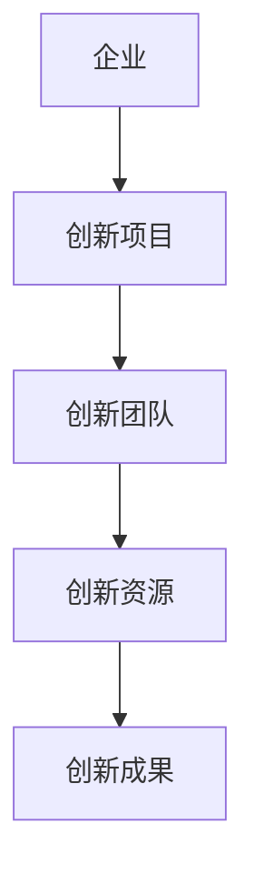
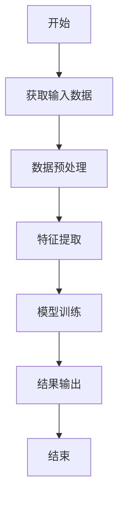
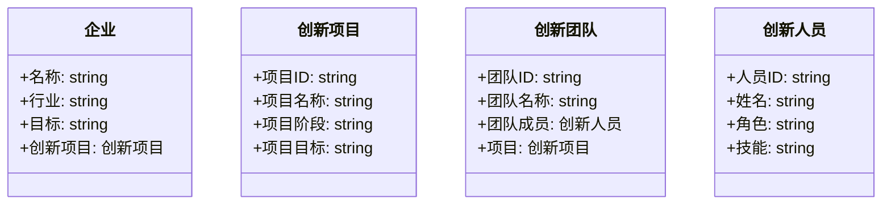
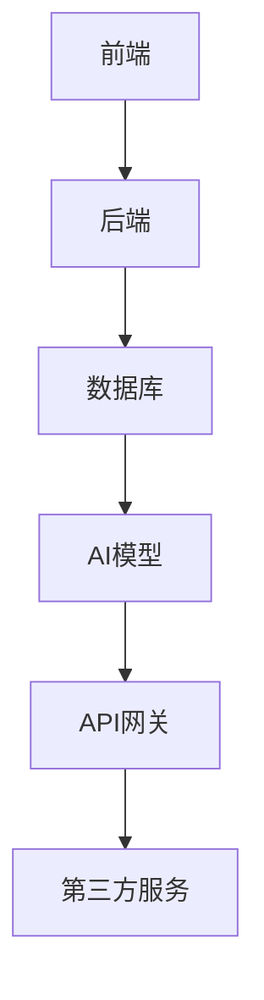
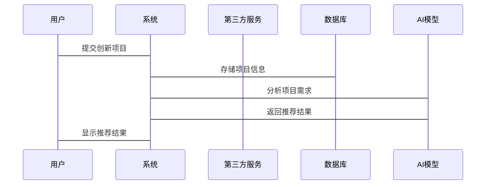

                 


# 《构建AI驱动的企业创新管理系统》

---

## 关键词：  
AI驱动、企业创新管理、管理系统、系统架构、算法原理、项目实战  

---

## 摘要：  
本文将详细探讨如何构建一个AI驱动的企业创新管理系统。通过分析传统企业创新管理的痛点，结合AI技术的优势，提出了一种基于AI的创新管理系统解决方案。文章从系统背景、核心概念、算法原理、系统架构、项目实战到最佳实践进行了全面阐述，旨在为企业创新管理提供一种高效、智能的解决方案。  

---

## 目录  

### # 引言  

### # 第一部分: AI驱动的企业创新管理系统的背景与核心概念  

#### ## 第1章: 问题背景与问题描述  

##### ### 1.1 问题背景  
- 企业创新管理的传统模式及其局限性  
- AI技术对企业创新管理的潜在价值  
- 当前企业创新管理面临的挑战与痛点  

##### ### 1.2 问题描述  
- 企业创新管理的核心目标与关键任务  
- 创新管理中的数据孤岛与信息不透明问题  
- 传统创新管理流程的效率瓶颈  

##### ### 1.3 问题解决  
- AI技术如何赋能企业创新管理  
- AI驱动的企业创新管理系统的初步构想  
- 系统如何解决传统创新管理中的痛点  

##### ### 1.4 系统的边界与外延  
- 系统的功能边界  
- 系统与企业其他管理系统的接口关系  
- 系统的适用范围与限制  

##### ### 1.5 核心概念与组成要素  
- 核心概念的定义与特征  
- 核心要素的组成与相互关系  
- 系统的整体架构与模块划分  

#### ## 第2章: 核心概念与原理  

##### ### 2.1 系统原理  
- AI驱动的企业创新管理系统的总体工作原理  
- 系统的主要功能模块及其相互关系  
- 系统的核心算法与技术选型  

##### ### 2.2 核心概念的属性特征对比  
- 创新管理与传统管理的对比分析  
- AI技术在创新管理中的应用特点  
- 系统各模块的属性特征与功能对比  

##### ### 2.3 ER实体关系图  


---

### # 第二部分: AI驱动的企业创新管理系统的原理与核心概念  

#### ## 第3章: 算法原理  

##### ### 3.1 算法原理  
- 系统算法的整体流程  
- 算法的核心步骤及其数学模型  
- 算法的实现细节与优化策略  

##### ### 3.2 算法流程图  


##### ### 3.3 算法实现代码  
```python
# 示例代码：创新项目推荐算法
import numpy as np
from sklearn.metrics.pairwise import cosine_similarity

# 数据预处理
def preprocess(data):
    # 数据清洗和特征提取
    pass

# 特征提取
def extract_features(data):
    # 提取文本特征
    pass

# 模型训练
def train_model(features):
    # 训练推荐模型
    pass

# 推荐系统
def recommend_projects(users, features):
    # 基于余弦相似度的推荐
    similarity = cosine_similarity(features)
    return similarity.argsort()[:, ::-1]

# 主函数
def main():
    data = load_data()
    processed_data = preprocess(data)
    features = extract_features(processed_data)
    model = train_model(features)
    recommendations = recommend_projects(users, features)
    print(recommendations)

if __name__ == "__main__":
    main()
```

##### ### 3.4 数学模型与公式  
- 相似度计算公式：$$\text{相似度} = \frac{\sum_{i=1}^{n} w_i x_i y_i}{\sqrt{\sum_{i=1}^{n} w_i x_i^2} \cdot \sqrt{\sum_{i=1}^{n} w_i y_i^2}}$$  
- 模型优化公式：$$\text{损失函数} = \sum_{i=1}^{m} (y_i - \hat{y}_i)^2$$  

---

### # 第三部分: 系统分析与架构设计方案  

#### ## 第4章: 问题场景介绍  

##### ### 4.1 问题场景描述  
- 创新项目的管理流程  
- 创新团队的协作模式  
- 创新资源的分配与利用  

##### ### 4.2 项目介绍  
- 系统的目标与范围  
- 项目的实施背景与意义  
- 项目的核心任务与挑战  

#### ## 第5章: 系统功能设计  

##### ### 5.1 领域模型设计  


##### ### 5.2 系统架构设计  


##### ### 5.3 系统接口设计  
- API接口定义  
- 接口调用流程  
- 接口安全设计  

##### ### 5.4 系统交互设计  


---

### # 第四部分: 项目实战  

#### ## 第6章: 环境安装与系统实现  

##### ### 6.1 环境安装  
- 安装Python与相关库  
- 安装AI框架（如TensorFlow、PyTorch）  
- 安装数据库与开发工具  

##### ### 6.2 系统核心实现  
- 创新项目推荐系统实现  
- 创新团队协作功能实现  
- 创新资源分配算法实现  

##### ### 6.3 代码实现与解读  
- 推荐系统代码  
- 团队协作功能代码  
- 资源分配算法代码  

##### ### 6.4 实际案例分析  
- 案例背景介绍  
- 系统应用过程  
- 实验结果与分析  

#### ## 第7章: 项目总结与优化建议  

##### ### 7.1 项目小结  
- 项目目标的实现情况  
- 系统的优缺点分析  
- 项目成果与经验总结  

##### ### 7.2 优化建议  
- 系统性能优化方向  
- 功能扩展建议  
- 系统维护与升级建议  

---

### # 第五部分: 最佳实践  

#### ## 第8章: 小结与注意事项  

##### ### 8.1 小结  
- 系统设计的核心思想  
- 系统实现的关键点  
- 系统应用的价值与意义  

##### ### 8.2 注意事项  
- 系统部署中的常见问题  
- 系统使用中的注意事项  
- 系统维护中的关键点  

#### ## 第9章: 拓展阅读与学习资源  

##### ### 9.1 拓展阅读  
- 推荐的相关技术书籍与论文  
- 其他AI驱动的管理系统案例分析  
- 系统架构设计的经典文献  

##### ### 9.2 学习资源  
- 开发工具与框架的学习资源  
- AI算法的学习资源  
- 系统设计的学习资源  

---

## 作者：  
AI天才研究院/AI Genius Institute & 禅与计算机程序设计艺术 /Zen And The Art of Computer Programming

