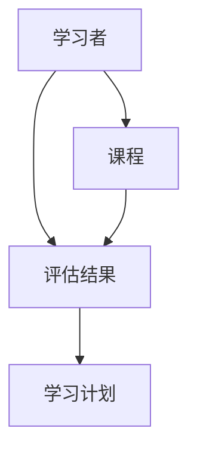
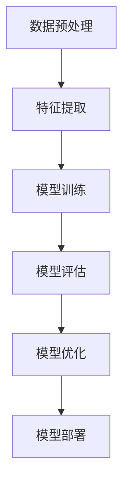
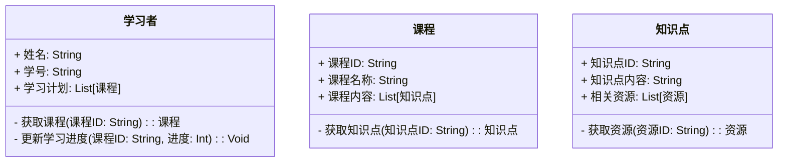
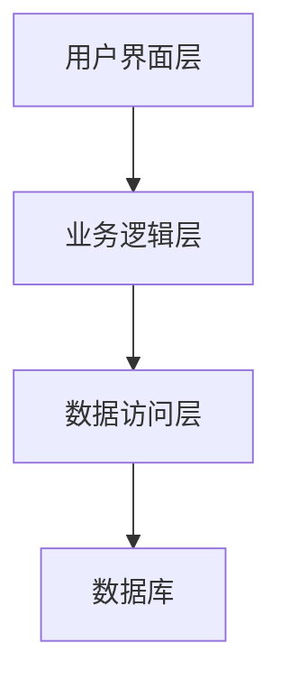
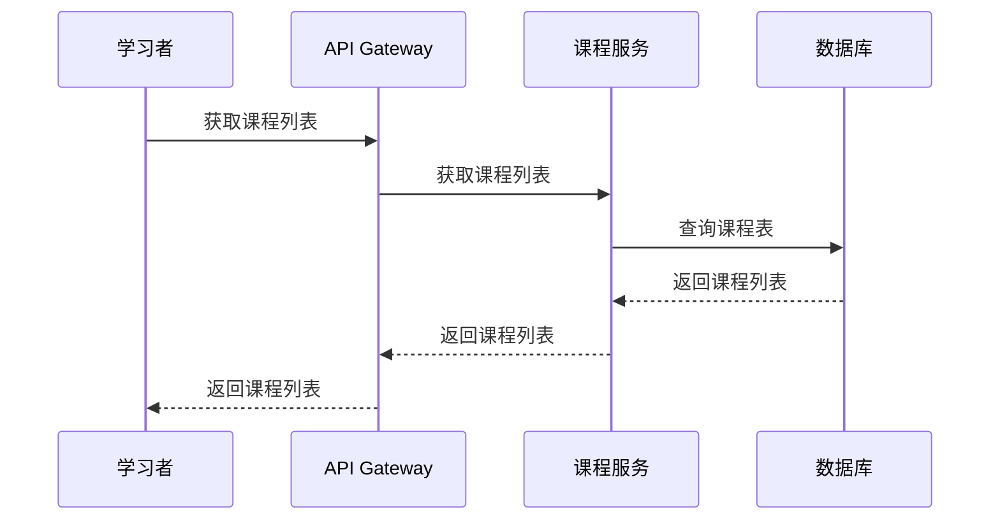

                 

# 《构建AI驱动的企业学习管理系统(LMS)》

---

## 关键词：AI驱动、企业学习管理系统、LMS、机器学习、深度学习、自然语言处理、系统架构

---

## 摘要：  
本文详细探讨了如何利用人工智能技术构建企业学习管理系统（LMS），从背景分析、核心概念、算法原理到系统设计和项目实战，层层深入。文章首先介绍了传统LMS的局限性以及AI驱动LMS的必要性，接着分析了AI在LMS中的核心应用领域，包括机器学习、深度学习和自然语言处理。随后，详细阐述了AI驱动LMS的算法原理和数学模型，并通过系统架构设计展示了如何将这些技术整合到实际系统中。最后，通过项目实战部分，读者可以学习到如何从零开始构建一个AI驱动的LMS，并通过实际案例分析，理解系统的实现细节和优化方向。

---

## 目录大纲

---

### 第一部分：AI驱动的企业学习管理系统概述

#### 第1章：企业学习管理系统（LMS）的背景与现状

- **1.1 什么是企业学习管理系统**
  - 1.1.1 LMS的定义与核心功能
  - 1.1.2 LMS的演变历程
  - 1.1.3 LMS在企业中的作用与价值

- **1.2 AI驱动的LMS的必要性**
  - 1.2.1 传统LMS的局限性
  - 1.2.2 AI技术如何提升LMS的智能化水平
  - 1.2.3 企业学习体验的未来趋势

- **1.3 当前AI驱动LMS的技术与市场现状**
  - 1.3.1 AI技术在教育领域的应用现状
  - 1.3.2 市场上主流的AI驱动LMS产品分析
  - 1.3.3 企业级LMS的挑战与机遇

- **1.4 本章小结**

---

### 第二部分：AI驱动LMS的核心概念与技术原理

#### 第2章：AI驱动LMS的核心概念解析

- **2.1 问题背景与问题描述**
  - 2.1.1 传统LMS的用户痛点分析
  - 2.1.2 AI驱动LMS的目标与边界
  - 2.1.3 核心问题的解决思路

- **2.2 核心概念与技术原理**
  - 2.2.1 AI驱动LMS的核心要素组成
  - 2.2.2 各要素之间的关系与依赖
  - 2.2.3 系统的输入、输出与目标函数

- **2.3 核心概念对比分析**
  - 2.3.1 核心要素属性对比表格
  - 2.3.2 ER实体关系图（Mermaid）

---

#### 第3章：AI驱动LMS的算法原理与数学模型

- **3.1 算法原理概述**
  - 3.1.1 机器学习在LMS中的应用
  - 3.1.2 深度学习在LMS中的应用
  - 3.1.3 自然语言处理在LMS中的应用

- **3.2 算法实现流程（Mermaid）**

- **3.3 数学模型与公式**
  - 3.3.1 机器学习模型的数学基础
  - 3.3.2 神经网络的数学模型
  - 3.3.3 深度学习算法的数学推导

- **3.4 算法实现代码示例**
  - 3.4.1 数据预处理代码
  - 3.4.2 模型训练代码
  - 3.4.3 模型评估代码

---

### 第三部分：AI驱动LMS的系统分析与架构设计

#### 第4章：系统分析与架构设计

- **4.1 问题场景分析**
  - 4.1.1 用户需求分析
  - 4.1.2 系统功能设计（Mermaid类图）

- **4.2 系统架构设计**
  - 4.2.1 分层架构设计（Mermaid架构图）

- **4.3 系统接口设计**
  - 4.3.1 API接口定义
  - 4.3.2 接口交互流程（Mermaid序列图）

---

### 第四部分：项目实战与总结

#### 第5章：项目实战

- **5.1 环境安装与配置**
  - 5.1.1 安装Python与相关库（如TensorFlow、Keras）
  - 5.1.2 安装数据库（如MySQL、MongoDB）
  - 5.1.3 安装开发框架（如Django、Flask）

- **5.2 系统核心实现**
  - 5.2.1 数据预处理与特征提取
  - 5.2.2 模型训练与部署
  - 5.2.3 系统接口开发与测试

- **5.3 实际案例分析**
  - 5.3.1 案例背景介绍
  - 5.3.2 数据准备与分析
  - 5.3.3 模型训练与优化
  - 5.3.4 系统功能展示与测试

- **5.4 本章小结**

---

### 第六章：总结与展望

- **6.1 本章总结**
  - 6.1.1 AI驱动LMS的核心技术总结
  - 6.1.2 系统设计与实现的要点回顾
  - 6.1.3 项目实战中的经验与教训

- **6.2 未来展望**
  - 6.2.1 AI技术在LMS中的进一步应用
  - 6.2.2 新技术（如元学习、强化学习）的潜在影响
  - 6.2.3 企业级LMS的未来发展与挑战

- **6.3 最佳实践与注意事项**
  - 6.3.1 系统设计中的关键点
  - 6.3.2 开发过程中的注意事项
  - 6.3.3 运维与维护建议

---

## 作者：AI天才研究院/AI Genius Institute & 禅与计算机程序设计艺术 /Zen And The Art of Computer Programming

---

以上是文章的详细目录大纲，每一章都详细涵盖了从理论到实践的各个方面，确保读者能够全面理解AI驱动的企业学习管理系统（LMS）的构建过程。

