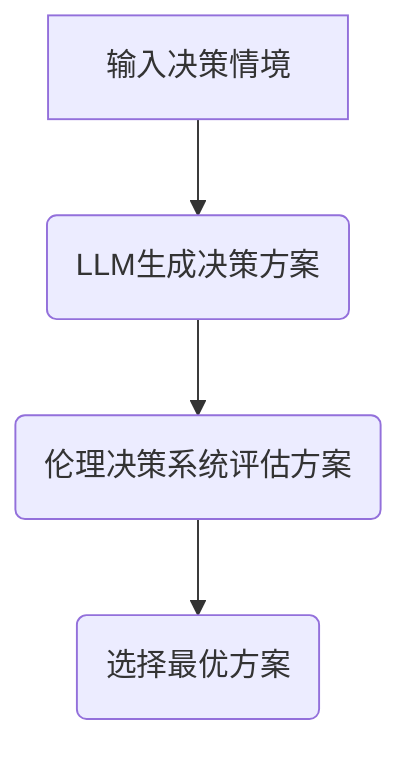
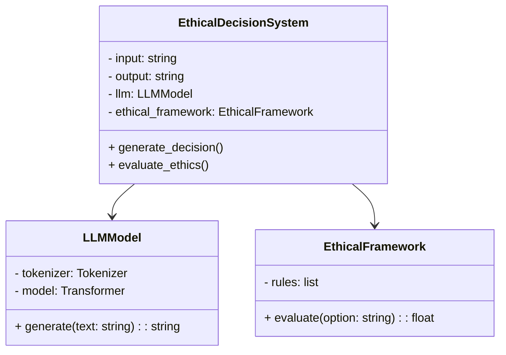
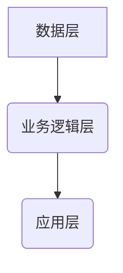
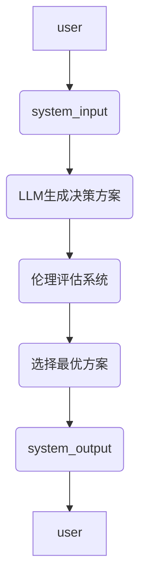

                 


# 《构建LLM支持的AI Agent伦理决策系统》

**关键词：LLM, AI Agent, 伦理决策系统, 大语言模型, 伦理框架, 决策支持工具**

**摘要：** 本文探讨了如何利用大语言模型（LLM）构建AI代理的伦理决策系统。文章从背景介绍、核心概念、算法原理、系统架构设计到项目实战，全面阐述了构建该系统的各个方面。通过详细分析LLM的工作原理和伦理决策系统的设计，文章提出了结合两者的方法，并通过实际案例展示了系统的应用。最后，文章总结了构建过程中的关键点，并展望了未来的发展方向。

---

## 第一章：背景介绍

### 1.1 问题背景

随着人工智能技术的飞速发展，AI代理（AI Agent）在各个领域的应用越来越广泛。从智能音箱到自动驾驶汽车，AI代理已经成为我们生活中不可或缺的一部分。然而，AI代理在决策过程中面临的伦理问题也随之浮现。例如，自动驾驶汽车在紧急情况下如何选择最优的行动方案，医疗AI在诊断和治疗建议中如何处理潜在的风险与收益之间的权衡。

大语言模型（LLM）作为一种强大的工具，能够处理自然语言并生成人类可读的内容，这使得它在AI代理的决策过程中扮演着越来越重要的角色。然而，LLM本身并不具备伦理判断的能力，它只能根据训练数据和算法生成结果。因此，如何在AI代理中引入伦理决策系统，使其能够根据具体情况做出符合伦理的选择，成为一个亟待解决的问题。

### 1.2 问题描述

AI代理的决策过程需要考虑的因素包括但不限于安全性、效率性、公平性以及伦理性。传统的决策系统往往依赖于固定的规则和预设的条件，难以应对复杂多变的实际情况。而LLM虽然在处理复杂问题方面表现出色，但其输出结果并不总是符合伦理标准。因此，构建一个能够与LLM协同工作的伦理决策系统，是提升AI代理智能化水平的重要途径。

### 1.3 问题解决与核心概念

为了解决上述问题，我们需要将伦理决策系统与LLM相结合。伦理决策系统的核心功能是根据具体情况，分析可能的决策选项，并选择最符合伦理标准的方案。通过将LLM的生成能力与伦理决策系统的分析能力相结合，AI代理能够在复杂场景中做出更为智能和合理的决策。

---

## 第二章：核心概念与联系

### 2.1 LLM的基本原理

大语言模型（LLM）基于Transformer架构，通过自注意力机制（Self-Attention）和前馈神经网络（FFN）对输入文本进行编码和解码。其核心思想是利用自注意力机制捕捉文本中不同词之间的关系，从而生成连贯且合理的输出。

**数学公式：**  
自注意力机制的计算公式可以表示为：
$$
\text{Attention}(Q, K, V) = \text{softmax}\left(\frac{QK^T}{\sqrt{d_k}}\right)V
$$  
其中，$Q$、$K$、$V$分别为查询、键和值向量，$d_k$为键的维度。

### 2.2 伦理决策系统的基本原理

伦理决策系统的核心是伦理框架，它定义了一系列的伦理准则和优先级。系统通过分析当前情境，将可能的决策选项映射到伦理框架中，评估每个选项的伦理得分，最终选择得分最高的方案。

**伦理框架示例：**  
1. **功利主义**：以最大化整体利益为目标。
2. **义务论**：基于个体的义务和责任进行决策。
3. **美德伦理**：基于个体的美德和情境的特殊性进行决策。

### 2.3 LLM与伦理决策系统的结合

将LLM与伦理决策系统结合，可以充分发挥前者的内容生成能力，同时借助后者的伦理分析能力，实现更为智能的决策过程。具体来说，LLM可以生成多个可能的决策方案，伦理决策系统则对这些方案进行伦理评估，最终选择最优的方案。

**流程图：**  


---

## 第三章：算法原理讲解

### 3.1 LLM的训练过程

LLM的训练过程主要包括数据预处理、模型初始化、参数优化等步骤。数据预处理涉及清洗、分词和数据格式化等操作。模型初始化则是基于随机权重的初始化。参数优化通过反向传播算法不断调整模型参数，以最小化预测误差。

**训练过程示例代码：**
```python
import torch

# 数据预处理
def preprocess(data):
    # 假设data为输入数据
    return torch.tensor(data, dtype=torch.long)

# 模型初始化
class LLMModel(torch.nn.Module):
    def __init__(self, vocab_size):
        super(LLMModel, self).__init__()
        self.transformer = Transformer(vocab_size)
    
    def forward(self, input_ids):
        return self.transformer(input_ids)

# 参数优化
def train(model, optimizer, criterion, train_loader):
    for epoch in range(num_epochs):
        for batch_data in train_loader:
            outputs = model(batch_data)
            loss = criterion(outputs, batch_labels)
            optimizer.zero_grad()
            loss.backward()
            optimizer.step()
```

### 3.2 伦理决策模型的构建

伦理决策模型的构建需要选择合适的伦理框架，并将决策选项映射到该框架中。通过分析每个选项的伦理得分，选择得分最高的方案作为最终决策。

**伦理决策模型示例代码：**
```python
def ethical_decision(ethical_framework, options):
    scores = []
    for option in options:
        score = evaluate_ethics(ethical_framework, option)
        scores.append(score)
    # 选择得分最高的选项
    best_option = options[scores.index(max(scores))]
    return best_option
```

---

## 第四章：系统分析与架构设计

### 4.1 系统功能设计

系统功能设计包括以下几个方面：
1. **输入处理**：接收决策情境和相关数据。
2. **LLM调用**：调用大语言模型生成决策方案。
3. **伦理评估**：对生成的决策方案进行伦理评估。
4. **决策输出**：输出最终的决策结果。

**功能设计类图：**


### 4.2 系统架构设计

系统架构设计采用分层架构，包括数据层、业务逻辑层和应用层。各层之间通过接口进行交互，确保系统的可扩展性和维护性。

**系统架构图：**


### 4.3 系统接口设计

系统接口设计包括以下几个部分：
1. **输入接口**：接收决策情境和相关数据。
2. **LLM接口**：调用大语言模型生成决策方案。
3. **伦理评估接口**：对生成的决策方案进行伦理评估。
4. **输出接口**：输出最终的决策结果。

### 4.4 系统交互流程

系统交互流程包括以下几个步骤：
1. 用户输入决策情境。
2. 系统调用LLM生成多个决策方案。
3. 系统对生成的决策方案进行伦理评估。
4. 系统选择最优方案并输出结果。

**交互流程图：**


---

## 第五章：项目实战

### 5.1 环境安装

为了运行本项目，需要安装以下依赖：
- Python 3.8+
- PyTorch
- Hugging Face Transformers

安装命令：
```bash
pip install torch transformers
```

### 5.2 核心代码实现

#### 5.2.1 LLM模型实现

```python
from transformers import AutoTokenizer, AutoModelForCausalLM

class LLMModel:
    def __init__(self, model_name):
        self.tokenizer = AutoTokenizer.from_pretrained(model_name)
        self.model = AutoModelForCausalLM.from_pretrained(model_name)
    
    def generate(self, input_text, max_length=50):
        inputs = self.tokenizer(input_text, return_tensors='pt')
        outputs = self.model.generate(**inputs, max_length=max_length)
        return self.tokenizer.decode(outputs[0], skip_special_tokens=True)
```

#### 5.2.2 伦理决策系统实现

```python
class EthicalDecisionSystem:
    def __init__(self, llm_model, ethical_framework):
        self.llm = llm_model
        self.ethical_framework = ethical_framework
    
    def generate_decision(self, input_text):
        # 调用LLM生成决策方案
        decision_options = self.llm.generate(input_text)
        # 伦理评估
        evaluated_options = self.ethical_framework.evaluate(decision_options)
        # 选择最优方案
        best_option = max(evaluated_options, key=lambda x: x['score'])
        return best_option['option']
```

### 5.3 实际案例分析

假设我们有一个自动驾驶汽车的场景，汽车需要在紧急情况下做出决策，例如：

**输入情境：**  
“前方出现一个小孩，车辆需要紧急转向，可能会撞到路边的树。”

通过调用LLM生成多个决策方案：
1. 紧急转向，撞向树。
2. 维持方向，可能撞到小孩。
3. 临时刹车，试图避免碰撞。

然后，伦理决策系统对这三个方案进行评估，选择最优的方案。

---

## 第六章：总结与展望

### 6.1 总结

本文详细探讨了如何构建一个基于LLM的AI代理伦理决策系统。通过分析LLM的基本原理和伦理决策系统的核心概念，提出了将两者结合的方法，并通过实际案例展示了系统的应用。本文还详细讲解了系统的算法原理、架构设计和实现过程，为读者提供了一个完整的构建方案。

### 6.2 展望

未来的研究方向包括：
1. 提高伦理决策系统的评估精度。
2. 优化LLM的生成能力，使其能够生成更加多样化和合理的决策方案。
3. 探讨不同伦理框架之间的相互作用，进一步完善伦理决策系统的评估模型。

---

## 作者：AI天才研究院 & 禅与计算机程序设计艺术

**本文作者：**  
AI天才研究院（AI Genius Institute）致力于人工智能领域的研究与实践，专注于大语言模型、AI代理和伦理决策系统的研究。  
禅与计算机程序设计艺术（Zen And The Art of Computer Programming）旨在通过艺术化的编程方式，探索计算机科学的深层奥秘，追求技术与艺术的完美结合。

---

通过以上步骤，我希望能够为您提供一篇内容详实、结构清晰的技术博客文章，帮助您更好地理解和构建基于LLM的AI代理伦理决策系统。

