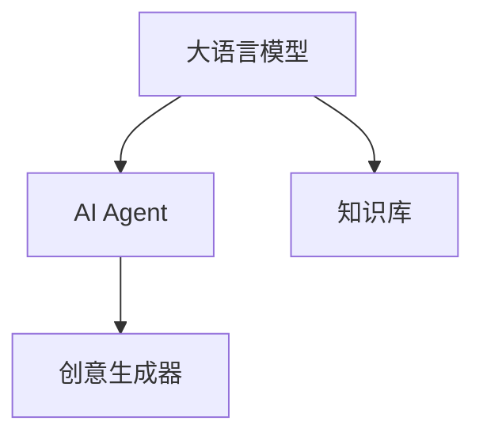
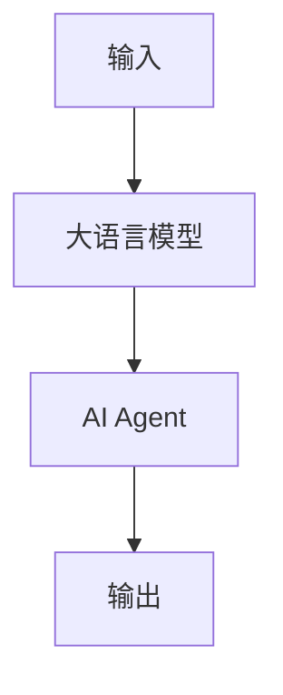
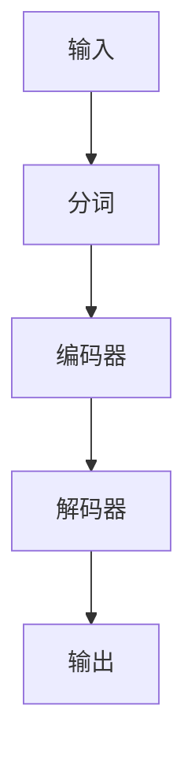
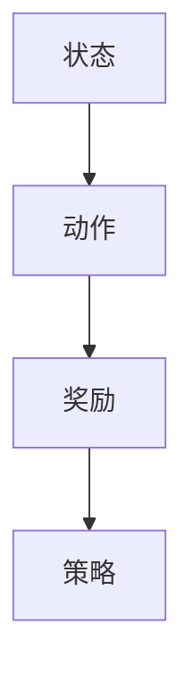
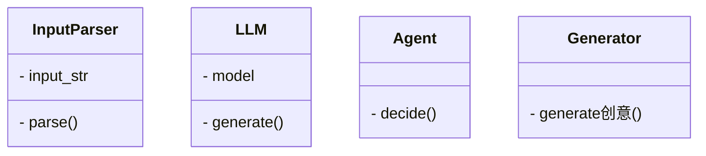
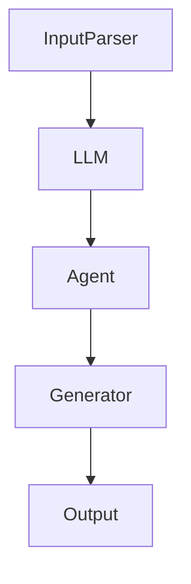
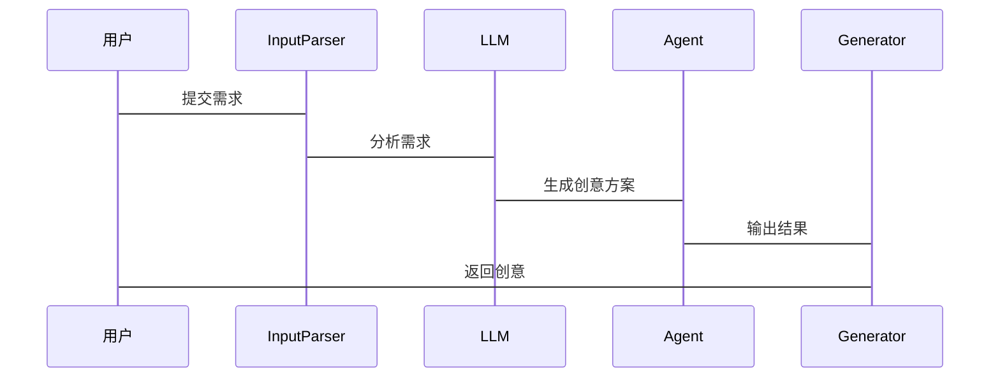

                 


# 《构建LLM支持的AI Agent创意生成系统》

---

## 关键词：LLM、AI Agent、创意生成、自然语言处理、强化学习、系统架构

---

## 摘要

本文系统地探讨了如何构建一个基于大语言模型（LLM）的AI Agent创意生成系统。文章从问题背景出发，详细分析了当前创意生成系统的不足，提出了结合LLM和AI Agent的解决方案。通过核心概念的对比分析，结合算法原理和系统架构设计，给出了具体的实现路径。同时，通过项目实战和最佳实践，提供了可落地的解决方案和开发建议。本文适合AI工程师、自然语言处理研究人员以及对创意生成技术感兴趣的读者阅读。

---

# 第一部分: 背景介绍与核心概念

## 第1章: 问题背景与问题描述

### 1.1 问题背景

#### 1.1.1 当前AI技术的发展现状
人工智能技术近年来取得了飞速发展，尤其是大语言模型（LLM）的崛起，为创意生成带来了新的可能性。然而，现有的创意生成系统往往缺乏智能性和灵活性，难以满足复杂场景的需求。

#### 1.1.2 大语言模型（LLM）的崛起
大语言模型通过海量数据训练，具备强大的语言理解和生成能力。然而，这些模型通常需要人工干预来调整生成结果，难以实现自动化创意生成。

#### 1.1.3 AI Agent的概念与应用前景
AI Agent是一种能够自主决策和行动的智能体，能够根据环境反馈调整行为。结合LLM的能力，AI Agent可以在创意生成中发挥重要作用。

### 1.2 问题描述

#### 1.2.1 创意生成的需求与挑战
创意生成需要结合上下文、用户意图和多种知识进行综合判断，传统生成模型难以满足这些复杂需求。

#### 1.2.2 LLM在创意生成中的优势
大语言模型具备强大的文本生成能力，但缺乏动态调整的能力，难以应对复杂的生成任务。

#### 1.2.3 当前创意生成系统的不足
现有系统通常基于规则或简单模板生成创意，缺乏灵活性和深度。

### 1.3 问题解决思路

#### 1.3.1 结合LLM与AI Agent的解决方案
通过将LLM与AI Agent结合，利用大模型的生成能力和Agent的自主决策能力，实现动态调整的创意生成。

#### 1.3.2 创意生成系统的功能定位
创意生成系统需要具备输入解析、创意生成、结果优化三大功能模块。

#### 1.3.3 系统的目标与预期效果
目标是实现智能化、个性化的创意生成，预期效果包括高精度、高效率和高灵活性。

### 1.4 系统的边界与外延

#### 1.4.1 系统的功能边界
创意生成系统仅负责生成创意，不涉及后续的执行和优化。

#### 1.4.2 系统的适用场景与限制
适用于文案创作、广告创意、产品设计等领域，受限于LLM的理解能力。

#### 1.4.3 系统与其他系统的区别与联系
与传统生成系统相比，本系统具备更强的动态调整能力和智能化水平。

### 1.5 核心概念与组成要素

#### 1.5.1 LLM的核心要素
包括模型结构、训练数据和训练方法。

#### 1.5.2 AI Agent的核心要素
包括感知能力、决策能力和执行能力。

#### 1.5.3 创意生成系统的组成结构
包括输入模块、处理模块和输出模块。

---

## 第2章: 核心概念与联系

### 2.1 LLM与AI Agent的核心原理

#### 2.1.1 LLM的工作原理
大语言模型通过自监督学习，从海量数据中学习语言模式，生成符合上下文的文本。

#### 2.1.2 AI Agent的决策机制
AI Agent通过感知环境、分析目标、制定策略并执行动作，实现自主决策。

#### 2.1.3 两者结合的创新点
将LLM的生成能力与AI Agent的决策能力结合，实现动态调整的创意生成。

### 2.2 核心概念对比分析

#### 2.2.1 LLM与传统NLP模型的对比
| 特性 | LLM | 传统NLP模型 |
|------|------|------------|
| 模型复杂度 | 高 | 低 |
| 训练数据 | 海量 | 有限 |
| 生成能力 | 强大 | 较弱 |

#### 2.2.2 AI Agent与传统脚本化Agent的对比
| 特性 | AI Agent | 传统脚本化Agent |
|------|----------|----------------|
| 智能性 | 高 | 低 |
| 灵活性 | 高 | 低 |
| 决策能力 | 强大 | 有限 |

#### 2.2.3 创意生成与传统生成任务的对比
| 特性 | 创意生成 | 传统生成 |
|------|----------|-----------|
| 复杂性 | 高 | 低 |
| 动态性 | 高 | 低 |
| 精准度 | 高 | 中 |

### 2.3 实体关系与架构图

#### 2.3.1 实体关系图（Mermaid）


#### 2.3.2 架构图（Mermaid）


---

## 第3章: 算法原理

### 3.1 LLM的相关算法

#### 3.1.1 大语言模型的训练过程
- **自监督学习**：通过预测下一个词来学习语言模式。
- **Transformer架构**：包括编码器和解码器，用于处理序列数据。

#### 3.1.2 基于RLHF的优化
- **强化学习**：通过奖励机制优化生成结果。
- **Human反馈**：利用人工反馈进一步优化模型。

#### 3.1.3 算法流程图（Mermaid）


#### 3.1.4 代码实现（Python）
```python
def generate_text(model, tokenizer, input_str):
    inputs = tokenizer(input_str, return_tensors='np')
    outputs = model.generate(inputs.input_ids, max_length=50)
    return tokenizer.decode(outputs[0], skip_special_tokens=True)
```

### 3.2 AI Agent的决策算法

#### 3.2.1 基于LLM的决策机制
- **输入解析**：解析用户需求，生成多个候选方案。
- **结果评估**：评估候选方案的可行性，选择最优方案。

#### 3.2.2 强化学习在决策中的应用
- **状态空间**：表示当前环境状态。
- **动作空间**：表示可能的决策动作。
- **奖励函数**：衡量决策的优劣。

#### 3.2.3 算法流程图（Mermaid）


#### 3.2.4 代码实现（Python）
```python
def decide_action(state, model):
    action = model.predict(state)
    return action
```

### 3.3 数学模型

#### 3.3.1 大模型的训练目标函数
$$ \mathcal{L}(\theta) = -\sum_{i=1}^{N} \log p_\theta(w_i | w_{<i}) $$

#### 3.3.2 基于强化学习的决策模型
$$ R(s, a) = r_{\text{score}}(s, a) + r_{\text{diversity}}(s, a) $$

---

## 第4章: 系统分析与架构设计

### 4.1 系统分析

#### 4.1.1 项目背景
创意生成系统的开发目标是提高创意生成的效率和质量。

#### 4.1.2 系统功能设计
- 输入解析模块：解析用户需求。
- 创意生成模块：生成创意内容。
- 结果优化模块：优化生成结果。

### 4.2 系统架构设计

#### 4.2.1 领域模型类图（Mermaid）


#### 4.2.2 系统架构图（Mermaid）


#### 4.2.3 系统交互流程（Mermaid）


---

## 第5章: 项目实战

### 5.1 环境安装

#### 5.1.1 安装依赖
```bash
pip install transformers torch
```

### 5.2 核心代码实现

#### 5.2.1 输入解析模块
```python
def parse_input(input_str):
    # 解析输入
    return parsed_result
```

#### 5.2.2 LLM生成模块
```python
def generate创意(model, tokenizer, input_str):
    # 使用模型生成创意
    return generated_result
```

#### 5.2.3 Agent决策模块
```python
def decide_action(model, state):
    # 决策最优创意方案
    return action
```

### 5.3 案例分析与解读

#### 5.3.1 案例分析
- **需求分析**：用户需求明确，生成创意。
- **系统执行**：解析需求、生成创意、优化结果。
- **结果展示**：输出优化后的创意方案。

---

## 第6章: 最佳实践

### 6.1 小结

#### 6.1.1 项目总结
通过结合LLM和AI Agent，实现了智能化的创意生成系统。

#### 6.1.2 经验总结
- 系统设计需注重模块化和灵活性。
- 模型调优和数据质量至关重要。

### 6.2 注意事项

#### 6.2.1 模型选择
选择适合任务的LLM模型，如GPT-3、PaLM等。

#### 6.2.2 数据安全
注意数据隐私和模型安全。

#### 6.2.3 系统优化
优化系统性能和用户体验。

### 6.3 拓展阅读

#### 6.3.1 推荐书籍
- 《深度学习》
- 《强化学习》

#### 6.3.2 推荐论文
- "Attention Is All You Need"
- "The Power of LLMs"

---

## 作者：AI天才研究院/AI Genius Institute & 禅与计算机程序设计艺术 /Zen And The Art of Computer Programming

---

以上为文章的完整目录大纲，您可以根据此结构撰写详细的技术博客文章。

