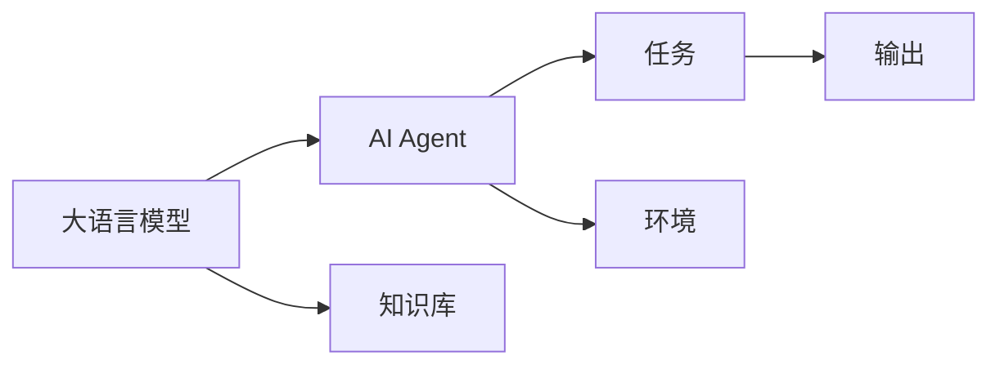

                 


```markdown
# 构建LLM支持的AI Agent创新思维系统

## 关键词：LLM, AI Agent, 创新思维, 系统架构, 算法原理

## 摘要：本文详细探讨了如何构建一个由大语言模型支持的AI Agent创新思维系统，涵盖了系统背景、核心概念、算法原理、系统架构设计以及项目实战等各个方面。通过详细的技术分析和实例演示，展示了如何利用LLM赋能AI Agent，实现创新思维的系统化构建。

---

# 第一部分: LLM支持的AI Agent创新思维系统背景介绍

## 第1章: 问题背景与描述

### 1.1 问题背景

#### 1.1.1 当前AI技术的发展现状
人工智能技术的快速发展，特别是在大语言模型（LLM）领域的突破，为AI Agent的创新思维能力提供了强大的技术基础。然而，如何将LLM与AI Agent有机结合，使其具备创新思维能力，仍是一个亟待解决的挑战。

#### 1.1.2 大语言模型（LLM）的崛起
大语言模型（如GPT-3、GPT-4）以其强大的自然语言处理能力，能够理解和生成人类语言，为AI Agent提供了丰富的语义理解和生成能力。然而，这些模型本身并不具备“思维”能力，需要通过与AI Agent的结合来实现创新思维。

#### 1.1.3 AI Agent在实际场景中的应用需求
AI Agent在多个领域（如智能客服、自动化决策、个性化推荐等）展现出巨大的潜力。然而，现有的AI Agent大多基于规则或简单的学习算法，缺乏创新思维能力，无法应对复杂多变的现实场景。

### 1.2 问题描述

#### 1.2.1 LLM与AI Agent的结合难点
LLM的强大生成能力与AI Agent的决策能力之间存在一定的割裂。如何将LLM的生成能力与AI Agent的决策能力有机结合，使其具备创新思维能力，是当前面临的主要挑战。

#### 1.2.2 创新思维系统的核心目标
通过构建一个由LLM支持的AI Agent创新思维系统，使得AI Agent能够自主地生成创新性的解决方案，具备类似人类的创造性思维能力。

#### 1.2.3 当前系统的痛点与不足
- **痛点**：现有AI Agent缺乏创新性，无法应对复杂的、非结构化的问题。
- **不足**：LLM与AI Agent的结合缺乏系统性，创新思维能力尚未得到充分挖掘。

### 1.3 问题解决

#### 1.3.1 LLM与AI Agent结合的解决方案
通过将LLM作为AI Agent的“大脑”，赋予其强大的语言理解和生成能力，同时结合AI Agent的决策和执行能力，实现创新思维。

#### 1.3.2 创新思维系统的核心优势
- **优势1**：具备强大的语言理解和生成能力。
- **优势2**：能够基于LLM的生成能力，自主生成创新性的解决方案。
- **优势3**：能够与现实环境进行交互，实现动态调整和优化。

### 1.4 边界与外延

#### 1.4.1 系统的边界
- **边界1**：仅限于基于LLM的AI Agent创新思维系统。
- **边界2**：不包括其他类型的人工智能系统（如基于规则的系统）。

#### 1.4.2 系统的外延
- **外延1**：可以扩展到其他类型的大语言模型。
- **外延2**：可以应用于更多领域，如教育、医疗、金融等。

### 1.5 概念结构与核心要素

#### 1.5.1 核心概念
- **概念1**：大语言模型（LLM）
- **概念2**：AI Agent
- **概念3**：创新思维系统

#### 1.5.2 核心要素
- **要素1**：LLM的语义理解和生成能力
- **要素2**：AI Agent的决策和执行能力
- **要素3**：创新思维系统的综合能力

---

# 第二部分: 核心概念与联系

## 第2章: 核心概念原理

### 2.1 大语言模型的基本原理

#### 2.1.1 基本原理概述
大语言模型通过大量的数据训练，能够理解和生成人类语言。其核心原理包括自然语言处理（NLP）、机器学习（ML）等技术。

#### 2.1.2 LLM的内部结构
- **分词**：将输入文本分割成词语或符号。
- **嵌入层**：将词语映射成向量表示。
- **变换层**：通过自注意力机制进行上下文的理解和生成。
- **输出层**：生成最终的文本输出。

#### 2.1.3 LLM的训练过程
- **训练数据**：大量多样化的文本数据。
- **损失函数**：交叉熵损失。
- **优化算法**：Adam优化器。

### 2.2 AI Agent的核心机制

#### 2.2.1 AI Agent的基本概念
AI Agent是一种能够感知环境、自主决策并执行任务的智能体。

#### 2.2.2 AI Agent的核心机制
- **感知**：通过传感器或API获取环境信息。
- **决策**：基于感知信息进行推理和决策。
- **执行**：根据决策结果执行具体的操作。

#### 2.2.3 AI Agent的分类
- **简单AI Agent**：基于规则的决策。
- **复杂AI Agent**：基于机器学习的决策。
- **超级AI Agent**：具备类人智能的决策能力。

### 2.3 创新思维系统的实现逻辑

#### 2.3.1 创新思维的定义
创新思维是指能够跳出常规，提出新颖、独特的解决方案的能力。

#### 2.3.2 创新思维的实现步骤
1. **问题分析**：理解问题并分解为多个子问题。
2. **方案生成**：基于LLM生成多个可能的解决方案。
3. **方案评估**：对生成的方案进行评估和优化。
4. **方案执行**：选择最优方案并执行。

---

## 第3章: 核心概念属性特征对比

### 3.1 LLM与传统NLP模型的对比

| 对比维度       | LLM                          | 传统NLP模型                     |
|----------------|------------------------------|---------------------------------|
| **处理能力**   | 强大的语义理解和生成能力       | 较弱的语义理解和生成能力         |
| **训练数据**   | 大量多样化的文本数据           | 较小规模的特定领域数据           |
| **模型结构**   | 基于Transformer架构             | 基于RNN或CNN架构                 |
| **应用领域**   | 多领域通用                     | 特定领域专用                     |

### 3.2 AI Agent与传统脚本式AI的区别

| 对比维度       | AI Agent                     | 传统脚本式AI                   |
|----------------|------------------------------|---------------------------------|
| **自主性**     | 高度自主，能够自我决策         | 依赖脚本，缺乏自主性             |
| **适应性**     | 能够适应变化，灵活调整         | 适应性差，难以应对变化           |
| **学习能力**   | 具备学习能力，能够不断优化     | 无学习能力，无法优化             |
| **应用复杂度** | 应用复杂，需要处理多种任务     | 应用简单，处理任务单一           |

### 3.3 创新思维系统与传统决策系统的差异

| 对比维度       | 创新思维系统                 | 传统决策系统                   |
|----------------|------------------------------|---------------------------------|
| **创新性**     | 高度创新，能够提出新颖方案     | 无创新性，基于规则进行决策       |
| **灵活性**     | 灵活性高，能够应对复杂问题     | 灵活性低，难以应对复杂问题       |
| **学习能力**   | 学习能力强，能够不断优化       | 学习能力差，无法优化             |
| **应用场景**   | 适用于需要创新的领域           | 适用于规则明确的领域             |

---

## 第4章: 实体关系图

### 4.1 实体关系图



### 4.2 实体关系图解释

- **LLM**：大语言模型，负责提供语义理解和生成能力。
- **Agent**：AI Agent，负责感知环境、决策和执行任务。
- **Task**：任务，由AI Agent接收并处理。
- **Output**：输出，AI Agent执行任务后的结果。
- **Knowledge**：知识库，LLM用来辅助决策的数据源。
- **Environment**：环境，AI Agent所处的外部环境。

---

## 第5章: 核心概念的实现

### 5.1 LLM的实现

#### 5.1.1 LLM的实现步骤
1. **数据预处理**：对训练数据进行清洗和格式化。
2. **模型训练**：使用训练数据训练大语言模型。
3. **模型优化**：通过调整超参数优化模型性能。
4. **模型评估**：评估模型的准确性和生成能力。

#### 5.1.2 LLM的代码实现（Python示例）

```python
import torch
import torch.nn as nn
import torch.optim as optim

class LLM(nn.Module):
    def __init__(self, vocab_size):
        super().__init__()
        self.embedding = nn.Embedding(vocab_size, 512)
        self.transformer = nn.Transformer(512, 512)
        self.output = nn.Linear(512, vocab_size)

    def forward(self, input_ids):
        embedded = self.embedding(input_ids)
        output = self.transformer(embedded)
        logits = self.output(output)
        return logits

# 初始化模型和优化器
vocab_size = 10000
model = LLM(vocab_size)
optimizer = optim.Adam(model.parameters(), lr=0.001)
criterion = nn.CrossEntropyLoss()

# 训练循环
for epoch in range(num_epochs):
    for batch in dataloader:
        inputs, targets = batch
        outputs = model(inputs)
        loss = criterion(outputs, targets)
        optimizer.zero_grad()
        loss.backward()
        optimizer.step()
```

### 5.2 AI Agent的实现

#### 5.2.1 AI Agent的实现步骤
1. **环境感知**：通过传感器或API获取环境信息。
2. **任务分解**：将复杂任务分解为多个子任务。
3. **方案生成**：基于LLM生成多个可能的解决方案。
4. **方案评估**：评估生成的方案并选择最优方案。
5. **方案执行**：执行最优方案并返回结果。

#### 5.2.2 AI Agent的代码实现（Python示例）

```python
class AI-Agent:
    def __init__(self, llm_model):
        self.llm = llm_model

    def perceive(self, environment):
        # 获取环境信息
        return environment.get_state()

    def decide(self, state):
        # 基于状态生成解决方案
        solutions = self.llm.generate_solutions(state)
        # 选择最优方案
        return self.select_best_solution(solutions)

    def execute(self, solution):
        # 执行方案并返回结果
        return self.environment.execute(solution)

    def select_best_solution(self, solutions):
        # 根据评估标准选择最优方案
        return max(solutions, key=lambda x: x.score)
```

---

## 第6章: 创新思维系统的核心要素

### 6.1 创新思维系统的实现逻辑

#### 6.1.1 创新思维的定义
创新思维是指能够跳出常规，提出新颖、独特的解决方案的能力。

#### 6.1.2 创新思维的实现步骤
1. **问题分析**：理解问题并分解为多个子问题。
2. **方案生成**：基于LLM生成多个可能的解决方案。
3. **方案评估**：对生成的方案进行评估和优化。
4. **方案执行**：选择最优方案并执行。

### 6.2 创新思维系统的数学模型

#### 6.2.1 创新思维系统的数学模型
$$
\text{创新思维能力} = f(\text{LLM能力}, \text{AI Agent能力}, \text{创新算法})
$$

其中，$f$ 是一个综合函数，表示创新思维能力是LLM能力、AI Agent能力以及创新算法的综合结果。

---

## 第7章: 创新思维系统的应用案例

### 7.1 应用场景

#### 7.1.1 教育领域
在教育领域，创新思维系统可以用于辅助教师设计创新性的教学方案，提升学生的学习兴趣和创造力。

#### 7.1.2 医疗领域
在医疗领域，创新思维系统可以用于辅助医生制定个性化的治疗方案，提高诊断的准确性和治疗效果。

#### 7.1.3 金融领域
在金融领域，创新思维系统可以用于辅助金融分析师制定创新性的投资策略，提高投资收益和风险控制能力。

### 7.2 案例分析

#### 7.2.1 教育领域的案例分析
- **问题描述**：某学校需要设计一套创新性的教学方案，以提高学生的学习兴趣和创造力。
- **解决方案**：利用创新思维系统，生成多个教学方案，并选择最优方案进行实施。
- **实施结果**：教学效果显著提升，学生的学习兴趣和创造力得到明显增强。

#### 7.2.2 医疗领域的案例分析
- **问题描述**：某医院需要制定一套个性化的治疗方案，以提高患者的治疗效果。
- **解决方案**：利用创新思维系统，生成多个治疗方案，并选择最优方案进行实施。
- **实施结果**：治疗效果显著提升，患者的康复速度和治疗满意度明显提高。

---

## 第8章: 创新思维系统的优化与提升

### 8.1 创新思维系统的优化策略

#### 8.1.1 模型优化
- **优化方向**：优化LLM的生成能力，提升AI Agent的决策能力。
- **优化方法**：通过调整模型参数、增加训练数据、优化算法等方法进行优化。

#### 8.1.2 系统优化
- **优化方向**：优化系统的运行效率，提升系统的稳定性和可靠性。
- **优化方法**：通过优化系统架构、增加缓存机制、优化网络传输等方法进行优化。

### 8.2 创新思维系统的提升建议

#### 8.2.1 提升LLM的生成能力
- **建议1**：引入多模态数据，提升LLM的语义理解和生成能力。
- **建议2**：优化LLM的训练算法，提高生成结果的质量。

#### 8.2.2 提升AI Agent的决策能力
- **建议1**：引入强化学习算法，提升AI Agent的决策能力。
- **建议2**：优化AI Agent的感知能力，提高环境理解能力。

---

## 第9章: 创新思维系统的未来展望

### 9.1 未来发展趋势

#### 9.1.1 LLM与AI Agent的深度融合
随着技术的不断进步，LLM与AI Agent的深度融合将成为未来的主要发展方向。

#### 9.1.2 创新思维系统的广泛应用
创新思维系统的广泛应用将在更多领域展现出其独特的优势，为人类社会的发展带来更多的可能性。

### 9.2 未来研究方向

#### 9.2.1 创新思维系统的算法研究
- **研究方向1**：研究创新思维系统的算法优化方法。
- **研究方向2**：研究创新思维系统的可解释性问题。

#### 9.2.2 创新思维系统的应用研究
- **研究方向1**：研究创新思维系统在不同领域的应用潜力。
- **研究方向2**：研究创新思维系统的社会影响和伦理问题。

---

## 第10章: 结论与展望

### 10.1 结论

通过构建一个由LLM支持的AI Agent创新思维系统，我们能够显著提升AI Agent的创新思维能力，使其在多个领域展现出强大的应用潜力。

### 10.2 展望

未来，随着技术的不断进步，创新思维系统的应用范围将进一步扩大，其在教育、医疗、金融等领域的潜力将得到充分挖掘，为人类社会的发展带来更多的可能性。

---

## 作者：AI天才研究院/AI Genius Institute & 禅与计算机程序设计艺术 /Zen And The Art of Computer Programming
```

