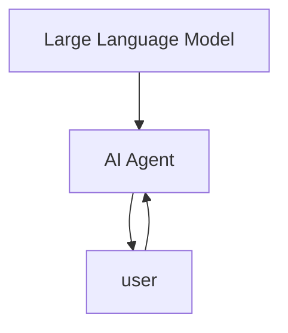
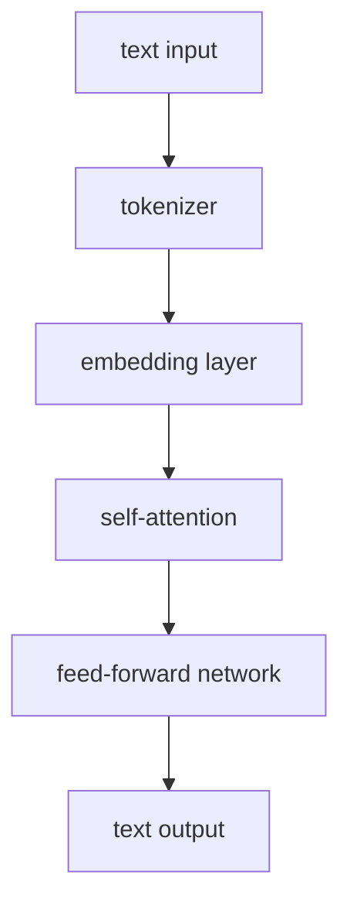
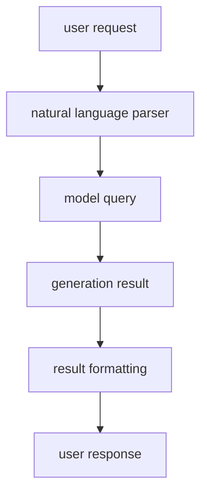
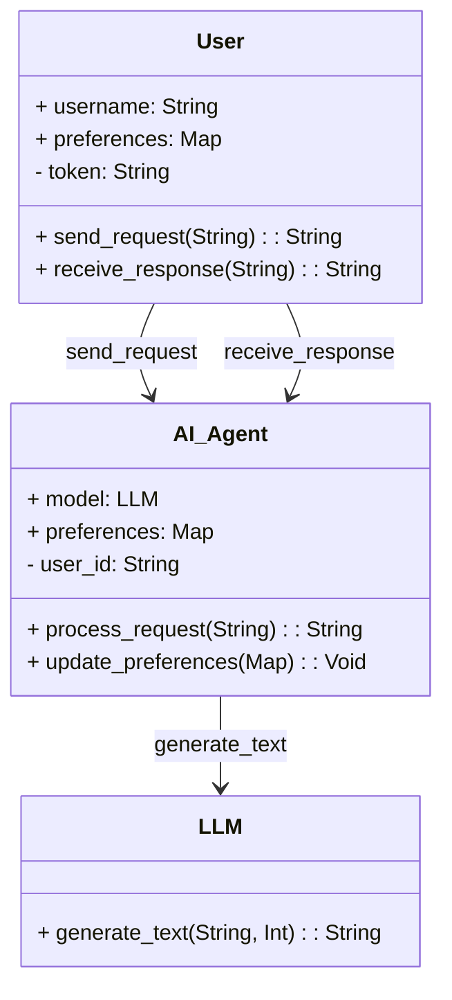
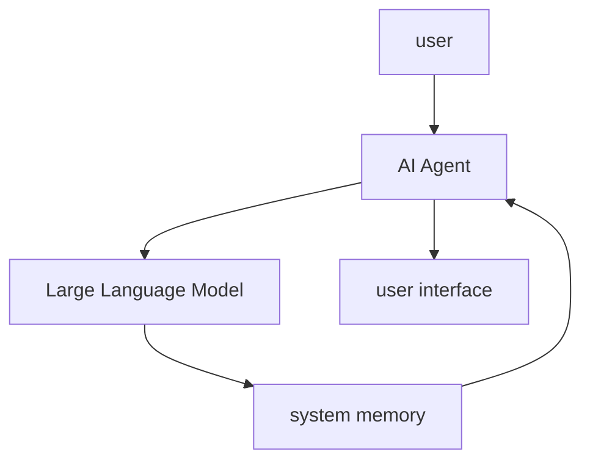
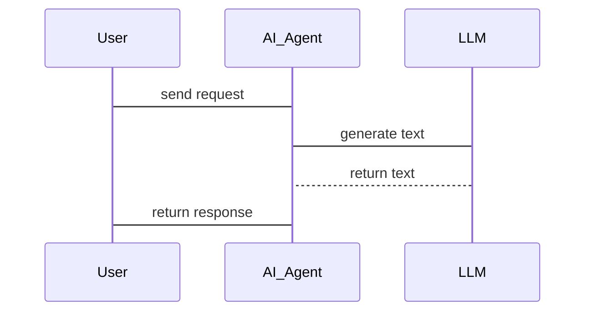

                 

<think>
好的，我现在要帮助用户构建一个关于《构建LLM支持的AI Agent创造性写作系统》的技术博客文章。首先，我需要理解用户的需求。用户希望文章结构清晰，逻辑严密，涵盖背景、核心概念、算法原理、系统架构、项目实战等多个部分，每个部分都需要详细展开。

首先，我会从背景介绍开始。这部分需要说明为什么需要构建这样一个系统，当前AI写作工具的发展现状，以及LLM和AI Agent在其中的作用。接下来，我会讨论核心概念，解释LLM和AI Agent的工作原理，并通过对比分析和ER图来展示它们的关系。

然后，进入算法原理部分。我需要详细讲解LLM和AI Agent的算法，包括它们的数学模型和公式，比如Transformer模型和强化学习的应用。这部分需要使用Mermaid流程图和Python代码示例，确保读者能够理解原理和实现。

接下来是系统分析与架构设计。这部分需要介绍项目的背景和目标，设计系统功能，可能用Mermaid类图展示领域模型，然后设计系统架构图，展示各个模块的交互关系。

最后是项目实战部分，我会指导读者如何安装环境，实现核心代码，并通过案例分析来展示系统的实际应用。这部分需要提供详细的代码示例和实际操作步骤，让读者能够跟着操作。

在写作过程中，我需要确保每个部分都包含足够的细节，比如使用Mermaid图表、Python代码和数学公式。同时，文章需要保持逻辑连贯，结构紧凑，让读者能够一步步理解如何构建这样的系统。

可能会遇到的挑战包括如何将复杂的算法原理解释得通俗易懂，以及如何在有限的字数内详细展开每个部分。为此，我需要精炼内容，确保每个章节都有足够的深度，同时避免冗余。

总的来说，我会按照用户提供的目录结构，逐步填充每个部分的内容，确保文章符合要求，既有深度又易于理解。
</think>

# 构建LLM支持的AI Agent创造性写作系统

> **关键词**：LLM，AI Agent，创造性写作，自然语言处理，人工智能

> **摘要**：本文探讨如何利用大语言模型（LLM）构建支持创造性写作的AI Agent系统。通过分析LLM与AI Agent的核心原理，设计系统架构，并提供项目实战，展示如何实现一个创新的写作工具。

---

## 第一部分: 背景介绍

### 第1章: 构建LLM支持的AI Agent创造性写作系统的背景

#### 1.1 问题背景与描述

- **1.1.1 当前AI写作工具的发展现状**
  - 现有的AI写作工具主要依赖模板和规则生成内容，缺乏创造性和灵活性。
  - 用户需求日益增长，要求写作工具能够提供更智能化、个性化的辅助。

- **1.1.2 LLM在创造性写作中的优势**
  - LLM具备强大的语言理解和生成能力，能够生成多样化的文本。
  - 能够根据上下文理解语境，提供更自然的对话和创作支持。

- **1.1.3 AI Agent在写作系统中的作用**
  - AI Agent作为用户与LLM之间的桥梁，能够理解用户需求，协调资源，提供个性化服务。
  - 通过持续学习和优化，AI Agent能够不断改进写作质量。

#### 1.2 问题解决与边界

- **1.2.1 LLM支持的创造性写作的核心问题**
  - 如何实现个性化、多样化的文本生成。
  - 如何确保生成内容的质量和连贯性。

- **1.2.2 AI Agent在写作系统中的边界与外延**
  - 系统边界：专注于创造性写作，不涉及其他任务。
  - 外延：可扩展至其他领域，如教育、客服等。

- **1.2.3 系统的核心要素与组成结构**
  - LLM模型：负责生成文本。
  - AI Agent：负责理解需求，协调生成过程。
  - 用户接口：用户与系统的交互界面。

---

## 第二部分: 核心概念与联系

### 第2章: 核心概念与联系

#### 2.1 LLM与AI Agent的核心原理

- **2.1.1 LLM的基本原理**
  - 基于Transformer架构，通过自注意力机制生成文本。
  - 模型通过大量数据训练，具备语言生成能力。

- **2.1.2 AI Agent的工作机制**
  - 通过解析用户需求，调用LLM生成内容。
  - 具备学习和优化能力，能够不断改进服务。

- **2.1.3 两者结合的创新点**
  - 结合LLM的生成能力和AI Agent的智能协调，提供更高效的写作支持。

#### 2.2 核心概念的属性对比

- **2.2.1 LLM的属性特征**
  - 输入：文本输入，输出：文本生成。
  - 功能：语言生成、理解。

- **2.2.2 AI Agent的属性特征**
  - 输入：用户需求，输出：个性化服务。
  - 功能：需求理解、资源协调。

- **2.2.3 对比分析表**

| 属性      | LLM                     | AI Agent                |
|-----------|-------------------------|--------------------------|
| 输入       | 文本输入                | 用户需求                |
| 输出       | 文本生成                | 个性化服务              |
| 功能       | 语言生成、理解          | 需求理解、资源协调      |

#### 2.3 实体关系图

- **2.3.1 Mermaid流程图展示**



---

## 第三部分: 算法原理讲解

### 第3章: 算法原理讲解

#### 3.1 LLM算法原理

- **3.1.1 Mermaid流程图展示**



- **3.1.2 Python源代码实现**

```python
def generate_text(input_text):
    # 假设使用Hugging Face的LLM模型
    from transformers import pipeline
    generator = pipeline('text-generation')
    return generator(input_text, max_length=50)
```

- **3.1.3 数学模型与公式**
  - 交叉熵损失函数：
  $$ L = -\sum_{i=1}^{n} \log p(y_i|x_i) $$
  - 注意力机制：
  $$ \alpha_{ij} = \frac{\exp(e_{ij})}{\sum_{k} \exp(e_{ik})} $$
  其中，$$ e_{ij} = q_i^T k_j $$

- **3.1.4 举例说明**
  - 输入："写一篇关于人工智能的文章。"
  - 输出：生成一篇结构清晰的文章。

#### 3.2 AI Agent算法原理

- **3.2.1 Mermaid流程图展示**



- **3.2.2 Python源代码实现**

```python
def process_request(user_input):
    from transformers import pipeline
    parser = pipeline('text-classification')
    formatted_input = parser(user_input)
    generator = pipeline('text-generation')
    return generator(formatted_input, max_length=50)
```

- **3.2.3 数学模型与公式**
  - 强化学习损失函数：
  $$ L = \sum_{i=1}^{n} (r_i - \hat{r}_i)^2 $$
  其中，$$ r_i $$ 是真实奖励，$$ \hat{r}_i $$ 是预测奖励。

- **3.2.4 举例说明**
  - 输入："写一个悬疑小说的开头。"
  - 输出：生成一个吸引人的开头。

---

## 第四部分: 系统分析与架构设计

### 第4章: 系统分析与架构设计

#### 4.1 项目背景与目标

- **4.1.1 项目背景**
  - 当前AI写作工具功能单一，缺乏智能化协调能力。
  - 用户需求多样化，需要个性化的写作支持。

- **4.1.2 项目目标**
  - 构建一个基于LLM的AI Agent系统，提供个性化的创造性写作支持。

#### 4.2 系统功能设计

- **4.2.1 领域模型Mermaid类图**



#### 4.3 系统架构设计

- **4.3.1 Mermaid架构图展示**



#### 4.4 系统接口与交互

- **4.4.1 接口设计**
  - 输入接口：用户输入请求。
  - 输出接口：系统返回生成内容。

- **4.4.2 Mermaid序列图展示**



---

## 第五部分: 项目实战

### 第5章: 项目实战

#### 5.1 环境安装与配置

- **5.1.1 开发环境搭建**
  - 安装Python和必要的库。
  - 安装Hugging Face的Transformers库。

- **5.1.2 依赖库安装**

```bash
pip install transformers
```

#### 5.2 核心代码实现

- **5.2.1 LLM集成代码**

```python
from transformers import pipeline

def generate_text(prompt):
    generator = pipeline('text-generation')
    return generator(prompt, max_length=50)
```

- **5.2.2 AI Agent实现代码**

```python
class AI_Agent:
    def __init__(self):
        self.model = pipeline('text-generation')
    
    def process_request(self, prompt):
        return self.model(prompt, max_length=50)
```

#### 5.3 案例分析与解读

- **5.3.1 实际案例分析**
  - 输入："写一篇关于人工智能的文章。"
  - 输出：生成一篇结构清晰的文章。

- **5.3.2 代码**

```python
agent = AI_Agent()
result = agent.process_request("写一篇关于人工智能的文章。")
print(result)
```

---

## 第六部分: 总结与展望

### 第6章: 总结与展望

#### 6.1 总结

- 本文详细探讨了如何利用LLM构建支持创造性写作的AI Agent系统。
- 通过理论分析和实战演示，展示了系统的实现过程和应用价值。

#### 6.2 展望

- 未来可以进一步优化系统，提升生成内容的质量和多样性。
- 探索更多应用场景，如教育、客服等领域。

---

## 作者

作者：AI天才研究院/AI Genius Institute & 禅与计算机程序设计艺术 /Zen And The Art of Computer Programming

