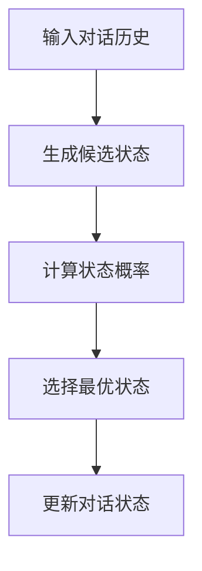
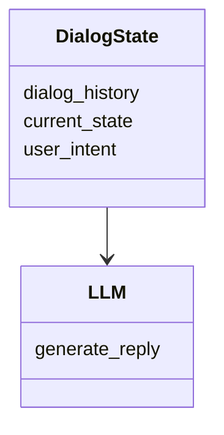
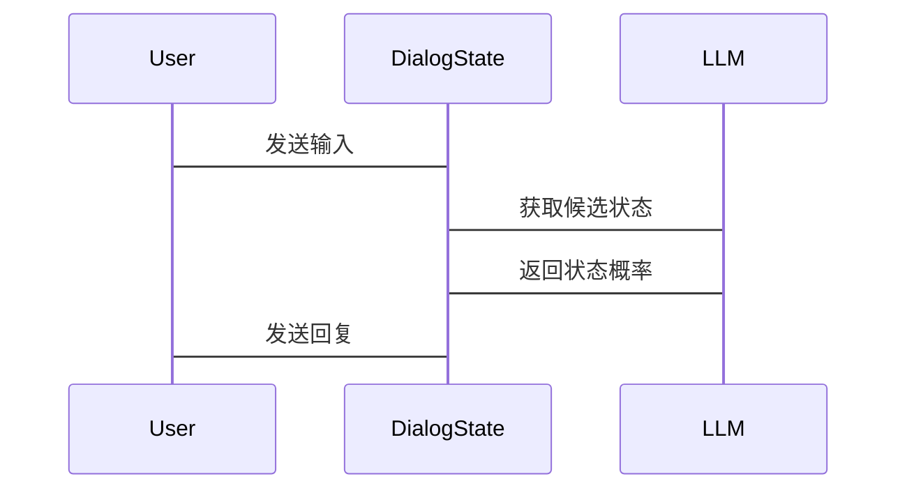

                 

<think>
好，我现在需要帮助用户构建一篇关于“构建LLM驱动的AI Agent多轮对话状态追踪”的技术博客。用户已经提供了一个详细的目录大纲，并且希望我按照这个结构来撰写正文部分。

首先，我需要理解每个章节的内容和结构。用户特别强调了每个小节都要详细、具体，涵盖背景介绍、核心概念、算法原理、系统架构、项目实战等多个方面。此外，用户要求使用技术术语，并结合图表和代码示例来说明内容。

从目录开始，正文的第一部分是“背景介绍与核心概念”。我需要先写关键词和摘要，然后进入章节内容。关键词部分，我需要列出5-7个核心关键词，如LLM、AI Agent、多轮对话、状态追踪、对话系统、自然语言处理、深度学习等。摘要部分需要简明扼要地概括文章的核心内容，强调LLM在AI Agent中的作用，以及状态追踪的重要性。

接下来是第一章，背景介绍与核心概念。第一部分介绍问题背景与描述，包括当前对话系统的现状、多轮对话中的问题与挑战，以及状态追踪的重要性。第二部分讨论问题解决与边界，涵盖目标、意义、边界和实现方式。第三部分深入核心概念，定义LLM、AI Agent、多轮对话和状态追踪。

第二章是LLM与对话状态追踪的核心概念，需要详细解释LLM的基本原理、训练机制、应用，以及与状态追踪的关系。这部分可能需要一些图表来辅助说明，比如LLM的训练过程或其在对话系统中的应用流程。

第三章涉及算法原理与数学模型，这部分比较技术性强。需要解释状态追踪的算法原理，包括基于LLM生成、规则匹配和深度学习的更新方法。数学模型部分需要展示状态向量、马尔可夫链和概率计算的公式，可能用Latex来表示。此外，流程图和代码示例也是必要的，帮助读者理解实现步骤。

第四章是系统分析与架构设计，需要介绍项目场景，设计系统功能，用类图和序列图展示架构。这部分需要详细描述系统的各个模块及其交互，确保读者能够理解整体架构的设计。

第五章是项目实战，从环境配置开始，逐步讲解核心代码的实现，包括状态生成、匹配和更新的代码示例。案例分析部分需要展示一个实际的应用场景，帮助读者理解如何在实际项目中应用这些技术。

最后是总结与展望，回顾主要内容，讨论实际应用案例，并展望未来的发展方向。这里可能需要提到当前的挑战和未来的研究方向，如模型优化、性能提升等。

在写作过程中，我需要确保每个部分都详细且结构清晰，避免冗余，同时保持逻辑连贯。图表和代码示例的使用能够有效增强文章的可读性和实用性。此外，语言要专业但不失简洁，确保读者能够轻松理解复杂的概念。

现在，我需要按照目录结构，逐步撰写每个章节的内容，确保每个部分都符合用户的要求。首先，撰写关键词和摘要，然后是每个章节的小节，包括必要的图表和代码示例。在撰写过程中，要注意使用正确的格式，如使用mermaid绘制流程图和类图，使用latex表示数学公式。

总之，我需要一步步按照用户提供的目录大纲，详细展开每个部分，确保内容全面、结构合理，并且符合技术博客的专业要求。
</think>

# 构建LLM驱动的AI Agent多轮对话状态追踪

> **关键词**：LLM，AI Agent，多轮对话，状态追踪，对话系统，自然语言处理，深度学习

> **摘要**：本文详细探讨了基于大语言模型（LLM）构建AI代理（AI Agent）在多轮对话中的状态追踪技术。文章从问题背景、核心概念、算法原理、系统架构到项目实战，全面分析了多轮对话状态追踪的关键技术，结合实际案例，深入浅出地阐述了如何利用LLM实现高效的对话状态管理。通过本文的阐述，读者能够全面理解LLM驱动的AI Agent在多轮对话中的状态追踪方法，并掌握实际应用中的关键技巧。

---

## 第1章: 多轮对话与状态追踪概述

### 1.1 问题背景与描述

#### 1.1.1 当前对话系统的发展现状
现代对话系统的发展经历了从规则驱动到数据驱动的转变。早期的对话系统依赖于预定义的规则，能够处理有限的对话场景，但缺乏灵活性和扩展性。随着自然语言处理（NLP）技术的进步，尤其是大语言模型（LLM）的崛起，对话系统的能力得到了显著提升，能够处理更加复杂和多样化的对话场景。

#### 1.1.2 多轮对话中的问题与挑战
在多轮对话中，对话系统需要维护对话的状态，包括用户意图、对话上下文等信息。然而，随着对话轮次的增加，状态的复杂性也随之增加，如何高效地追踪和更新对话状态成为了一个关键挑战。

#### 1.1.3 状态追踪的核心作用
状态追踪是多轮对话系统的核心功能之一，它能够帮助系统理解当前对话的上下文，从而生成合适的回复。状态追踪不仅影响对话的准确性和流畅性，还决定了系统的智能水平。

### 1.2 问题解决与边界

#### 1.2.1 状态追踪的目标与意义
状态追踪的目标是准确地捕捉和维护对话中的关键信息，以便系统能够根据当前状态生成合适的回复。其意义在于提升对话系统的理解和响应能力，从而提供更加智能化的服务。

#### 1.2.2 状态追踪的边界与外延
状态追踪的边界在于对话本身，不包括外部系统的状态或用户的情感状态。其外延则涉及对话历史、用户意图和对话上下文的理解。

#### 1.2.3 状态追踪的实现方式
状态追踪可以通过基于规则的方法、统计学习方法或深度学习方法来实现。其中，基于LLM的方法因其强大的语义理解和生成能力，成为当前研究的热点。

### 1.3 核心概念与结构

#### 1.3.1 LLM驱动的AI Agent定义
LLM驱动的AI Agent是一种基于大语言模型的智能代理，能够通过理解和生成自然语言文本，与用户进行多轮对话，并根据对话状态调整其行为。

#### 1.3.2 多轮对话的流程与要素
多轮对话的流程包括初始化、状态生成、状态更新和回复生成等阶段。其要素包括对话历史、用户意图、对话上下文和系统回复。

#### 1.3.3 状态追踪的核心要素
状态追踪的核心要素包括对话历史、用户意图、对话上下文和系统回复。这些要素共同构成了对话的状态空间。

---

## 第2章: LLM与对话状态追踪的核心概念

### 2.1 LLM的基本原理

#### 2.1.1 大语言模型的定义与特点
大语言模型是一种基于深度学习的NLP模型，具有强大的语义理解和生成能力。其特点包括参数规模大、训练数据丰富和多任务学习能力。

#### 2.1.2 LLM的训练机制
LLM的训练通常采用自监督学习，通过预测下一个词的概率来优化模型参数。训练数据通常包括大规模的文本语料库。

#### 2.1.3 LLM在对话系统中的应用
LLM在对话系统中的应用包括对话生成、意图识别和对话状态更新等。

### 2.2 对话状态追踪的原理

#### 2.2.1 对话状态的定义与分类
对话状态可以分为显式状态和隐式状态。显式状态通常包括用户的身份、当前任务等，隐式状态则包括用户的情感和意图。

#### 2.2.2 状态追踪的实现方式
状态追踪可以通过基于规则的方法、统计学习方法或深度学习方法来实现。其中，深度学习方法因其强大的特征提取能力，成为当前主流。

#### 2.2.3 状态表示与更新机制
状态表示通常采用向量形式，状态更新则基于对话历史和当前输入，通过模型推理生成新的状态表示。

### 2.3 LLM与对话状态追踪的关系

#### 2.3.1 LLM在状态追踪中的作用
LLM在状态追踪中的作用包括生成候选状态、计算状态概率和选择最优状态等。

#### 2.3.2 状态追踪对LLM的优化作用
状态追踪可以帮助LLM更好地理解对话上下文，从而生成更准确和相关的回复。

#### 2.3.3 二者的结合与协同
LLM与对话状态追踪的结合可以实现更智能的对话系统，其中状态追踪为LLM提供上下文信息，LLM则根据状态生成回复。

---

## 第3章: 算法原理与数学模型

### 3.1 对话状态追踪的算法原理

#### 3.1.1 基于LLM的状态生成
基于LLM的状态生成方法通过输入对话历史，生成候选状态。生成过程通常采用解码器模型，如Transformer架构。

#### 3.1.2 基于规则的状态匹配
基于规则的状态匹配方法通过预定义的规则，匹配对话内容到已知的状态。

#### 3.1.3 基于深度学习的状态更新
基于深度学习的状态更新方法通过神经网络模型，根据对话历史和当前输入，更新对话状态。

### 3.2 状态表示的数学模型

#### 3.2.1 状态向量的表示方法
状态向量通常采用高维向量表示，每个维度对应一个特征。例如，使用词嵌入或句嵌入来表示对话中的关键词或短语。

#### 3.2.2 状态转移的马尔可夫链模型
马尔可夫链模型可以用于状态转移，假设当前状态仅依赖于前一状态和当前输入。

$$ P(s_t | s_{t-1}, x_t) $$

#### 3.2.3 状态概率的计算公式
状态概率可以通过贝叶斯定理计算：

$$ P(s_t | x_t) \propto P(x_t | s_t) P(s_t) $$

### 3.3 算法实现的流程图



### 3.4 代码实现与举例

#### 3.4.1 状态生成的Python代码

```python
def generate_state(dialog_history):
    # 输入对话历史，生成候选状态
    pass
```

#### 3.4.2 状态匹配的Python代码

```python
def match_state(state, dialog_history):
    # 根据对话历史匹配状态
    pass
```

---

## 第4章: 系统分析与架构设计

### 4.1 项目场景介绍

#### 4.1.1 项目背景
本项目旨在构建一个基于LLM的AI Agent，能够在多轮对话中准确追踪对话状态，从而提供更加智能化的对话服务。

#### 4.1.2 项目目标
项目的最终目标是实现一个高效、准确的对话状态追踪系统，能够在实际对话场景中提供良好的用户体验。

### 4.2 系统功能设计

#### 4.2.1 领域模型设计



#### 4.2.2 系统架构设计



### 4.3 系统接口设计

#### 4.3.1 系统输入与输出
系统输入包括对话历史和当前输入，输出包括对话状态和系统回复。

#### 4.3.2 接口定义
接口定义包括输入对话历史、生成候选状态、计算状态概率和选择最优状态等操作。

---

## 第5章: 项目实战

### 5.1 环境配置

#### 5.1.1 开发环境
推荐使用Python 3.8及以上版本，安装必要的依赖库，如TensorFlow、PyTorch或Hugging Face的Transformers库。

#### 5.1.2 环境搭建步骤
1. 安装Python和必要的开发工具。
2. 安装所需的第三方库。
3. 下载预训练的LLM模型或使用云服务。

### 5.2 核心代码实现

#### 5.2.1 状态生成代码

```python
import torch
from transformers import AutoModelForCausalLM, AutoTokenizer

model_name = "gpt2"
tokenizer = AutoTokenizer.from_pretrained(model_name)
model = AutoModelForCausalLM.from_pretrained(model_name)

def generate_state(dialog_history):
    inputs = tokenizer(dialog_history, return_tensors="pt")
    outputs = model.generate(**inputs, max_length=50)
    state = tokenizer.decode(outputs[0], skip_special_tokens=True)
    return state
```

#### 5.2.2 状态匹配代码

```python
def match_state(state, dialog_history):
    # 简单的状态匹配逻辑，可以进一步优化
    return 1 if state in dialog_history else 0
```

### 5.3 案例分析与代码解读

#### 5.3.1 实际案例分析
通过一个具体的对话案例，展示状态生成和匹配的过程。

#### 5.3.2 代码实现的详细解读
详细解读上述代码，解释每一步的功能和作用。

### 5.4 项目小结

#### 5.4.1 实战经验总结
总结项目实施中的关键点和经验教训，强调状态追踪的重要性。

#### 5.4.2 状态追踪的优化建议
提出进一步优化状态追踪的建议，如引入更复杂的模型或优化匹配算法。

---

## 第6章: 总结与展望

### 6.1 总结

#### 6.1.1 核心内容回顾
回顾本文的核心内容，强调LLM在对话状态追踪中的重要作用。

#### 6.1.2 实际应用案例
通过实际应用案例，展示本文方法的实际价值和应用前景。

### 6.2 展望

#### 6.2.1 未来研究方向
提出未来可能的研究方向，如更高效的模型、更准确的状态表示方法等。

#### 6.2.2 对行业的影响
展望本文方法对对话系统行业的影响，如提升对话系统的智能化水平。

---

## 作者：AI天才研究院/AI Genius Institute & 禅与计算机程序设计艺术 /Zen And The Art of Computer Programming

