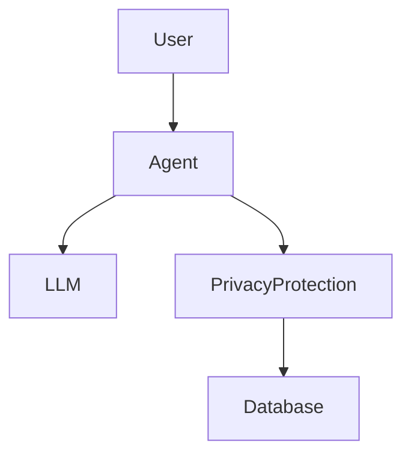
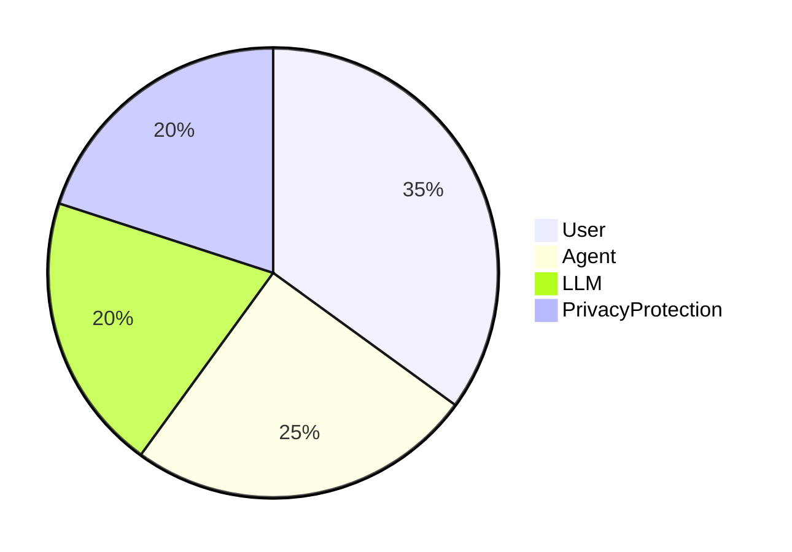
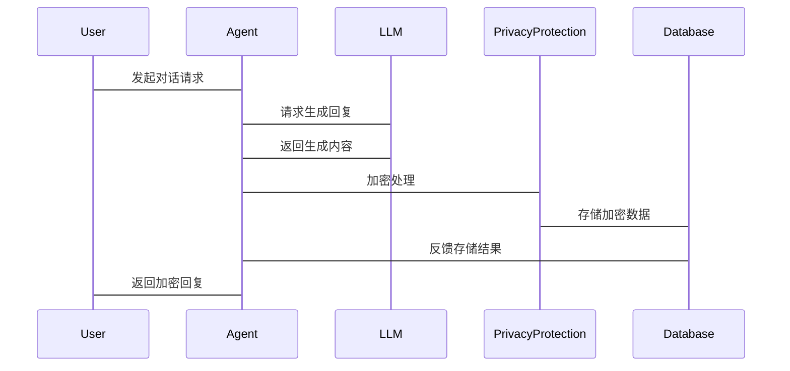

                 

<think>
好的，我需要为《构建LLM驱动的AI Agent隐私保护对话系统》这本书设计一个详细的目录大纲。这本书的核心在于如何利用大语言模型（LLM）构建一个具备隐私保护功能的AI代理对话系统。首先，我应该从背景介绍和核心概念入手，让读者了解为什么需要这样的系统以及其基本组成部分。

接下来，我需要详细讲解LLM和AI Agent的核心原理，包括它们的算法、训练过程以及如何实现隐私保护机制。这部分可能需要涉及一些数学公式和图表，比如Transformer模型的注意力机制和隐私计算的数学模型。

然后，我会分析系统架构设计，包括问题场景分析、功能设计、系统架构图以及接口设计。这部分需要使用Mermaid图来展示系统的结构和交互流程。

接下来是项目实战部分，提供环境安装、核心代码实现和案例分析，让读者能够实际操作和理解系统实现的细节。

最后，我会总结最佳实践，包括小结、注意事项和拓展阅读，帮助读者巩固所学内容，并指导他们如何进一步深入学习。

在组织这些内容时，我需要确保每个章节之间逻辑连贯，从基础概念到实际应用逐步展开。同时，要确保每个部分都涵盖必要的内容，避免遗漏关键点。这样，最终的目录大纲才能既全面又简洁，满足用户的需求。
</think>

# 构建LLM驱动的AI Agent隐私保护对话系统

> 关键词：LLM，AI Agent，隐私保护，对话系统，大语言模型，人工智能，隐私计算

> 摘要：本文系统地介绍了如何构建一个基于大语言模型（LLM）的AI代理隐私保护对话系统。通过详细分析背景、核心概念、算法原理、系统架构、项目实战和最佳实践，本文为读者提供了一个全面的视角，帮助他们理解并掌握构建此类系统的必要技能和方法。文章结合理论与实践，深入探讨了隐私保护机制在AI对话系统中的应用，为相关领域的研究和开发提供了宝贵的参考。

---

# 第1章 构建LLM驱动的AI Agent隐私保护对话系统概述

## 1.1 问题背景与目标

### 1.1.1 当前对话系统的发展现状
- 从传统规则驱动的对话系统到基于深度学习的模型
- 大语言模型（LLM）的崛起及其在对话系统中的应用
- 当前对话系统中存在的隐私保护不足的问题

### 1.1.2 LLM驱动的AI Agent的核心优势
- 自然语言处理能力的提升
- 动态上下文理解和推理能力
- 个性化交互体验

### 1.1.3 隐私保护的重要性与挑战
- 隐私泄露的潜在风险
- 隐私保护的技术挑战
- 隐私与功能平衡的难点

## 1.2 问题描述与解决思路

### 1.2.1 对话系统中的隐私泄露风险
- 用户数据的直接暴露
- 模型训练数据的潜在泄露
- 间接信息泄露的可能性

### 1.2.2 LLM驱动的AI Agent的隐私保护需求
- 数据在传输和处理过程中的安全性
- 对话内容的加密与脱敏
- 用户隐私与系统功能的平衡

### 1.2.3 解决方案的总体思路
- 数据隐私保护机制的设计
- 模型训练与推理的隐私保护
- 对话过程中的实时隐私监控

## 1.3 系统边界与外延

### 1.3.1 系统功能边界
- 用户身份认证与授权
- 对话内容的加密与解密
- 隐私计算的实现

### 1.3.2 系统的外延与扩展性
- 支持多语言与多文化场景
- 动态隐私策略的调整
- 与其他系统的集成能力

## 1.4 核心概念与组成要素

### 1.4.1 LLM的基本概念
- 大语言模型的定义与特点
- LLM在对话系统中的作用
- LLM与传统NLP模型的对比

### 1.4.2 AI Agent的核心要素
- AI Agent的定义与分类
- Agent的智能性与自主性
- Agent与用户交互的双向性

### 1.4.3 隐私保护机制的关键组成部分
- 数据加密技术
- 数据脱敏技术
- 隐私计算模型

---

# 第2章 LLM与AI Agent的核心原理

## 2.1 LLM的基本原理

### 2.1.1 大语言模型的训练过程
- 数据预处理与清洗
- 模型的训练与优化
- 模型的评估与调优

### 2.1.2 模型的参数与训练方法
- Transformer模型的结构特点
- 自注意力机制的实现
- 梯度下降与优化器的选择

### 2.1.3 模型的输出机制
- 生成式输出的原理
- 输出结果的可解释性
- 模型的鲁棒性与稳定性

## 2.2 AI Agent的构成与功能

### 2.2.1 AI Agent的定义与分类
- AI Agent的定义与类型
- Agent的智能性与自主性
- Agent与用户交互的双向性

### 2.2.2 Agent的核心功能模块
- 感知模块：接收用户输入并解析
- 决策模块：基于LLM进行推理
- 执行模块：输出结果并反馈

### 2.2.3 Agent的决策机制
- 基于规则的决策
- 基于模型的决策
- 综合决策的实现

## 2.3 隐私保护的核心机制

### 2.3.1 数据加密的基本原理
- 对称加密与非对称加密的对比
- 数据加密的实现步骤
- 加密算法的选择与优化

### 2.3.2 数据脱敏技术
- 数据脱敏的定义与应用
- 常见的脱敏方法：哈希、随机替换、泛化
- 脱敏技术的优缺点分析

### 2.3.3 隐私计算的数学模型
- 隐私计算的基本原理
- 隐私保护的数学模型
- 隐私计算中的挑战与解决方案

## 2.4 核心概念对比与联系

### 2.4.1 LLM与传统NLP模型的对比
- 模型结构的对比
- 训练方法的对比
- 应用场景的对比

### 2.4.2 AI Agent与传统对话系统的对比
- 功能上的对比
- 技术实现上的对比
- 用户体验上的对比

### 2.4.3 隐私保护机制的对比
- 数据保护方式的对比
- 实现复杂度的对比
- 保护效果的对比

## 2.5 本章小结

---

# 第3章 LLM的算法原理

## 3.1 大语言模型的训练算法

### 3.1.1 基于Transformer的模型结构
- Transformer模型的基本结构
- 自注意力机制的实现
- 前馈网络的实现

### 3.1.2 自注意力机制的数学公式
$$
\text{Attention}(Q, K, V) = \text{softmax}\left(\frac{QK^T}{\sqrt{d_k}}\right)V
$$

### 3.1.3 模型的并行计算
- 并行计算的实现方法
- 并行计算的优势
- 并行计算的优化技巧

## 3.2 模型的损失函数

### 3.2.1 交叉熵损失函数
$$
\text{Loss} = -\sum_{i=1}^{n} y_i \log p(y_i)
$$

### 3.2.2 损失函数的优化
- 损失函数的计算步骤
- 损失函数的优化方法
- 损失函数的调优技巧

## 3.3 模型的优化方法

### 3.3.1 Adam优化器
$$
m_t = \beta_1 m_{t-1} + (1-\beta_1)g_t
$$
$$
v_t = \beta_2 v_{t-1} + (1-\beta_2)g_t^2
$$
$$
\theta_{t} = \theta_{t-1} - \alpha \frac{m_t}{\sqrt{v_t} + \epsilon}
$$

### 3.3.2 学习率的调整
- 学习率的定义与作用
- 学习率的调整方法
- 学习率的优化策略

---

# 第4章 AI Agent的系统分析与架构设计

## 4.1 问题场景介绍

### 4.1.1 用户需求分析
- 用户的基本需求
- 用户的隐私保护需求
- 用户的体验需求

### 4.1.2 系统目标
- 构建一个安全、可靠的对话系统
- 实现用户隐私的全面保护
- 提供高效的交互体验

## 4.2 系统功能设计

### 4.2.1 领域模型（ER实体关系图）


### 4.2.2 系统架构设计


### 4.2.3 系统接口设计
- 用户与Agent的交互接口
- Agent与LLM的通信接口
- 隐私保护模块的接口

## 4.3 系统架构设计

### 4.3.1 系统架构图


### 4.3.2 系统交互流程


## 4.4 系统实现细节

### 4.4.1 模块之间的交互流程
- 用户输入的处理流程
- LLM的推理过程
- 隐私保护的实现步骤

### 4.4.2 数据流的处理
- 数据的输入、处理与输出
- 数据的加密与解密
- 数据的存储与管理

### 4.4.3 系统的扩展性设计
- 系统功能的扩展
- 系统性能的优化
- 系统安全性的增强

## 4.5 本章小结

---

# 第5章 项目实战：构建LLM驱动的AI Agent隐私保护对话系统

## 5.1 环境安装与配置

### 5.1.1 开发环境的选择
- Python的安装与配置
- 开发工具的安装与配置
- 依赖库的安装（如TensorFlow、PyTorch）

### 5.1.2 系统架构的选择
- 选择合适的框架（如Flask、Django）
- 数据库的选择（如MySQL、MongoDB）
- 通信协议的选择（如HTTP、WebSocket）

## 5.2 系统核心实现

### 5.2.1 LLM的实现
```python
class LLM:
    def __init__(self):
        self.model = ...  # 初始化模型

    def generate_response(self, input_text):
        # 生成回复
        pass
```

### 5.2.2 AI Agent的实现
```python
class Agent:
    def __init__(self):
        self.llm = LLM()
        self.privacy_protection = PrivacyProtection()

    def handle_request(self, input_text):
        # 处理请求
        pass
```

### 5.2.3 隐私保护的实现
```python
class PrivacyProtection:
    def __init__(self):
        self.encryptor = Encryptor()

    def protect_data(self, data):
        # 数据保护
        pass
```

## 5.3 案例分析与详细讲解

### 5.3.1 实际案例分析
- 案例背景介绍
- 案例需求分析
- 案例实现过程

### 5.3.2 代码实现与解读
- 核心代码的实现
- 代码的注释与说明
- 代码的优化与改进

## 5.4 本章小结

---

# 第6章 最佳实践与小结

## 6.1 小结

### 6.1.1 核心知识点回顾
- LLM的基本原理
- AI Agent的实现方法
- 隐私保护的实现技巧

### 6.1.2 系统设计的关键点
- 模块化设计的重要性
- 隐私保护机制的选择
- 系统性能的优化

## 6.2 注意事项

### 6.2.1 开发中的常见问题
- 模型训练中的过拟合问题
- 数据隐私保护中的漏洞性问题
- 系统性能的瓶颈问题

### 6.2.2 解决方案与建议
- 采用适当的正则化方法
- 加强数据加密与脱敏技术
- 优化系统架构与性能

## 6.3 拓展阅读

### 6.3.1 推荐的技术书籍与文章
- 大语言模型相关的书籍
- AI Agent相关的技术文章
- 隐私保护领域的研究论文

### 6.3.2 推荐的学习资源
- 在线课程与视频
- 技术博客与社区
- 开源项目与工具

## 6.4 本章小结

---

# 作者

作者：AI天才研究院/AI Genius Institute & 禅与计算机程序设计艺术 /Zen And The Art of Computer Programming

