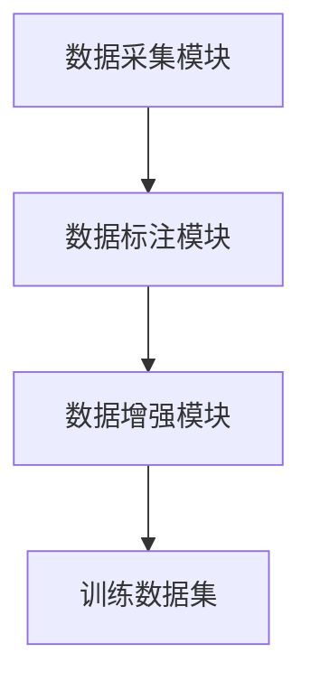
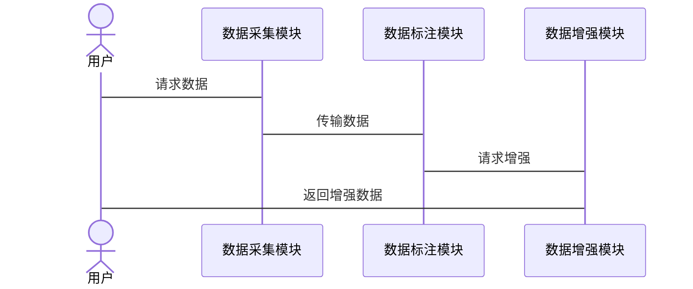

                 


# 构建企业专属训练数据集：确保AI Agent的领域适应性

> 关键词：企业数据集、AI Agent、领域适应性、数据隐私、数据标注、数据增强

> 摘要：构建企业专属的训练数据集是确保AI Agent在特定领域内高效运行的关键。本文从数据集的核心概念出发，详细探讨了数据预处理、标注、增强等技术，并通过系统架构设计和项目实战，展示了如何构建高质量的企业专属数据集，同时确保数据隐私与合规性。

---

# 第一部分: 企业专属训练数据集的背景与重要性

## 第1章: 数据集在AI Agent中的核心作用

### 1.1 问题背景与数据的重要性

#### 1.1.1 AI Agent的定义与应用场景

AI Agent（人工智能代理）是指能够感知环境、执行任务并做出决策的智能系统。在企业环境中，AI Agent可以用于客户支持、自动化操作、数据分析等领域。例如，一个智能客服AI Agent需要能够理解客户的问题并提供准确的解决方案。

#### 1.1.2 数据在AI模型训练中的关键作用

AI Agent的性能高度依赖于训练数据的质量。高质量的数据集能够帮助模型更好地理解特定领域的语言、模式和逻辑。例如，一个训练有素的AI Agent可以通过分析大量客服对话数据，快速理解用户需求并提供准确的回复。

#### 1.1.3 企业专属数据集的必要性

企业专属数据集是指根据企业的具体需求和业务场景定制的数据集。与通用数据集相比，企业专属数据集更贴近企业的实际业务，能够显著提升AI Agent的领域适应性。例如，金融领域的AI Agent需要处理复杂的金融术语和法规，而这些内容通常不会出现在通用数据集中。

---

### 1.2 数据集构建的目标与意义

#### 1.2.1 确保AI Agent的领域适应性

企业专属数据集能够帮助AI Agent更好地适应特定领域的业务需求。例如，医疗领域的AI Agent需要处理病历、药物信息等专业内容，这些内容在通用数据集中通常无法覆盖。

#### 1.2.2 提高模型的泛化能力

通过构建多样化的数据集，可以提高模型的泛化能力。例如，一个AI Agent需要能够处理不同客户的问题，而不仅仅是单一领域的请求。

#### 1.2.3 数据隐私与合规性的重要性

企业在构建数据集时需要确保数据的隐私性和合规性。例如，医疗数据需要符合《通用数据保护条例》（GDPR）等法规要求。

---

# 第二部分: 数据集构建的核心要素

## 第2章: 企业专属训练数据集的核心概念

### 2.1 数据集的基本构成

#### 2.1.1 数据来源的多样性

数据来源多样化的数据集能够提高模型的鲁棒性。例如，数据可以来自文本文件、图像、视频等多种形式。

#### 2.1.2 数据的多样性与代表性

数据集需要涵盖不同场景、不同用户群体和不同业务需求。例如，一个AI Agent需要能够处理不同语言、不同文化和不同业务背景的用户请求。

#### 2.1.3 数据的质量控制

数据质量控制是构建高质量数据集的关键。例如，需要确保数据的完整性和一致性，避免噪声数据的干扰。

### 2.2 数据与AI模型的关系

#### 2.2.1 数据对模型性能的影响

数据的质量和多样性直接影响模型的性能。例如，如果数据集中存在偏差，模型可能会在特定场景下表现不佳。

#### 2.2.2 数据的领域适应性与模型表现

领域适应性是指数据集是否适合特定领域的需求。例如，金融领域的数据集需要包含金融术语和相关业务逻辑。

#### 2.2.3 数据的可解释性与模型的可信赖性

可解释性是指数据能够被人类理解和解释。例如，医疗领域的数据集需要能够清晰地解释每个数据点的含义，以便模型能够被医生和患者信任。

---

## 第3章: 数据集构建的核心要素

### 3.1 数据来源与采集策略

#### 3.1.1 数据来源的多样性

数据来源多样化可以提高模型的泛化能力。例如，数据可以来自内部数据库、公开数据集和外部合作伙伴。

#### 3.1.2 数据采集的标准与流程

数据采集需要遵循一定的标准和流程。例如，需要制定数据采集的规范，确保数据的准确性和一致性。

#### 3.1.3 数据清洗与预处理

数据清洗是构建高质量数据集的关键步骤。例如，需要去除重复数据、填补缺失值和纠正错误数据。

### 3.2 数据标注与注释

#### 3.2.1 数据标注的必要性

数据标注是构建高质量数据集的重要环节。例如，图像数据需要标注目标物体的位置和类别，文本数据需要标注关键词和情感倾向。

#### 3.2.2 数据标注的工具与方法

数据标注工具可以帮助提高标注效率和准确性。例如，使用Label Studio进行文本标注，使用CVAT进行图像标注。

#### 3.2.3 数据标注的质量控制

数据标注的质量控制是确保数据集准确性的关键。例如，需要制定标注规范，定期检查标注结果，并进行抽样验证。

### 3.3 数据增强与扩展

#### 3.3.1 数据增强的基本概念

数据增强是指通过技术手段增加数据的多样性和数量。例如，对图像数据进行旋转、翻转和裁剪，对文本数据进行同义词替换和句式变化。

#### 3.3.2 常见的数据增强方法

常见的数据增强方法包括随机裁剪、翻转、旋转、颜色变换等。例如，对于图像数据，可以使用OpenCV库进行数据增强。

#### 3.3.3 数据增强对模型性能的影响

数据增强可以提高模型的鲁棒性和泛化能力。例如，通过增加数据的多样性，模型可以更好地适应不同的输入情况。

---

# 第三部分: 数据预处理与清洗算法

## 第4章: 数据预处理与清洗算法

### 4.1 数据清洗的必要性

#### 4.1.1 数据清洗的目标与步骤

数据清洗的目标是去除噪声数据，确保数据的准确性和一致性。例如，需要去除重复数据、填补缺失值和纠正错误数据。

#### 4.1.2 常见的数据清洗方法

常见的数据清洗方法包括删除重复数据、填补缺失值、纠正错误数据和标准化数据。例如，对于文本数据，可以使用Python的pandas库进行数据清洗。

#### 4.1.3 数据清洗的工具与技术

数据清洗的工具包括Python的pandas库、SQL数据库和数据可视化工具。例如，可以使用pandas库进行数据清洗，使用Seaborn库进行数据可视化。

### 4.2 数据标准化与归一化

#### 4.2.1 数据标准化的定义与作用

数据标准化是指将数据转换为统一的格式和范围。例如，对于数值数据，可以使用z-score标准化或min-max归一化。

#### 4.2.2 数据归一化的实现方法

数据归一化的实现方法包括z-score标准化和min-max归一化。例如，z-score标准化公式为：$z = \frac{x - \mu}{\sigma}$，其中$\mu$是均值，$\sigma$是标准差。

#### 4.2.3 数据标准化与归一化的选择

选择数据标准化或归一化的关键在于数据的分布和模型的需求。例如，对于正态分布的数据，可以使用z-score标准化；对于均匀分布的数据，可以使用min-max归一化。

---

# 第四部分: 数据标注与注释技术

## 第5章: 数据标注与注释技术

### 5.1 数据标注的基本概念

#### 5.1.1 数据标注的定义与作用

数据标注是指对数据进行标记和注释，以便模型能够理解和处理数据。例如，图像数据需要标注目标物体的位置和类别，文本数据需要标注关键词和情感倾向。

#### 5.1.2 数据标注的工具与方法

数据标注工具包括Label Studio、CVAT和 Amazon Mechanical Turk。例如，Label Studio是一个开源的文本标注工具，支持多种数据格式。

#### 5.1.3 数据标注的质量控制

数据标注的质量控制是确保数据集准确性的关键。例如，需要制定标注规范，定期检查标注结果，并进行抽样验证。

---

# 第五部分: 数据增强与扩展

## 第6章: 数据增强与扩展

### 6.1 数据增强的基本概念

#### 6.1.1 数据增强的定义与作用

数据增强是指通过技术手段增加数据的多样性和数量。例如，对于图像数据，可以进行旋转、翻转和裁剪。

#### 6.1.2 常见的数据增强方法

常见的数据增强方法包括随机裁剪、翻转、旋转、颜色变换等。例如，可以使用OpenCV库进行图像数据增强。

#### 6.1.3 数据增强对模型性能的影响

数据增强可以提高模型的鲁棒性和泛化能力。例如，通过增加数据的多样性，模型可以更好地适应不同的输入情况。

---

# 第六部分: 数据集的系统架构与设计

## 第7章: 数据集的系统架构与设计

### 7.1 问题场景介绍

#### 7.1.1 数据采集与处理的场景

数据采集与处理的场景包括内部数据库、公开数据集和外部合作伙伴。例如，企业可以从客户互动记录中提取数据，用于训练智能客服AI Agent。

#### 7.1.2 数据标注与管理的场景

数据标注与管理的场景包括图像、文本和音频数据。例如，企业可以使用标注工具对图像数据进行标注，生成标注文件。

### 7.2 系统功能设计

#### 7.2.1 数据采集模块

数据采集模块负责从各种数据源中采集数据，并进行初步的清洗和预处理。例如，可以使用Python的requests库从API中获取数据。

#### 7.2.2 数据标注模块

数据标注模块负责对数据进行标注和注释。例如，可以使用Label Studio对文本数据进行标注，生成标签文件。

#### 7.2.3 数据增强模块

数据增强模块负责对数据进行增强和扩展。例如，可以使用OpenCV库对图像数据进行增强，生成更多的训练数据。

### 7.3 系统架构设计

#### 7.3.1 系统架构图

以下是系统架构的Mermaid图：



#### 7.3.2 系统接口设计

系统接口设计包括数据采集接口、数据标注接口和数据增强接口。例如，数据采集接口可以使用RESTful API进行数据传输。

#### 7.3.3 系统交互流程

以下是系统交互流程的Mermaid图：



---

# 第七部分: 项目实战

## 第8章: 项目实战

### 8.1 环境安装与配置

#### 8.1.1 Python环境的安装与配置

需要安装Python 3.8及以上版本，并安装必要的库，例如pandas、numpy、OpenCV和Label Studio。

#### 8.1.2 数据采集工具的安装

需要安装requests库和beautifulsoup4库，用于数据采集。

#### 8.1.3 数据标注工具的安装

需要安装Label Studio和CVAT。

### 8.2 数据采集与预处理

#### 8.2.1 数据采集的实现

以下是数据采集的Python代码示例：

```python
import requests
from bs4 import BeautifulSoup

url = "https://example.com/data"
response = requests.get(url)
soup = BeautifulSoup(response.text, "html.parser")
data = soup.find_all("div", class_="data-item")
# 提取数据并保存到本地文件
```

#### 8.2.2 数据预处理的实现

以下是数据预处理的Python代码示例：

```python
import pandas as pd

# 读取数据文件
data = pd.read_csv("data.csv")
# 删除重复数据
data = data.drop_duplicates()
# 填补缺失值
data = data.fillna(method="ffill")
# 保存处理后的数据
data.to_csv("processed_data.csv", index=False)
```

### 8.3 数据标注与增强

#### 8.3.1 数据标注的实现

以下是使用Label Studio进行数据标注的示例：

```python
# 安装Label Studio
pip install label-studio
# 启动Label Studio
label-studio
```

#### 8.3.2 数据增强的实现

以下是使用OpenCV进行图像数据增强的示例：

```python
import cv2
import numpy as np

# 读取图像
image = cv2.imread("input.jpg")
# 随机裁剪
cropped = cv2.cropy(image, (100, 100, 200, 200))
# 随机翻转
flipped = cv2.flip(cropped, 1)
# 保存增强后的图像
cv2.imwrite("augmented.jpg", flipped)
```

### 8.4 项目小结

通过上述步骤，我们成功构建了一个企业专属的训练数据集，并通过数据预处理、标注和增强，显著提升了AI Agent的领域适应性。未来，我们可以进一步优化数据采集和标注流程，引入更多的数据增强方法，以提高模型的性能和泛化能力。

---

# 第八部分: 最佳实践与总结

## 第9章: 最佳实践与总结

### 9.1 最佳实践

#### 9.1.1 数据隐私与合规性

在构建数据集时，必须遵守相关法律法规，确保数据的隐私性和合规性。例如，医疗数据需要符合《通用数据保护条例》（GDPR）。

#### 9.1.2 数据质量和多样性

数据质量和多样性是构建高质量数据集的关键。例如，需要确保数据的准确性和一致性，同时涵盖不同的场景和用户群体。

#### 9.1.3 数据标注与增强

数据标注和增强是提升模型性能的重要步骤。例如，需要制定标注规范，确保标注的准确性和一致性，并引入多种数据增强方法，以增加数据的多样性和数量。

### 9.2 小结

通过本文的介绍，我们了解了构建企业专属训练数据集的重要性和核心要素。从数据采集、预处理、标注到数据增强，每一步都需要精心设计和实施。只有通过高质量的数据集，才能确保AI Agent在特定领域的高效和准确。

### 9.3 注意事项

#### 9.3.1 数据隐私与安全

在处理敏感数据时，必须确保数据的安全性和隐私性。例如，需要使用加密技术保护数据，并严格控制数据的访问权限。

#### 9.3.2 数据标注的准确性

数据标注的准确性直接影响模型的性能。例如，需要制定详细的标注规范，并进行定期检查和验证。

#### 9.3.3 数据增强的适度性

数据增强需要适度，避免过度增强导致数据失真。例如，可以通过实验和验证，找到最佳的数据增强方法和参数。

### 9.4 未来趋势

#### 9.4.1 自动化数据标注

随着技术的发展，自动化数据标注工具将变得更加智能和高效。例如，可以使用AI模型辅助标注，提高标注的效率和准确性。

#### 9.4.2 数据隐私与安全

数据隐私和安全将越来越受到重视。例如，未来的数据处理将更加注重数据的隐私保护，采用联邦学习等技术，避免数据集中存储。

#### 9.4.3 数据与模型的结合

数据与模型的结合将更加紧密。例如，可以通过数据驱动的方式优化模型结构和参数，进一步提升模型的性能和效果。

---

# 作者

作者：AI天才研究院/AI Genius Institute & 禅与计算机程序设计艺术 /Zen And The Art of Computer Programming

