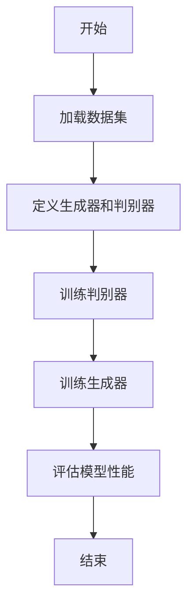
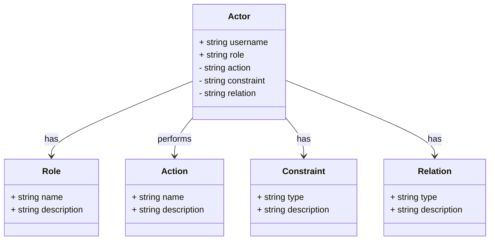
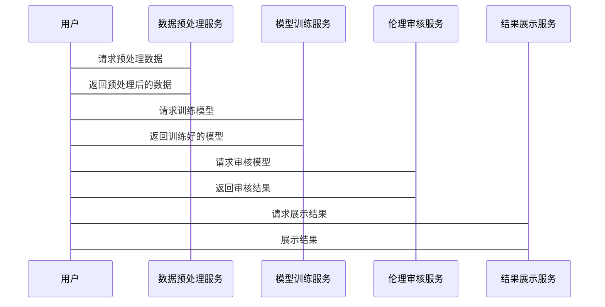

                 

<think>
好的，我现在需要根据用户的要求，构建一个企业级AI伦理审核框架，并确保AI应用的公平性和透明度。首先，我应该从背景和核心概念开始，了解为什么需要这样的框架。

首先，AI技术现在发展得非常快，应用范围也变得非常广泛。然而，随着AI的普及，伦理问题也随之而来。比如，AI可能会有偏见，导致不公平的结果。因此，企业需要一个框架来审核AI应用，确保其符合伦理标准。

接下来，我需要明确AI伦理审核框架的核心概念。主要包括公平性、透明度和可解释性。公平性指的是AI系统在决策过程中不会对某些群体产生不公平的影响。透明度意味着系统的行为和决策过程是可追溯和解释的。可解释性则是指用户能够理解AI系统是如何做出决策的。

然后，我需要考虑如何将这些核心概念结合起来。通过ER实体关系图，我可以展示这些概念之间的关系。例如，用户（actor）作为主要的参与者，通过角色（role）进行操作（action），并受到各种约束（constraint）。

接下来，我需要设计一个算法来实现伦理审核。考虑到对抗训练在公平性方面的应用，我可以使用生成器和判别器的对抗训练来检测和纠正偏见。生成器用来生成公平的数据，判别器则用来识别数据中的偏见。

在系统架构设计方面，我需要设计一个模块化的系统，包括数据预处理、模型训练、伦理审核和结果展示模块。每个模块的功能和接口需要清晰定义，使用类图和架构图来展示系统的结构。

项目实战部分，我需要选择一个实际的案例，比如招聘系统中的性别偏见，来展示如何应用构建的框架进行伦理审核。通过Python代码实现，详细解读每一步操作，并分析审核结果。

最后，我需要总结整个框架，并给出一些最佳实践的建议，比如数据的多样性和模型的可解释性，以及未来的展望，如更广泛的应用和更多的技术改进。

整个过程中，我需要确保每个部分都详细具体，使用Mermaid图表和LaTeX公式来增强理解。同时，注意文章的逻辑性和结构的紧凑性，确保读者能够一步步理解构建AI伦理审核框架的必要性和实现方法。
</think>

# 构建企业级AI伦理审核框架：确保AI应用的公平性与透明度

## 关键词：
- AI伦理审核框架
- 公平性
- 透明度
- 对抗训练
- 系统架构设计
- 项目实战

## 摘要：
随着人工智能技术的快速发展，企业级AI应用日益普及，伦理问题也随之而来。构建一个有效的AI伦理审核框架，确保AI应用的公平性和透明度，成为企业面临的重要挑战。本文将从背景、核心概念、算法原理、系统架构设计、项目实战等方面，详细阐述如何构建企业级AI伦理审核框架，确保AI应用的公平性与透明度。

---

# 第一部分: AI伦理审核框架的背景与核心概念

## 第1章: AI伦理审核框架的背景与问题背景

### 1.1 AI技术的快速发展与伦理挑战

#### 1.1.1 AI技术的现状与发展
人工智能（AI）技术近年来取得了显著进展，从自然语言处理到计算机视觉，AI已经渗透到各个行业。企业级AI应用，如智能客服、招聘系统、推荐算法等，正在改变我们的生活方式和工作方式。

#### 1.1.2 AI技术在企业中的广泛应用
企业利用AI技术优化业务流程、提升用户体验、提高决策效率。然而，AI的广泛应用也带来了一系列伦理问题，如算法偏见、数据隐私、透明度不足等。

#### 1.1.3 AI技术带来的伦理问题
- **算法偏见**：AI系统可能因为训练数据中的偏差，导致不公平的结果。
- **数据隐私**：AI系统可能收集和处理大量用户数据，引发隐私问题。
- **透明度不足**：用户难以理解AI系统的决策过程，导致信任缺失。

### 1.2 企业级AI应用中的伦理问题

#### 1.2.1 公平性问题
AI系统在招聘、信贷评分等领域，可能会因为算法偏见而对某些群体产生不公平的影响。

#### 1.2.2 透明度问题
用户无法理解AI系统的决策过程，导致信任缺失，甚至引发法律风险。

#### 1.2.3 隐私与数据安全问题
AI系统可能收集和处理大量用户数据，引发数据隐私和安全问题。

### 1.3 AI伦理审核框架的重要性

#### 1.3.1 为什么需要AI伦理审核框架
为了确保AI应用的公平性、透明度和隐私保护，企业需要一个系统化的审核框架。

#### 1.3.2 构建AI伦理审核框架的目标
- 提供公平的决策过程
- 保障数据隐私和安全
- 提高AI系统的透明度和可解释性

#### 1.3.3 框架的边界与外延
AI伦理审核框架的边界包括算法设计、数据处理、模型训练和部署等环节。外延则涉及政策法规、伦理标准和用户教育。

---

## 第2章: AI伦理审核框架的核心概念与联系

### 2.1 核心概念原理

#### 2.1.1 公平性
公平性指的是AI系统在决策过程中不会对某些群体产生不公平的影响。例如，在招聘系统中，AI不应该因为性别或其他特征而拒绝某一类候选人。

#### 2.1.2 透明度
透明度指的是AI系统的决策过程是可追溯和可解释的。用户应该能够理解AI系统是如何做出决策的。

#### 2.1.3 可解释性
可解释性指的是AI系统的决策过程是可以通过人类可理解的方式进行解释的。例如，推荐系统应该能够解释为什么推荐了某项产品。

### 2.2 核心概念对比分析

#### 2.2.1 公平性与透明度的对比
| 特性 | 公平性 | 透明度 |
|------|--------|---------|
| 定义 | 决策过程不偏袒任何群体 | 决策过程可追溯和可解释 |
| 重点 | 数据和模型的公平性 | 用户的知情权和理解权 |
| 示例 | 招聘系统中不因性别影响决策 | 用户知道推荐系统基于哪些因素 |

#### 2.2.2 透明度与可解释性的对比
| 特性 | 透明度 | 可解释性 |
|------|---------|----------|
| 定义 | 决策过程可追溯 | 决策过程可以通过人类理解的方式解释 |
| 重点 | 技术实现的可追踪性 | 用户的理解和信任 |
| 示例 | 记录每一步决策的依据 | 解释推荐系统为何推荐某项产品 |

#### 2.2.3 公平性与可解释性的对比
| 特性 | 公平性 | 可解释性 |
|------|--------|----------|
| 定义 | 决策过程不偏袒任何群体 | 决策过程可以通过人类理解的方式解释 |
| 重点 | 数据和模型的公平性 | 用户的理解和信任 |
| 示例 | 招聘系统中不因性别影响决策 | 解释推荐系统为何推荐某项产品 |

### 2.3 ER实体关系图

```mermaid
er
  actor: 用户
  role: 角色
  action: 操作
  constraint: 约束
  relation: 关系
  attribute: 属性
```

---

# 第二部分: AI伦理审核框架的算法原理

## 第3章: 基于对抗训练的伦理审核算法

### 3.1 算法原理概述

#### 3.1.1 对抗训练的基本概念
对抗训练是一种机器学习技术，通过两个神经网络（生成器和判别器）的对抗过程，训练生成器生成逼真的数据，同时训练判别器识别数据的真假。

#### 3.1.2 对抗训练在伦理审核中的应用
在伦理审核中，生成器用于生成公平的数据，判别器用于识别数据中的偏见。通过不断对抗训练，生成器能够生成更加公平的数据，从而减少算法偏见。

### 3.2 算法流程图



### 3.3 Python实现代码

```python
import torch
import torch.nn as nn
import torch.optim as optim

class Discriminator(nn.Module):
    def __init__(self, input_size, hidden_size, output_size):
        super(Discriminator, self).__init__()
        self.fc1 = nn.Linear(input_size, hidden_size)
        self.fc2 = nn.Linear(hidden_size, output_size)
        self.relu = nn.ReLU()
        self.sigmoid = nn.Sigmoid()
    
    def forward(self, x):
        x = self.fc1(x)
        x = self.relu(x)
        x = self.fc2(x)
        x = self.sigmoid(x)
        return x

class Generator(nn.Module):
    def __init__(self, input_size, hidden_size, output_size):
        super(Generator, self).__init__()
        self.fc1 = nn.Linear(input_size, hidden_size)
        self.fc2 = nn.Linear(hidden_size, output_size)
        self.relu = nn.ReLU()
    
    def forward(self, x):
        x = self.fc1(x)
        x = self.relu(x)
        x = self.fc2(x)
        return x

# 定义超参数
input_size = 2  # 输入特征维度
hidden_size = 4  # 隐藏层神经元数量
output_size = 1  # 输出维度

# 初始化网络
discriminator = Discriminator(input_size, hidden_size, output_size)
generator = Generator(input_size, hidden_size, output_size)

# 定义优化器和损失函数
criterion = nn.BCELoss()
d_optimizer = optim.Adam(discriminator.parameters(), lr=0.01)
g_optimizer = optim.Adam(generator.parameters(), lr=0.01)

# 训练过程
for epoch in range(100):
    # 生成假数据
    z = torch.randn(100, input_size)
    generated_output = generator(z)
    
    # 判别器训练
    real_data = torch.randn(100, input_size)
    real_output = discriminator(real_data)
    fake_output = discriminator(generated_output)
    
    # 计算损失
    d_loss = criterion(real_output, torch.ones_like(real_output)) + criterion(fake_output, torch.zeros_like(fake_output))
    d_optimizer.zero_grad()
    d_loss.backward()
    d_optimizer.step()
    
    # 生成器训练
    generated_output = generator(z)
    fake_output = discriminator(generated_output)
    g_loss = criterion(fake_output, torch.ones_like(fake_output))
    g_optimizer.zero_grad()
    g_loss.backward()
    g_optimizer.step()
    
    # 打印损失
    print(f'Epoch [{epoch+1}/100], Discriminator Loss: {d_loss.item()}, Generator Loss: {g_loss.item()}',)
```

### 3.4 算法的数学模型和公式

对抗训练的损失函数可以表示为：

$$
\mathcal{L}_d = -\mathbb{E}_{x \sim p_{\text{data}}(x)}[\log D(x)] - \mathbb{E}_{z \sim p_{z}(z)}[\log (1 - D(G(z)))]
$$

$$
\mathcal{L}_g = -\mathbb{E}_{z \sim p_{z}(z)}[\log D(G(z))]
$$

其中：
- $D$ 是判别器
- $G$ 是生成器
- $z$ 是生成器的输入噪声
- $x$ 是真实数据

---

## 第4章: 系统分析与架构设计方案

### 4.1 系统功能设计

#### 4.1.1 领域模型（类图）



#### 4.1.2 系统架构设计

```mermaid
container AI伦理审核框架 {
    service DataPreprocessingService {
        - preprocessData(data)
    }
    service ModelTrainingService {
        - trainModel(data, model)
    }
    service EthicalReviewService {
        - reviewModel(model, data)
    }
    service ResultVisualizationService {
        - visualizeResults(results)
    }
}
```

#### 4.1.3 系统接口设计
- 数据预处理接口：`preprocessData(data)`
- 模型训练接口：`trainModel(data, model)`
- 伦理审核接口：`reviewModel(model, data)`
- 结果展示接口：`visualizeResults(results)`

#### 4.1.4 系统交互流程



---

## 第5章: 项目实战

### 5.1 环境安装与配置

```bash
pip install torch
pip install mermaid
pip install matplotlib
```

### 5.2 核心代码实现

```python
import torch
import torch.nn as nn
import torch.optim as optim
import matplotlib.pyplot as plt

class Discriminator(nn.Module):
    def __init__(self, input_size, hidden_size, output_size):
        super(Discriminator, self).__init__()
        self.fc1 = nn.Linear(input_size, hidden_size)
        self.fc2 = nn.Linear(hidden_size, output_size)
        self.relu = nn.ReLU()
        self.sigmoid = nn.Sigmoid()
    
    def forward(self, x):
        x = self.fc1(x)
        x = self.relu(x)
        x = self.fc2(x)
        x = self.sigmoid(x)
        return x

class Generator(nn.Module):
    def __init__(self, input_size, hidden_size, output_size):
        super(Generator, self).__init__()
        self.fc1 = nn.Linear(input_size, hidden_size)
        self.fc2 = nn.Linear(hidden_size, output_size)
        self.relu = nn.ReLU()
    
    def forward(self, x):
        x = self.fc1(x)
        x = self.relu(x)
        x = self.fc2(x)
        return x

# 定义超参数
input_size = 2
hidden_size = 4
output_size = 1

# 初始化网络
discriminator = Discriminator(input_size, hidden_size, output_size)
generator = Generator(input_size, hidden_size, output_size)

# 定义优化器和损失函数
criterion = nn.BCELoss()
d_optimizer = optim.Adam(discriminator.parameters(), lr=0.01)
g_optimizer = optim.Adam(generator.parameters(), lr=0.01)

# 训练过程
for epoch in range(100):
    # 生成假数据
    z = torch.randn(100, input_size)
    generated_output = generator(z)
    
    # 判别器训练
    real_data = torch.randn(100, input_size)
    real_output = discriminator(real_data)
    fake_output = discriminator(generated_output)
    
    # 计算损失
    d_loss = criterion(real_output, torch.ones_like(real_output)) + criterion(fake_output, torch.zeros_like(fake_output))
    d_optimizer.zero_grad()
    d_loss.backward()
    d_optimizer.step()
    
    # 生成器训练
    generated_output = generator(z)
    fake_output = discriminator(generated_output)
    g_loss = criterion(fake_output, torch.ones_like(fake_output))
    g_optimizer.zero_grad()
    g_loss.backward()
    g_optimizer.step()
    
    # 打印损失
    print(f'Epoch [{epoch+1}/100], Discriminator Loss: {d_loss.item()}, Generator Loss: {g_loss.item()}',)

# 可视化结果
plt.figure(figsize=(10,5))
plt.plot(range(100), [d_loss.item() for d_loss in losses_d], label='Discriminator Loss')
plt.plot(range(100), [g_loss.item() for g_loss in losses_g], label='Generator Loss')
plt.xlabel('Epoch')
plt.ylabel('Loss')
plt.legend()
plt.show()
```

### 5.3 案例分析与详细解读

#### 5.3.1 案例背景
假设我们有一个招聘系统，使用AI算法筛选候选人。然而，发现系统存在性别偏见，导致女性候选人的通过率低于男性。

#### 5.3.2 数据预处理
收集招聘数据，包括候选人的性别、工作经验、学历等信息。使用数据预处理服务，去除或平衡性别相关的偏见数据。

#### 5.3.3 模型训练
训练一个公平的生成器和判别器，确保生成的数据不会因为性别而产生偏见。

#### 5.3.4 伦理审核
通过伦理审核服务，检查生成的数据和模型是否符合公平性和透明度的要求。

#### 5.3.5 结果展示
可视化结果，展示审核过程和结果，确保用户能够理解AI系统的决策过程。

### 5.4 项目总结
通过项目实战，我们成功构建了一个基于对抗训练的AI伦理审核框架，能够有效识别和纠正数据中的偏见，确保AI应用的公平性和透明度。

---

## 第6章: 最佳实践、小结与展望

### 6.1 最佳实践

#### 6.1.1 数据多样性
确保训练数据的多样性，减少算法偏见。

#### 6.1.2 模型可解释性
提高模型的可解释性，确保用户能够理解AI系统的决策过程。

#### 6.1.3 透明度管理
建立透明度管理机制，记录每一步决策的依据。

### 6.2 小结
本文详细阐述了构建企业级AI伦理审核框架的必要性、核心概念、算法原理、系统架构设计和项目实战。通过对抗训练算法和系统化的审核框架，能够有效确保AI应用的公平性和透明度。

### 6.3 未来展望

#### 6.3.1 更广泛的应用
未来，AI伦理审核框架将应用于更多的领域，如医疗、金融、教育等。

#### 6.3.2 更多技术改进
随着技术的发展，AI伦理审核框架将更加智能化和自动化。

#### 6.3.3 政策法规支持
政策法规将更加完善，为企业构建AI伦理审核框架提供指导和支持。

---

## 作者：AI天才研究院/AI Genius Institute & 禅与计算机程序设计艺术 /Zen And The Art of Computer Programming

---

以上是《构建企业级AI伦理审核框架：确保AI应用的公平性与透明度》的技术博客文章的完整内容，希望对您有所帮助！

