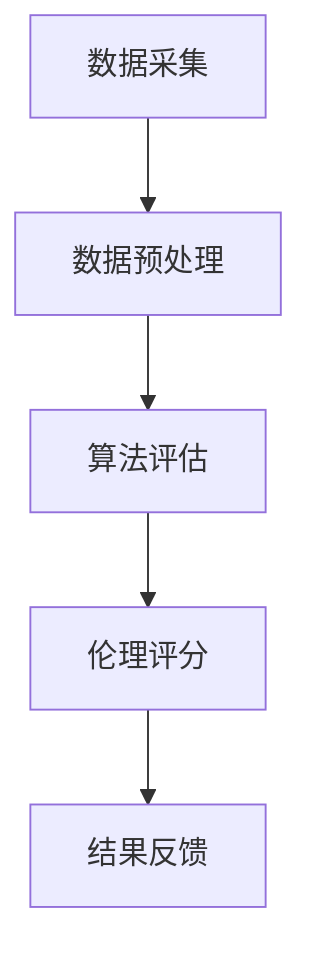
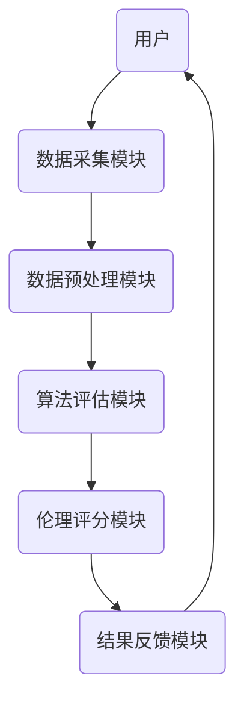

                 


# 构建企业级AI伦理顾问：确保AI应用的道德合规

> 关键词：AI伦理顾问，企业级AI，道德合规，算法公平性，数据隐私，AI决策透明性

> 摘要：随着人工智能技术的快速发展，企业在应用AI技术时面临越来越多的伦理和合规问题。本文详细探讨如何构建一个企业级AI伦理顾问系统，确保AI应用的道德合规。通过分析AI伦理顾问的核心概念、算法原理、系统架构以及项目实战，本文为读者提供了一套完整的解决方案，帮助企业在AI应用中实现伦理与合规的双重保障。

---

## 第一部分：AI伦理顾问的背景与核心概念

### 第1章：AI伦理顾问的背景与问题背景

#### 1.1 AI技术的快速发展与挑战
人工智能（AI）技术的快速发展为企业带来了巨大的机遇，但也伴随着诸多挑战。AI技术的应用范围不断扩大，从简单的数据处理到复杂的决策支持，AI系统逐渐成为企业运营的核心工具。然而，随着AI技术的深入应用，一系列伦理和合规问题也随之浮现。

#### 1.2 企业级AI应用中的伦理问题
在企业级AI应用中，伦理问题主要体现在以下几个方面：
1. **数据隐私与安全**：AI系统通常需要处理大量的用户数据，如何确保这些数据的隐私性和安全性是一个重大挑战。
2. **算法公平性与偏见**：AI算法可能会因为训练数据的偏差而产生不公平的决策，这可能导致企业在市场中失去信任。
3. **决策透明性与可解释性**：AI系统做出的决策往往缺乏透明性，这使得企业在解释这些决策时面临困难。
4. **企业责任与法律合规**：企业需要遵守相关法律法规，确保AI应用的合规性，这涉及到数据使用、算法评估等多个方面。

#### 1.3 为什么需要AI伦理顾问
AI伦理顾问的出现是为了帮助企业解决上述伦理和合规问题。通过自动化和智能化的方式，AI伦理顾问能够实时监控和评估AI系统的伦理风险，为企业提供及时的建议和解决方案。

---

### 第2章：AI伦理顾问的核心概念与定义

#### 2.1 AI伦理顾问的定义与核心要素
AI伦理顾问是一种智能化的工具，旨在帮助企业评估和管理AI应用中的伦理风险。其核心要素包括：
1. **数据隐私保护**：确保AI系统处理的数据符合隐私保护要求。
2. **算法公平性评估**：检测和纠正算法中的偏见和不公平现象。
3. **决策透明性**：提供可解释的决策过程，增强用户对AI系统的信任。
4. **伦理评分与建议**：基于评估结果生成伦理评分，并提供改进建议。

#### 2.2 AI伦理顾问与传统伦理审查的对比
传统的伦理审查主要依赖人工评估，效率低且成本高。而AI伦理顾问通过自动化和智能化的方式，能够快速评估和解决伦理问题，显著提高了效率和准确性。

#### 2.3 AI伦理顾问的系统架构与核心功能
AI伦理顾问的系统架构主要包括以下几个模块：
1. **数据采集与处理模块**：负责收集和处理相关数据。
2. **算法分析与评估模块**：对AI算法进行评估，检测潜在的伦理风险。
3. **伦理评分与建议模块**：基于评估结果生成伦理评分和改进建议。
4. **交互与反馈模块**：与用户进行交互，实时反馈评估结果。

---

## 第二部分：AI伦理顾问的核心概念与联系

### 第3章：AI伦理顾问的核心概念与联系

#### 3.1 AI伦理顾问的核心概念原理
1. **数据隐私保护的原理**：通过加密技术和访问控制确保数据的安全性和隐私性。
2. **算法公平性评估的原理**：基于统计方法检测算法中的偏见，并提出修正建议。
3. **决策透明性的实现原理**：通过日志记录和可解释性报告增强决策的透明性。

#### 3.2 核心概念属性特征对比表
| 核心概念 | 属性 | 特征 |
|----------|------|------|
| 数据隐私 | 保护范围 | 用户数据、模型参数 |
| 算法公平性 | 评估指标 | 偏见检测、公平性评分 |
| 决策透明性 | 实现方式 | 日志记录、可解释性报告 |

#### 3.3 ER实体关系图
```mermaid
er
    actor: 用户
    system: AI伦理顾问系统
    database: 伦理评估数据库

    actor --> system: 提交评估请求
    system --> database: 查询伦理评估数据
    system --> actor: 返回评估结果
```

---

## 第三部分：AI伦理顾问的算法原理

### 第4章：AI伦理顾问的算法原理

#### 4.1 伦理评分模型
伦理评分模型是AI伦理顾问的核心算法之一。它基于以下几个步骤进行评估：
1. 数据采集：收集AI系统的输入和输出数据。
2. 数据预处理：对数据进行清洗和标准化处理。
3. 算法评估：检测算法中的偏见和不公平现象。
4. 伦理评分：基于评估结果生成伦理评分。

#### 4.2 伦理评分模型的数学公式
伦理评分模型的计算公式如下：
$$
\text{伦理评分} = \frac{1}{N} \sum_{i=1}^{N} \text{伦理风险}(x_i)
$$
其中，$N$ 是数据样本的数量，$\text{伦理风险}(x_i)$ 是每个样本的伦理风险评分。

#### 4.3 伦理评分模型的流程图


---

## 第四部分：AI伦理顾问的系统架构设计

### 第5章：AI伦理顾问的系统架构设计

#### 5.1 系统功能设计
AI伦理顾问的系统功能设计主要包括以下几个方面：
1. 数据采集与处理：收集和处理AI系统的输入和输出数据。
2. 算法分析与评估：检测算法中的偏见和不公平现象。
3. 伦理评分与建议：基于评估结果生成伦理评分和改进建议。
4. 交互与反馈：与用户进行交互，实时反馈评估结果。

#### 5.2 系统架构图


---

## 第五部分：AI伦理顾问的项目实战

### 第6章：AI伦理顾问的项目实战

#### 6.1 环境安装
为了运行AI伦理顾问系统，首先需要安装以下环境：
1. Python 3.8及以上版本
2. 安装必要的Python库，如`numpy`, `pandas`, `scikit-learn`

#### 6.2 核心实现代码
以下是AI伦理顾问系统的核心实现代码：
```python
import numpy as np
import pandas as pd
from sklearn.metrics import accuracy_score

def calculate_ethical_risk(y_true, y_pred):
    # 计算伦理风险评分
    risk = np.mean(np.where(y_true != y_pred, 1, 0))
    return risk

def generate_ethical_score(y_true, y_pred):
    # 生成伦理评分
    risk = calculate_ethical_risk(y_true, y_pred)
    score = 100 - (risk * 100)
    return score

# 示例数据
y_true = np.array([0, 1, 0, 1, 0, 1])
y_pred = np.array([0, 1, 1, 1, 0, 1])

# 计算伦理评分
score = generate_ethical_score(y_true, y_pred)
print(f"伦理评分: {score}%")
```

#### 6.3 案例分析
以下是一个实际案例分析：
假设某企业使用AI算法进行招聘筛选，AI系统可能会因为数据偏差而对某些群体产生偏见。通过AI伦理顾问系统，可以检测到这种偏见，并提出改进建议，例如增加更多样化的数据或调整算法参数。

---

## 第六部分：AI伦理顾问的最佳实践

### 第7章：AI伦理顾问的最佳实践

#### 7.1 最佳实践
1. **定期评估**：定期对AI系统进行伦理评估，确保其合规性。
2. **数据多样性**：确保训练数据的多样性和代表性，减少偏见。
3. **透明性**：提供可解释的决策过程，增强用户信任。

#### 7.2 小结
构建企业级AI伦理顾问是一项复杂但重要的任务。通过自动化和智能化的方式，AI伦理顾问能够帮助企业解决伦理和合规问题，确保AI应用的道德合规。

#### 7.3 注意事项
1. 数据隐私保护是重中之重，必须严格遵守相关法律法规。
2. 算法评估时，要确保评估方法的科学性和准确性。
3. 系统设计时，要充分考虑可扩展性和可维护性。

#### 7.4 拓展阅读
1. 《人工智能：一种现代方法》
2. 《机器学习实战》
3. 《数据隐私与安全》

---

## 作者简介

作者：AI天才研究院/AI Genius Institute & 禅与计算机程序设计艺术/Zen And The Art of Computer Programming

---

以上是《构建企业级AI伦理顾问：确保AI应用的道德合规》的完整目录大纲和文章内容。

