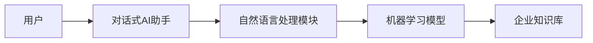
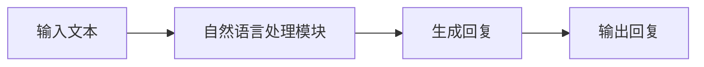
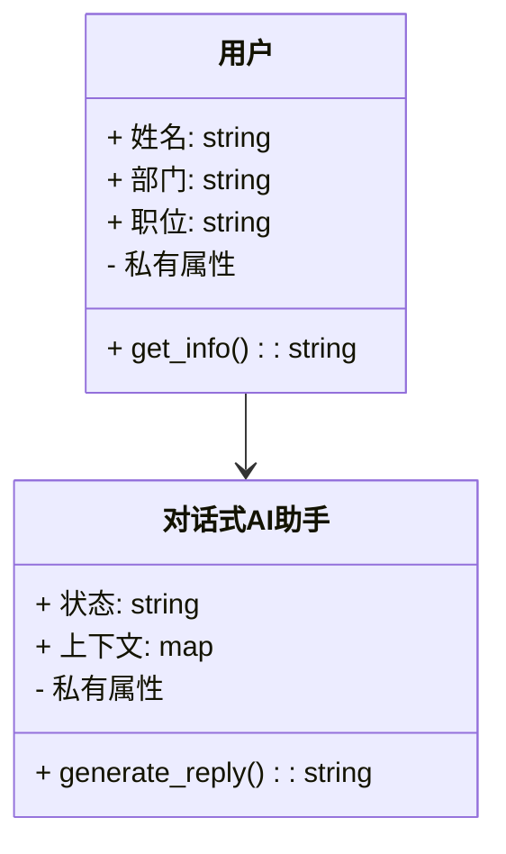
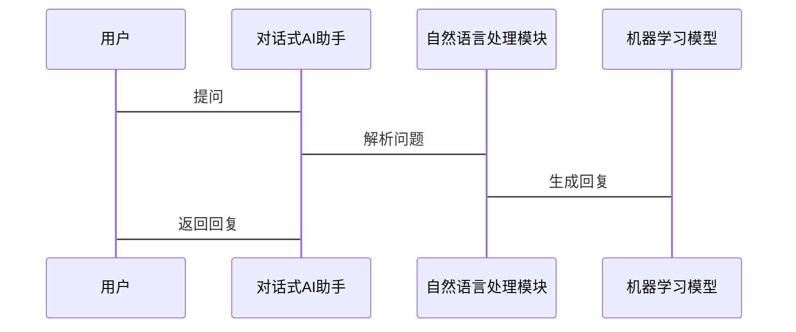

                 

<think>
好的，我现在需要帮用户撰写一篇关于《构建企业级对话式AI助手：提升员工生产力》的技术博客文章。用户已经提供了详细的目录大纲和一些内容，我需要按照这个大纲逐步完成每部分内容，并确保文章逻辑清晰、结构紧凑，语言专业且易懂。

首先，我会从文章标题开始，然后列出关键词和摘要，这部分相对简短，但需要概括文章的核心内容。接下来是正文部分，分为七个章节，每个章节都有详细的小节。

在撰写过程中，我需要确保每个章节的内容都涵盖必要的细节，比如背景介绍需要包括问题背景、问题描述、解决方案等。核心概念部分要详细解释对话式AI的基本原理，并用对比表格和实体关系图来辅助说明。算法原理部分需要用流程图和代码示例来展示，同时提供数学公式的详细推导。

系统架构设计部分，我会使用类图、架构图和序列图来展示系统的各个部分及其交互。项目实战部分需要提供安装步骤、代码实现和案例分析，确保读者能够实际操作。最后，在最佳实践部分总结经验和提供进一步的学习资源。

我需要特别注意使用Mermaid图表和Latex公式，确保它们正确嵌入并清晰展示。同时，文章的整体字数需要控制在10000到12000字之间，确保内容详尽但不过于冗长。

现在，我会按照目录大纲一步步填充内容，确保每个部分都符合用户的要求，并且逻辑连贯，结构合理。同时，我会注意语言的专业性和易懂性，帮助读者更好地理解和应用这些技术。
</think>

# 构建企业级对话式AI助手：提升员工生产力

> 关键词：对话式AI助手、企业级AI、自然语言处理、机器学习模型、系统架构设计

> 摘要：本文详细探讨了构建企业级对话式AI助手的全过程，从核心概念到算法原理，再到系统架构设计和项目实战，结合实际案例分析，为技术开发者和企业管理者提供了全面的指导和实用建议，旨在提升企业员工生产力。

---

## 第一章：背景介绍

### 1.1 问题背景与问题描述

#### 1.1.1 问题背景
- **企业内部效率提升的痛点**：现代企业面临着日益复杂的信息处理和决策需求，员工在日常工作中常常需要处理大量信息，导致效率低下。
- **对话式AI的潜在价值**：对话式AI助手能够通过自然语言处理技术，帮助员工快速获取信息、简化操作流程，从而提升工作效率。

#### 1.1.2 问题描述
- **传统协作工具的局限性**：现有的协作工具功能单一，难以满足多样化的需求。
- **对话式AI的核心问题**：如何构建一个能够理解并执行复杂任务的AI助手。

### 1.2 问题解决与边界

#### 1.2.1 对话式AI助手的解决方案
- **自然语言处理技术**：通过NLP技术实现对用户意图的理解。
- **机器学习模型的应用**：利用预训练语言模型进行对话生成和任务执行。

#### 1.2.2 边界与外延
- **功能边界**：AI助手主要负责信息查询、任务执行和流程自动化。
- **外延应用**：未来可能扩展到更复杂的决策支持和创造性任务。

### 1.3 概念结构与核心要素

#### 1.3.1 核心概念的定义
- **对话式AI助手**：通过自然语言交互帮助用户完成任务的智能系统。
- **企业级AI助手**：专门为企业的特定需求设计的AI助手。

#### 1.3.2 核心要素组成
- **自然语言处理模块**：负责理解和生成自然语言。
- **机器学习模型**：用于对话生成和任务推理。
- **企业知识库**：提供企业内部的知识支持。

---

## 第二章：核心概念与联系

### 2.1 对话式AI的基本原理

#### 2.1.1 自然语言处理(NLP)基础
- **语言模型的定义**：语言模型用于预测下一个词的概率分布。
- **NLP在对话式AI中的应用**：包括意图识别、实体提取和对话生成。

#### 2.1.2 机器学习模型
- **深度学习在对话式AI中的作用**：通过神经网络模型实现对话理解和生成。
- **预训练语言模型的原理**：利用大规模数据预训练模型，然后在特定任务上进行微调。

### 2.2 核心概念对比分析

#### 2.2.1 对话式AI与传统AI的区别
| 对比维度 | 对话式AI | 传统AI |
|----------|----------|--------|
| 交互方式 | 自然语言 | 固定输入 |
| 智能性   | 更智能    | 较固定   |
| 应用场景 | 多样化    | 有限    |

#### 2.2.2 不同AI模型的对比
- **GPT系列**：擅长生成性任务，如文本生成。
- **BERT系列**：擅长理解性任务，如问答系统。

### 2.3 实体关系图


---

## 第三章：算法原理讲解

### 3.1 对话式AI的算法流程

#### 3.1.1 对话生成流程
- **输入处理**：接收用户的自然语言输入。
- **模型推理**：通过语言模型生成回复。
- **输出生成**：将回复返回给用户。

#### 3.1.2 模型训练流程
- **数据预处理**：清洗数据，分割训练集和验证集。
- **模型训练**：使用大规模数据进行预训练，然后在特定任务上进行微调。
- **模型优化**：通过调整超参数和优化算法提升性能。

### 3.2 算法流程图


### 3.3 代码实现

```python
import tensorflow as tf
from tensorflow.keras import layers

# 定义模型
def build_model(vocab_size, embedding_dim, hidden_dim):
    model = tf.keras.Sequential()
    model.add(layers.Embedding(vocab_size, embedding_dim))
    model.add(layers.LSTM(hidden_dim))
    model.add(layers.Dense(vocab_size, activation='softmax'))
    return model

# 训练过程
def train_model(model, optimizer, loss_function, epochs):
    model.compile(optimizer=optimizer, loss=loss_function)
    model.fit(train_data, train_labels, epochs=epochs, validation_data=(val_data, val_labels))
```

### 3.4 数学模型与公式

- **交叉熵损失函数**：
  $$ \text{loss} = -\frac{1}{\text{batch size}} \sum_{i=0}^{\text{batch size}-1} \sum_{j=0}^{\text{vocab size}-1} y_{ij} \log(p_{ij}) $$
- **梯度下降优化**：
  $$ \theta = \theta - \eta \frac{\partial \text{loss}}{\partial \theta} $$

---

## 第四章：系统分析与架构设计

### 4.1 问题场景介绍

#### 4.1.1 项目介绍
- **项目目标**：构建一个企业级对话式AI助手，提升员工生产力。
- **项目范围**：涵盖信息查询、任务执行和流程自动化。

### 4.2 系统功能设计

#### 4.2.1 领域模型


#### 4.2.2 系统架构设计


### 4.3 系统接口设计

#### 4.3.1 对话式AI助手接口
- **输入接口**：接收用户的自然语言输入。
- **输出接口**：返回生成的回复。

#### 4.3.2 系统交互流程


---

## 第五章：项目实战

### 5.1 环境安装

#### 5.1.1 安装Python和相关库
- Python 3.8+
- TensorFlow、Keras、Scikit-learn

#### 5.1.2 安装对话式AI框架
- Hugging Face Transformers库

### 5.2 系统核心实现

#### 5.2.1 对话式AI助手核心代码
```python
from transformers import pipeline

# 初始化对话生成器
text_generator = pipeline("text-generation", model="gpt2")

# 生成回复
response = text_generator("用户：你好，你能帮我查询一下公司政策吗？")
print(response[0]['generated_text'])
```

#### 5.2.2 自然语言处理模块实现
```python
from spacy.lang.zh import Chinese

nlp = Chinese()
doc = nlp("我需要查询员工福利政策。")
for token in doc:
    print(token.text, token.pos_)
```

### 5.3 实际案例分析

#### 5.3.1 案例分析
- **问题描述**：员工询问公司报销政策。
- **系统处理**：AI助手通过自然语言处理理解问题，调用企业知识库生成回复。

#### 5.3.2 代码实现分析
- **输入处理**：解析用户的问题。
- **模型推理**：生成合适的回复。
- **输出生成**：将结果返回给用户。

### 5.4 项目小结

#### 5.4.1 项目总结
- 成功构建了一个企业级对话式AI助手。
- 提升了企业的信息查询效率和员工生产力。

#### 5.4.2 经验总结
- 数据质量和模型选择对系统性能影响重大。
- 系统的可扩展性和维护性需要重点关注。

---

## 第六章：最佳实践

### 6.1 小结

#### 6.1.1 项目核心知识点总结
- 对话式AI的核心技术：NLP和机器学习模型。
- 系统架构设计的关键点：模块化设计和高效交互。

### 6.2 注意事项

#### 6.2.1 项目实施中的注意事项
- 数据隐私和安全问题。
- 模型的可解释性和透明度。

#### 6.2.2 项目维护建议
- 定期更新模型和知识库。
- 收集用户反馈，持续优化系统。

### 6.3 未来趋势

#### 6.3.1 对话式AI的发展方向
- 更加智能化和个性化。
- 多模态对话技术的发展。

#### 6.3.2 技术趋势展望
- 预训练模型的持续优化。
- 边缘计算在对话式AI中的应用。

### 6.4 拓展阅读

#### 6.4.1 推荐学习资源
- 《深度学习》—— Ian Goodfellow
- 《自然语言处理入门》—— 刘挺

#### 6.4.2 技术社区与工具推荐
- Hugging Face社区
- TensorFlow和Keras官方文档

---

## 第七章：作者信息

作者：AI天才研究院/AI Genius Institute & 禅与计算机程序设计艺术/Zen And The Art of Computer Programming

---

以上是《构建企业级对话式AI助手：提升员工生产力》的技术博客文章的完整目录和内容框架。

