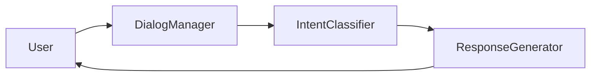

                 


# 构建企业级对话系统：多轮对话管理与意图理解的深度整合

> 关键词：企业级对话系统，多轮对话管理，意图理解，深度整合，自然语言处理

> 摘要：本文将详细介绍如何构建一个高效的企业级对话系统，重点探讨多轮对话管理与意图理解的深度整合。从基础概念到复杂系统的构建，本文将一步步解析其背后的原理与实现方法，通过丰富的项目案例和系统架构设计，展示如何将理论应用于实践，最终构建出一个高效、智能的企业级对话系统。

---

## 第一部分: 企业级对话系统概述

### 第1章: 对话系统的背景与概念

#### 1.1 对话系统的定义与分类
- **对话系统的定义**：对话系统是一种能够与用户进行自然语言交互的计算机系统，通过理解和生成人类语言来实现人机对话。
- **对话系统的分类**：
  - 单轮对话系统：仅处理单个用户输入，不考虑对话历史。
  - 多轮对话系统：能够处理连续的多个对话回合，维护对话上下文。
  - 混合对话系统：结合规则和机器学习的混合型对话系统。
- **企业级对话系统的特征**：
  - 高可用性：支持大规模并发用户。
  - 高准确性：准确理解用户意图。
  - 高可扩展性：支持多种业务场景。

#### 1.2 多轮对话管理的背景
- **多轮对话的基本概念**：多轮对话是指在对话过程中，系统需要根据之前的对话内容，理解和生成后续的回复。
- **多轮对话管理的必要性**：
  - 维护对话上下文。
  - 理解用户意图的变化。
  - 处理对话中的歧义和不确定性。
- **企业级多轮对话管理的挑战**：
  - 对话历史的高效存储与检索。
  - 多轮对话中的上下文理解。
  - 多轮对话中的用户意图变化。

#### 1.3 意图理解的背景
- **意图理解的定义**：意图理解是指从用户的语言输入中识别出用户的主要意图或目标。
- **意图理解的关键技术**：
  - 基于规则的方法：通过预定义的规则匹配用户的输入。
  - 基于统计的方法：利用机器学习模型进行意图分类。
  - 基于深度学习的方法：利用神经网络模型进行意图识别。
- **企业级意图理解的应用场景**：
  - 客服系统中的意图分类。
  - 智能助手中的任务执行。
  - 企业内部协作中的意图识别。

### 1.4 多轮对话管理与意图理解的整合
- **整合的基本原理**：
  - 多轮对话管理负责维护对话上下文，理解用户意图的变化。
  - 意图理解负责从用户的输入中识别出当前的意图。
- **整合的关键技术**：
  - 对话上下文的表示与管理。
  - 意图理解的动态调整。
  - 多轮对话中的意图关联。
- **整合的实现步骤**：
  1. 收集用户输入。
  2. 分析用户输入，识别意图。
  3. 维护对话上下文。
  4. 根据意图生成回复。
  5. 更新对话上下文，进入下一回合。

---

## 第二部分: 多轮对话管理与意图理解的核心技术

### 第2章: 多轮对话管理的核心技术

#### 2.1 对话状态表示
- **对话状态的定义**：对话状态是指在对话过程中，系统对当前对话内容的理解和表示。
- **对话状态表示方法**：
  - 基于槽位的方法：通过预定义的槽位来表示对话状态。
  - 基于向量的方法：通过向量表示对话状态。
  - 基于图的方法：通过图结构表示对话状态。
- **对话状态表示的实现步骤**：
  1. 定义槽位或向量空间。
  2. 通过自然语言处理技术提取槽位或向量。
  3. 维护对话状态的动态更新。

#### 2.2 对话历史记录
- **对话历史记录的定义**：对话历史记录是指在对话过程中，系统记录的所有对话内容。
- **对话历史记录的存储方法**：
  - 基于数据库的方法：将对话历史记录存储在关系型数据库中。
  - 基于日志文件的方法：将对话历史记录存储在日志文件中。
  - 基于缓存的方法：将对话历史记录存储在缓存中。
- **对话历史记录的检索方法**：
  - 基于关键词检索：通过关键词检索对话历史。
  - 基于上下文检索：通过对话上下文检索对话历史。
  - 基于时间检索：通过时间戳检索对话历史。

#### 2.3 对话上下文管理
- **对话上下文的定义**：对话上下文是指在对话过程中，系统需要维护的所有与当前对话相关的信息。
- **对话上下文的管理方法**：
  - 基于规则的管理：通过预定义的规则管理对话上下文。
  - 基于机器学习的管理：通过机器学习模型管理对话上下文。
  - 基于混合方法的管理：结合规则和机器学习进行对话上下文管理。
- **对话上下文的动态更新**：
  - 通过用户输入更新对话上下文。
  - 通过系统回复更新对话上下文。
  - 通过对话历史记录更新对话上下文。

### 第3章: 意图理解的核心技术

#### 3.1 意图识别与分类
- **意图识别的定义**：意图识别是指从用户的语言输入中识别出用户的主要意图或目标。
- **意图分类的方法**：
  - 基于规则的方法：通过预定义的规则匹配用户的输入。
  - 基于统计的方法：利用机器学习模型进行意图分类。
  - 基于深度学习的方法：利用神经网络模型进行意图识别。
- **意图分类的实现步骤**：
  1. 收集用户输入。
  2. 提取用户输入的特征。
  3. 使用机器学习或深度学习模型进行意图分类。

#### 3.2 意图理解的特征提取
- **特征提取的定义**：特征提取是指从用户输入中提取出有助于意图理解的关键特征。
- **特征提取的方法**：
  - 基于词袋模型的方法：提取用户输入中的关键词。
  - 基于词嵌入模型的方法：提取用户输入的词向量。
  - 基于句嵌入模型的方法：提取用户输入的句向量。
- **特征提取的实现步骤**：
  1. 收集用户输入。
  2. 提取用户输入的特征。
  3. 使用特征进行意图分类。

#### 3.3 意图理解的模型选择
- **意图理解模型的选择**：
  - 基于规则的模型：适用于简单的意图分类任务。
  - 基于机器学习的模型：适用于中等复杂度的意图分类任务。
  - 基于深度学习的模型：适用于复杂度较高的意图分类任务。
- **意图理解模型的优化**：
  - 调整模型参数。
  - 优化特征提取方法。
  - 增加训练数据量。

---

## 第三部分: 企业级对话系统的应用与实现

### 第4章: 企业级对话系统的系统架构

#### 4.1 系统功能设计
- **系统功能设计的定义**：系统功能设计是指根据需求分析，设计系统的功能模块。
- **系统功能设计的方法**：
  - 面向用户的需求分析。
  - 面向系统的技术分析。
  - 面向业务的流程分析。
- **系统功能设计的实现步骤**：
  1. 收集用户需求。
  2. 分析用户需求，设计功能模块。
  3. 细化功能模块，设计功能流程。

#### 4.2 系统架构设计
- **系统架构设计的定义**：系统架构设计是指根据功能需求，设计系统的整体架构。
- **系统架构设计的方法**：
  - 分层架构：将系统划分为多个层次，每个层次负责不同的功能。
  - 微服务架构：将系统划分为多个微服务，每个微服务负责不同的功能。
  - 基于事件驱动的架构：通过事件驱动系统功能的实现。
- **系统架构设计的实现步骤**：
  1. 分析功能需求，设计系统架构。
  2. 细化系统架构，设计模块之间的接口。
  3. 优化系统架构，确保系统的可扩展性和可维护性。

#### 4.3 系统接口设计
- **系统接口设计的定义**：系统接口设计是指设计系统与外部系统之间的接口。
- **系统接口设计的方法**：
  - 基于RESTful API的设计：使用RESTful API设计系统接口。
  - 基于RPC的设计：使用远程过程调用设计系统接口。
  - 基于消息队列的设计：使用消息队列设计系统接口。
- **系统接口设计的实现步骤**：
  1. 确定系统接口的功能需求。
  2. 设计系统接口的协议和格式。
  3. 实现系统接口，确保接口的可用性和稳定性。

#### 4.4 系统交互设计
- **系统交互设计的定义**：系统交互设计是指设计用户与系统之间的交互流程。
- **系统交互设计的方法**：
  - 基于流程图的设计：使用流程图设计用户与系统的交互流程。
  - 基于用户旅程图的设计：基于用户旅程图设计用户与系统的交互流程。
  - 基于状态转换图的设计：基于状态转换图设计用户与系统的交互流程。
- **系统交互设计的实现步骤**：
  1. 分析用户需求，设计用户与系统的交互流程。
  2. 细化交互流程，确保流程的完整性和合理性。
  3. 优化交互流程，提升用户体验。

---

## 第四部分: 项目实战与案例分析

### 第5章: 项目实战

#### 5.1 项目背景与需求分析
- **项目背景**：介绍项目背景，明确项目的建设目标和意义。
- **项目需求分析**：
  - 功能需求分析。
  - 性能需求分析。
  - 用户需求分析。
- **项目技术选型**：
  - 开发语言选型。
  - 开发框架选型。
  - 数据库选型。
  - 第三方服务选型。

#### 5.2 项目核心代码实现
- **环境安装**：
  - 安装开发语言和开发环境。
  - 安装必要的开发工具和库。
- **核心代码实现**：
  - 对话管理模块的实现。
  - 意图理解模块的实现。
  - 系统架构模块的实现。
  - 系统接口模块的实现。
- **代码解读与分析**：
  - 代码结构解读。
  - 关键代码段解读。
  - 代码实现的优化建议。

#### 5.3 项目实际案例分析
- **案例背景介绍**：
  - 项目名称。
  - 项目目标。
  - 项目实施过程。
- **案例分析**：
  - 对话管理模块的实现。
  - 意图理解模块的实现。
  - 系统架构模块的实现。
  - 系统接口模块的实现。
- **案例总结**：
  - 项目实施的经验总结。
  - 项目实施的教训总结。
  - 项目实施的优化建议。

---

## 第五部分: 总结与展望

### 第6章: 总结与展望

#### 6.1 总结
- **本文的核心内容总结**：总结本文的核心内容，强调多轮对话管理与意图理解的深度整合。
- **本文的主要贡献**：总结本文在企业级对话系统构建中的主要贡献。
- **本文的局限性**：总结本文在企业级对话系统构建中的局限性。

#### 6.2 未来研究方向
- **多轮对话管理的未来研究方向**：
  - 对话状态表示的优化。
  - 对话历史记录的高效存储与检索。
  - 对话上下文管理的创新方法。
- **意图理解的未来研究方向**：
  - 意图识别与分类的优化。
  - 意图理解的特征提取方法。
  - 意图理解的模型优化。
- **企业级对话系统的未来研究方向**：
  - 企业级对话系统的可扩展性研究。
  - 企业级对话系统的可维护性研究。
  - 企业级对话系统的可解释性研究。

#### 6.3 最佳实践与注意事项
- **最佳实践**：
  - 在企业级对话系统构建中，注重系统的可扩展性和可维护性。
  - 在多轮对话管理中，合理设计对话状态表示和对话上下文管理。
  - 在意图理解中，注重特征提取和模型优化。
- **注意事项**：
  - 在企业级对话系统构建中，充分考虑系统的安全性和隐私性。
  - 在多轮对话管理中，避免对话状态表示过于复杂。
  - 在意图理解中，避免特征提取过于简单。

---

## 附录

### 附录A: 项目代码与实现细节

#### 附录A.1 对话管理模块代码
```python
class DialogManager:
    def __init__(self):
        self.dialog_states = {}

    def update_dialog_state(self, user_id, state):
        self.dialog_states[user_id] = state

    def get_dialog_state(self, user_id):
        return self.dialog_states.get(user_id, {})
```

#### 附录A.2 意图理解模块代码
```python
class IntentClassifier:
    def __init__(self, model):
        self.model = model

    def predict_intent(self, text):
        return self.model.predict(text)
```

#### 附录A.3 系统架构设计图


---

## 参考文献

（此处列出相关参考文献，包括书籍、论文、技术文档等。）

---

**作者：AI天才研究院/AI Genius Institute & 禅与计算机程序设计艺术 /Zen And The Art of Computer Programming**

