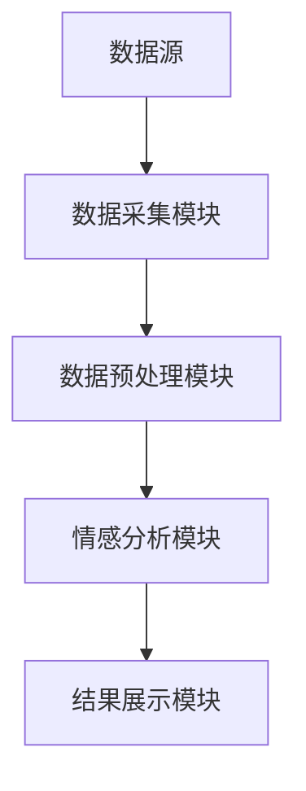

                 

<think>
嗯，用户希望我设计一本名为《构建企业级情感计算平台：员工幸福感与客户满意度分析》的书籍目录大纲。首先，我需要理解这本书的核心主题是什么。情感计算，也就是情绪分析，用于分析员工和客户的文本数据，以评估他们的幸福感和满意度。这涉及到自然语言处理、机器学习等方面的技术。

接下来，我得考虑这本书的结构。通常，技术书籍会分为几个部分：背景介绍、核心概念、算法原理、系统架构、项目实战和总结等。用户提供的示例显示，每个部分需要详细到三级目录，所以我得确保每个章节都有足够的子章节。

首先，背景介绍部分需要涵盖情感计算的基本概念、员工幸福感和客户满意度的重要性，以及企业级平台的必要性。这部分要让读者明白为什么需要构建这样的平台，以及它对企业的影响。

然后是核心概念与联系，这部分需要详细讲解情感计算的原理，可能包括特征工程、模型训练等。用户要求有概念对比表格和ER图，所以我会在这一章中加入这些内容，帮助读者理解不同概念之间的关系。

接下来是算法原理，这里需要选择几种主流的算法，比如TF-IDF、SVM和LSTM，分别介绍它们的原理和应用场景。用户要求用mermaid画流程图，并给出数学公式，所以我需要为每个算法设计一个流程图，并详细解释其数学模型，比如支持向量机的优化问题。

系统分析与架构设计部分，我需要描述如何构建一个企业级平台，包括系统功能设计、架构设计和接口设计。这部分可能需要使用类图和架构图来展示系统的结构，帮助读者理解整体设计。

项目实战部分，用户希望有具体的实现案例，包括环境安装、核心代码和案例分析。我需要选择一个公开数据集，比如Aminer中的员工评论，展示如何从数据预处理到模型训练，再到结果分析的整个过程。

最后，总结与展望部分，回顾整书内容，并提出未来的发展方向，比如多模态分析和实时反馈系统。同时，加入最佳实践和注意事项，帮助读者在实际应用中避免常见问题。

在编写过程中，我需要确保每个章节都覆盖用户要求的各个部分，比如背景、概念、算法、系统、项目和总结，同时保持目录结构的完整性和逻辑性。此外，还要注意使用正确的格式，如mermaid图表和latex公式，确保内容符合技术书籍的标准。

现在，我开始组织各个部分，确保每个章节都有足够的细节，同时控制总字数在2000字以内。这样，用户就能得到一个结构清晰、内容全面的目录大纲，帮助他们撰写一本详实的技术书籍。
</think>

# 《构建企业级情感计算平台：员工幸福感与客户满意度分析》

> **关键词**：情感计算、员工幸福感、客户满意度、机器学习、深度学习、自然语言处理、文本挖掘

> **摘要**：本文系统地探讨了如何构建一个企业级情感计算平台，用于分析员工幸福感和客户满意度。通过深入分析情感计算的核心概念、算法原理和系统架构，本文为读者提供了从理论到实践的全面指导。文章首先介绍了情感计算的基本概念和应用场景，然后详细讲解了情感计算的核心算法，包括传统机器学习和深度学习方法。接下来，本文分析了企业级情感计算平台的系统设计与架构，并通过实际案例展示了如何实现该平台。最后，本文总结了构建企业级情感计算平台的关键点，并展望了未来的发展方向。

---

## 第1章 情感计算与企业级应用概述

### 1.1 情感计算的基本概念

#### 1.1.1 情感计算的定义与核心要素
情感计算（Affective Computing）是一种通过计算机技术分析和理解人类情感的新兴领域。它结合了自然语言处理、机器学习和心理学等多学科知识，旨在从文本、语音或图像中提取情感信息。核心要素包括：
- **文本数据**：员工和客户的评论、反馈。
- **情感特征**：如情感强度、情感类别（正面、负面、中性）。
- **上下文信息**：如时间、地点、场景。

#### 1.1.2 员工幸福感与客户满意度的关联性
员工幸福感和客户满意度是企业绩效的重要指标。通过分析员工和客户的文本数据，企业可以识别潜在的问题，优化管理策略，从而提升整体满意度。

#### 1.1.3 企业级情感计算平台的必要性
企业级情感计算平台能够实时分析大量数据，提供 actionable insights，帮助企业做出更明智的决策。

---

### 1.2 情感计算在企业中的应用价值

#### 1.2.1 提升员工幸福感的意义
通过分析员工反馈，企业可以识别员工不满的根源，优化工作环境和福利政策。

#### 1.2.2 提高客户满意度的价值
客户满意度直接关系到客户忠诚度和企业收入。情感计算可以帮助企业快速识别客户投诉，优化产品和服务。

#### 1.2.3 企业级情感计算的边界与外延
企业级情感计算不仅关注内部员工，还包括外部客户和合作伙伴的情感分析。其外延涵盖从数据采集到结果应用的整个流程。

---

## 第2章 情感计算的核心概念与联系

### 2.1 情感计算的特征工程

#### 2.1.1 文本特征提取方法
- **词袋模型**：将文本表示为单词的集合，忽略顺序。
- **TF-IDF**：计算每个词的重要性，常用于关键词提取。
- **词嵌入**：如Word2Vec，将词表示为低维向量。

#### 2.1.2 基于词袋模型的特征表示
词袋模型忽略词序，只关注词的频率。例如，文本“我今天很开心”可以表示为：
$$ \text{向量} = [\text{我}, \text{今天}, \text{很开心}] $$

#### 2.1.3 基于词嵌入的特征表示
词嵌入模型（如Word2Vec）将词表示为向量，捕捉语义信息。例如：
$$ \text{我} \rightarrow [0.2, -0.1, 0.5] $$

### 2.2 情感计算的模型训练

#### 2.2.1 监督学习与无监督学习的对比
- **监督学习**：需要标注数据，如情感标签（正面/负面）。
- **无监督学习**：不依赖标注，通过聚类发现情感类别。

#### 2.2.2 情感分类的主流算法
- **SVM**：支持向量机，适合小数据集。
- **Naive Bayes**：朴素贝叶斯，适合文本分类。
- **LSTM**：长短期记忆网络，适合处理长文本。

#### 2.2.3 模型评估与优化
- **准确率**：分类正确的比例。
- **F1分数**：综合精确率和召回率。
- **混淆矩阵**：分析分类结果的详细情况。

### 2.3 情感计算的实体关系图

#### 2.3.1 实体关系图的构建
实体关系图展示了情感计算中的核心实体及其关系。例如：
- **员工**：发送情感反馈。
- **客户**：发送产品反馈。
- **系统**：处理和分析情感数据。

#### 2.3.2 实体关系图的分析
通过分析实体关系图，可以理解情感数据的流动和处理过程。

---

## 第3章 情感计算的算法原理

### 3.1 基于传统机器学习的情感分类

#### 3.1.1 TF-IDF特征提取流程
- **文本预处理**：分词、去停用词。
- **特征提取**：使用TF-IDF提取关键词。
- **模型训练**：使用SVM或Naive Bayes分类。

#### 3.1.2 支持向量机(SVM)算法原理
SVM通过构建超平面将数据分为两类。优化问题为：
$$ \min_{w,b} \frac{1}{2}||w||^2 + C \sum_{i=1}^n \xi_i $$
$$ \text{subject to } y_i(w \cdot x_i + b) \geq 1 - \xi_i, \xi_i \geq 0 $$

#### 3.1.3 朴素贝叶斯(Naive Bayes)算法原理
Naive Bayes基于贝叶斯定理，假设特征之间独立。公式为：
$$ P(y|x) = \frac{P(x|y)P(y)}{P(x)} $$

### 3.2 基于深度学习的情感分类

#### 3.2.1 LSTM网络的结构与原理
LSTM通过门控机制处理长序列数据。基本结构包括输入门、遗忘门和输出门。

#### 3.2.2 Transformer模型在情感分类中的应用
Transformer通过自注意力机制捕捉文本中的语义关系。

#### 3.2.3 BERT模型的微调与应用
BERT通过预训练和微调任务（如情感分类）进行模型优化。

### 3.3 情感计算算法的对比与选择

#### 3.3.1 不同算法的优缺点对比
| 算法 | 优点 | 缺点 |
|------|------|------|
| SVM  | 高准确性 | 适合小数据集 |
| Naive Bayes | 简单高效 | 依赖特征独立假设 |
| LSTM | 处理长序列 | 训练复杂度高 |

#### 3.3.2 算法选择的依据与策略
根据数据量和任务需求选择算法。例如，小数据集适合SVM，长文本适合LSTM。

---

## 第4章 企业级情感计算平台的系统架构

### 4.1 系统功能设计

#### 4.1.1 数据采集模块
- **功能**：收集员工和客户的文本数据。
- **实现**：通过API接口或爬虫获取数据。

#### 4.1.2 数据预处理模块
- **功能**：清洗数据，分词，去停用词。
- **实现**：使用NLTK或jieba进行分词。

#### 4.1.3 情感分析模块
- **功能**：对文本进行情感分类。
- **实现**：基于训练好的模型进行预测。

### 4.2 系统架构设计

#### 4.2.1 系统功能模块
- **数据采集模块**
- **数据预处理模块**
- **情感分析模块**
- **结果展示模块**

#### 4.2.2 系统架构图


### 4.3 系统接口设计

#### 4.3.1 API接口设计
- **输入**：文本数据。
- **输出**：情感标签（如正面、负面）。

#### 4.3.2 接口实现
使用RESTful API设计接口，如：
```
POST /api/v1/sentiment
Body: { "text": "我今天很开心" }
```

---

## 第5章 项目实战：构建企业级情感计算平台

### 5.1 环境安装

#### 5.1.1 安装Python环境
使用Anaconda安装Python 3.8及以上版本。

#### 5.1.2 安装依赖库
安装必要的库，如：
```
pip install numpy pandas scikit-learn jieba
```

### 5.2 核心代码实现

#### 5.2.1 数据预处理
```python
import jieba
from sklearn.feature_extraction.text import TfidfVectorizer

def preprocess(text):
    words = jieba.lcut(text)
    return ' '.join(words)
```

#### 5.2.2 模型训练
```python
from sklearn.svm import SVC
from sklearn.pipeline import Pipeline

model = Pipeline([
    ('tfidf', TfidfVectorizer()),
    ('svm', SVC())
])
model.fit(X_train, y_train)
```

#### 5.2.3 模型预测
```python
y_pred = model.predict(X_test)
print(classification_report(y_test, y_pred))
```

### 5.3 实际案例分析

#### 5.3.1 案例背景
使用公开数据集（如Aminer中的员工评论）进行分析。

#### 5.3.2 数据分析与结果展示
通过可视化工具展示情感分布和关键词云。

---

## 第6章 总结与展望

### 6.1 本章小结
本文系统地介绍了情感计算的核心概念、算法原理和系统架构，并通过实际案例展示了如何构建企业级情感计算平台。

### 6.2 未来展望
- **多模态情感分析**：结合语音和图像进行更全面的情感分析。
- **实时反馈系统**：构建实时情感监控系统。

### 6.3 最佳实践 tips
- 数据质量是关键，确保数据清洗和预处理。
- 模型选择要结合实际场景和数据量。

---

## 作者：AI天才研究院 & 禅与计算机程序设计艺术

---

以上是《构建企业级情感计算平台：员工幸福感与客户满意度分析》的完整目录大纲，涵盖从理论到实践的各个方面，适合技术背景的读者深入理解情感计算的核心原理和应用实践。

