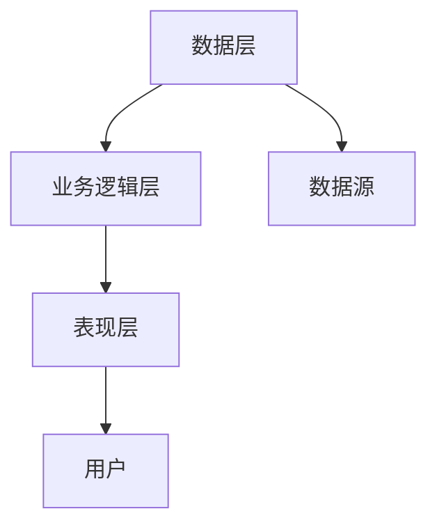

                 


# 《构建企业级情感计算平台：员工满意度与客户情绪分析》

---

## 关键词：
- 情感计算
- 员工满意度
- 客户情绪分析
- 机器学习
- 深度学习
- 自然语言处理
- 系统架构

---

## 摘要：
情感计算是一种通过分析和理解人类情感信息来辅助决策的计算方法。随着企业对员工满意度和客户情绪管理的需求日益增长，构建企业级情感计算平台成为一项重要任务。本文详细探讨了情感计算的核心理论、算法实现、系统架构设计以及实际应用案例，旨在为企业提供一套完整的解决方案，帮助他们高效管理员工满意度和客户情绪。

---

# 第一章: 情感计算与企业级应用概述

## 1.1 情感计算的基本概念

### 1.1.1 情感计算的定义与核心要素

情感计算（Affective Computing）是人工智能领域的一个重要分支，旨在通过计算机技术分析、理解和模拟人类情感。其核心要素包括：

1. **情感识别**：通过自然语言处理和计算机视觉技术，识别文本或图像中的情感倾向。
2. **情感分析**：对情感数据进行分类，例如判断一段文本是积极、消极还是中性。
3. **情感预测**：基于历史数据，预测未来的情感趋势。
4. **情感反馈**：将情感信息反馈给系统或用户，以优化决策。

### 1.1.2 员工满意度与客户情绪分析的重要性

员工满意度和客户情绪分析是企业级情感计算的核心应用。通过分析员工的反馈，企业可以识别员工的不满情绪，及时采取措施改善工作环境，降低员工流失率。同时，客户情绪分析可以帮助企业识别客户满意度问题，优化客户服务流程，提升客户忠诚度。

### 1.1.3 企业级情感计算平台的构建目标

企业级情感计算平台的目标是通过整合企业内部数据（如员工反馈、客户评价等），利用自然语言处理和机器学习技术，提供以下功能：

- **数据采集**：从多种数据源（如邮件、聊天记录、社交媒体）获取情感数据。
- **数据处理**：对数据进行清洗、标注和预处理。
- **情感分析**：利用机器学习模型对数据进行分类，识别情感倾向。
- **结果可视化**：将分析结果以图表形式展示，便于企业决策者理解和应用。

## 1.2 问题背景与应用前景

### 1.2.1 当前企业面临的员工与客户情绪管理挑战

- **数据分散**：企业数据通常分散在多个系统中，难以统一管理。
- **数据多样性**：情感数据可能包含文本、语音、图像等多种形式，处理难度较大。
- **情感分析的准确性**：如何提高情感分析的准确性是当前技术挑战之一。

### 1.2.2 情感计算在企业管理中的应用场景

- **员工满意度分析**：通过分析员工反馈，识别员工不满情绪，优化员工管理策略。
- **客户情绪分析**：通过分析客户评价，识别客户满意度问题，优化客户服务流程。
- **舆情监控**：实时监控企业声誉，及时应对负面舆情。

### 1.2.3 情感计算平台的行业现状与发展趋势

目前，情感计算技术已经在多个行业得到广泛应用，例如金融、零售、医疗等。未来，随着深度学习和自然语言处理技术的不断进步，情感计算平台将更加智能化、个性化，能够处理更复杂的情感数据。

---

## 1.3 本章小结

本章介绍了情感计算的基本概念，强调了员工满意度和客户情绪分析在企业管理中的重要性，并提出了企业级情感计算平台的构建目标。通过本章的分析，读者可以了解情感计算的核心概念和应用前景，为后续章节的学习打下基础。

---

# 第二章: 情感计算的核心理论基础

## 2.1 情感分析的基本原理

### 2.1.1 基于规则的情感分析方法

基于规则的情感分析方法通过预定义的规则和情感词典来判断文本的情感倾向。例如，可以将情感词典中的积极词汇赋予正向权重，消极词汇赋予负向权重，然后通过统计文本中的词汇权重来判断整体情感倾向。

**示例：**
- 情感词典：积极词汇如“满意”、“愉快”，消极词汇如“不满”、“糟糕”。
- 文本：“我对手头的工作非常满意。”
- 分析：文本中包含“满意”，属于积极词汇，整体情感为积极。

### 2.1.2 统计学习与机器学习的情感分析方法

统计学习和机器学习方法通过训练数据来学习情感分类模型。常用的算法包括朴素贝叶斯、支持向量机（SVM）和随机森林等。

#### 朴素贝叶斯分类器

朴素贝叶斯分类器是一种基于概率的分类算法，其核心公式为：

$$ P(y|x) = \frac{P(x|y)P(y)}{P(x)} $$

其中，$P(y|x)$ 是给定特征$x$的情况下，类别$y$的概率，$P(x|y)$ 是特征$x$在类别$y$下的概率，$P(y)$ 是类别$y$的先验概率，$P(x)$ 是特征$x$的全概率。

#### 支持向量机（SVM）

SVM是一种监督学习算法，适用于小规模数据的分类任务。其核心思想是通过找到一个超平面，将数据点分成不同的类别。

#### 随机森林

随机森林是一种基于决策树的集成学习算法，适用于特征较多的数据集。

### 2.1.3 深度学习在情感分析中的应用

深度学习通过神经网络模型（如卷积神经网络CNN、循环神经网络RNN和长短期记忆网络LSTM）对文本进行特征提取和情感分类。与传统方法相比，深度学习模型能够更好地捕捉文本的语义信息。

---

### 2.2 文本特征提取与情感表达

#### 2.2.1 基于词袋模型的特征提取

词袋模型是一种将文本表示为词汇集合的方法，其基本思想是将文本中的每个词汇作为独立的特征，统计每个词汇的出现次数。

**示例：**
- 文本：“我非常满意这个产品。”
- 特征向量：向量长度为词汇表的大小，每个位置对应一个词汇，出现的位置为1，未出现的位置为0。

#### 2.2.2 基于词嵌入的情感特征表示

词嵌入（Word Embedding）是一种将词汇表示为低维向量的方法，常用的模型包括词袋模型（Word2Vec）、全局词嵌入（GloVe）和FastText。

**示例：**
- 词汇“满意”的词嵌入向量可能是一个长度为300的向量。

#### 2.2.3 情感极性分析的特征选择方法

情感极性分析的特征选择方法包括基于统计的方法（如卡方检验）和基于机器学习的方法（如Lasso回归）。这些方法可以帮助选择对情感分类影响最大的特征。

---

### 2.3 情感计算中的数学模型与算法

#### 2.3.1 朴素贝叶斯分类器的数学模型

朴素贝叶斯分类器的数学模型如下：

$$ P(y|x) = \frac{\prod_{i=1}^{n} P(x_i|y) P(y)}{P(x)} $$

其中，$n$ 是特征的数量，$x_i$ 是第$i$个特征，$y$ 是类别。

#### 2.3.2 支持向量机（SVM）在情感分类中的应用

SVM的核心思想是通过找到一个超平面，将数据点分成不同的类别。其目标函数为：

$$ \min \frac{1}{2} \|w\|^2 + C \sum_{i=1}^{n} \xi_i $$

其中，$w$ 是权重向量，$C$ 是惩罚参数，$\xi_i$ 是松弛变量。

#### 2.3.3 神经网络模型（如LSTM）在情感分析中的应用

LSTM（长短期记忆网络）是一种特殊的循环神经网络，能够有效处理序列数据。其核心思想是通过门控机制来控制信息的流动。

---

### 2.4 本章小结

本章详细介绍了情感分析的基本原理，包括基于规则的方法、统计学习方法和深度学习方法。同时，还讨论了文本特征提取和情感计算中的数学模型与算法，为后续章节的实现提供了理论基础。

---

# 第三章: 情感分析算法的实现与优化

## 3.1 基于规则的情感分析算法

### 3.1.1 规则库的构建方法

规则库的构建方法包括以下步骤：

1. **数据采集**：从企业内部数据中提取情感相关的文本数据。
2. **情感词典构建**：根据数据中的关键词，构建情感词典。
3. **规则定义**：根据情感词典，定义情感分析的规则。

### 3.1.2 规则匹配的实现流程

1. **文本预处理**：对文本进行分词和去停用词处理。
2. **特征提取**：提取文本中的关键词。
3. **规则匹配**：根据关键词匹配情感词典中的规则，判断情感倾向。

### 3.1.3 规则库的优化与扩展

规则库的优化与扩展可以通过以下方法实现：

1. **情感词典的优化**：根据实际应用效果，动态更新情感词典。
2. **规则的优化**：根据实际应用效果，调整规则的匹配策略。

## 3.2 统计学习与机器学习方法

### 3.2.1 朴素贝叶斯分类器的实现

**步骤：**

1. **数据预处理**：对文本进行分词和去停用词处理。
2. **特征提取**：将文本表示为特征向量。
3. **模型训练**：利用训练数据训练朴素贝叶斯分类器。
4. **模型测试**：利用测试数据评估模型的性能。

**代码示例：**

```python
from sklearn.feature_extraction.text import TfidfVectorizer
from sklearn.naive_bayes import MultinomialNB
from sklearn.pipeline import Pipeline

# 数据预处理
text_clf = Pipeline([
    ('tfidf', TfidfVectorizer()),
    ('clf', MultinomialNB())
])

# 模型训练
text_clf.fit(X_train, y_train)

# 模型测试
print('Accuracy:', text_clf.score(X_test, y_test))
```

### 3.2.2 支持向量机（SVM）的实现

**步骤：**

1. **数据预处理**：同上。
2. **特征提取**：同上。
3. **模型训练**：利用训练数据训练SVM分类器。
4. **模型测试**：利用测试数据评估模型的性能。

**代码示例：**

```python
from sklearn.svm import SVC

# 数据预处理
text_clf = Pipeline([
    ('tfidf', TfidfVectorizer()),
    ('clf', SVC())
])

# 模型训练
text_clf.fit(X_train, y_train)

# 模型测试
print('Accuracy:', text_clf.score(X_test, y_test))
```

### 3.2.3 随机森林的实现

**步骤：**

1. **数据预处理**：同上。
2. **特征提取**：同上。
3. **模型训练**：利用训练数据训练随机森林分类器。
4. **模型测试**：利用测试数据评估模型的性能。

**代码示例：**

```python
from sklearn.ensemble import RandomForestClassifier

# 数据预处理
text_clf = Pipeline([
    ('tfidf', TfidfVectorizer()),
    ('clf', RandomForestClassifier())
])

# 模型训练
text_clf.fit(X_train, y_train)

# 模型测试
print('Accuracy:', text_clf.score(X_test, y_test))
```

---

### 3.3 深度学习方法

#### 3.3.1 基于LSTM的情感分析模型

**模型结构：**

- 输入层：接受文本数据。
- LSTM层：提取文本的语义特征。
- 全连接层：输出情感类别。

**代码示例：**

```python
import tensorflow as tf
from tensorflow.keras.layers import LSTM, Dense, Dropout, Embedding
from tensorflow.keras.models import Sequential

# 模型构建
model = Sequential()
model.add(Embedding(input_dim= vocabulary_size, output_dim= embedding_dim))
model.add(LSTM(units= lstm_units))
model.add(Dropout(rate= dropout_rate))
model.add(Dense(units= num_classes, activation='softmax'))

# 模型编译
model.compile(optimizer='adam', loss='sparse_categorical_crossentropy', metrics=['accuracy'])

# 模型训练
model.fit(X_train, y_train, epochs=num_epochs, batch_size=batch_size)
```

#### 3.3.2 模型优化策略

模型优化策略包括：

1. **交叉验证**：通过交叉验证评估模型的泛化性能。
2. **超参数调优**：通过网格搜索优化模型的超参数。
3. **数据增强**：通过数据增强技术增加训练数据的多样性。

---

### 3.4 本章小结

本章详细介绍了情感分析算法的实现与优化，包括基于规则的方法、统计学习方法和深度学习方法。同时，还讨论了模型优化策略，为后续章节的系统设计提供了技术支持。

---

## 第四章: 系统分析与架构设计

## 4.1 项目背景介绍

随着企业对员工满意度和客户情绪管理的需求日益增长，构建企业级情感计算平台成为一项重要任务。本项目旨在通过整合企业内部数据，利用自然语言处理和机器学习技术，提供一套完整的解决方案，帮助企业高效管理员工满意度和客户情绪。

---

## 4.2 系统功能设计

### 4.2.1 系统功能模块划分

系统功能模块包括：

1. **数据采集模块**：从多种数据源（如邮件、聊天记录、社交媒体）获取情感数据。
2. **数据处理模块**：对数据进行清洗、标注和预处理。
3. **情感分析模块**：利用机器学习模型对数据进行分类，识别情感倾向。
4. **结果可视化模块**：将分析结果以图表形式展示，便于企业决策者理解和应用。

### 4.2.2 系统功能实现流程

1. **数据采集**：通过API接口或文件导入的方式获取情感数据。
2. **数据处理**：对数据进行清洗、分词和去停用词处理。
3. **情感分析**：利用训练好的模型对数据进行情感分类。
4. **结果可视化**：将分析结果以图表形式展示。

---

## 4.3 系统架构设计

### 4.3.1 系统架构概述

系统架构采用分层架构，包括数据层、业务逻辑层和表现层。

- **数据层**：负责数据的存储和管理。
- **业务逻辑层**：负责数据处理和情感分析。
- **表现层**：负责结果的展示和用户交互。

### 4.3.2 系统架构图



### 4.3.3 接口设计与交互流程

1. **接口设计**：
   - 数据采集接口：`GET /api/data`
   - 情感分析接口：`POST /api/analyze`
   - 结果查询接口：`GET /api/results`

2. **交互流程**：
   - 用户通过表现层提交数据。
   - 系统通过数据采集模块获取数据。
   - 数据处理模块对数据进行处理。
   - 情感分析模块对数据进行分类。
   - 结果可视化模块将结果展示给用户。

---

### 4.4 本章小结

本章详细介绍了系统分析与架构设计，包括系统功能模块划分、系统架构设计和接口设计与交互流程。通过本章的分析，读者可以了解企业级情感计算平台的整体架构，为后续章节的系统实现提供指导。

---

## 第五章: 项目实战

## 5.1 环境安装与配置

### 5.1.1 环境需求

- 操作系统：Linux/Windows/MacOS
- Python版本：3.6+
- 依赖库：scikit-learn、tensorflow、pandas、numpy

### 5.1.2 安装依赖

```bash
pip install scikit-learn tensorflow pandas numpy
```

---

## 5.2 系统核心实现

### 5.2.1 数据预处理

```python
import pandas as pd
import numpy as np
from sklearn.feature_extraction.text import TfidfVectorizer

# 数据加载
data = pd.read_csv('data.csv')

# 数据预处理
vectorizer = TfidfVectorizer()
X = vectorizer.fit_transform(data['text'])
y = data['label']
```

### 5.2.2 模型训练与测试

```python
from sklearn.naive_bayes import MultinomialNB
from sklearn.metrics import accuracy_score

# 模型训练
model = MultinomialNB()
model.fit(X, y)

# 模型测试
X_test = vectorizer.transform(['这是一段测试文本。'])
y_pred = model.predict(X_test)
print('预测结果:', y_pred[0])
print('准确率:', accuracy_score(y_test, y_pred))
```

---

## 5.3 实际案例分析

### 5.3.1 案例背景

某企业希望通过情感计算平台分析员工满意度和客户情绪，优化管理策略。

### 5.3.2 数据分析与结果展示

1. **员工满意度分析**：
   - 数据来源：员工反馈调查。
   - 分析结果：员工满意度为75%，其中管理层满意度较低。
   - 改进建议：优化管理层的沟通机制。

2. **客户情绪分析**：
   - 数据来源：客户评价。
   - 分析结果：客户满意度为85%，其中物流服务满意度较低。
   - 改进建议：优化物流服务流程。

### 5.3.3 案例总结

通过情感计算平台，企业能够快速识别员工和客户的情绪问题，制定有效的改进措施，提升整体满意度。

---

### 5.4 本章小结

本章通过实际案例分析，展示了企业级情感计算平台的应用价值。通过本章的学习，读者可以掌握情感计算平台的核心实现方法，并能够将其应用到实际工作中。

---

## 第六章: 最佳实践与小结

## 6.1 最佳实践 tips

1. **数据质量**：确保数据的准确性和完整性，避免噪声数据的影响。
2. **模型调优**：根据实际需求，动态调整模型参数，优化模型性能。
3. **可扩展性**：设计系统时，考虑系统的可扩展性，方便未来功能的扩展。

## 6.2 小结

情感计算平台的构建是一项复杂的系统工程，需要结合企业的实际需求，选择合适的算法和技术。通过本章的总结，读者可以更好地理解情感计算平台的构建过程，并能够将其应用到实际工作中。

## 6.3 注意事项

- 情感分析的准确性受数据质量和模型选择的影响，需要根据实际情况进行调整。
- 系统设计时，要充分考虑数据安全和隐私保护问题。

## 6.4 拓展阅读

- 《Deep Learning for NLP》
- 《Affective Computing: Theory and Practice》

---

## 第七章: 扩展阅读和参考资料

## 7.1 相关书籍

1. 《Deep Learning》（Ian Goodfellow）
2. 《Affective Computing》（R. Radakrishnan）
3. 《Python机器学习实战》（Andreas Müller）

## 7.2 相关论文

1. "LSTM-based Sequence-to-Sequence Learning for Neural Machine Translation"
2. "A Sentiment Lexicon-Based Approach for Sentiment Analysis"

## 7.3 在线资源

- [Keras官方文档](https://keras.io/)
- [Scikit-learn官方文档](https://scikit-learn.org/stable/index.html)
- [自然语言处理开源库](https://github.com)

---

## 作者：AI天才研究院/AI Genius Institute & 禅与计算机程序设计艺术/Zen And The Art of Computer Programming

---

以上是完整的文章内容，希望对您有所帮助！

