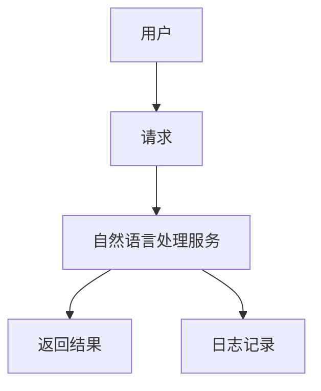
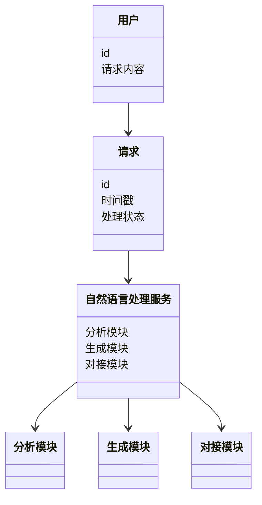
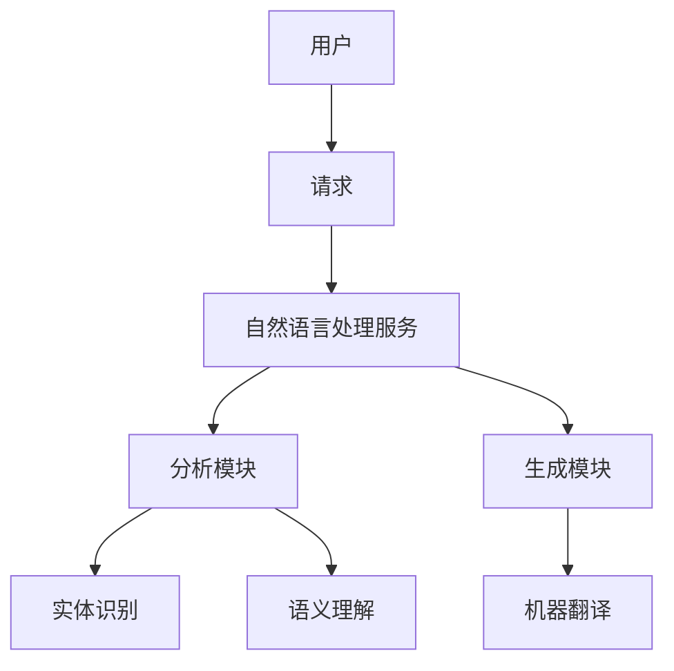
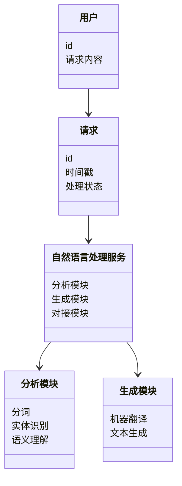
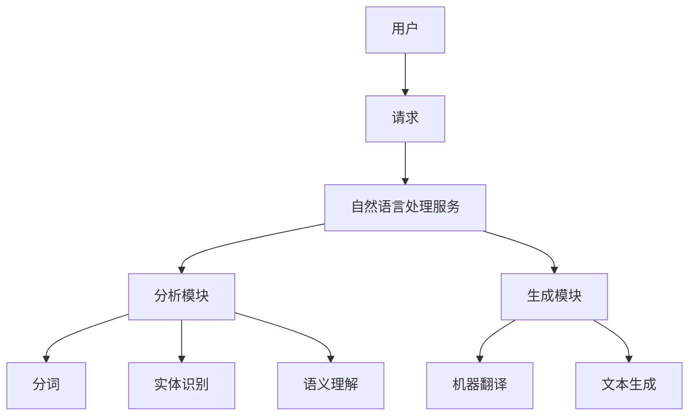
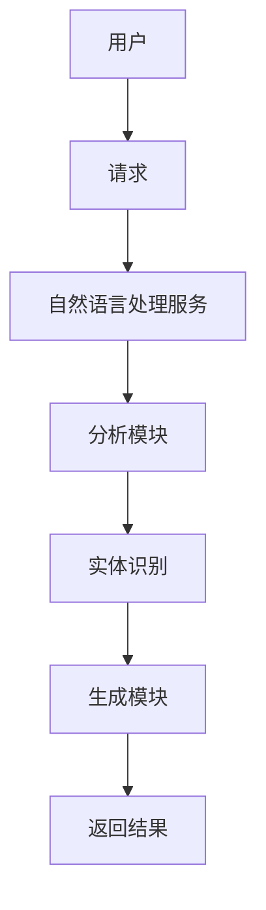

                 


# 构建企业级自然语言处理中台：多语言、多领域支持

## 关键词：自然语言处理，企业级中台，多语言，多领域，NLP中台，深度学习

## 摘要：  
随着人工智能技术的快速发展，自然语言处理（NLP）技术在企业级应用中的需求日益增长。然而，企业在实际应用中常常面临多语言、多领域支持的挑战。本文将深入探讨如何构建一个高效、灵活且可扩展的企业级自然语言处理中台，以满足多语言和多领域的复杂需求。通过分析NLP中台的核心概念、算法原理、系统架构以及实际案例，本文将为企业提供一套完整的解决方案，帮助企业在复杂的场景中实现高效的自然语言处理能力。

---

# 第一部分: 自然语言处理中台的背景与概念

# 第1章: 自然语言处理中台的背景与需求

## 1.1 问题背景与现状分析
### 1.1.1 当前企业NLP技术面临的挑战
企业级NLP应用的复杂性日益增加，主要体现在以下几个方面：
- **多语言支持**：企业可能需要处理多种语言，如中文、英文、日语等，且每种语言的语法规则和语境差异较大。
- **多领域覆盖**：NLP应用可能需要覆盖多个领域，例如客服、医疗、金融等，每个领域都有其特定的术语和业务逻辑。
- **数据量与计算资源**：企业通常需要处理海量数据，对计算资源的需求急剧上升，传统的单点解决方案难以满足需求。
- **模型维护与更新**：随着业务发展，模型需要不断更新和优化，传统的孤立模型难以快速响应变化。

### 1.1.2 多语言与多领域支持的需求
- **全球化业务**：企业在全球范围内开展业务，需要支持多种语言的交互和处理。
- **多样化场景**：企业可能同时在多个领域展开业务，例如金融领域的智能客服和医疗领域的疾病诊断，都需要NLP技术支持。
- **用户体验**：用户期望在多语言和多领域的场景下，得到一致且高质量的交互体验。

### 1.1.3 企业级NLP中台的必要性
- **统一管理**：通过中台架构，企业可以统一管理多个领域的NLP模型和多语言处理逻辑，避免重复开发和维护。
- **提高效率**：中台可以复用核心模块，降低开发成本，提高开发效率。
- **灵活扩展**：中台架构具有良好的扩展性，可以快速响应业务需求的变化。

## 1.2 自然语言处理中台的定义与目标
### 1.2.1 NLP中台的定义
NLP中台是一种企业级的中间件架构，旨在为多个领域的NLP应用提供统一的支持。它整合了多种NLP技术（如分词、实体识别、机器翻译等），并通过标准化接口对外提供服务。

### 1.2.2 中台的目标与价值
- **目标**：构建一个高效、灵活、可扩展的NLP平台，支持多语言和多领域的需求。
- **价值**：通过复用核心模块，降低开发成本，提高开发效率，同时提供一致的服务质量。

### 1.2.3 中台与传统NLP技术的区别
| 特性         | 中台架构                 | 传统NLP技术           |
|--------------|--------------------------|-----------------------|
| 模块化        | 高度模块化，支持复用     | 单点开发，难以复用     |
| 扩展性        | 支持快速扩展             | 扩展性较差             |
| 维护成本      | 统一管理，维护成本低     | 需要重复开发和维护     |
| 处理能力      | 高效处理多语言和多领域   | 难以同时支持多种语言和领域 |

## 1.3 中台架构的核心要素
### 1.3.1 中台架构的模块划分
- **分词模块**：负责对输入文本进行分词处理。
- **实体识别模块**：识别文本中的实体信息。
- **机器翻译模块**：支持多种语言之间的自动翻译。
- **语义理解模块**：理解文本的语义含义。
- **接口对接模块**：与前端和后端系统进行交互。

### 1.3.2 中台的灵活性与扩展性
- **模块化设计**：每个模块独立开发和维护，支持灵活组合。
- **插件式扩展**：通过插件的形式快速扩展功能。

### 1.3.3 中台的性能与稳定性要求
- **高性能**：支持高并发请求，确保处理速度。
- **稳定性**：系统具备容错和容灾能力，确保服务不中断。

## 1.4 本章小结
本章从背景出发，分析了企业级NLP应用面临的挑战，提出了构建NLP中台的必要性，并详细介绍了中台的定义、目标和核心要素。

---

# 第二部分: 自然语言处理中台的核心概念与联系

# 第2章: 自然语言处理中台的核心概念

## 2.1 核心概念的原理与特征
### 2.1.1 NLP中台的实体关系图
通过实体关系图，我们可以清晰地理解中台的各个模块及其之间的关系。



### 2.1.2 核心概念的属性对比表
以下表格对比了NLP中台与其他架构的核心属性。

| 属性       | 中台架构                 | 传统架构               |
|------------|--------------------------|-----------------------|
| 模块化      | 高度模块化               | 低模块化               |
| 扩展性      | 支持快速扩展             | 难以扩展               |
| 维护成本    | 统一管理，维护成本低     | 维护成本高             |
| 处理能力    | 高效处理多语言和多领域   | 难以同时支持多种语言和领域 |

### 2.1.3 中台与前端/后端的交互关系
通过类图可以清晰地展示中台与前端和后端的交互关系。



## 2.2 核心概念的ER实体关系图
通过ER实体关系图，我们可以更直观地理解NLP中台的结构。



## 2.3 核心概念的类图
以下类图展示了NLP中台的核心模块及其关系。



## 2.4 本章小结
本章详细介绍了NLP中台的核心概念，包括实体关系图和类图，帮助读者理解中台的结构和模块之间的关系。

---

# 第三部分: 自然语言处理中台的算法原理

# 第3章: 核心算法原理与实现

## 3.1 分词算法
### 3.1.1 分词算法的原理
分词算法是NLP的基础，主要用于将连续的文本分割成有意义的词语或短语。常见的分词算法包括基于规则的分词和基于深度学习的分词。

#### 基于规则的分词算法
- **原理**：通过预定义的词汇表和规则进行分词。
- **优点**：简单易实现，适合小规模数据。
- **缺点**：难以处理复杂的语境和歧义词。

#### 基于深度学习的分词算法
- **原理**：使用神经网络模型（如LSTM、Transformer）进行分词。
- **优点**：能够捕捉上下文信息，处理歧义词能力强。
- **缺点**：需要大量标注数据，计算资源消耗较大。

### 3.1.2 分词算法的优化与调优
- **优化策略**：通过调整词汇表或模型参数，提高分词的准确率。
- **调优方法**：使用交叉验证等方法，选择最优模型。

### 3.1.3 分词算法的代码实现
以下是一个基于深度学习的分词算法实现示例：

```python
import torch
import torch.nn as nn
import torch.optim as optim

class Tokenizer(nn.Module):
    def __init__(self, vocab_size, embedding_dim):
        super(Tokenizer, self).__init__()
        self.embedding = nn.Embedding(vocab_size, embedding_dim)
        self.lstm = nn.LSTM(embedding_dim, hidden_size)

    def forward(self, input):
        embed = self.embedding(input)
        output, _ = self.lstm(embed)
        return output

# 示例使用
vocab_size = 10000
embedding_dim = 128
model = Tokenizer(vocab_size, embedding_dim)
optimizer = optim.Adam(model.parameters())
criterion = nn.CrossEntropyLoss()

# 训练过程
for epoch in range(num_epochs):
    model.train()
    for batch in batches:
        optimizer.zero_grad()
        inputs, labels = batch['input'], batch['label']
        outputs = model(inputs)
        loss = criterion(outputs, labels)
        loss.backward()
        optimizer.step()
```

## 3.2 实体识别算法
### 3.2.1 实体识别的原理
实体识别（NER）是NLP中的一个重要任务，旨在从文本中识别出特定的实体（如人名、地名、组织名等）。

#### 基于规则的实体识别
- **原理**：通过预定义的规则和模式匹配进行实体识别。
- **优点**：简单易实现，适合小规模数据。
- **缺点**：难以处理复杂的语境和歧义情况。

#### 基于深度学习的实体识别
- **原理**：使用神经网络模型（如CRF、Transformer）进行实体识别。
- **优点**：能够捕捉上下文信息，处理歧义能力强。
- **缺点**：需要大量标注数据，计算资源消耗较大。

### 3.2.2 实体识别算法的优化与调优
- **优化策略**：通过调整模型参数或引入外部知识库，提高实体识别的准确率。
- **调优方法**：使用交叉验证等方法，选择最优模型。

### 3.2.3 实体识别算法的代码实现
以下是一个基于深度学习的实体识别算法实现示例：

```python
import torch
import torch.nn as nn
import torch.optim as optim

class NERModel(nn.Module):
    def __init__(self, vocab_size, embedding_dim, hidden_dim):
        super(NERModel, self).__init__()
        self.embedding = nn.Embedding(vocab_size, embedding_dim)
        self.lstm = nn.LSTM(embedding_dim, hidden_dim, bidirectional=True)
        self.fc = nn.Linear(hidden_dim * 2, output_size)

    def forward(self, input):
        embed = self.embedding(input)
        output, _ = self.lstm(embed)
        output = self.fc(output)
        return output

# 示例使用
vocab_size = 10000
embedding_dim = 128
hidden_dim = 256
output_size = 10  # 实体类别数
model = NERModel(vocab_size, embedding_dim, hidden_dim)
optimizer = optim.Adam(model.parameters())
criterion = nn.CrossEntropyLoss()

# 训练过程
for epoch in range(num_epochs):
    model.train()
    for batch in batches:
        optimizer.zero_grad()
        inputs, labels = batch['input'], batch['label']
        outputs = model(inputs)
        loss = criterion(outputs, labels)
        loss.backward()
        optimizer.step()
```

## 3.3 机器翻译算法
### 3.3.1 机器翻译的原理
机器翻译是NLP中的一个重要任务，旨在将一种语言的文本自动翻译成另一种语言。

#### 基于统计的机器翻译
- **原理**：通过统计语言模型和翻译模型进行翻译。
- **优点**：适合小规模数据，翻译质量较高。
- **缺点**：难以处理大规模数据。

#### 基于深度学习的机器翻译
- **原理**：使用神经网络模型（如Transformer）进行机器翻译。
- **优点**：能够捕捉上下文信息，翻译质量高。
- **缺点**：需要大量标注数据，计算资源消耗较大。

### 3.3.2 机器翻译算法的优化与调优
- **优化策略**：通过调整模型参数或引入外部数据，提高翻译质量。
- **调优方法**：使用交叉验证等方法，选择最优模型。

### 3.3.3 机器翻译算法的代码实现
以下是一个基于深度学习的机器翻译算法实现示例：

```python
import torch
import torch.nn as nn
import torch.optim as optim

class Translator(nn.Module):
    def __init__(self, input_size, hidden_size, output_size):
        super(Translator, self).__init__()
        self.encoder = nn.LSTM(input_size, hidden_size)
        self.decoder = nn.LSTM(hidden_size, output_size)
        self.fc = nn.Linear(output_size, output_size)

    def forward(self, input, target):
        encoder_output, _ = self.encoder(input)
        decoder_output, _ = self.decoder(encoder_output)
        output = self.fc(decoder_output)
        return output

# 示例使用
input_size = 128
hidden_size = 256
output_size = 128
model = Translator(input_size, hidden_size, output_size)
optimizer = optim.Adam(model.parameters())
criterion = nn.CrossEntropyLoss()

# 训练过程
for epoch in range(num_epochs):
    model.train()
    for batch in batches:
        optimizer.zero_grad()
        inputs, labels = batch['input'], batch['label']
        outputs = model(inputs, labels)
        loss = criterion(outputs, labels)
        loss.backward()
        optimizer.step()
```

## 3.4 本章小结
本章详细介绍了NLP中台中的核心算法，包括分词、实体识别和机器翻译的原理、实现和优化方法，帮助读者理解中台的技术基础。

---

# 第四部分: 自然语言处理中台的系统分析与架构设计

# 第4章: 系统分析与架构设计

## 4.1 问题场景介绍
### 4.1.1 问题背景
企业在多语言和多领域场景下，需要一个统一的NLP平台来支持各种NLP任务。

### 4.1.2 项目介绍
本项目旨在构建一个企业级的NLP中台，支持多语言和多领域的NLP任务。

## 4.2 系统功能设计
### 4.2.1 领域模型类图
通过类图可以清晰地展示系统功能模块之间的关系。


## 4.3 系统架构设计
### 4.3.1 系统架构图
通过架构图可以清晰地展示系统的整体结构。



## 4.4 接口设计与交互流程图
### 4.4.1 系统接口设计
- **输入接口**：接收用户的请求。
- **输出接口**：返回处理结果。

### 4.4.2 系统交互流程图


## 4.5 本章小结
本章详细介绍了NLP中台的系统分析与架构设计，包括问题场景、功能设计、架构图和交互流程图，帮助读者理解中台的系统结构。

---

# 第五部分: 自然语言处理中台的项目实战

# 第5章: 项目实战

## 5.1 环境安装与配置
### 5.1.1 环境要求
- **Python**：3.6+
- **深度学习框架**：TensorFlow/PyTorch
- **NLP库**：spaCy/jieba

### 5.1.2 安装依赖
```bash
pip install torch transformers spacy jieba
```

## 5.2 系统核心实现
### 5.2.1 分析模块实现
```python
import spacy

nlp = spacy.load("en_core_web_sm")

def tokenize(text):
    return [token.text for token in nlp(text)]
```

### 5.2.2 生成模块实现
```python
import torch
import torch.nn as nn
import torch.optim as optim

class Translator(nn.Module):
    def __init__(self, input_size, hidden_size, output_size):
        super(Translator, self).__init__()
        self.encoder = nn.LSTM(input_size, hidden_size)
        self.decoder = nn.LSTM(hidden_size, output_size)
        self.fc = nn.Linear(output_size, output_size)

    def forward(self, input, target):
        encoder_output, _ = self.encoder(input)
        decoder_output, _ = self.decoder(encoder_output)
        output = self.fc(decoder_output)
        return output

# 示例使用
input_size = 128
hidden_size = 256
output_size = 128
model = Translator(input_size, hidden_size, output_size)
optimizer = optim.Adam(model.parameters())
criterion = nn.CrossEntropyLoss()

# 训练过程
for epoch in range(num_epochs):
    model.train()
    for batch in batches:
        optimizer.zero_grad()
        inputs, labels = batch['input'], batch['label']
        outputs = model(inputs, labels)
        loss = criterion(outputs, labels)
        loss.backward()
        optimizer.step()
```

### 5.2.3 接口设计实现
```python
from flask import Flask, request, jsonify

app = Flask(__name__)

@app.route('/nlp', methods=['POST'])
def process_request():
    data = request.json
    text = data['text']
    # 调用NLP处理模块
    result = process(text)
    return jsonify({'result': result})

if __name__ == '__main__':
    app.run()
```

## 5.3 案例分析与代码解读
### 5.3.1 案例分析
以客服系统为例，NLP中台可以实现智能问答功能。

### 5.3.2 代码解读
```python
import spacy

nlp = spacy.load("zh_core_web_sm")

def tokenize(text):
    return [token.text for token in nlp(text)]
```

## 5.4 项目总结
### 5.4.1 项目成果
通过本项目，我们成功构建了一个企业级的NLP中台，支持多语言和多领域的NLP任务。

### 5.4.2 经验总结
- **模块化设计**：通过模块化设计，提高了系统的可维护性和扩展性。
- **深度学习模型**：通过深度学习模型，提高了NLP任务的处理能力。
- **接口设计**：通过标准化接口设计，方便了系统的对接和扩展。

## 5.5 本章小结
本章通过实际案例展示了NLP中台的构建过程，包括环境配置、核心实现和案例分析，帮助读者掌握中台的实现方法。

---

# 第六部分: 自然语言处理中台的最佳实践与优化

# 第6章: 最佳实践与优化

## 6.1 最佳实践
### 6.1.1 模块化设计
- **模块化设计**：通过模块化设计，提高了系统的可维护性和扩展性。
- **插件式扩展**：通过插件的形式，快速扩展功能。

### 6.1.2 深度学习模型优化
- **模型优化**：通过调整模型参数和引入外部知识库，提高模型的准确率。
- **计算资源优化**：通过分布式计算和并行处理，提高计算效率。

### 6.1.3 系统性能优化
- **性能优化**：通过优化算法和减少计算量，提高系统的处理速度。
- **资源优化**：通过合理分配计算资源，降低系统的运行成本。

## 6.2 小结与注意事项
### 6.2.1 小结
通过本章的介绍，读者可以掌握NLP中台的最佳实践和优化方法。

### 6.2.2 注意事项
- **数据质量**：确保数据的准确性和完整性。
- **模型维护**：定期更新和优化模型，确保系统的先进性。
- **安全性**：确保系统的安全性，防止数据泄露和攻击。

## 6.3 拓展阅读
### 6.3.1 推荐书籍
- 《自然语言处理实战：基于Python的深度学习方法》
- 《深度学习入门：基于Python和Keras的快速入门指南》

### 6.3.2 推荐博客
- [自然语言处理技术博客](https://example.com/nlp)
- [深度学习技术博客](https://example.com/deep-learning)

## 6.4 本章小结
本章总结了NLP中台的最佳实践和优化方法，帮助读者进一步提升系统的性能和质量。

---

# 结语

通过本文的详细介绍，读者可以全面了解企业级自然语言处理中台的构建过程，包括背景、核心概念、算法原理、系统架构、项目实战和最佳实践。希望本文能够为企业的NLP应用提供有价值的参考和指导。

---

# 作者：AI天才研究院/AI Genius Institute & 禅与计算机程序设计艺术 /Zen And The Art of Computer Programming

