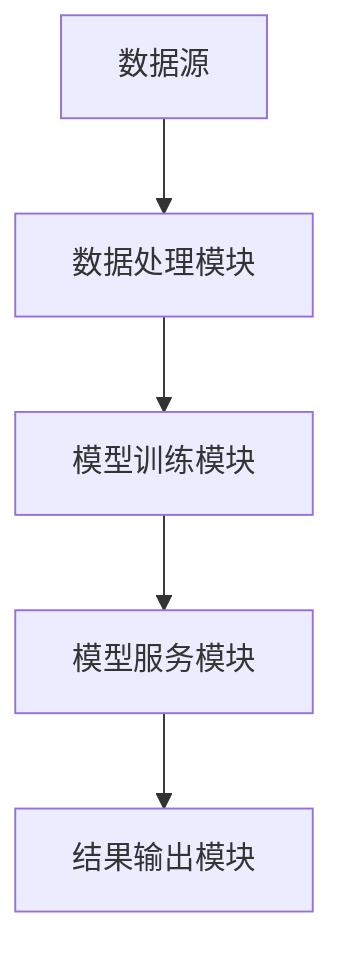
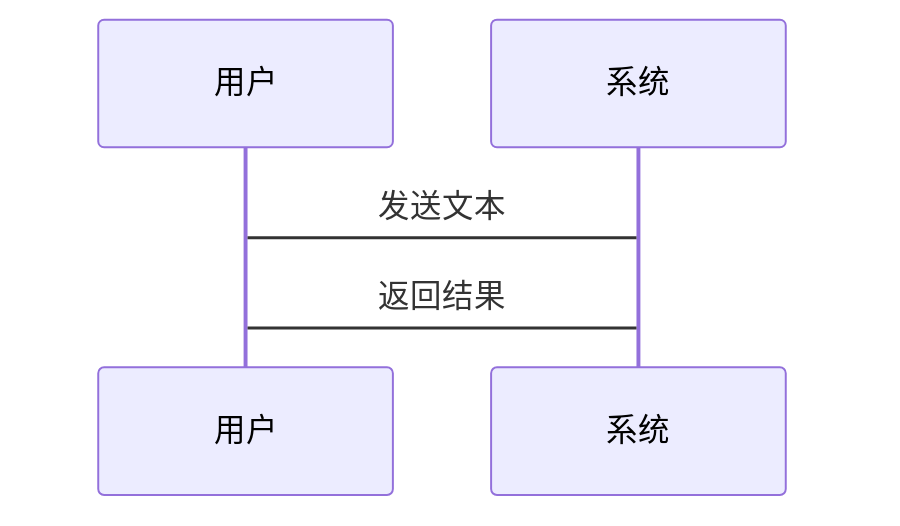

                 

<think>
嗯，用户需要我帮他写一篇关于《构建企业级自然语言处理平台：多语言、多领域、多任务集成》的技术博客。首先，我得理解用户的需求。他是一位技术专家，可能希望有一个结构清晰、内容详尽的文章，涵盖从背景到实战的各个方面。

我应该先梳理一下目录大纲，确保每个部分都详细且逻辑清晰。看起来用户已经提供了一个大纲，但需要填充具体内容。我需要确保每个章节都有足够的细节，包括背景、核心概念、算法原理、系统架构、项目实战和总结。

首先，背景部分需要介绍NLP的定义、演进和企业需求。这部分要让读者明白为什么需要构建企业级NLP平台，以及其重要性。然后是核心概念与技术基础，详细讲解NLP的主要任务、模型架构和算法原理。这部分可能需要一些数学公式和mermaid图来说明。

接下来是算法原理，特别是预训练模型如BERT、Transformer和Seq2Seq。我需要解释它们的工作机制，并可能使用mermaid图来展示流程。系统分析部分需要介绍项目背景、功能设计、架构设计等，可能需要使用架构图和序列图。

项目实战部分要实际，包括环境搭建、核心模块实现、代码解读和案例分析。最后是总结与展望，回顾内容并讨论未来趋势。

在写作过程中，我需要确保每个部分都有足够的技术深度，同时保持语言的简洁易懂。可能需要使用latex公式来展示数学模型，mermaid图来辅助说明系统架构和流程。此外，最佳实践和注意事项部分也很重要，帮助读者在实际应用中避免常见问题。

现在，我得开始一步步填充每个部分，确保内容全面且结构合理。可能需要多次检查，确保每个章节都符合用户的要求，并且逻辑连贯。最终目标是写出一篇高质量的技术博客，帮助读者全面理解企业级NLP平台的构建过程。
</think>

# 构建企业级自然语言处理平台：多语言、多领域、多任务集成

## 关键词：自然语言处理、企业级平台、多语言、多领域、多任务、预训练模型、系统架构

## 摘要：  
本文深入探讨了构建企业级自然语言处理平台的关键技术与方法，涵盖多语言、多领域和多任务的集成。文章从自然语言处理的背景与需求出发，详细分析了核心概念与技术基础，重点讲解了预训练模型的算法原理与实现，结合系统架构设计与项目实战，最后总结了构建企业级自然语言处理平台的实践经验与未来展望。

---

## 第1章: 自然语言处理的背景与需求

### 1.1 自然语言处理的定义与核心概念

#### 1.1.1 自然语言处理的定义  
自然语言处理（Natural Language Processing, NLP）是人工智能领域的重要分支，旨在使计算机能够理解和生成人类语言。NLP的目标是通过计算机程序对文本进行分析、理解和生成，从而实现人机交互或机器辅助的自然语言处理任务。

#### 1.1.2 多语言、多领域、多任务的核心要素  
- **多语言**：支持多种语言的处理，如中文、英文、法语等，满足全球化的需求。  
- **多领域**：覆盖多个垂直领域，如医疗、金融、教育等，实现领域-specific的优化。  
- **多任务**：同时处理多种NLP任务，如文本分类、机器翻译、情感分析等，提升平台的综合能力。  

#### 1.1.3 企业级NLP平台的目标与意义  
企业级NLP平台的目标是通过整合多种NLP技术，提供高效、准确、可扩展的自然语言处理能力，支持企业的智能化转型和数字化升级。

---

### 1.2 企业级NLP平台的背景与需求

#### 1.2.1 企业级NLP的背景  
随着人工智能技术的快速发展，企业对智能化处理的需求日益增长。NLP技术在企业中的应用场景广泛，如客服系统、智能助手、文档处理等。

#### 1.2.2 企业级NLP的需求分析  
- **高效性**：需要快速处理大规模数据，满足实时或准实时的需求。  
- **准确性**：在关键业务场景中，NLP结果的准确性至关重要。  
- **可扩展性**：支持多种语言、多领域和多任务的扩展需求。  

#### 1.2.3 企业级NLP的边界与外延  
企业级NLP平台的边界在于其核心功能和外部接口，而外延则涉及与其他系统的集成，如数据库、业务系统等。

---

## 第2章: 自然语言处理的核心概念与技术

### 2.1 自然语言处理的主要任务

#### 2.1.1 文本分类  
文本分类是将文本划分为预定义的类别，如垃圾邮件分类、情感分析等。

#### 2.1.2 实体识别  
实体识别（Named Entity Recognition,NER）是识别文本中的命名实体，如人名、地名、组织名等。

#### 2.1.3 信息抽取  
信息抽取是从文本中提取结构化信息，如时间、地点、人物等。

#### 2.1.4 机器翻译  
机器翻译是将一种语言的文本转换为另一种语言，如英译中、中译法等。

#### 2.1.5 情感分析  
情感分析是判断文本中表达的情感倾向，如正面、负面或中性。

---

### 2.2 自然语言处理的模型架构

#### 2.2.1 传统NLP模型  
传统NLP模型基于统计方法，如词袋模型、n-gram模型等。

#### 2.2.2 深度学习模型  
深度学习模型如RNN、LSTM、Transformer等，通过神经网络进行特征学习。

#### 2.2.3 预训练语言模型  
预训练语言模型如BERT、GPT、ALBERT等，通过大规模数据预训练，具备强大的上下文理解和生成能力。

---

### 2.3 自然语言处理的算法原理

#### 2.3.1 词袋模型与词嵌入  
词袋模型将文本表示为词袋，忽略词序。词嵌入（如Word2Vec）将词表示为低维向量。

#### 2.3.2 变压器架构  
Transformer架构由编码器和解码器组成，通过自注意力机制捕捉文本中的长距离依赖关系。

#### 2.3.3 注意力机制  
注意力机制（Attention）用于计算词与词之间的相关性，突出重要信息。

---

### 2.4 自然语言处理的预训练模型

#### 2.4.1 BERT模型  
BERT通过双向预训练，擅长上下文理解。

#### 2.4.2 GPT模型  
GPT通过自回归方式生成文本，擅长文本生成。

#### 2.4.3 ALBERT模型  
ALBERT通过参数共享和自适应机制，提升模型效率。

---

## 第3章: 自然语言处理的算法原理与数学模型

### 3.1 BERT模型的算法原理

#### 3.1.1 BERT模型的输入处理  
BERT将输入文本分成tokens，并添加特殊标记[CLS]和[SEP]。

#### 3.1.2 BERT模型的编码器  
编码器由多个Transformer层组成，通过自注意力机制进行特征提取。

#### 3.1.3 BERT模型的解码器  
解码器用于生成文本，基于自注意力和交叉注意力机制。

---

### 3.2 Transformer模型的算法原理

#### 3.2.1 Transformer的基本结构  
Transformer由编码器和解码器组成，编码器负责特征提取，解码器负责生成输出。

#### 3.2.2 注意力机制的数学公式  
$$  
\text{Attention}(Q, K, V) = \text{softmax}\left(\frac{QK^T}{\sqrt{d_k}}\right)V 
$$  

其中，$Q$、$K$、$V$分别是查询、键、值向量，$d_k$是向量维度。

#### 3.2.3 多头注意力机制的实现  
多头注意力机制通过并行处理多个子空间的注意力，提升模型的表达能力。

---

### 3.3 Seq2Seq模型的算法原理

#### 3.3.1 Seq2Seq模型的结构  
Seq2Seq模型由编码器和解码器组成，编码器将输入序列编码为向量，解码器将向量解码为输出序列。

#### 3.3.2 编码器与解码器的交互  
编码器通过自注意力机制提取输入特征，解码器通过交叉注意力机制利用编码器的输出。

#### 3.3.3 生成式模型的实现  
生成式模型如GPT通过自回归方式生成文本，逐步预测下一个词。

---

## 第4章: 自然语言处理的系统分析与架构设计

### 4.1 系统架构设计

#### 4.1.1 系统模块划分  
系统模块包括数据处理模块、模型训练模块、模型服务模块和结果输出模块。

#### 4.1.2 系统架构图  


#### 4.1.3 接口设计  
系统提供RESTful API接口，支持文本分类、实体识别等多种任务。

#### 4.1.4 交互流程  


---

## 第5章: 项目实战

### 5.1 环境搭建

#### 5.1.1 安装Python
```bash
python --version
pip install --upgrade pip
```

#### 5.1.2 安装依赖库
```bash
pip install transformers torch numpy
```

---

### 5.2 核心模块实现

#### 5.2.1 文本分类实现
```python
from transformers import BertTokenizer, BertModel
import torch

tokenizer = BertTokenizer.from_pretrained('bert-base-chinese')
model = BertModel.from_pretrained('bert-base-chinese')

inputs = tokenizer("这是个测试文本", return_tensors="pt")
outputs = model(**inputs)
print(outputs.last_hidden_state)
```

#### 5.2.2 实体识别实现
```python
import spacy

nlp = spacy.load("zh_core_web_sm")
doc = nlp("张三在北京工作。")
for ent in doc.ents:
    print(ent.text, ent.label_)
```

---

### 5.3 案例分析

#### 5.3.1 情感分析案例
```python
from transformers import pipeline

sentiment_pipeline = pipeline("sentiment-analysis")
result = sentiment_pipeline("我非常喜欢这本书。")
print(result)
```

#### 5.3.2 机器翻译案例
```python
from transformers import pipeline

translation_pipeline = pipeline("translation", model="facebook/m2o")
result = translation_pipeline("Hello, how are you?")
print(result)
```

---

## 第6章: 总结与展望

### 6.1 本章小结  
本文详细探讨了构建企业级自然语言处理平台的关键技术与方法，涵盖多语言、多领域和多任务的集成。

### 6.2 未来展望  
未来，随着大模型技术的发展，企业级NLP平台将更加智能化、自动化和高效化。

### 6.3 最佳实践 Tips  
- 在实际应用中，建议结合具体业务需求选择合适的NLP模型。  
- 数据质量对NLP性能至关重要，需注意数据清洗和特征工程。  
- 模型部署时，需关注性能优化和资源管理。

---

## 作者：AI天才研究院/AI Genius Institute & 禅与计算机程序设计艺术 /Zen And The Art of Computer Programming

