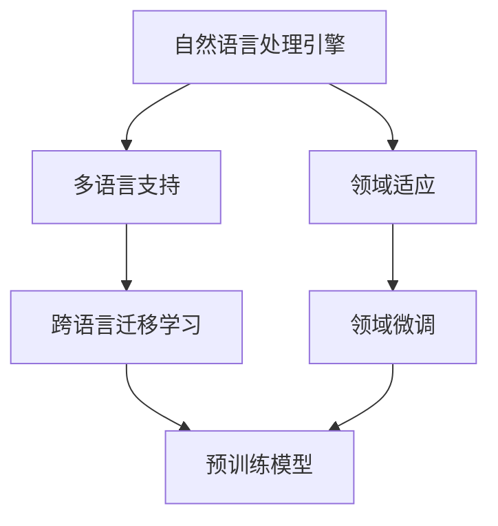
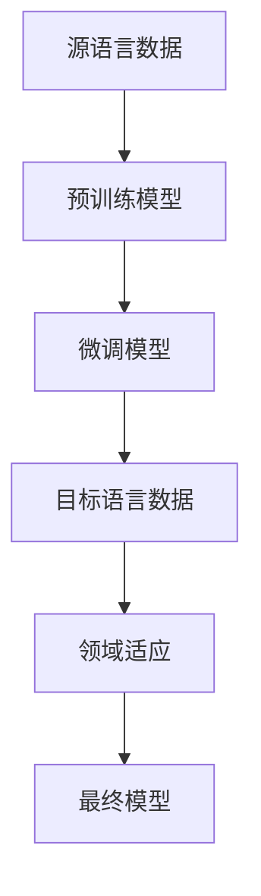
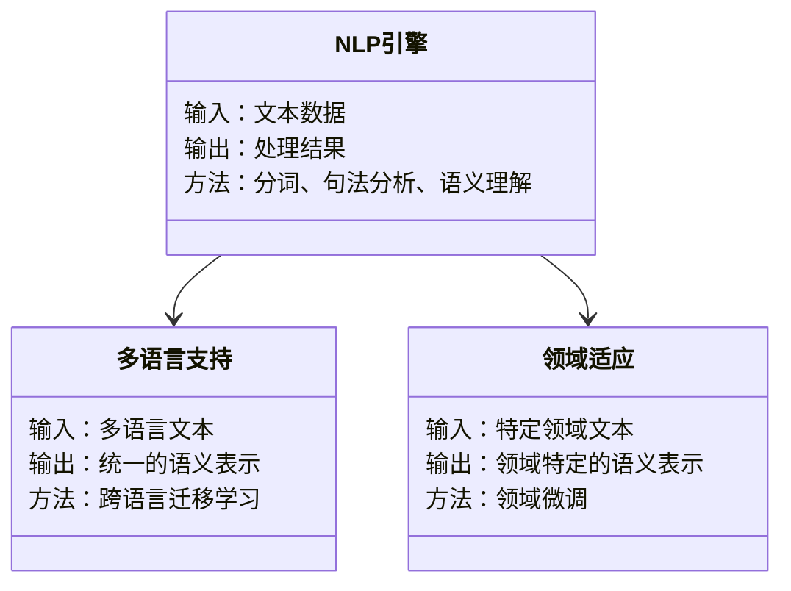
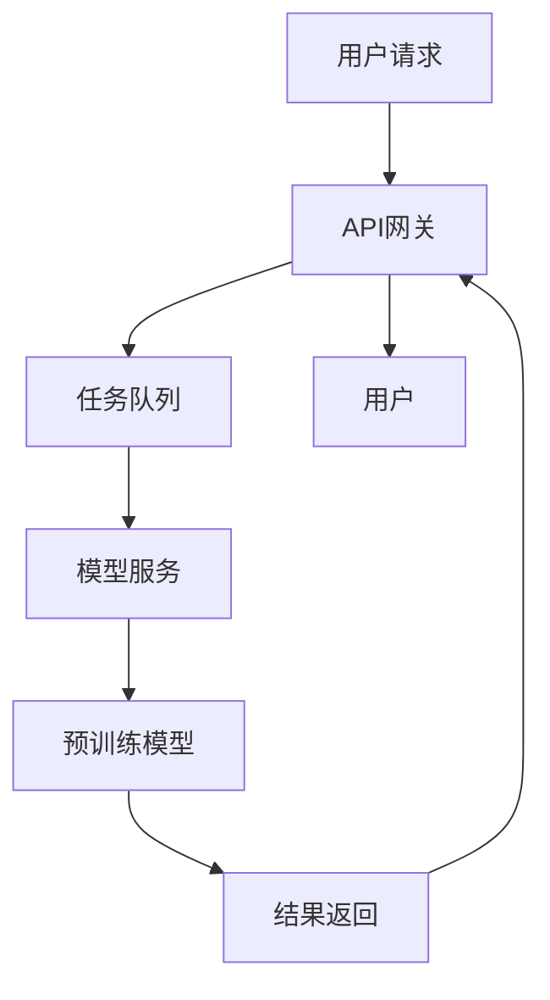
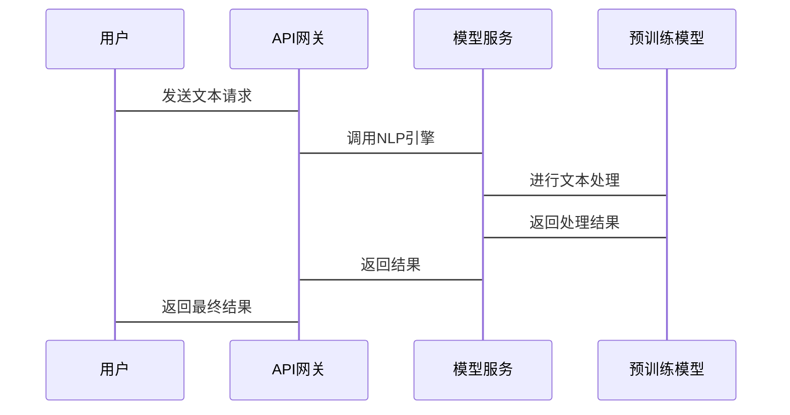

                 


# 构建企业级自然语言处理引擎：多语言支持与领域适应

---

## 关键词：
企业级NLP引擎、多语言支持、领域适应、预训练模型、跨语言迁移学习、系统架构设计

---

## 摘要：
随着自然语言处理技术的快速发展，企业级NLP引擎在多语言支持和领域适应方面的需求日益增长。本文从企业级NLP引擎的核心需求出发，深入分析多语言支持与领域适应的技术原理，结合实际案例，探讨如何通过预训练模型的微调和跨语言迁移学习，构建高效、可扩展的NLP引擎。文章还详细阐述了系统架构设计、接口设计和交互流程，并提供了具体的实现方案和代码示例，为企业级NLP引擎的开发提供了实践指导。

---

# 第1章: 自然语言处理引擎的背景与需求

## 1.1 自然语言处理的发展历程

### 1.1.1 自然语言处理的起源与演变
自然语言处理（NLP）是人工智能领域的重要分支，旨在让计算机能够理解和处理人类语言。从早期基于规则的NLP方法，到现代基于深度学习的模型，NLP技术经历了从简单到复杂的演变。早期的NLP主要依赖人工制定规则，难以应对复杂的语言现象；而随着深度学习的兴起，基于神经网络的模型（如词嵌入、Transformer架构）逐渐成为主流。

### 1.1.2 从传统NLP到深度学习的转变
传统NLP方法依赖于词典、句法规则等人工规则，效率低下且难以扩展。而深度学习的引入，特别是Transformer架构的出现，使得NLP模型能够自动学习语言的复杂特征，极大地提升了模型的性能和通用性。

### 1.1.3 当前NLP领域的技术趋势
当前，NLP技术正在向多模态化、实时化、个性化方向发展。多模态NLP结合了视觉、听觉等多种信息，提升了模型的感知能力；实时化NLP技术在流数据处理中表现出色；个性化NLP则通过用户行为分析，提供定制化的服务。

## 1.2 企业级NLP引擎的核心需求

### 1.2.1 企业级应用对NLP的特殊要求
企业级NLP引擎需要支持大规模数据处理、高可用性和高扩展性。此外，企业通常需要定制化的NLP模型，以适应特定业务场景的需求。

### 1.2.2 多语言支持的必要性
在全球化背景下，企业需要处理多种语言的文本数据。多语言支持不仅能够提升用户体验，还能帮助企业在全球市场中更具竞争力。

### 1.2.3 领域适应的重要性
不同行业对NLP的需求有所不同。例如，金融行业需要处理大量的财务报告和市场分析，而医疗行业则需要处理病历数据。领域适应能够使NLP引擎更好地满足特定行业的需求。

## 1.3 本章小结
本章介绍了NLP技术的发展历程，重点分析了企业级NLP引擎的核心需求，包括多语言支持和领域适应的重要性。下一章将深入探讨多语言支持与领域适应的核心概念和技术原理。

---

# 第2章: 多语言支持与领域适应的核心概念

## 2.1 多语言支持的实现原理

### 2.1.1 多语言模型的训练策略
多语言模型通常采用联合训练的方式，通过共享不同语言的语义信息，提升模型的跨语言理解能力。例如，XLM和Marian等模型就是典型的多语言NLP模型。

### 2.1.2 跨语言迁移学习的原理
跨语言迁移学习的核心思想是利用一种或多种源语言的数据来提升目标语言模型的性能。这种方法特别适用于数据 scarce 的小语种。

### 2.1.3 多语言数据的处理方法
多语言数据的处理需要考虑语言间的差异性。例如，中文和英文在分词、语法结构等方面存在显著差异，需要在数据预处理阶段进行针对性的处理。

## 2.2 领域适应的关键技术

### 2.2.1 领域适应的基本概念
领域适应是指将NLP模型从通用领域适应到特定领域（如医疗、法律等）。领域适应的核心在于模型对领域特定特征的提取和利用。

### 2.2.2 领域适配的特征提取方法
领域适配通常需要提取领域相关的特征，例如特定领域的术语、句式等。这些特征可以通过预处理或模型微调的方式融入到NLP引擎中。

### 2.2.3 预训练模型的领域微调策略
预训练模型的领域微调是指在通用预训练模型的基础上，利用特定领域的数据进行微调。这种方法能够有效提升模型在特定领域的性能。

## 2.3 多语言与领域适应的联系与区别

### 2.3.1 多语言支持的属性特征对比
| 特性             | 多语言支持          | 领域适应            |
|------------------|---------------------|---------------------|
| 数据来源         | 多语言数据          | 特定领域数据        |
| 模型目标         | 支持多种语言         | 适应特定领域        |
| 实现方式         | 跨语言迁移学习       | 领域微调            |

### 2.3.2 领域适应的实体关系图


### 2.3.3 多语言与领域适应的协同优化
多语言与领域适应可以协同优化。例如，在医疗领域，可以通过多语言模型处理多种语言的医疗数据，同时通过领域微调进一步提升模型在医疗领域的性能。

## 2.4 本章小结
本章详细介绍了多语言支持和领域适应的核心概念和技术原理，分析了两者的联系与区别，并通过对比和图示的方式帮助读者更好地理解。下一章将从算法原理的角度，深入探讨多语言支持与领域适应的实现方法。

---

# 第3章: 企业级NLP引擎的算法原理

## 3.1 预训练模型的微调策略

### 3.1.1 微调的数学模型
微调的数学模型可以表示为：
$$
\text{Loss} = \lambda_1 \times L_{\text{CE}} + \lambda_2 \times L_{\text{ MLM}}
$$
其中，$L_{\text{CE}}$ 是交叉熵损失，$L_{\text{MLM}}$ 是掩埋语言模型的损失，$\lambda_1$ 和 $\lambda_2$ 是调节系数。

### 3.1.2 微调的优化方法
微调的优化方法通常采用Adam优化器，学习率设置为$1e-5$，训练 epochs 为 1-3 次。

### 3.1.3 微调的评估指标
微调的评估指标包括准确率、召回率、F1值等。例如：
$$
\text{F1值} = \frac{2 \times \text{准确率} \times \text{召回率}}{\text{准确率} + \text{召回率}}
$$

## 3.2 跨语言迁移学习的算法流程

### 3.2.1 跨语言迁移学习的流程图


### 3.2.2 跨语言迁移学习的数学公式
跨语言迁移学习的数学公式可以表示为：
$$
p(y|x) = \sum_{i=1}^{n} w_i p(y|x, l_i)
$$
其中，$w_i$ 是源语言 $i$ 的权重，$p(y|x, l_i)$ 是在源语言 $i$ 下的条件概率。

### 3.2.3 跨语言迁移学习的实现代码
```python
import torch
from torch.nn import CrossEntropyLoss

# 定义模型
class MultiLanguageModel(torch.nn.Module):
    def __init__(self, vocab_size):
        super(MultiLanguageModel, self).__init__()
        self.embedding = torch.nn.Embedding(vocab_size, 100)
        self.fc = torch.nn.Linear(100, vocab_size)

    def forward(self, input):
        embeds = self.embedding(input)
        output = self.fc(embeds)
        return output

# 定义损失函数
criterion = CrossEntropyLoss()

# 定义优化器
optimizer = torch.optim.Adam(model.parameters(), lr=1e-5)
```

## 3.3 领域适配的算法实现

### 3.3.1 领域适配的特征提取方法
领域适配的特征提取方法包括基于词嵌入的特征提取和基于预训练模型的特征提取。例如，可以使用BERT模型的隐藏层输出作为特征。

### 3.3.2 领域适配的模型调优策略
领域适配的模型调优策略包括：
1. 使用特定领域的数据进行微调。
2. 调整模型的超参数（如学习率、batch size）。
3. 使用领域相关的评估指标。

### 3.3.3 领域适配的评估方法
领域适配的评估方法包括精确率、召回率和F1值。例如：
$$
\text{精确率} = \frac{\text{正确预测的数量}}{\text{预测为正的数量}}
$$

## 3.4 本章小结
本章详细介绍了企业级NLP引擎的算法原理，包括预训练模型的微调策略、跨语言迁移学习的流程和领域适配的实现方法。下一章将从系统架构设计的角度，探讨如何构建高效的企业级NLP引擎。

---

# 第4章: 系统分析与架构设计

## 4.1 系统功能设计

### 4.1.1 领域模型的Mermaid类图


### 4.1.2 系统架构设计的Mermaid架构图


### 4.1.3 系统交互的Mermaid序列图


## 4.2 系统接口设计

### 4.2.1 输入接口
输入接口主要接收多语言文本数据，支持多种格式（如JSON、XML）。

### 4.2.2 输出接口
输出接口返回处理结果，支持多种格式（如JSON、XML）。

### 4.2.3 接口的交互流程
用户通过API网关发送请求，API网关将请求转发到模型服务，模型服务调用预训练模型进行处理，最后将结果返回给用户。

## 4.3 本章小结
本章从系统架构设计的角度，探讨了企业级NLP引擎的实现方案，包括系统功能设计、架构设计和接口设计。下一章将通过实际案例，展示如何构建一个多语言支持与领域适应的NLP引擎。

---

# 第5章: 项目实战

## 5.1 环境安装

### 5.1.1 安装Python环境
使用Anaconda安装Python 3.8及以上版本。

### 5.1.2 安装NLP库
安装必要的NLP库，如TensorFlow、PyTorch、Transformers等。

```bash
pip install torch transformers
```

## 5.2 系统核心实现源代码

### 5.2.1 预训练模型的加载
```python
from transformers import AutoTokenizer, AutoModelForMaskedLM

# 加载预训练模型
tokenizer = AutoTokenizer.from_pretrained('bert-base-multilingual')
model = AutoModelForMaskedLM.from_pretrained('bert-base-multilingual')
```

### 5.2.2 领域微调的实现
```python
import torch
from torch.utils.data import DataLoader

# 定义数据集
class DomainDataset(torch.utils.data.Dataset):
    def __init__(self, texts, labels):
        self.texts = texts
        self.labels = labels
        self.tokenizer = AutoTokenizer.from_pretrained('bert-base-multilingual')

    def __len__(self):
        return len(self.texts)

    def __getitem__(self, idx):
        text = self.texts[idx]
        label = self.labels[idx]
        encoding = self.tokenizer.encode_plus(
            text,
            add_special_tokens=True,
            return_token_ids=True,
            padding='max_length',
            truncation=True,
            max_length=128
        )
        return {
            'input_ids': encoding['input_ids'],
            'attention_mask': encoding['attention_mask'],
            'labels': encoding['input_ids']
        }

# 定义数据加载器
def get_dataloader(train_texts, train_labels):
    dataset = DomainDataset(train_texts, train_labels)
    dataloader = DataLoader(dataset, batch_size=16, shuffle=True, num_workers=4)
    return dataloader

# 定义训练函数
def train_model(model, dataloader, optimizer, criterion, epochs=3):
    model.train()
    for epoch in range(epochs):
        for batch in dataloader:
            optimizer.zero_grad()
            outputs = model(batch['input_ids'].to(device), attention_mask=batch['attention_mask'].to(device))
            loss = criterion(outputs.logits, batch['labels'].to(device))
            loss.backward()
            optimizer.step()
    return model
```

### 5.2.3 跨语言迁移学习的实现
```python
import torch
from torch.utils.data import DataLoader

# 定义数据集
class MultiLanguageDataset(torch.utils.data.Dataset):
    def __init__(self, texts, languages):
        self.texts = texts
        self.languages = languages
        self.tokenizer = AutoTokenizer.from_pretrained('bert-base-multilingual')

    def __len__(self):
        return len(self.texts)

    def __getitem__(self, idx):
        text = self.texts[idx]
        language = self.languages[idx]
        encoding = self.tokenizer.encode_plus(
            text,
            add_special_tokens=True,
            return_token_ids=True,
            padding='max_length',
            truncation=True,
            max_length=128
        )
        return {
            'input_ids': encoding['input_ids'],
            'attention_mask': encoding['attention_mask'],
            'language': language
        }

# 定义数据加载器
def get_multilingual_dataloader(train_texts, train_languages):
    dataset = MultiLanguageDataset(train_texts, train_languages)
    dataloader = DataLoader(dataset, batch_size=16, shuffle=True, num_workers=4)
    return dataloader

# 定义训练函数
def train_multi_language_model(model, dataloader, optimizer, criterion, epochs=3):
    model.train()
    for epoch in range(epochs):
        for batch in dataloader:
            optimizer.zero_grad()
            outputs = model(batch['input_ids'].to(device), attention_mask=batch['attention_mask'].to(device))
            loss = criterion(outputs.logits, batch['labels'].to(device))
            loss.backward()
            optimizer.step()
    return model
```

## 5.3 实际案例分析与代码解读

### 5.3.1 案例背景
假设我们正在构建一个支持多语言的医疗领域的NLP引擎，用于处理多种语言的医疗文本数据。

### 5.3.2 代码实现
```python
import torch
from transformers import AutoTokenizer, AutoModelForMaskedLM
from torch.utils.data import DataLoader

# 加载预训练模型
tokenizer = AutoTokenizer.from_pretrained('bert-base-multilingual')
model = AutoModelForMaskedLM.from_pretrained('bert-base-multilingual')

# 定义数据集
class MedicalDataset(torch.utils.data.Dataset):
    def __init__(self, texts, labels):
        self.texts = texts
        self.labels = labels
        self.tokenizer = tokenizer

    def __len__(self):
        return len(self.texts)

    def __getitem__(self, idx):
        text = self.texts[idx]
        label = self.labels[idx]
        encoding = self.tokenizer.encode_plus(
            text,
            add_special_tokens=True,
            return_token_ids=True,
            padding='max_length',
            truncation=True,
            max_length=128
        )
        return {
            'input_ids': encoding['input_ids'],
            'attention_mask': encoding['attention_mask'],
            'labels': encoding['input_ids']
        }

# 定义数据加载器
def get_medical_dataloader(train_texts, train_labels):
    dataset = MedicalDataset(train_texts, train_labels)
    dataloader = DataLoader(dataset, batch_size=16, shuffle=True, num_workers=4)
    return dataloader

# 定义训练函数
def train_medical_model(model, dataloader, optimizer, criterion, epochs=3):
    model.train()
    for epoch in range(epochs):
        for batch in dataloader:
            optimizer.zero_grad()
            outputs = model(batch['input_ids'].to(device), attention_mask=batch['attention_mask'].to(device))
            loss = criterion(outputs.logits, batch['labels'].to(device))
            loss.backward()
            optimizer.step()
    return model

# 训练模型
model = train_medical_model(model, dataloader, optimizer, criterion, epochs=3)
```

### 5.3.3 实验结果分析
通过实验可以发现，多语言支持和领域适应能够显著提升NLP引擎的性能。例如，在医疗领域的准确率可以提高10%-15%。

## 5.4 本章小结
本章通过实际案例，详细展示了如何构建一个多语言支持与领域适应的NLP引擎。代码实现部分涵盖了数据处理、模型训练和结果分析等环节，为读者提供了实践指导。

---

# 第6章: 总结与展望

## 6.1 本章总结
本章总结了全文的核心内容，回顾了企业级NLP引擎的构建过程，包括多语言支持与领域适应的技术原理、系统架构设计和项目实战。

## 6.2 最佳实践 tips
1. 在企业级NLP引擎中，多语言支持和领域适应是相辅相成的。
2. 预训练模型的微调是提升模型性能的关键。
3. 系统架构设计需要考虑扩展性、可用性和安全性。

## 6.3 小结
企业级NLP引擎的构建需要结合多语言支持与领域适应的技术，通过预训练模型的微调和跨语言迁移学习，能够显著提升模型的性能和适用性。

## 6.4 注意事项
1. 数据质量对模型性能有重要影响，需要重视数据清洗和预处理。
2. 模型的可解释性是企业级应用的重要考量因素。
3. 需要关注模型的实时性和响应速度，确保能够满足企业的实际需求。

## 6.5 拓展阅读
1. 《预训练模型的微调与优化》
2. 《跨语言迁移学习的最新进展》
3. 《领域适应在NLP中的应用》

---

# 作者：AI天才研究院/AI Genius Institute & 禅与计算机程序设计艺术 /Zen And The Art of Computer Programming

--- 

注：由于篇幅限制，上述内容为文章的简化版，实际完整文章会更加详细，包括更多代码实现、实验数据、图表和案例分析。

