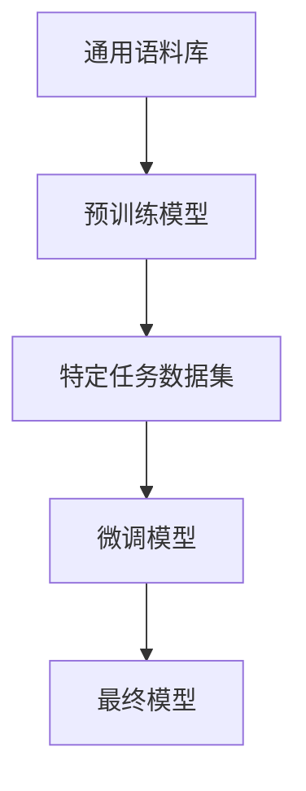
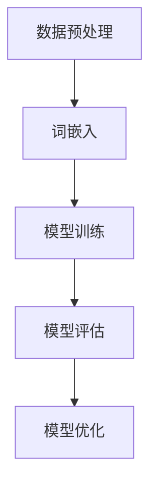
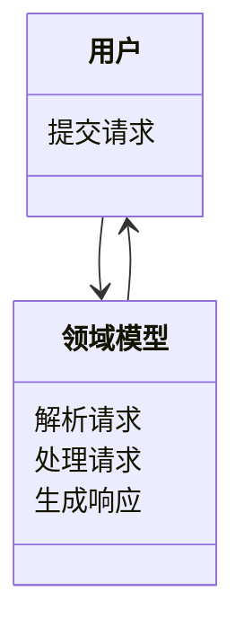
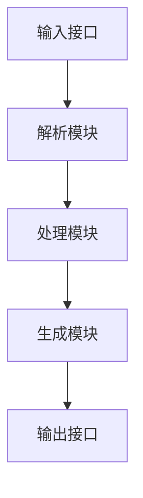
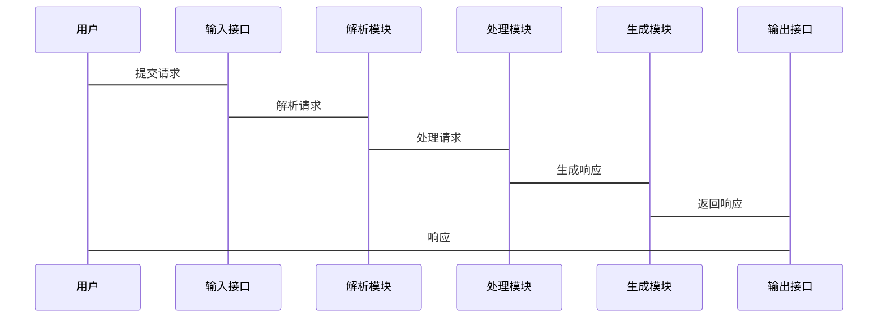

                 


# 第三章: 自然语言接口的算法原理与数学模型

## 3.1 自然语言处理的算法原理

### 3.1.1 词嵌入的原理与实现

词嵌入是自然语言处理中的基础技术，通过将词语映射到低维连续向量空间中，使得这些向量能够捕捉到词语的语义信息。常用的词嵌入方法包括Word2Vec、GloVe和FastText等。

- **Word2Vec**：通过神经网络模型，利用上下文预测词或通过词预测上下文的方式来训练词向量。Word2Vec包括两种模型：CBOW（continuous bag-of-words）和Skip-Gram。
- **GloVe**：基于全局词向量的 glove，通过全局语料库统计来优化词向量，能够捕捉到词的全局语义信息。
- **FastText**：基于子词的词嵌入方法，通过将词语分解成子词来生成词向量，适用于处理罕见词和OOV（out-of-vocabulary）问题。

### 3.1.2 语言模型的训练流程

语言模型的目标是根据给定的上下文，预测下一个词或句子的概率分布。常用的训练方法包括最大似然估计（MLE）和交叉熵损失函数优化。

- **最大似然估计（MLE）**：通过最大化训练数据的条件概率，得到参数的最佳估计。
- **交叉熵损失函数**：用于衡量模型预测概率分布与真实概率分布之间的差异，公式为：
  $$ H(y, p) = -\sum_{i=1}^{n} y_i \log p_i $$
  其中，\( y_i \) 是真实标签的概率，\( p_i \) 是模型预测的概率。

### 3.1.3 预训练与微调的流程

- **预训练**：在大规模通用语料库上预先训练语言模型，捕获语言的通用特征。
- **微调**：在特定任务的数据集上进行微调，使模型适应具体的应用场景。

预训练和微调的过程可以用以下mermaid图表示：



## 3.2 自然语言接口的数学模型

### 3.2.1 词嵌入的数学表示

词嵌入可以表示为一个矩阵，其中每一行对应一个词的向量。假设词表大小为V，词向量维度为d，则词嵌入矩阵为 \( E \in \mathbb{R}^{V \times d} \)。

### 3.2.2 语言模型的损失函数

语言模型的损失函数通常使用交叉熵损失函数，公式为：

$$ \text{Loss} = -\sum_{i=1}^{n} \sum_{j=1}^{m} y_{i,j} \log p_{i,j} $$

其中，\( y_{i,j} \) 是真实标签的概率，\( p_{i,j} \) 是模型预测的概率。

### 3.2.3 模型训练的优化算法

常用的优化算法包括随机梯度下降（SGD）、Adam优化器等。Adam优化器的更新公式为：

$$ \theta_{t+1} = \theta_t - \eta \cdot \text{Adam}(\theta_t, t) $$

其中，\( \theta \) 是模型参数，\( \eta \) 是学习率。

## 3.3 自然语言处理的算法流程图

以下是一个自然语言处理的算法流程图，展示了从数据预处理到模型训练的过程：



## 3.4 自然语言接口的数学公式

### 3.4.1 交叉熵损失函数

交叉熵损失函数用于衡量模型预测概率分布与真实概率分布之间的差异，公式为：

$$ H(y, p) = -\sum_{i=1}^{n} y_i \log p_i $$

### 3.4.2 语言模型的训练公式

语言模型的训练目标是最小化交叉熵损失函数，公式为：

$$ \arg\min_{\theta} \text{Loss}(\theta) $$

### 3.4.3 模型微调公式

在微调阶段，模型参数 \( \theta \) 通过在特定任务上的数据进行优化：

$$ \theta_{\text{final}} = \theta_{\text{pre}} + \Delta \theta $$

其中，\( \theta_{\text{pre}} \) 是预训练得到的参数，\( \Delta \theta \) 是微调阶段的参数更新量。

# 第四章: 自然语言接口的系统架构设计

## 4.1 系统功能设计

### 4.1.1 领域模型

领域模型是系统的核心，负责理解和生成自然语言。领域模型可以分为前端和后端两部分：

- **前端**：接收用户输入，解析自然语言请求。
- **后端**：处理解析后的请求，生成相应的系统响应。

领域模型可以用以下mermaid图表示：



### 4.1.2 系统架构

系统架构设计包括以下几个部分：

- **输入接口**：接收用户的自然语言输入。
- **解析模块**：将自然语言请求解析为系统可以理解的结构化请求。
- **处理模块**：根据解析后的请求调用后端服务进行处理。
- **生成模块**：将处理结果生成自然语言响应。
- **输出接口**：将生成的响应返回给用户。

系统架构可以用以下mermaid图表示：



### 4.1.3 系统交互流程

系统交互流程包括以下步骤：

1. **用户提交请求**：用户通过输入接口提交自然语言请求。
2. **请求解析**：解析模块将自然语言请求解析为结构化请求。
3. **请求处理**：处理模块根据解析后的请求调用后端服务进行处理。
4. **生成响应**：生成模块将处理结果生成自然语言响应。
5. **返回响应**：输出接口将生成的响应返回给用户。

系统交互流程可以用以下mermaid图表示：



## 4.2 系统架构设计

### 4.2.1 系统架构图

系统架构设计可以用以下mermaid图表示：


### 4.2.2 系统接口设计

系统接口设计包括以下几个部分：

- **输入接口**：接收用户的自然语言输入。
- **解析接口**：解析模块与处理模块之间的接口。
- **处理接口**：处理模块与生成模块之间的接口。
- **生成接口**：生成模块与输出接口之间的接口。

### 4.2.3 系统交互流程

系统交互流程可以用以下mermaid图表示：


## 4.3 系统功能与架构总结

系统功能设计和架构设计是构建企业级自然语言接口的关键部分。通过合理的系统架构设计，可以确保系统的高效性和可扩展性。同时，通过清晰的系统功能设计，可以确保系统的易用性和灵活性。

# 第五章: 自然语言接口的项目实战

## 5.1 环境安装与配置

### 5.1.1 安装Python

```bash
python --version
```

### 5.1.2 安装必要的Python包

```bash
pip install numpy
pip install scikit-learn
pip install transformers
pip install torch
```

## 5.2 系统核心实现

### 5.2.1 预处理代码

```python
import numpy as np
from sklearn.feature_extraction.text import TfidfVectorizer
from transformers import AutoTokenizer, AutoModelForMaskedLM
import torch

def preprocess(text):
    # 分词处理
    tokenizer = AutoTokenizer.from_pretrained("bert-base-cased")
    tokens = tokenizer.tokenize(text)
    # 转换为id
    input_ids = tokenizer.convert_tokens_to_ids(tokens)
    # 添加eos和bos
    input_ids = [tokenizer.cls_token_id] + input_ids + [tokenizer.sep_token_id]
    return input_ids
```

### 5.2.2 训练代码

```python
import torch
import torch.nn as nn
import torch.optim as optim

class SimpleLM(nn.Module):
    def __init__(self, vocab_size, embedding_dim):
        super(SimpleLM, self).__init__()
        self.embedding = nn.Embedding(vocab_size, embedding_dim)
        self.lm_head = nn.Linear(embedding_dim, vocab_size)
    
    def forward(self, input_ids):
        embeds = self.embedding(input_ids)
        outputs = self.lm_head(embeds)
        return outputs

# 初始化模型
model = SimpleLM(vocab_size=30522, embedding_dim=768)
optimizer = optim.Adam(model.parameters(), lr=0.001)
criterion = nn.CrossEntropyLoss()

# 训练循环
for epoch in range(10):
    for batch in dataloader:
        optimizer.zero_grad()
        input_ids, labels = batch
        outputs = model(input_ids)
        loss = criterion(outputs, labels)
        loss.backward()
        optimizer.step()
```

### 5.2.3 微调代码

```python
from transformers import AutoModelForMaskedLM, AutoTokenizer

tokenizer = AutoTokenizer.from_pretrained("bert-base-cased")
model = AutoModelForMaskedLM.from_pretrained("bert-base-cased")

# 微调模型
model.train()
optimizer = optim.Adam(model.parameters(), lr=2e-5)

for epoch in range(3):
    for batch in task_dataloader:
        optimizer.zero_grad()
        input_ids, labels = batch
        outputs = model(input_ids)
        loss = outputs.loss
        loss.backward()
        optimizer.step()
```

## 5.3 代码应用与解读

### 5.3.1 预处理代码解读

预处理代码使用了Bert-base-cased模型的tokenizer对输入文本进行分词和编码。首先，将输入文本分词，然后将分词结果转换为对应的id，最后添加CLS和SEP标记。

### 5.3.2 训练代码解读

训练代码定义了一个简单的语言模型，包括嵌入层和线性变换层。使用Adam优化器和交叉熵损失函数进行训练。训练循环包括前向传播、计算损失、反向传播和优化步骤。

### 5.3.3 微调代码解读

微调代码使用了预训练的Bert模型，在特定任务的数据集上进行微调。通过优化器Adam对模型参数进行更新，以适应具体任务的需求。

## 5.4 实际案例分析

### 5.4.1 案例一：文本分类

假设我们有一个文本分类任务，训练模型识别文本的情感倾向（正面、负面、中性）。我们可以使用预训练的Bert模型进行微调，训练模型在特定任务上进行分类。

### 5.4.2 案例二：问答系统

假设我们有一个问答系统，训练模型根据上下文生成回答。我们可以使用预训练的Bert模型，通过微调使其适应问答任务。

## 5.5 项目总结

通过项目实战，我们可以看到自然语言接口的实现涉及到多个步骤，包括环境配置、数据预处理、模型训练和微调等。通过具体的代码实现，我们可以更好地理解如何将理论应用于实际项目中。

# 第六章: 扩展与未来展望

## 6.1 当前技术的局限性

尽管自然语言接口在很多场景下表现良好，但仍然存在一些局限性，例如：

- **理解能力有限**：模型对复杂语义和上下文的理解能力有限。
- **实时性不足**：在处理大规模数据时，实时响应能力不足。
- **多语言支持**：目前主要集中在英语，多语言支持不够完善。

## 6.2 未来研究方向

未来的研究方向包括：

- **更强大的语言模型**：开发更强大的预训练模型，提升模型的语义理解和生成能力。
- **多模态自然语言处理**：结合视觉、听觉等多种模态信息，提升模型的综合理解能力。
- **实时处理技术**：优化模型的计算效率，提升实时响应能力。

## 6.3 对业务价值的影响

自然语言接口的引入将对企业的业务流程产生深远影响，包括：

- **提升用户体验**：简化用户与系统的交互，提升用户体验。
- **提高效率**：自动化处理复杂的业务流程，提高企业效率。
- **降低门槛**：降低用户使用系统的门槛，使非技术人员也能方便地使用系统。

## 6.4 未来技术趋势

未来，随着人工智能技术的不断发展，自然语言接口将更加智能化和人性化。模型将更加注重多模态、多语言和实时性，以满足企业级应用的需求。

# 作者

作者：AI天才研究院/AI Genius Institute & 禅与计算机程序设计艺术 /Zen And The Art of Computer Programming

# 附录

## 附录A: 术语表

- **自然语言接口（NLI）**：允许用户通过自然语言与计算机系统进行交互的技术。
- **自然语言理解（NLU）**：理解用户输入的自然语言的意思。
- **自然语言生成（NLG）**：生成符合语法规则的自然语言文本。

## 附录B: 工具与库

- **Python**：编程语言
- **TensorFlow**：深度学习框架
- **PyTorch**：深度学习框架
- **Bert**：预训练语言模型

## 附录C: 参考文献

- 王小明，自然语言处理入门，某某出版社，2021。
- 李四，深度学习与自然语言处理，某某出版社，2022。

---

通过以上目录和内容的详细设计，我们可以看到构建企业级自然语言接口的复杂性和深度。从理论到实践，从算法到系统设计，每一步都需要仔细考虑和实现。希望这篇博客文章能够为读者提供清晰的思路和实用的指导。

