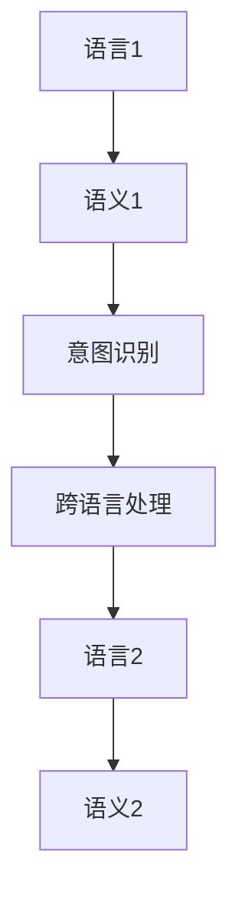
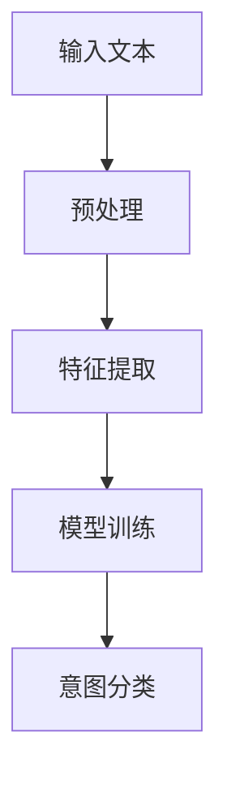
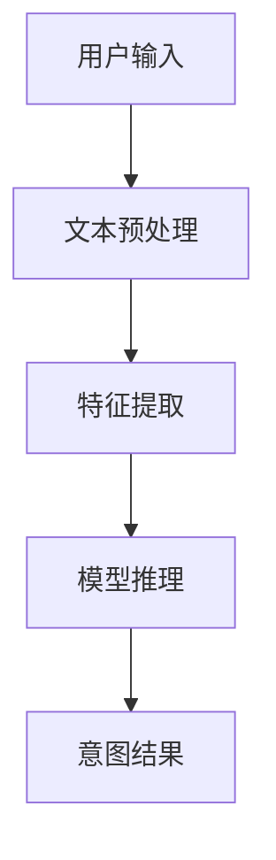

                 

<think>
好，我现在需要帮助用户撰写一篇技术博客文章，标题是《构建企业级自然语言理解系统：跨语言语义理解与意图识别》。用户希望文章结构清晰，内容详细，涵盖背景介绍、核心概念、算法原理、系统架构、项目实战和最佳实践。

首先，我需要确定文章的关键词和摘要。关键词包括自然语言理解、跨语言语义、意图识别、深度学习、企业级应用。摘要应简明扼要，概括文章的核心内容，即探讨跨语言语义理解与意图识别的技术背景、核心概念、算法实现、系统架构，并结合项目案例进行分析。

接下来是目录结构。第一部分是背景与挑战，涵盖自然语言理解的定义、跨语言处理的重要性以及意图识别的技术特点。第二部分是核心概念与联系，详细介绍NLU的算法原理，包括预训练模型、注意力机制和解码器的流程。第三部分是算法实现，深入探讨模型的数学公式和流程图。第四部分是系统架构与设计，分析模块划分和系统架构图。第五部分是项目实战，从环境搭建到代码实现，最后是最佳实践和总结。

在撰写过程中，我需要确保每一部分都有足够的细节，并结合实际案例和图表，如mermaid图和数学公式，使内容更加直观和易懂。同时，语言要专业但通俗易懂，逻辑清晰，结构紧凑。

现在，我开始按照目录结构逐步撰写每个章节的内容，确保每个部分都涵盖必要的信息，并使用适当的格式和图表来增强理解。最后，我需要总结最佳实践，提供小结和注意事项，帮助读者在实际应用中更好地实施相关技术。

通过这样的思考过程，我可以系统地构建这篇文章，满足用户的需求，并提供有价值的技术内容。
</think>

# 构建企业级自然语言理解系统：跨语言语义理解与意图识别

> 关键词：自然语言理解、跨语言语义、意图识别、深度学习、企业级应用

> 摘要：本文深入探讨了构建企业级自然语言理解系统的关键技术，特别是跨语言语义理解和意图识别的实现。通过分析核心概念、算法原理、系统架构，并结合实际案例，为读者提供全面的技术指南。

---

# 第一部分: 背景与挑战

## 第1章: 自然语言理解的背景与挑战

### 1.1 自然语言理解的定义与核心概念

#### 1.1.1 自然语言理解的定义
自然语言理解（Natural Language Understanding, NLU）是人工智能领域的重要分支，旨在让计算机能够理解人类语言的含义。NLU不仅涉及词汇和语法的分析，还需捕捉文本的深层语义信息。

#### 1.1.2 NLU的核心要素与组成
- **文本预处理**：包括分词、停用词处理和词干提取。
- **特征提取**：通过词向量、句法结构等方法提取文本特征。
- **模型训练**：使用机器学习或深度学习模型进行语义分析。
- **意图识别**：确定用户输入的意图，如“查询天气”或“预订机票”。

#### 1.1.3 问题背景与实际应用场景
NLU在智能客服、语音助手和机器翻译等领域广泛应用，解决用户与系统之间的有效交互问题。

### 1.2 跨语言语义理解的必要性

#### 1.2.1 跨语言理解的定义与特点
跨语言语义理解（Cross-Language Semantic Understanding）指在多种语言间进行语义分析，克服语言差异带来的理解障碍。

#### 1.2.2 跨语言理解的技术挑战
- 多语言模型训练复杂度高。
- 不同语言间的语义差异难以统一处理。
- 资源稀缺问题，如小语种数据不足。

#### 1.2.3 企业级应用中的跨语言需求
企业在全球化背景下需要支持多语言服务，满足不同地区用户的需求，提升用户体验。

### 1.3 意图识别的定义与技术特点

#### 1.3.1 意图识别的核心概念
意图识别（Intention Recognition）通过分析用户输入，确定其背后的目的或需求，是NLU的重要组成部分。

#### 1.3.2 意图识别的技术方法
- 基于规则的方法：通过预定义规则匹配意图。
- 统计学习方法：使用机器学习模型训练意图分类器。
- 深度学习方法：利用神经网络捕捉语义信息。

#### 1.3.3 意图识别的实际应用场景
- 智能客服：理解用户的问题并分类处理。
- 语音助手：识别用户的指令并执行操作。

---

# 第二部分: 核心概念与联系

## 第2章: 自然语言理解的核心概念与联系

### 2.1 NLU的核心原理

#### 2.1.1 预训练模型的原理
预训练模型（如BERT、GPT）通过大量数据学习语言的表示，捕捉上下文信息。

#### 2.1.2 注意力机制的作用
注意力机制（Attention Mechanism）在模型中赋予不同位置的输入不同的权重，提升语义理解能力。

#### 2.1.3 解码器的工作流程
解码器将输入的序列转换为输出序列，常用于生成任务，如机器翻译和对话生成。

### 2.2 跨语言语义理解的实体关系图



### 2.3 意图识别的算法流程图



---

# 第三部分: 算法原理

## 第3章: 跨语言语义理解与意图识别的算法原理

### 3.1 预训练模型的数学模型

#### 3.1.1 词嵌入的表示方法
词嵌入将词语映射到高维空间中，常用方法如Word2Vec和GloVe。

$$\text{词向量表示} = \mathbf{v}_w$$

#### 3.1.2 注意力机制的公式
注意力机制通过计算每个位置的权重，确定每个位置的重要性。

$$\alpha_{i,j} = \frac{\exp(e_{i,j})}{\sum_{k} \exp(e_{i,k})}$$

### 3.2 意图识别的分类算法

#### 3.2.1 基于深度学习的分类模型
深度学习模型（如LSTM和Transformer）在意图识别中表现出色。

#### 3.2.2 模型训练的损失函数
交叉熵损失函数用于分类任务，衡量预测值与真实值的差异。

$$\text{损失函数} = -\sum_{i} y_i \log(p(y_i))$$

---

# 第四部分: 系统架构与设计

## 第4章: 系统架构与设计

### 4.1 系统功能模块划分

#### 4.1.1 文本预处理模块
处理输入文本，如分词和去除停用词。

#### 4.1.2 特征提取模块
提取文本特征，如词向量和语法结构。

#### 4.1.3 模型推理模块
使用训练好的模型对文本进行语义分析和意图识别。

### 4.2 系统架构设计图



---

# 第五部分: 项目实战

## 第5章: 项目实战与实现

### 5.1 项目环境搭建

#### 5.1.1 安装Python和相关库
安装Python和深度学习框架（如TensorFlow、PyTorch）以及NLP库（如spaCy、transformers）。

### 5.2 系统核心实现源代码

#### 5.2.1 文本预处理代码
```python
import spacy

nlp = spacy.load("en_core_web_sm")
doc = nlp("Hello, how are you?")
for token in doc:
    print(token.text, token.pos_)
```

#### 5.2.2 模型训练代码
```python
import torch
import torch.nn as nn

class IntentClassifier(nn.Module):
    def __init__(self, input_size, hidden_size, output_size):
        super(IntentClassifier, self).__init__()
        self.fc = nn.Linear(input_size, hidden_size)
        self.relu = nn.ReLU()
        self.fc2 = nn.Linear(hidden_size, output_size)
    
    def forward(self, x):
        out = self.fc(x)
        out = self.relu(out)
        out = self.fc2(out)
        return out
```

### 5.3 实际案例分析与详细讲解

#### 5.3.1 案例分析
以智能客服为例，用户输入“我需要帮助”，系统识别意图并调用相应的处理流程。

#### 5.3.2 代码应用解读
解读上述代码，展示如何进行文本预处理和模型训练，突出关键步骤和技术细节。

---

# 第六部分: 最佳实践与总结

## 第6章: 最佳实践与总结

### 6.1 最佳实践

#### 6.1.1 数据预处理的重要性
高质量的数据预处理能显著提升模型性能。

#### 6.1.2 模型调优技巧
使用交叉验证和超参数优化提升模型效果。

#### 6.1.3 跨语言处理的注意事项
注意不同语言间的语义差异，选择合适的预训练模型。

### 6.2 小结

本文详细探讨了构建企业级自然语言理解系统的关键技术，特别是跨语言语义理解与意图识别的实现。通过理论与实践的结合，为读者提供了全面的技术指南。

### 6.3 注意事项

- 数据质量和多样性直接影响模型性能。
- 模型的可解释性在实际应用中至关重要。
- 定期更新模型以适应语言的变化和新数据的出现。

### 6.4 拓展阅读

推荐阅读《Deep Learning》和《Natural Language Processing with PyTorch》等书籍，深入理解NLU的核心技术。

---

# 作者：AI天才研究院/AI Genius Institute & 禅与计算机程序设计艺术 /Zen And The Art of Computer Programming

---

通过以上结构，文章系统地介绍了企业级自然语言理解系统的构建过程，从背景到实现，从理论到实践，为读者提供了全面的技术指导。

