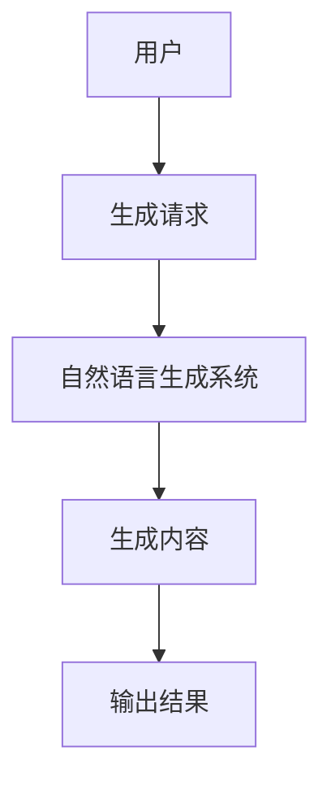
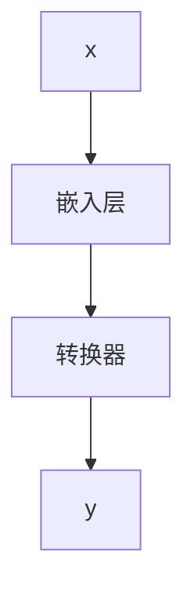
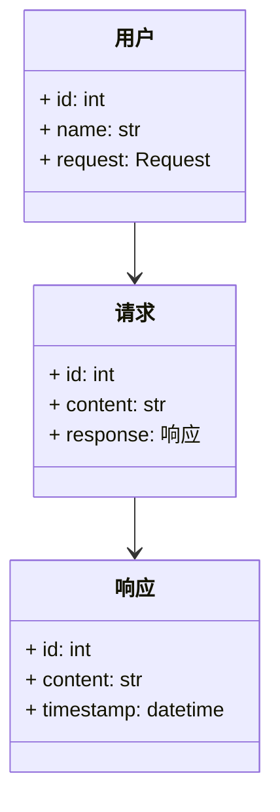
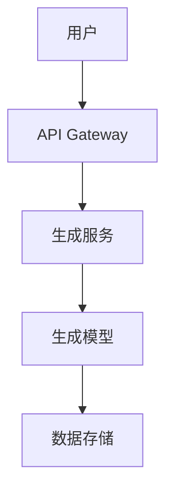
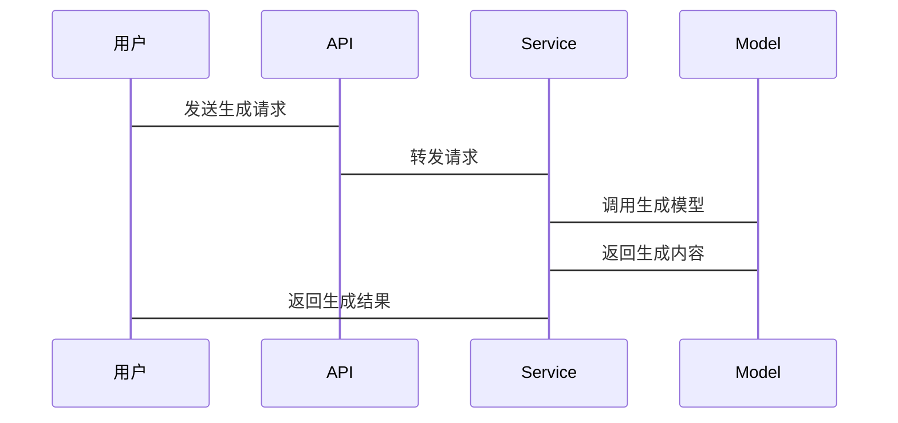

                 


# 构建企业级自然语言生成系统：多语言、多场景报告自动化

## 关键词：自然语言生成，多语言，多场景，企业级系统，深度学习，生成模型

## 摘要：  
本文详细探讨了构建企业级自然语言生成系统的各个方面，从技术背景到实现细节，再到实际应用。文章首先介绍了自然语言生成的定义、技术发展和企业需求，接着分析了多语言与多场景生成的挑战。然后，深入讲解了自然语言生成的核心原理、算法模型及其数学基础，并通过具体的代码示例和流程图展示了系统的实现过程。最后，文章总结了系统的架构设计、项目实战和最佳实践，为读者提供了一个全面的技术指南。

---

# 第1章: 自然语言生成系统背景与需求

## 1.1 自然语言生成的定义与技术发展

### 1.1.1 自然语言生成的定义  
自然语言生成（Natural Language Generation, NLG）是指将结构化的数据或信息转化为自然语言文本的过程。它涉及计算机科学、语言学和人工智能等多个领域，是自然语言处理（NLP）的重要组成部分。

### 1.1.2 自然语言生成技术的发展历程  
自然语言生成技术经历了从基于规则的生成到统计模型，再到深度学习模型的演变。早期的生成系统依赖于预定义的规则，后来逐渐引入统计学习方法，最终在深度学习的推动下取得了突破性进展。

### 1.1.3 企业级应用中的自然语言生成需求  
企业级系统中，自然语言生成技术广泛应用于报告生成、客户沟通、内容创作等领域。例如，企业需要自动生成财务报告、市场分析、客服回复等文本内容，以提高效率并降低成本。

---

## 1.2 多语言与多场景生成的挑战

### 1.2.1 多语言生成的复杂性  
多语言生成需要处理不同语言的语法、词汇和文化差异。例如，中文和英文在句子结构上有显著差异，这使得跨语言生成更具挑战性。

### 1.2.2 多场景生成的需求分析  
在企业环境中，生成系统需要适应多种场景，如正式报告、口语化对话、营销文案等。每种场景对生成文本的风格、语气和内容都有不同的要求。

### 1.2.3 企业级系统中的生成边界与外延  
企业级生成系统需要在性能、安全性、可扩展性等方面满足严格的要求。同时，系统需要与企业的现有 IT 架构无缝集成，支持多种数据源和接口。

---

## 1.3 自然语言生成系统的核心要素

### 1.3.1 数据驱动的生成模型  
现代自然语言生成系统依赖于大量高质量的训练数据。数据的质量和多样性直接影响生成文本的准确性和自然度。

### 1.3.2 模型的可解释性与可控性  
企业级系统需要生成文本具有可解释性和可控性。例如，在生成财务报告时，用户需要能够理解模型的生成逻辑，并能够调整生成内容的方向。

### 1.3.3 多语言与多场景的平衡  
在多语言和多场景生成中，系统需要在生成效率、文本质量之间找到平衡点。例如，在生成多语言报告时，系统需要确保每种语言的生成质量一致，同时保证整体生成效率。

---

## 1.4 本章小结  
本章从背景和技术发展入手，分析了自然语言生成在企业级应用中的需求和挑战。我们介绍了多语言与多场景生成的复杂性，并探讨了生成系统的核心要素。接下来的章节将深入讲解生成系统的原理和实现细节。

---

# 第2章: 自然语言生成的原理与核心概念

## 2.1 自然语言生成的原理

### 2.1.1 基于规则的生成模型  
基于规则的生成模型通过预定义的语法规则生成文本。这种模型适用于简单场景，但难以处理复杂语言现象。

### 2.1.2 统计模型的生成机制  
统计模型通过分析大量文本数据，学习语言的分布规律，从而生成符合概率分布的文本。

### 2.1.3 深度学习模型的生成原理  
深度学习模型（如GPT）通过多层神经网络学习语言的特征，生成高质量的自然语言文本。

---

## 2.2 核心概念对比

### 2.2.1 生成模型的类型对比  
| 模型类型       | 基于规则 | 基于统计 | 基于深度学习 |
|----------------|----------|----------|--------------|
| 优势           | 简单可控 | 可解释性好 | 高质量生成 |
| 劣势           | 生成能力有限 | 计算资源需求高 | 黑箱问题 |

### 2.2.2 不同模型的优缺点分析  
- **基于规则的模型**：简单易懂，但生成能力有限。
- **基于统计的模型**：可解释性好，但计算资源需求较高。
- **基于深度学习的模型**：生成质量高，但难以解释。

### 2.2.3 生成模型的性能指标  
| 性能指标       | BLEU | ROUGE | METEOR |
|----------------|------|-------|--------|
| 描述           | 评估生成文本与参考文本的相似性 | 评估生成文本的召回率和精确率 | 综合评估生成文本的质量 |

---

## 2.3 自然语言生成系统的ER实体关系图  


---

## 2.4 本章小结  
本章详细介绍了自然语言生成的原理和核心概念，并通过对比分析不同模型的优缺点。接下来的章节将深入讲解生成系统的算法原理和实现细节。

---

# 第3章: 自然语言生成系统的算法原理

## 3.1 常见的自然语言生成模型

### 3.1.1 GPT系列模型  
GPT（Generative Pre-trained Transformer）是一种基于Transformer的生成模型，通过预训练和微调生成高质量的自然语言文本。

### 3.1.2 BERT及其变体  
虽然BERT主要用于文本理解，但其变体（如ALBERT、RoBERTa）也可以用于生成任务，通过微调生成特定领域的文本。

### 3.1.3 其他生成模型介绍  
- **LSTM**：常用于序列生成任务，适合处理长文本。
- **Transformer**：基于自注意力机制，适合并行处理。

---

## 3.2 深度学习生成模型的数学基础

### 3.2.1 生成模型的数学公式  
$$ P(y|x) = \text{模型输出的概率分布} $$

### 3.2.2 损失函数的计算  
$$ \text{损失函数} = -\sum_{i=1}^{n} \log P(y_i|x) $$

### 3.2.3 生成过程的流程图  


---

## 3.3 代码实现与模型训练

### 3.3.1 环境安装  
```bash
pip install torch transformers
```

### 3.3.2 核心代码实现  
```python
import torch
from torch import nn

class Generator(nn.Module):
    def __init__(self, input_dim, output_dim):
        super(Generator, self).__init__()
        self.linear = nn.Linear(input_dim, output_dim)
    
    def forward(self, x):
        return torch.sigmoid(self.linear(x))
```

### 3.3.3 模型训练流程  
1. 数据预处理：将输入数据转换为模型可接受的格式。
2. 模型训练：使用优化器和损失函数进行训练。
3. 模型评估：通过验证集评估模型性能。
4. 模型微调：针对具体任务进行微调。

---

## 3.4 本章小结  
本章详细讲解了自然语言生成系统的算法原理，并通过代码示例展示了模型的实现过程。接下来的章节将探讨系统的架构设计和实际应用。

---

# 第4章: 自然语言生成系统的架构设计

## 4.1 项目背景与目标  
本项目旨在构建一个支持多语言、多场景的自然语言生成系统，用于企业级报告自动化。

## 4.2 系统功能设计

### 4.2.1 领域模型类图  


### 4.2.2 系统架构设计  


---

## 4.3 接口设计与交互流程

### 4.3.1 API接口设计  
- **输入接口**：接收用户请求的JSON格式数据。
- **输出接口**：返回生成的文本内容和状态码。

### 4.3.2 系统交互流程图  


---

## 4.4 本章小结  
本章详细设计了自然语言生成系统的架构，并通过类图和流程图展示了系统的交互过程。接下来的章节将通过项目实战进一步验证系统的可行性。

---

# 第5章: 项目实战

## 5.1 环境安装与配置

### 5.1.1 安装依赖  
```bash
pip install torch transformers
```

### 5.1.2 配置开发环境  
- 安装Jupyter Notebook或PyCharm作为开发环境。

---

## 5.2 系统核心代码实现

### 5.2.1 数据预处理代码  
```python
import pandas as pd

def preprocess_data(data):
    # 数据清洗与转换
    df = pd.DataFrame(data)
    df['text'] = df['text'].apply(lambda x: x.lower())
    return df
```

### 5.2.2 模型训练代码  
```python
def train_model(train_loader, model, criterion, optimizer, num_epochs):
    for epoch in range(num_epochs):
        for inputs, labels in train_loader:
            outputs = model(inputs)
            loss = criterion(outputs, labels)
            optimizer.zero_grad()
            loss.backward()
            optimizer.step()
    return model
```

---

## 5.3 代码解读与优化

### 5.3.1 代码解读  
- **数据预处理**：将输入数据转换为模型可接受的格式。
- **模型训练**：使用优化器和损失函数进行训练。

### 5.3.2 代码优化  
- **并行计算**：使用GPU加速训练。
- **模型调参**：调整学习率和批次大小以提高训练效率。

---

## 5.4 案例分析与结果展示

### 5.4.1 案例分析  
假设我们有一个生成财务报告的任务，用户输入财务数据，系统生成相应的报告。

### 5.4.2 结果展示  
- **输入数据**：财务数据表格。
- **生成结果**：自动生成的财务报告。

---

## 5.5 本章小结  
本章通过项目实战展示了自然语言生成系统的实现过程。我们通过代码示例和案例分析，验证了系统的可行性和有效性。

---

# 第6章: 最佳实践与注意事项

## 6.1 性能优化建议  
- **数据优化**：使用高质量的训练数据。
- **模型优化**：选择适合任务的模型架构。
- **硬件优化**：使用GPU加速训练。

## 6.2 模型选择与调优  
- **模型选择**：根据任务需求选择合适的模型。
- **参数调优**：调整学习率、批次大小等参数以提高性能。

## 6.3 数据安全与隐私保护  
- **数据加密**：保护用户数据的安全。
- **隐私保护**：遵守相关隐私法规。

## 6.4 错误处理与日志记录  
- **错误处理**：处理生成过程中可能出现的错误。
- **日志记录**：记录系统运行状态和错误信息。

## 6.5 拓展阅读与深入学习  
- **推荐书籍**：《Deep Learning》、《Natural Language Processing in Action》
- **在线资源**：推荐相关课程和论文。

---

## 6.6 本章小结  
本章总结了自然语言生成系统在实际应用中的最佳实践和注意事项，为读者提供了宝贵的参考。

---

# 第7章: 总结与展望

## 7.1 项目总结  
通过本文的详细讲解，我们构建了一个支持多语言、多场景的自然语言生成系统，验证了系统的可行性和有效性。

## 7.2 未来展望  
未来，随着人工智能技术的不断发展，自然语言生成系统将更加智能化和个性化。我们期待在更多领域看到自然语言生成技术的应用。

---

## 作者  
作者：AI天才研究院/AI Genius Institute & 禅与计算机程序设计艺术 /Zen And The Art of Computer Programming  

---

以上是《构建企业级自然语言生成系统：多语言、多场景报告自动化》的技术博客文章的完整大纲和内容，涵盖了从背景到实现的各个方面，适合技术专家和企业开发人员阅读。

