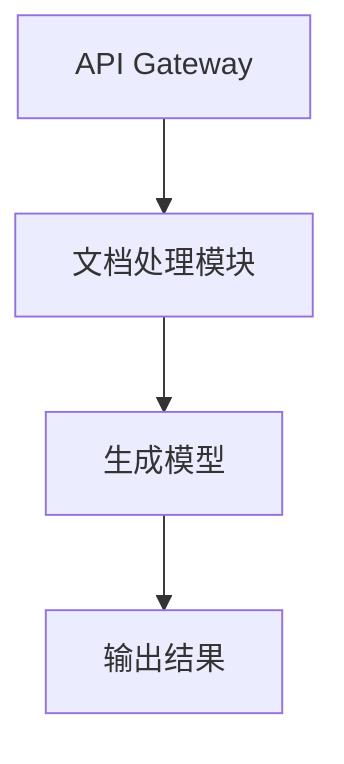
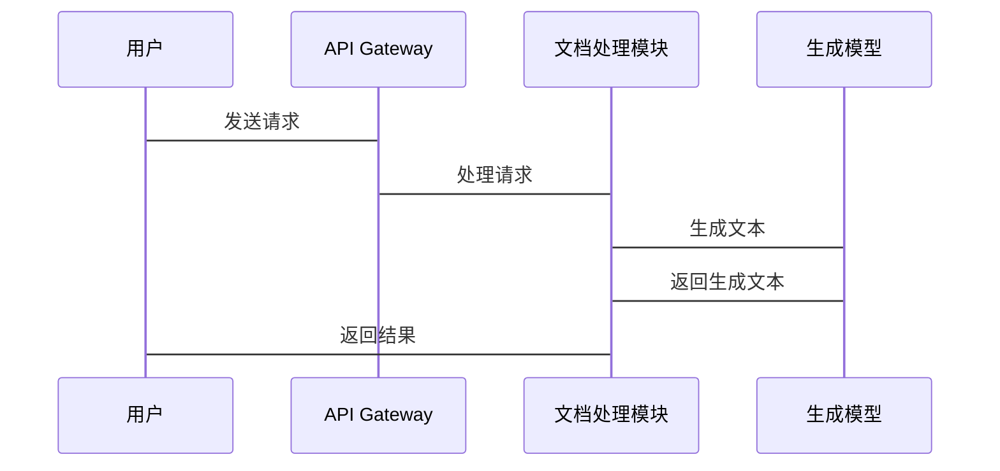

                 


# 构建企业级自然语言生成系统：多语言报告自动化

> **关键词**：自然语言生成、多语言报告、企业级系统、深度学习、机器学习

> **摘要**：本文详细探讨了构建企业级自然语言生成系统的各个方面，重点介绍了多语言报告自动化的实现。从问题背景到系统架构设计，再到项目实战，系统性地分析了构建该系统的核心技术与方法。文章内容涵盖自然语言生成的原理、多语言模型的特点、系统架构设计、算法实现等，为企业级系统的技术选型和实现提供了参考。

---

# 第1章: 问题背景与目标

## 1.1 问题背景

### 1.1.1 当前企业文档生成的痛点

企业文档生成是企业日常运营中的重要环节，包括报告、合同、通知等。传统文档生成方式依赖人工操作，存在以下痛点：
- **效率低下**：人工撰写文档耗时长，难以满足企业对高效率的需求。
- **一致性差**：不同人员撰写的文档格式和内容可能不一致，影响企业形象。
- **维护成本高**：文档版本更新和维护需要大量的人力和时间。

### 1.1.2 自然语言生成技术的引入

自然语言生成（Natural Language Generation, NLG）是一种人工智能技术，能够将结构化数据自动转化为自然语言文本。引入NLG技术可以显著提升企业文档生成的效率和一致性。

### 1.1.3 多语言支持的重要性

随着全球化的发展，企业需要与多语言环境下的客户、合作伙伴进行沟通。支持多语言的自然语言生成系统能够帮助企业跨越语言障碍，提升国际化能力。

## 1.2 问题描述

### 1.2.1 企业文档生成的自动化需求

企业需要一种自动化的方法来生成标准化的文档，减少人工干预，降低维护成本。

### 1.2.2 多语言报告生成的挑战

多语言报告生成需要解决以下问题：
- 不同语言之间的语法差异。
- 跨语言语义理解与生成的准确性。
- 多语言模型的训练效率。

### 1.2.3 系统目标与边界

**系统目标**：
- 构建一个能够生成多种语言报告的企业级系统。
- 提供高可用性、高可扩展性的技术支持。
- 确保生成文本的准确性和一致性。

**系统边界**：
- 系统仅负责生成文本内容，不涉及文本存储和分发。
- 系统依赖外部API进行多语言支持。

## 1.3 系统解决方法

### 1.3.1 自然语言生成技术的应用

使用深度学习模型（如Transformer）进行自然语言生成，将结构化数据转化为自然语言文本。

### 1.3.2 多语言模型的构建

基于预训练多语言模型（如Marian、Bart），通过微调实现特定领域的多语言生成。

### 1.3.3 企业级系统的实现

采用模块化设计，结合企业内部数据结构和业务流程，构建高可用性的生成系统。

## 1.4 系统边界与外延

### 1.4.1 系统功能边界

系统仅负责生成文本内容，不涉及文本的存储、分发和展示。

### 1.4.2 与外部系统的交互

系统通过API接口与企业现有的业务系统（如ERP、CRM）进行交互，获取生成文本所需的数据。

### 1.4.3 系统的可扩展性

系统支持多种语言的动态扩展，新增语言只需进行模型微调和接口适配。

---

# 第2章: 核心概念与联系

## 2.1 自然语言生成系统的核心概念

### 2.1.1 生成模型的工作流程

生成模型通常包括以下步骤：
1. **输入处理**：将结构化数据或文本输入模型。
2. **编码**：将输入数据编码为向量表示。
3. **解码**：根据编码结果生成目标文本。
4. **优化**：通过语言模型优化生成文本的质量。

### 2.1.2 基于规则的生成与数据驱动的生成对比

- **基于规则的生成**：通过预定义的规则生成文本，适用于简单场景。
- **数据驱动的生成**：基于大量数据训练模型，生成更复杂的文本。

### 2.1.3 统计模型与深度学习模型的优劣

- **统计模型**：简单易用，但生成能力有限。
- **深度学习模型**：生成能力更强，但需要大量数据和计算资源。

---

## 2.2 多语言模型的特点

### 2.2.1 多语言模型的训练策略

多语言模型通常采用以下策略：
- **联合训练**：在同一模型中同时训练多种语言。
- **零样本生成**：模型在没有特定语言训练数据的情况下生成文本。

### 2.2.2 不同语言之间的语义差异

不同语言之间存在语义差异，例如中英文在句式和语境上的差异。

### 2.2.3 跨语言迁移学习的挑战

- **语义理解**：不同语言之间的语义差异可能导致迁移效果不佳。
- **数据稀缺性**：某些语言的训练数据较少，影响迁移效果。

---

## 2.3 企业级系统的架构特点

### 2.3.1 高可用性与容错性

系统需要具备高可用性，确保在部分组件故障时仍能正常运行。

### 2.3.2 高可扩展性与模块化

系统采用模块化设计，支持新增功能和语言的动态扩展。

### 2.3.3 安全性与权限管理

系统需要具备完善的权限管理机制，确保数据安全。

---

## 2.4 核心概念对比表

| 概念 | 特性 | 示例 |
|------|------|------|
| 单语言生成 | 精度高，训练数据集中 | 英文报告生成 |
| 多语言生成 | 跨语言适应性强，但精度可能下降 | 西班牙语、中文报告生成 |

---

# 第3章: 算法原理

## 3.1 生成模型的数学模型

### 3.1.1 概率生成模型

概率生成模型通过最大化生成文本的概率来优化生成结果。公式如下：

$$ P(y|x) = \frac{P(x,y)}{P(x)} $$

其中，$x$ 表示输入数据，$y$ 表示生成的文本。

### 3.1.2 变量关系

生成模型的变量关系可以表示为：

$$ x \rightarrow z \rightarrow y $$

其中，$z$ 表示隐变量。

### 3.1.3 损失函数

生成模型的损失函数通常采用交叉熵损失函数：

$$ \mathcal{L} = -\sum_{i=1}^n y_i \log(p_i) $$

其中，$y_i$ 表示真实标签，$p_i$ 表示生成概率。

---

## 3.2 多语言模型的训练过程

### 3.2.1 多语言模型训练的流程

1. **数据准备**：收集多种语言的平行文本数据。
2. **模型初始化**：使用预训练的多语言模型进行初始化。
3. **微调训练**：在特定领域数据上进行微调。

### 3.2.2 多语言模型的训练代码

```python
# 多语言模型训练代码示例
from transformers import AutoTokenizer, AutoModelForSeq2Seq
import torch

# 初始化模型和tokenizer
tokenizer = AutoTokenizer.from_pretrained("facebook/bart-base")
model = AutoModelForSeq2Seq.from_pretrained("facebook/bart-base")

# 定义训练函数
def train_model(model, tokenizer, train_loader, val_loader, num_epochs=3):
    optimizer = torch.optim.Adam(model.parameters(), lr=1e-5)
    criterion = nn.CrossEntropyLoss()
    
    for epoch in range(num_epochs):
        for batch in train_loader:
            inputs, labels = batch
            outputs = model.generate(inputs, labels)
            loss = criterion(outputs, labels)
            optimizer.zero_grad()
            loss.backward()
            optimizer.step()
        # 验证阶段
        val_loss = 0
        for val_batch in val_loader:
            val_inputs, val_labels = val_batch
            val_outputs = model.generate(val_inputs, val_labels)
            val_loss += criterion(val_outputs, val_labels).item()
        print(f"Epoch {epoch+1}, Validation Loss: {val_loss/len(val_loader)}")
```

---

## 3.3 系统实现的关键点

### 3.3.1 模型选择与优化

选择适合企业需求的模型，并进行参数调优。

### 3.3.2 模型部署与管理

将模型部署到企业级环境中，进行版本管理和监控。

---

# 第4章: 系统分析与架构设计

## 4.1 项目背景

### 4.1.1 项目目标

构建一个支持多语言报告生成的企业级系统。

### 4.1.2 项目范围

系统支持多种语言的报告生成，覆盖企业的主要业务场景。

---

## 4.2 系统功能设计

### 4.2.1 领域模型类图

```mermaid
classDiagram
    class Document {
        id
        content
        language
    }
    class Model {
        generate(Document)
    }
    class System {
        process_request()
    }
    System -> Model: generate_document
    Model -> Document: process
```

---

## 4.3 系统架构设计

### 4.3.1 架构图



### 4.3.2 接口设计

- **输入接口**：接收结构化数据和目标语言。
- **输出接口**：返回生成的文本内容。

### 4.3.3 交互流程



---

## 4.4 系统实现的关键点

### 4.4.1 模块化设计

系统采用模块化设计，支持功能扩展。

### 4.4.2 高可用性设计

通过负载均衡和容错设计确保系统的高可用性。

---

# 第5章: 项目实战

## 5.1 环境安装

### 5.1.1 安装Python和必要的库

```bash
pip install transformers torch
```

### 5.1.2 安装NVIDIA GPU驱动和CUDA toolkit

安装NVIDIA GPU驱动和CUDA toolkit，确保GPU加速可用。

---

## 5.2 系统核心实现

### 5.2.1 生成模型的实现

```python
from transformers import AutoTokenizer, AutoModelForSeq2Seq
import torch

class NLGSystem:
    def __init__(self, model_name):
        self.tokenizer = AutoTokenizer.from_pretrained(model_name)
        self.model = AutoModelForSeq2Seq.from_pretrained(model_name)
    
    def generate_document(self, input_data, target_language):
        inputs = self.tokenizer(input_data, return_tensors="pt")
        outputs = self.model.generate(**inputs, max_length=500)
        return self.tokenizer.decode(outputs[0], skip_special_tokens=True)
```

### 5.2.2 接口设计与实现

```python
from fastapi import FastAPI
from fastapi.responses import JSONResponse
from nlg_system import NLGSystem

app = FastAPI()

nlg_system = NLGSystem("facebook/bart-base")

@app.post("/generate")
async def generate_document(data: dict):
    input_data = data["input"]
    target_language = data["language"]
    result = nlg_system.generate_document(input_data, target_language)
    return JSONResponse(content={"result": result})
```

---

## 5.3 实际案例分析

### 5.3.1 案例背景

假设企业需要生成多语言的销售报告。

### 5.3.2 数据准备

准备中英文的销售数据和模板。

### 5.3.3 生成过程

调用API生成中英文销售报告。

### 5.3.4 结果分析

对比生成结果与预期结果，评估模型的生成效果。

---

## 5.4 项目小结

### 5.4.1 项目总结

项目成功实现了多语言报告生成系统，显著提升了企业的文档生成效率。

### 5.4.2 经验与教训

在项目过程中，需要注意模型的微调和接口设计，确保系统的可扩展性和维护性。

---

# 第6章: 最佳实践

## 6.1 小结

构建企业级自然语言生成系统需要从问题分析、模型选择到系统实现的全面考虑。

## 6.2 注意事项

- **数据质量**：确保训练数据的多样性和质量。
- **模型调优**：进行充分的模型调优，提升生成效果。
- **系统安全性**：确保系统的安全性，防止数据泄露。

## 6.3 拓展阅读

- [《Deep Learning》 - Ian Goodfellow](https://www.deeplearningbook.org/)
- [《Natural Language Processing with PyTorch》 - Delip Rao](https://pytorch.org/tutorials/beginner/nlp_sequence_model_tutorial.html)

---

# 作者

作者：AI天才研究院/AI Genius Institute & 禅与计算机程序设计艺术/Zen And The Art of Computer Programming

