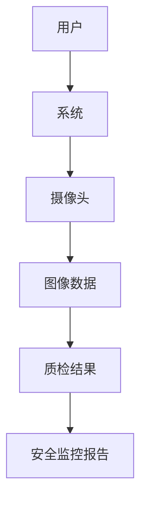
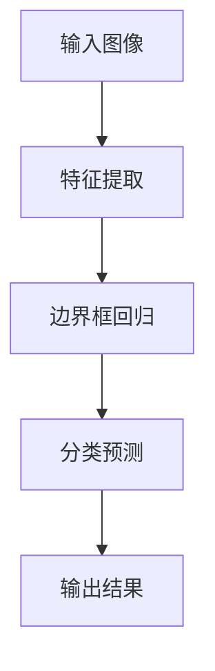
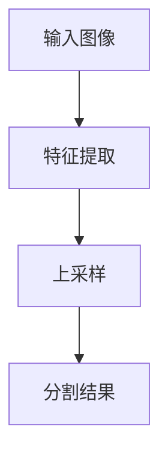
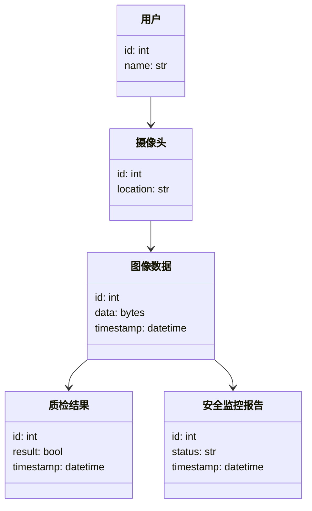
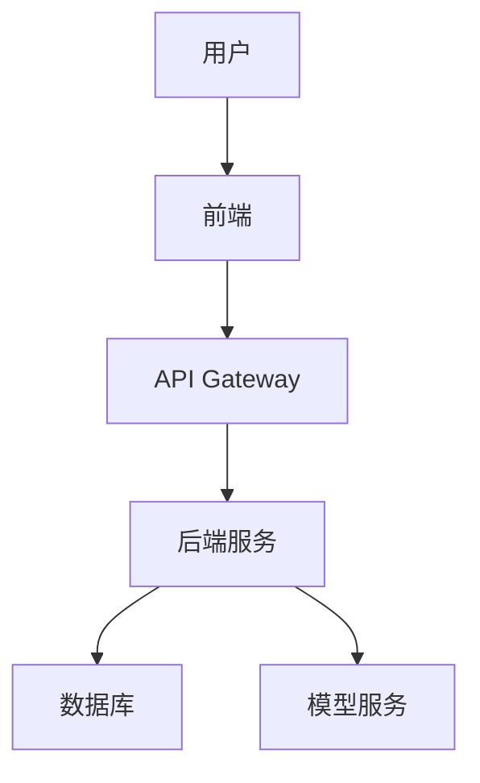
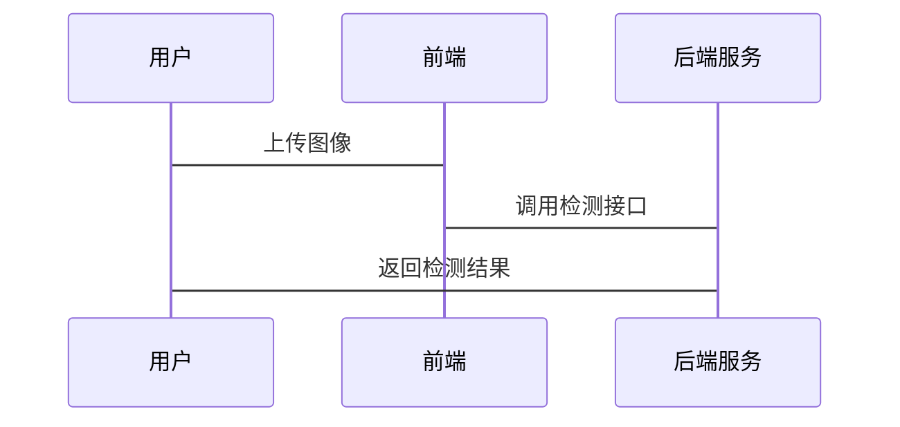

                 

<think>
嗯，我现在需要帮用户设计一本关于《构建企业级计算机视觉平台：从产品质检到员工安全监控》的目录大纲。首先，我得理解这本书的主题和目标读者。这本书是针对企业级计算机视觉平台的构建，涵盖产品质检和员工安全监控两个方面，所以读者可能是IT工程师、项目经理或者企业决策者。

接下来，我应该考虑目录的结构。通常，技术书籍会分为几个部分，比如基础、核心概念、算法原理、系统架构、项目实战和最佳实践。用户还特别提到要包含背景介绍、核心概念、算法、系统分析、项目实战和小结等内容，所以我得确保这些部分都涵盖进去。

首先，第1章应该是背景介绍，涵盖问题背景、描述、解决方案，以及概念的结构和核心要素。这部分需要详细说明为什么企业需要计算机视觉平台，以及它在不同场景中的应用。

然后，第2章应该深入讲解核心概念，包括原理、属性对比和ER图。这部分可能需要使用表格和Mermaid图来展示，帮助读者更好地理解系统架构。

接下来是算法原理，第3章和第4章分别讨论目标检测和图像分割。每个部分都需要有流程图、数学模型和代码示例，这样读者可以理论结合实际，理解算法的工作原理。

系统分析与架构设计是第5章，这部分需要介绍项目背景、系统功能设计、架构图、接口设计和交互流程。使用Mermaid图来展示系统架构和序列图，可以让内容更直观。

第6章是项目实战，包括环境搭建、代码实现、案例分析和项目总结。这部分要详细讲解如何实际操作，帮助读者掌握技能。

最后，第7章总结最佳实践，包括小结、注意事项和拓展阅读，帮助读者巩固知识，并指导他们如何进一步学习和应用。

在编写过程中，我需要确保每个章节都细化到三级目录，涵盖用户提到的所有内容，同时保持结构清晰，逻辑连贯。这样，目录大纲才能全面覆盖主题，满足读者的需求。
</think>

# 构建企业级计算机视觉平台：从产品质检到员工安全监控

**关键词：** 企业级计算机视觉、产品质检、员工安全监控、目标检测、图像分割、系统架构设计

**摘要：**  
随着人工智能技术的飞速发展，计算机视觉技术在企业级应用中的重要性日益凸显。本文将从产品质检和员工安全监控两个方面，深入探讨企业级计算机视觉平台的构建过程。通过分析核心概念、算法原理、系统架构设计以及实际项目案例，本文旨在为企业提供一套完整的解决方案，帮助其高效提升产品质量和员工安全管理水平。

---

## 第1章 问题背景与需求分析

### 1.1 问题背景
#### 1.1.1 企业级计算机视觉的需求驱动
现代企业面临着日益增长的质量控制需求和安全管理挑战。传统的人工质检和安全监控方式效率低下，且容易出错，而计算机视觉技术能够提供高效、精准的解决方案。

#### 1.1.2 传统质检与安全监控的痛点
- **质检问题：** 人工质检耗时长、成本高，且容易受主观因素影响。
- **安全监控问题：** 传统监控系统依赖人工值守，无法实时识别安全隐患。

#### 1.1.3 计算机视觉技术的解决方案
通过引入深度学习和计算机视觉技术，企业可以实现自动化质检和智能安全监控，显著提升效率和准确性。

### 1.2 问题描述
#### 1.2.1 产品质检的核心问题
如何通过计算机视觉技术实现对产品的缺陷检测和分类。

#### 1.2.2 员工安全监控的关键挑战
如何实时识别工作环境中的安全隐患，如人员跌倒、设备故障等。

#### 1.2.3 系统集成与数据处理的难点
如何将计算机视觉系统与企业的现有系统无缝集成，同时确保数据安全和隐私保护。

### 1.3 问题解决
#### 1.3.1 计算机视觉技术的适用性分析
- **目标检测：** 用于识别产品中的缺陷位置。
- **图像分割：** 用于精确分割安全监控区域的人员或物体。

#### 1.3.2 多场景应用的可行性探讨
通过分析不同场景的需求，探讨计算机视觉技术在质检和安全监控中的应用可行性。

#### 1.3.3 系统设计与实现的总体思路
提出基于深度学习的计算机视觉平台设计框架，包括数据采集、模型训练、系统集成和部署等步骤。

### 1.4 边界与外延
#### 1.4.1 计算机视觉的边界定义
明确计算机视觉技术的适用范围和限制，避免将其应用于不擅长的领域。

#### 1.4.2 相关技术的外延扩展
探讨与计算机视觉相关的其他技术，如自然语言处理和物联网技术的协同应用。

#### 1.4.3 与其他技术的协同关系
分析计算机视觉与其他技术（如大数据、云计算）的协同关系，形成完整的解决方案。

### 1.5 核心概念与组成
#### 1.5.1 计算机视觉平台的组成要素
- 数据采集模块
- 数据处理模块
- 模型训练模块
- 应用部署模块

#### 1.5.2 各要素之间的关系
通过流程图展示各模块之间的关系，确保系统设计的逻辑性。

#### 1.5.3 系统架构的核心特征
强调系统的可扩展性、实时性和高可靠性。

---

## 第2章 核心概念与系统架构

### 2.1 核心概念原理
#### 2.1.1 计算机视觉的基本原理
- 图像处理：通过滤波、边缘检测等技术提取图像特征。
- 特征提取：利用卷积神经网络（CNN）提取图像深层特征。

#### 2.1.2 深度学习在计算机视觉中的应用
- 用于目标检测、图像分割等任务的模型设计。

#### 2.1.3 目标检测与图像分割的核心算法
- 目标检测：基于Faster R-CNN的改进算法。
- 图像分割：基于U-Net的改进算法。

### 2.2 核心概念属性对比
#### 2.2.1 不同算法的性能对比
- 检测精度、计算效率、模型复杂度等方面的对比。

#### 2.2.2 各算法的优缺点分析
- 优：速度快，精度高；缺：模型参数过多，训练时间长。

#### 2.2.3 算法选择的决策框架
基于具体场景需求选择合适的算法。

### 2.3 ER实体关系图


---

## 第3章 目标检测算法原理

### 3.1 算法流程


### 3.2 算法实现
#### 3.2.1 特征提取网络
- 使用ResNet作为基础网络提取图像特征。

#### 3.2.2 损失函数设计
- 结合分类损失和回归损失的联合损失函数。

#### 3.2.3 优化器选择
- 使用Adam优化器进行模型训练。

### 3.3 数学模型
#### 3.3.1 检测框回归公式
$$ y = \theta^T x + b $$

#### 3.3.2 分类损失函数
$$ L_{cls} = -\sum_{i} y_i \log p_i + (1 - y_i) \log (1 - p_i) $$

#### 3.3.3 总体损失函数
$$ L = L_{cls} + \lambda L_{loc} $$

### 3.4 代码实现
#### 3.4.1 环境搭建
- 安装TensorFlow、Keras、COCO数据集等。

#### 3.4.2 核心代码
```python
import tensorflow as tf
from tensorflow.keras import layers

# 模型定义
def build_model():
    base_model = tf.keras.applications.MobileNetV2(weights='imagenet', include_top=False)
    x = base_model.output
    x = layers.GlobalAveragePooling2D()(x)
    x = layers.Dense(128, activation='relu')(x)
    predictions = layers.Dense(num_classes, activation='softmax')(x)
    return Model(inputs=base_model.input, outputs=predictions)
```

#### 3.4.3 代码解读
- 使用预训练模型提取特征，再通过全连接层进行分类预测。

---

## 第4章 图像分割算法原理

### 4.1 算法流程


### 4.2 算法实现
#### 4.2.1 特征提取网络
- 使用U-Net架构进行图像分割。

#### 4.2.2 损失函数设计
- 使用交叉熵损失函数。

#### 4.2.3 优化器选择
- 使用SGD优化器。

### 4.3 数学模型
#### 4.3.1 分割模型
$$ p(x) = \sigma(w^T x + b) $$

#### 4.3.2 损失函数
$$ L = -\sum_{i} y_i \log p_i + (1 - y_i) \log (1 - p_i) $$

### 4.4 代码实现
#### 4.4.1 环境搭建
- 安装Keras、TensorFlow、OpenCV等库。

#### 4.4.2 核心代码
```python
import tensorflow as tf
from tensorflow.keras import layers

# 模型定义
def build_unet_model():
    inputs = layers.Input(shape=(256, 256, 3))
    ...  # 定义U-Net网络
    return Model(inputs=inputs, outputs=output)
```

#### 4.4.3 代码解读
- 通过跳跃连接实现特征融合，提升分割精度。

---

## 第5章 系统分析与架构设计

### 5.1 项目背景
- 某制造企业希望引入计算机视觉技术，提升质检效率和员工安全管理水平。

### 5.2 系统功能设计
#### 5.2.1 领域模型


#### 5.2.2 系统架构图


#### 5.2.3 接口设计
- API接口：RESTful API，支持图像上传、结果查询等功能。

#### 5.2.4 交互流程


---

## 第6章 项目实战

### 6.1 环境搭建
- 安装必要的依赖：TensorFlow、Keras、OpenCV、Flask等。

### 6.2 系统核心实现
#### 6.2.1 质检模块
- 使用预训练的目标检测模型进行缺陷检测。

#### 6.2.2 安全监控模块
- 使用图像分割模型识别安全隐患区域。

### 6.3 代码实现
#### 6.3.1 后端服务代码
```python
from flask import Flask, request, jsonify
import tensorflow as tf

app = Flask(__name__)

@app.route('/detect', methods=['POST'])
def detect():
    # 获取图像数据
    image = request.files['image'].read()
    # 调用检测模型
    result = model.predict(image)
    return jsonify(result)

if __name__ == '__main__':
    app.run(host='0.0.0.0', port=5000)
```

#### 6.3.2 前端代码
```html
<!DOCTYPE html>
<html>
<head>
    <title>计算机视觉平台</title>
</head>
<body>
    <h1>图像上传</h1>
    <form action="/detect" method="post" enctype="multipart/form-data">
        <input type="file" name="image" />
        <input type="submit" value="上传" />
    </form>
</body>
</html>
```

### 6.4 案例分析
- **质检案例：** 检测手机屏幕的划痕。
- **安全监控案例：** 监测工厂车间的人员跌倒情况。

### 6.5 项目总结
通过实际案例验证系统的有效性，总结经验教训，为后续优化提供参考。

---

## 第7章 最佳实践与小结

### 7.1 小结
- 本文详细介绍了企业级计算机视觉平台的构建过程，从需求分析到系统实现，为企业提供了一套完整的解决方案。

### 7.2 注意事项
- 数据质量是系统性能的关键，需确保数据的多样性和代表性。
- 系统部署时需考虑性能优化和安全性。

### 7.3 拓展阅读
- 《Deep Learning for Computer Vision》
- 《Computer Vision: Algorithms and Applications》

---

## 作者

**作者：AI天才研究院/AI Genius Institute & 禅与计算机程序设计艺术 /Zen And The Art of Computer Programming**

