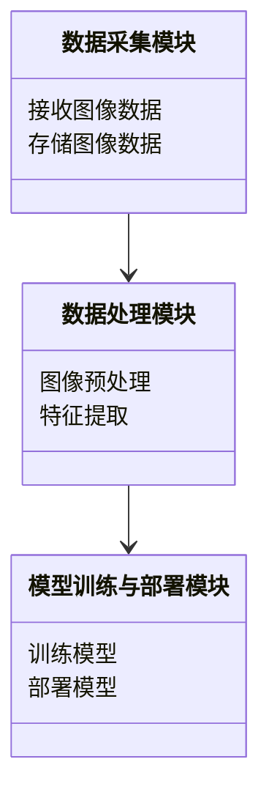

                 


# 构建企业级计算机视觉平台：从质量控制到安全监管的全面应用

## 关键词：计算机视觉，企业级平台，质量控制，安全监管，深度学习，系统架构

## 摘要：  
本文详细探讨了企业级计算机视觉平台的构建过程，从基础概念到系统架构，再到实际应用案例，全面解析了如何利用计算机视觉技术实现质量控制和安全监管。通过深入分析经典算法和系统设计，结合实际项目案例，为读者提供了一套完整的解决方案，帮助企业在各个领域高效应用计算机视觉技术。

---

## 第一部分：引言

### # 第1章：计算机视觉概述

#### 1.1 计算机视觉的定义与应用领域  
计算机视觉（Computer Vision）是研究如何让计算机像人类一样“看”和“理解”图像的科学。它结合了图像处理、模式识别和深度学习等技术，广泛应用于工业自动化、医疗影像分析、智能安防、自动驾驶等领域。  

#### 1.2 企业级计算机视觉平台的重要性  
企业级计算机视觉平台能够通过自动化的方式处理大量图像数据，提升生产效率、降低成本，并在安全监管方面提供实时监控能力。例如，在制造业中，计算机视觉可以用于缺陷检测；在安防领域，可以实现人脸识别和行为分析。  

#### 1.3 本书的目的与结构安排  
本书旨在为企业技术团队提供一套从理论到实践的完整指南，涵盖计算机视觉的核心概念、算法原理、系统架构设计以及实际项目案例。通过本书，读者可以掌握构建企业级计算机视觉平台的关键技术，并能够将其应用于质量控制和安全监管等场景。

---

## 第二部分：计算机视觉核心概念与技术

### # 第2章：计算机视觉的核心概念

#### 2.1 图像处理基础  
图像处理是计算机视觉的基础，主要包括图像的获取、增强、变换和分析。例如，通过滤波器对图像进行去噪处理，或者通过几何变换对图像进行旋转和缩放。  

#### 2.2 特征提取与目标检测  
特征提取是将图像转换为高维特征向量的过程，常用的方法包括SIFT、HOG和CNN。目标检测则是在图像中定位和识别特定物体，常用算法有YOLO和Faster R-CNN。  

#### 2.3 图像分割与语义理解  
图像分割将图像划分为多个区域，每个区域具有相似的特征或语义含义。语义分割则进一步将每个像素分配到特定的类别中，如道路、车辆、行人等。  

---

### # 第3章：经典计算机视觉算法

#### 3.1 基于特征的图像匹配  
SIFT（尺度不变特征变换）是一种常用的图像特征提取算法，能够检测图像中的关键点并计算其描述子，从而实现图像匹配。  

#### 3.2 基于深度学习的目标检测  
YOLO（You Only Look Once）是一种实时目标检测算法，通过将图像划分为网格，并预测每个网格中的目标类别和位置，实现了高效的物体检测。  

#### 3.3 图像分割算法  
U-Net是一种经典的图像分割网络，广泛应用于医学影像分析和图像修复任务。其结构包括编码器和解码器两部分，能够有效捕捉图像中的上下文信息。  

---

## 第三部分：企业级计算机视觉平台的系统架构

### # 第4章：系统架构设计

#### 4.1 系统功能模块划分  
企业级计算机视觉平台通常包括数据采集、数据处理、模型训练与部署三个主要模块。数据采集模块负责获取图像数据；数据处理模块对图像进行预处理和增强；模型训练与部署模块负责训练模型并将其部署到实际应用中。  

#### 4.2 系统架构设计图  
以下是系统架构设计图：  



#### 4.3 系统接口设计  
系统接口设计需要考虑模块之间的通信方式和接口规范。例如，数据采集模块通过REST API向数据处理模块发送图像数据，数据处理模块再通过队列将处理后的数据传递给模型训练模块。  

#### 4.4 系统安全性设计  
系统安全性设计包括数据加密、访问控制和日志管理。通过加密技术保护图像数据的安全性，通过访问控制限制对敏感模块的访问权限，并通过日志记录系统运行状态，及时发现异常情况。  

---

## 第四部分：项目实战与案例分析

### # 第5章：质量控制中的计算机视觉应用

#### 5.1 项目背景与需求分析  
在制造业中，质量控制是确保产品符合标准的关键环节。通过计算机视觉技术，企业可以实现自动化的缺陷检测，提高检测效率并降低成本。  

#### 5.2 系统实现  
以下是缺陷检测系统的实现代码：  

```python
import cv2
import numpy as np

def detect_defects(image):
    # 图像预处理
    gray = cv2.cvtColor(image, cv2.COLOR_BGR2GRAY)
    blurred = cv2.GaussianBlur(gray, (5, 5), 0)
    edges = cv2.Canny(blurred, 50, 150)
    
    # 使用Hough变换检测圆
    circles = cv2.HoughCircles(edges, cv2.HOUGH_GRADIENT, 1, 20, param1=50, param2=50)
    if circles is not None:
        circles = np.uint16(np.around(circles))
        for circle in circles[0]:
            center = (circle[0], circle[1])
            radius = circle[2]
            cv2.circle(image, center, radius, (0, 255, 0), 2)
    return image

# 示例图像处理
image = cv2.imread('defect_image.jpg')
result = detect_defects(image)
cv2.imwrite('result.jpg', result)
```

#### 5.3 应用案例分析  
在汽车制造过程中，计算机视觉可以用于检测车身表面的划痕和凹陷。通过训练一个基于CNN的模型，系统能够快速识别并标记出缺陷区域，帮助工人进行修复。  

---

### # 第6章：安全监管中的计算机视觉应用

#### 6.1 项目背景与需求分析  
在公共安全领域，计算机视觉可以用于实时监控和行为分析，帮助预防和应对安全事件。例如，在机场和火车站，计算机视觉技术可以用于人脸识别和行为分析，及时发现可疑人员。  

#### 6.2 系统实现  
以下是行为分析系统的实现代码：  

```python
import cv2
import numpy as np

def analyze_behavior(image):
    # 图像分割
    segmented_image = cv2.cvtColor(image, cv2.COLOR_BGR2RGB)
    # 使用预训练模型进行行为分类
    model = load_model('behavior_model.h5')
    prediction = model.predict(segmented_image)
    return get_prediction_labels(prediction)

# 示例图像处理
image = cv2.imread('behavior_image.jpg')
result = analyze_behavior(image)
print(result)
```

#### 6.3 应用案例分析  
在交通监控中，计算机视觉可以用于检测交通违规行为，如闯红灯、超速等。通过部署在路边的摄像头，系统可以实时监控并记录违规车辆，帮助交警部门进行处罚。  

---

## 第五部分：总结与展望

### # 第7章：总结与未来发展方向

#### 7.1 总结  
企业级计算机视觉平台的构建需要结合计算机视觉的核心技术、系统架构设计和实际应用案例。通过深度学习算法和高效的系统架构，企业可以在质量控制和安全监管等领域实现自动化和智能化。  

#### 7.2 未来发展方向  
未来，随着深度学习和边缘计算技术的不断发展，企业级计算机视觉平台将更加智能化和高效化。例如，通过边缘计算技术，可以实现本地化的实时分析，减少对云端的依赖，提升系统的响应速度和安全性。  

---

## 注意事项  
- 在实际项目中，需要根据具体需求选择合适的算法和系统架构。  
- 确保数据质量和多样性，以提高模型的泛化能力和检测准确率。  
- 加强系统安全性设计，保护图像数据和模型的安全性。  

## 最佳实践  
- 定期对模型进行更新和优化，以适应新的应用场景和数据变化。  
- 在系统设计中充分考虑可扩展性和可维护性，便于后续的功能扩展和技术升级。  

## 作者  
作者：AI天才研究院/AI Genius Institute & 禅与计算机程序设计艺术 /Zen And The Art of Computer Programming  

--- 

希望这篇文章能够为企业级计算机视觉平台的构建提供有价值的参考和指导。

