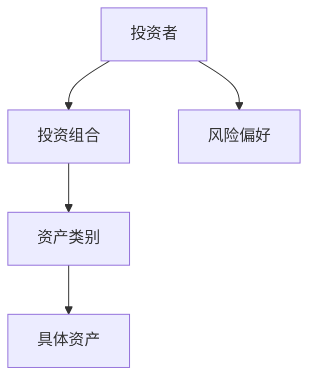
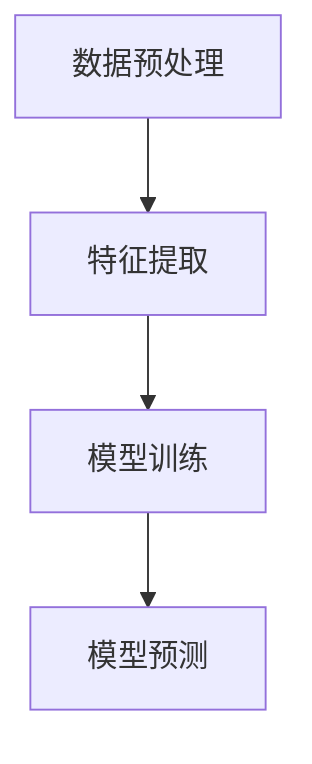
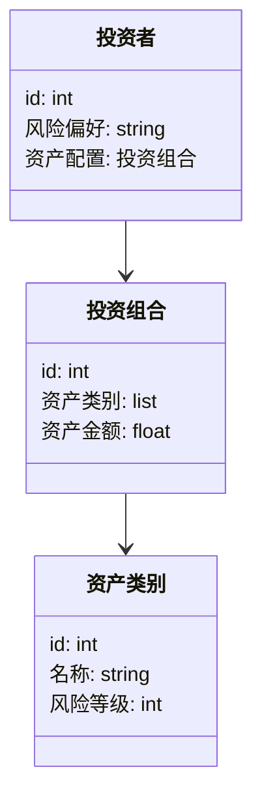
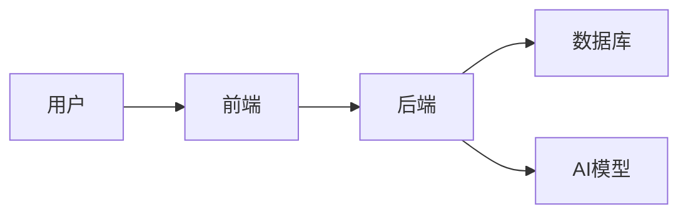

                 


# 构建全方位的AI驱动财富管理平台

> 关键词：AI、财富管理、机器学习、金融系统、数据驱动

> 摘要：随着人工智能技术的迅速发展，财富管理领域正在经历一场深刻的变革。本文将详细探讨如何利用AI技术构建一个全方位的财富管理平台，从背景分析到系统架构设计，再到项目实战，全面解析AI在财富管理中的应用与实现。通过本文，读者将深入了解AI驱动财富管理的核心概念、算法原理、系统架构以及实际应用案例。

---

# 第一部分: AI驱动财富管理平台的背景与核心概念

# 第1章: AI驱动财富管理平台的背景介绍

## 1.1 AI与财富管理的结合

### 1.1.1 传统财富管理的痛点
传统的财富管理行业面临以下痛点：
1. **服务效率低**：传统财富管理依赖人工服务，效率低下，难以满足大规模客户需求。
2. **信息不透明**：投资者难以获取实时市场信息，缺乏透明度。
3. **风险控制难**：传统方法难以准确预测市场波动，风险控制能力有限。
4. **个性化不足**：传统财富管理难以根据客户需求提供个性化的投资建议。

### 1.1.2 AI技术如何解决财富管理问题
AI技术通过以下方式解决财富管理的痛点：
1. **自动化服务**：AI可以实时处理海量数据，为投资者提供自动化、个性化的投资建议。
2. **精准预测**：通过机器学习算法，AI能够更准确地预测市场趋势，帮助投资者做出更明智的决策。
3. **风险控制**：AI可以通过分析历史数据和实时信息，帮助投资者识别和规避潜在风险。
4. **智能匹配**：AI可以根据投资者的偏好和风险承受能力，智能匹配最适合的投资产品。

### 1.1.3 财富管理AI化的行业趋势
随着技术的进步，AI在财富管理中的应用越来越广泛，行业趋势包括：
1. **智能化投资顾问**：AI驱动的智能投顾逐渐取代传统的人工投顾。
2. **数据驱动决策**：通过大数据分析和AI算法，财富管理更加依赖数据驱动的决策。
3. **个性化服务普及**：AI能够为每一位投资者提供个性化的投资方案。
4. **实时动态调整**：AI可以根据市场变化实时调整投资策略，确保最优收益。

## 1.2 财富管理的核心要素

### 1.2.1 财富管理的定义与目标
财富管理是指通过科学的资产配置和投资策略，帮助投资者实现财富保值、增值的过程。其核心目标是为投资者提供最大化收益的同时，最小化投资风险。

### 1.2.2 投资者行为分析
投资者行为分析是财富管理的重要组成部分，主要包括：
1. **风险偏好分析**：通过问卷调查和数据分析，确定投资者的风险承受能力。
2. **投资目标分析**：了解投资者的投资目标，如短期收益、长期财富积累等。
3. **行为模式分析**：通过分析投资者的历史交易行为，预测其未来的投资决策。

### 1.2.3 财富管理产品的多样性
财富管理产品种类繁多，主要包括：
1. **股票**：高风险、高收益的投资工具。
2. **债券**：相对稳定的收益，风险较低。
3. **基金**：通过分散投资降低风险。
4. **保险**：提供风险保障的同时，也有一定的投资收益。
5. **信托**：通过专业管理实现资产增值。

## 1.3 AI在财富管理中的应用场景

### 1.3.1 个性化投资建议
AI可以根据投资者的风险偏好和财务状况，提供个性化的投资建议，帮助投资者选择最适合的投资产品。

### 1.3.2 风险评估与控制
AI可以通过分析市场数据和投资者行为，评估投资组合的风险，并提供相应的风险控制建议。

### 1.3.3 财富配置优化
AI可以根据市场变化和投资者目标，动态调整资产配置，优化财富配置方案。

### 1.3.4 市场预测与交易决策
AI可以通过机器学习模型预测市场趋势，帮助投资者做出更明智的交易决策。

## 1.4 本章小结
本章介绍了AI在财富管理中的背景和核心概念，分析了传统财富管理的痛点以及AI技术如何解决这些问题，最后总结了财富管理AI化的行业趋势。

---

# 第2章: AI驱动财富管理的核心概念与联系

## 2.1 核心概念原理

### 2.1.1 AI模型的基本原理
AI模型的基本原理包括数据采集、特征提取、模型训练和预测四个阶段。

### 2.1.2 财富管理中的数据特征
财富管理中的数据特征包括：
1. **时间序列性**：市场数据通常具有时间序列特征。
2. **多维性**：涉及多种资产类别和市场指标。
3. **非线性**：市场波动通常是非线性的。

### 2.1.3 AI算法在财富管理中的应用
AI算法在财富管理中的应用包括：
1. **回归分析**：用于预测资产回报率。
2. **决策树**：用于分类投资者的风险偏好。
3. **神经网络**：用于复杂市场趋势的预测。

## 2.2 核心概念属性对比

### 2.2.1 数据特征对比表
| 特征 | 描述 |
|------|------|
| 数据来源 | 市场数据、用户行为数据等 |
| 数据类型 | 结构化数据、非结构化数据 |
| 数据规模 | 大数据量 |

## 2.3 ER实体关系图


## 2.4 本章小结
本章从核心概念的角度，分析了AI驱动财富管理的基本原理、数据特征以及算法应用，通过对比表和ER图直观展示了核心概念的联系。

---

# 第3章: AI驱动财富管理的算法原理

## 3.1 常用算法概述

### 3.1.1 线性回归
线性回归是一种简单而有效的回归算法，适用于预测连续型变量。

### 3.1.2 随机森林
随机森林是一种基于决策树的集成学习算法，具有较高的准确性和鲁棒性。

### 3.1.3 神经网络
神经网络是一种模拟人脑神经网络的深度学习算法，适用于处理复杂的非线性问题。

## 3.2 算法流程图


## 3.3 线性回归数学模型
### 损失函数
$$ L = \sum_{i=1}^{n} (y_i - \hat{y}_i)^2 $$
### 正则化项
$$ R = \lambda \sum_{j=1}^{m} \theta_j^2 $$

## 3.4 算法实现代码
```python
import numpy as np
from sklearn.linear_model import LinearRegression

# 生成训练数据
X = np.array([[1], [2], [3], [4], [5]])
y = np.array([2, 4, 5, 4, 6])

# 训练模型
model = LinearRegression()
model.fit(X, y)

# 预测
print(model.predict([[6]]))
```

## 3.5 本章小结
本章详细介绍了AI驱动财富管理中常用的算法，包括线性回归、随机森林和神经网络，并通过流程图和代码示例展示了算法的实现过程。

---

# 第4章: AI驱动财富管理的系统架构设计

## 4.1 问题场景介绍
构建一个AI驱动的财富管理平台需要考虑数据采集、模型训练、用户交互等多个方面。

## 4.2 系统功能设计
### 4.2.1 领域模型类图


### 4.2.2 系统架构图


### 4.2.3 系统接口设计
| 接口名称 | 接口描述 |
|---------|---------|
| get_investor_info | 获取投资者信息 |
| predict_market | 预测市场趋势 |
| optimize_portfolio | 优化资产配置 |

### 4.2.4 系统交互流程图


## 4.3 本章小结
本章从系统架构的角度，详细设计了AI驱动财富管理平台的架构，包括功能设计、接口设计和交互流程。

---

# 第5章: AI驱动财富管理的项目实战

## 5.1 环境安装
需要安装以下工具：
1. Python 3.8+
2. Jupyter Notebook
3. Scikit-learn
4. Pandas
5. Matplotlib

## 5.2 系统核心实现源代码
```python
import numpy as np
import pandas as pd
from sklearn.model_selection import train_test_split
from sklearn.linear_model import LinearRegression
from sklearn.metrics import mean_squared_error

# 加载数据
data = pd.read_csv('wealth_management_data.csv')

# 数据预处理
X = data[['age', 'income', 'risk_preference']]
y = data['return']

# 划分训练集和测试集
X_train, X_test, y_train, y_test = train_test_split(X, y, test_size=0.2)

# 训练模型
model = LinearRegression()
model.fit(X_train, y_train)

# 预测
y_pred = model.predict(X_test)

# 评估
print(mean_squared_error(y_test, y_pred))
```

## 5.3 代码应用解读与分析
1. 数据加载：使用Pandas加载财富管理数据。
2. 数据预处理：提取特征变量和目标变量。
3. 划分数据集：将数据划分为训练集和测试集。
4. 模型训练：使用线性回归模型训练。
5. 模型预测：对测试集进行预测。
6. 模型评估：计算均方误差，评估模型性能。

## 5.4 实际案例分析
以某投资者为例，通过模型预测其投资组合的预期回报率。

## 5.5 本章小结
本章通过实际案例，详细讲解了AI驱动财富管理平台的实现过程，包括环境安装、代码实现和案例分析。

---

# 第6章: 最佳实践、小结与展望

## 6.1 最佳实践
1. 数据质量至关重要，确保数据的准确性和完整性。
2. 选择合适的算法，根据问题特点进行模型优化。
3. 注重模型的解释性，避免“黑箱”模型。
4. 定期更新模型，适应市场变化。

## 6.2 小结
通过本文的详细讲解，读者可以全面了解AI驱动财富管理的核心概念、算法原理和系统架构设计，并通过实际案例掌握AI驱动财富管理平台的实现方法。

## 6.3 展望
随着AI技术的不断发展，财富管理将更加智能化和个性化，未来可能会出现更多创新的应用场景和技术。

---

# 作者：AI天才研究院/AI Genius Institute & 禅与计算机程序设计艺术 /Zen And The Art of Computer Programming

---

通过以上内容，我们系统地探讨了AI驱动财富管理平台的构建过程，从理论到实践，为读者提供了一套完整的解决方案。希望本文能够为从事财富管理行业的技术专家和从业者提供有价值的参考和启发。

