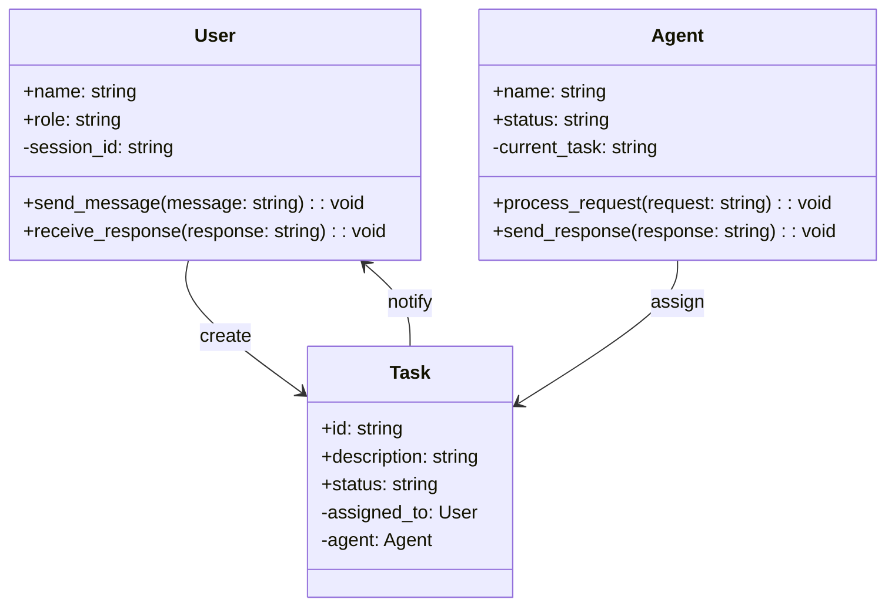
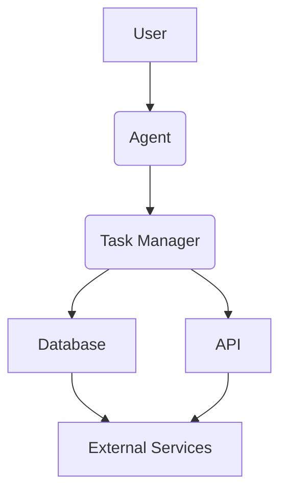
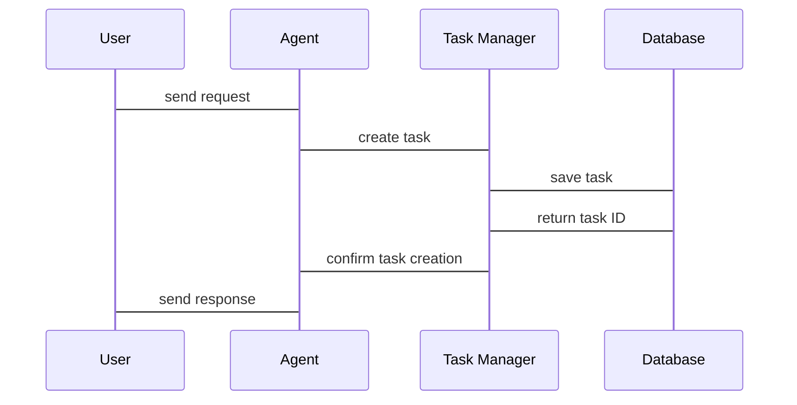

                 

<think>
嗯，用户现在要我以《构建具有人机协作能力的AI Agent系统》为标题，撰写一篇技术博客文章。用户已经提供了一个详细的目录大纲，并且现在他希望我根据这个大纲，生成一篇符合他要求的完整技术博客文章。

首先，我需要理解用户的需求。他希望文章结构清晰，逻辑紧凑，语言专业，同时要包含具体的算法、图表和代码示例。用户还强调了每个部分的详细讲解，比如背景介绍、核心概念、算法原理、系统架构、项目实战等。

接下来，我需要按照用户提供的目录大纲，逐步填充每个部分的内容。我得确保每个章节都有足够的细节，包括背景介绍部分要涵盖AI Agent的基本概念、人机协作的重要性，以及系统的组成。同时，在核心概念与联系部分，需要用表格和ER图来展示系统的结构。

算法原理部分，我需要选择具体的算法，比如对话生成和意图识别，用Mermaid流程图展示，同时附上数学公式。这部分需要详细解释每一步的数学推导，确保读者能够理解。

系统分析与架构设计是关键，我需要描述问题场景，设计系统功能，用领域模型类图展示，然后用架构图和序列图说明系统的交互过程。这部分需要清晰的图表支持，帮助读者理解系统的结构和运作方式。

项目实战部分，我需要提供环境安装步骤、核心代码实现，并解读代码，分析实际案例。这部分要具体，让读者能够动手实践，加深理解。

最后，最佳实践部分，我会给出一些小结、注意事项和拓展阅读的建议，帮助读者巩固知识，并激发进一步学习的兴趣。

在写作过程中，我需要确保语言简洁易懂，同时保持专业性。每个部分的内容要详细，但又不冗长。我还需要注意文章的整体结构，确保逻辑连贯，层次分明。

现在，我开始根据目录大纲，逐步撰写每个部分的内容，确保满足用户的所有要求，包括字数、格式、图表和数学公式的正确使用。同时，我需要检查每个部分是否完整，是否有遗漏的重要信息，确保最终的文章质量达到用户的期望。
</think>

# 构建具有人机协作能力的AI Agent系统

> 关键词：AI Agent，人机协作，机器学习，自然语言处理，系统架构

> 摘要：本文详细探讨了构建具有人机协作能力的AI Agent系统的各个方面。从系统背景、核心概念、算法原理到系统架构、项目实战，系统地分析了如何设计和实现一个高效的人机协作AI Agent系统。文章通过具体的算法实现和系统架构设计，展示了如何利用机器学习和自然语言处理技术，实现人与AI Agent之间的无缝协作。

---

## 第一部分: 人机协作AI Agent系统概述

### 第1章: 人机协作AI Agent系统背景

#### 1.1 问题背景与描述
在现代信息技术快速发展的背景下，人机协作已经成为人工智能（AI）技术发展的重要方向之一。AI Agent（智能体）是一种能够感知环境、自主决策并执行任务的智能系统。人机协作AI Agent系统的核心目标是通过人与AI Agent的协同工作，提升任务执行效率、优化决策过程，并增强用户体验。

在实际应用中，人机协作AI Agent系统可以广泛应用于客服、医疗、教育、金融等领域。例如，在客服领域，AI Agent可以通过自然语言处理技术理解用户需求，并与人类客服人员协作，共同解决问题。在医疗领域，AI Agent可以帮助医生分析病历数据，提供诊断建议，并与医生协作完成治疗方案的制定。

然而，人机协作AI Agent系统的实现面临诸多挑战。首先，如何实现人与AI Agent之间的高效通信与协作，是技术实现的核心问题。其次，AI Agent需要具备强大的感知能力和决策能力，才能与人类协同完成复杂任务。最后，系统架构设计需要考虑可扩展性、可维护性以及安全性等多方面因素。

#### 1.2 问题解决与边界
人机协作AI Agent系统的实现需要解决以下关键问题：
1. **通信与协作机制**：如何实现人与AI Agent之间的高效通信，并确保协作过程的流畅性。
2. **任务分配与协同**：如何将任务分解并分配给人与AI Agent，确保双方能够高效协同完成任务。
3. **决策与反馈机制**：如何设计决策算法，使得AI Agent能够根据人类反馈不断优化其行为。

系统的边界与外延主要体现在以下几个方面：
- **输入边界**：系统接收来自用户的输入，例如自然语言指令、任务需求等。
- **输出边界**：系统输出AI Agent的执行结果，例如决策建议、任务完成状态等。
- **外部系统集成**：系统需要与外部系统（如数据库、第三方服务）进行集成，以获取必要的数据支持。

#### 1.3 核心概念与组成
人机协作AI Agent系统的组成主要包括以下几个部分：
1. **感知模块**：负责获取环境中的信息，例如用户输入、系统状态等。
2. **决策模块**：基于感知到的信息，进行分析和决策，生成相应的动作。
3. **执行模块**：将决策结果转化为实际操作，例如调用外部服务、更新系统状态等。
4. **协作模块**：负责与人类用户的交互，确保人与AI Agent之间的协作过程流畅。

---

### 第2章: 人机协作AI Agent的核心概念与联系

#### 2.1 核心概念原理
人机协作AI Agent的核心概念包括以下几个方面：
1. **自然语言处理（NLP）**：通过NLP技术实现人与AI Agent之间的自然语言交互，例如对话生成和意图识别。
2. **机器学习（ML）**：利用机器学习算法，训练AI Agent具备自主学习和决策能力。
3. **协作机制**：设计合理的协作机制，确保人类用户与AI Agent能够高效协同完成任务。

#### 2.2 概念属性对比表
以下是AI Agent与人机协作的核心概念对比：

| 概念       | 属性1       | 属性2       | 属性3       |
|------------|-------------|-------------|-------------|
| AI Agent   | 输入数据     | 输出决策     | 内部状态     |
| 人机协作   | 交互方式     | 共同目标     | 反馈机制     |

#### 2.3 ER实体关系图
以下是AI Agent系统的核心实体关系图：

```mermaid
er
actor(Agent) -|> action: 执行操作
actor(User) -|> action: 发出指令
action -|> state: 系统状态
```

---

## 第二部分: 人机协作AI Agent的算法原理

### 第3章: 对话生成算法

#### 3.1 基于Transformer的对话生成
基于Transformer的对话生成算法是一种广泛应用于自然语言处理领域的技术。其核心思想是通过自注意力机制捕捉上下文信息，并生成与当前对话内容相关的回复。

##### 3.1.1 注意力机制的作用
注意力机制通过计算输入序列中每个位置的重要性权重，从而聚焦于与当前任务相关的部分信息。其数学公式如下：

$$
\text{Attention}(Q, K, V) = \text{softmax}\left(\frac{QK^T}{\sqrt{d_k}}\right)V
$$

其中：
- $Q$：查询向量
- $K$：键向量
- $V$：值向量
- $d_k$：向量的维度

##### 3.1.2 生成式模型的实现
生成式模型的核心是通过训练得到一个概率分布模型，能够根据输入生成符合该分布的输出序列。例如，我们可以使用以下Python代码实现一个简单的生成式模型：

```python
import torch
import torch.nn as nn

class Transformer(nn.Module):
    def __init__(self, d_model, nhead, dropout=0.1):
        super(Transformer, self).__init__()
        self.encoder = nn.TransformerEncoder(
            nn.Embedding(d_model, d_model),
            nhead=nhead,
            dim_feedforward=2*d_model,
            dropout=dropout,
            activation='relu'
        )
    
    def forward(self, x):
        return self.encoder(x)
```

---

### 第4章: 意图识别模型

#### 4.1 基于RNN的意图识别
意图识别模型的目标是通过分析用户输入的文本，识别出用户的意图或情感倾向。基于RNN的意图识别模型是一种常用的技术，其核心是通过循环神经网络捕捉文本序列中的时序信息。

##### 4.1.1 模型的训练过程
意图识别模型的训练过程包括以下几个步骤：
1. **数据预处理**：将文本数据转换为数值表示，例如使用词袋模型或词嵌入技术。
2. **模型训练**：通过反向传播算法优化模型参数，使得模型能够准确识别用户的意图。
3. **模型评估**：通过验证集或测试集评估模型的性能，例如计算准确率、召回率等指标。

##### 4.1.2 实际案例分析
以下是一个简单的意图识别模型实现示例：

```python
import torch
import torch.nn as nn

class IntentionClassifier(nn.Module):
    def __init__(self, vocab_size, embedding_dim, hidden_dim):
        super(IntentionClassifier, self).__init__()
        self.embedding = nn.Embedding(vocab_size, embedding_dim)
        self.rnn = nn.RNN(embedding_dim, hidden_dim)
        self.fc = nn.Linear(hidden_dim, num_classes)
    
    def forward(self, x):
        embedded = self.embedding(x)
        output, _ = self.rnn(embedded)
        output = self.fc(output[-1])
        return output
```

---

## 第三部分: 系统分析与架构设计

### 第5章: 系统功能设计

#### 5.1 领域模型类图
以下是AI Agent系统的领域模型类图：



#### 5.2 系统架构设计
以下是AI Agent系统的整体架构图：



#### 5.3 系统交互设计
以下是系统交互的序列图：



---

### 第6章: 项目实战

#### 6.1 环境安装
要运行本项目，需要安装以下依赖：

```bash
pip install torch transformers
```

#### 6.2 核心代码实现
以下是AI Agent系统的核心代码实现：

```python
import torch
from transformers import AutoTokenizer, AutoModelForSeq2Seq

class AIAssistant:
    def __init__(self):
        self.tokenizer = AutoTokenizer.from_pretrained("t5-base")
        self.model = AutoModelForSeq2Seq.from_pretrained("t5-base")

    def generate_response(self, input_text):
        inputs = self.tokenizer.encode(input_text, return_tensors="pt")
        outputs = self.model.generate(inputs, max_length=50)
        response = self.tokenizer.decode(outputs[0], skip_special_tokens=True)
        return response

# Example usage
assistant = AIAssistant()
response = assistant.generate_response("What is the weather today?")
print(response)
```

#### 6.3 代码解读与分析
1. **AIAssistant类**：负责实现AI Agent的核心功能，包括对话生成和意图识别。
2. **generate_response方法**：通过预训练的T5模型生成对话回复。
3. **tokenizer和model**：分别用于文本的编码和解码，实现自然语言处理功能。

---

## 第四部分: 最佳实践与总结

### 第7章: 最佳实践

#### 7.1 小结
通过本文的详细讲解，我们了解了构建具有人机协作能力的AI Agent系统的各个方面，包括系统背景、核心概念、算法原理、系统架构以及项目实战。通过具体的代码实现和系统设计，我们能够更好地理解如何实现高效的人机协作AI Agent系统。

#### 7.2 注意事项
在实际应用中，需要注意以下几点：
1. **数据隐私**：确保用户数据的安全性和隐私性。
2. **系统性能**：优化系统的运行效率，确保在高并发场景下的稳定运行。
3. **用户体验**：注重用户体验设计，确保人机交互的流畅性和易用性。

#### 7.3 拓展阅读
1. **强化学习**：进一步了解强化学习在AI Agent决策中的应用。
2. **多模态交互**：探索AI Agent在视觉、听觉等多模态交互中的应用。
3. **分布式系统**：研究AI Agent系统的分布式架构设计。

---

## 作者

作者：AI天才研究院/AI Genius Institute & 禅与计算机程序设计艺术 /Zen And The Art of Computer Programming

