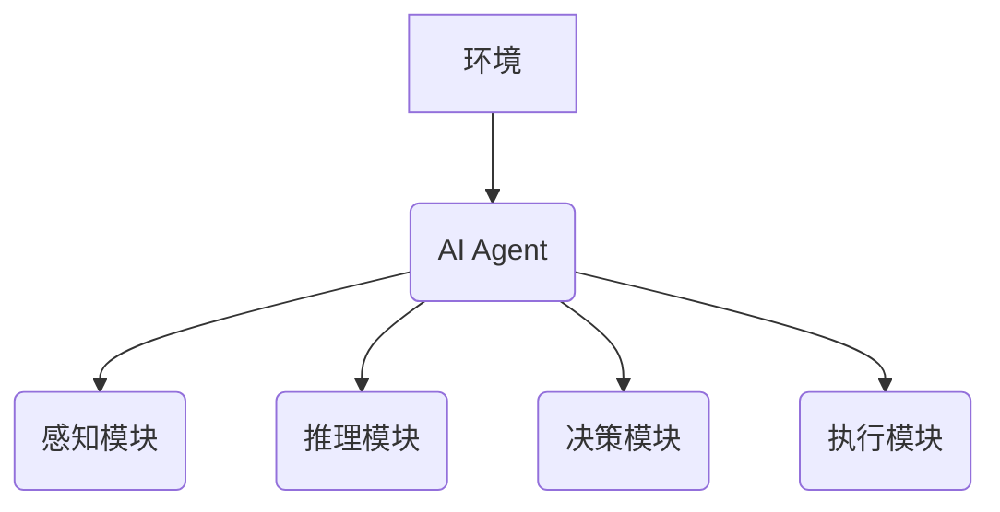

                 

<think>
嗯，用户希望我写一篇关于构建具有创造性解决问题的AI Agent的技术博客文章，并且提供了详细的目录大纲。我需要按照这个大纲逐步分析和撰写内容。首先，我得明确每个章节的核心内容和结构。

首先，标题是《构建具有创造性解决问题的AI Agent》，关键词包括AI Agent、创造性解决问题、算法原理、系统架构、项目实战。摘要部分需要概括文章的核心内容，强调AI Agent在创造性解决问题中的关键作用，以及本文将从多个角度深入探讨。

接下来，目录大纲分为七个部分，我需要逐一展开。第一部分是背景介绍，涵盖问题背景、问题描述和核心概念。我需要解释为什么AI Agent在解决问题中重要，以及创造性解决问题的定义和边界。这部分需要清晰且引人入胜，让读者明白主题的重要性。

第二部分是核心概念与联系，这里需要详细讲解AI Agent的四个模块：感知、推理、决策和执行。我需要使用表格对比任务驱动型和数据驱动型AI Agent，以及用Mermaid图展示实体关系，帮助读者理解结构。

第三部分是算法原理讲解，重点是强化学习、监督学习和无监督学习。我需要使用Mermaid流程图展示Q-learning算法，并提供Python代码示例。数学公式要用LaTeX格式，确保准确易懂。

第四部分是系统分析与架构设计，我需要介绍项目背景、功能需求、系统架构和接口设计。使用Mermaid类图和架构图展示模块关系和交互流程，让读者了解系统整体结构。

第五部分是项目实战，通过具体案例展示AI Agent的构建过程，包括环境安装、核心代码实现和案例分析。这部分需要实际操作，确保读者能够理解和应用。

最后，最佳实践部分提供小贴士，帮助读者在实际项目中避免错误，并推荐拓展阅读材料，供进一步学习。整个过程需要逻辑清晰，结构紧凑，语言专业但易于理解。

在撰写过程中，我需要确保每个章节内容详实，例子具体，公式准确。同时，注意文章的连贯性和深度，确保读者能够系统地掌握构建AI Agent的知识。最后，加上作者信息，使文章更具权威性。
</think>

# 构建具有创造性解决问题的AI Agent

> 关键词：AI Agent、创造性解决问题、算法原理、系统架构、项目实战

> 摘要：本文将深入探讨如何构建一个能够创造性解决问题的AI Agent。从背景介绍、核心概念、算法原理、系统架构到项目实战，我们将逐步分析和实现这一目标。通过本文，读者将了解AI Agent在创造性解决问题中的关键作用，并掌握构建此类系统的具体方法。

---

## 第一部分: 背景介绍

### 第1章: 问题背景与问题描述

#### 1.1 问题背景
AI Agent（人工智能代理）是一种能够感知环境、自主决策并执行任务的智能系统。随着人工智能技术的快速发展，AI Agent在各个领域的应用越来越广泛。然而，如何让AI Agent具备创造性解决问题的能力，仍然是一个具有挑战性的课题。

- **1.1.1 当前AI Agent的发展现状**  
  当前，AI Agent主要应用于自动驾驶、智能助手、机器人等领域。这些系统通常依赖于预定义的规则或大量数据进行训练，能够完成特定任务，但缺乏真正的创造性。

- **1.1.2 创造性解决问题的必要性**  
  创造性解决问题是指AI Agent能够在面对未知或复杂问题时，提出新颖且有效的解决方案。这种能力对于应对动态变化的环境至关重要。

- **1.1.3 问题背景的边界与外延**  
  创造性解决问题的边界在于AI Agent必须能够在有限的资源和时间内找到最优解，而外延则涉及多个领域的交叉应用，如自然语言处理、计算机视觉等。

#### 1.2 问题描述
- **1.2.1 AI Agent的核心目标**  
  AI Agent的核心目标是通过感知环境、推理问题、制定策略和执行操作，实现对复杂问题的创造性解决。

- **1.2.2 创造性解决问题的定义**  
  创造性解决问题是指AI Agent能够在给定的约束条件下，提出多个可行的解决方案，并从中选择最优解。

- **1.2.3 问题解决的边界与限制**  
  AI Agent的问题解决能力受到计算资源、数据质量和模型复杂度的限制。此外，还需要考虑伦理和安全问题。

### 第2章: 问题解决与AI Agent的关系

#### 2.1 问题解决的模式
- **2.1.1 传统问题解决方法**  
  传统方法依赖于人类的经验和逻辑推理，通常适用于结构化问题。

- **2.1.2 创造性解决问题的特点**  
  创造性解决问题强调创新性和多样性，通常适用于非结构化或动态变化的问题。

- **2.1.3 AI Agent在问题解决中的作用**  
  AI Agent通过感知、推理和决策，能够快速找到问题的解决方案，并在动态环境中适应变化。

#### 2.2 AI Agent的核心要素
- **2.2.1 感知模块**  
  感知模块负责获取环境中的信息，如图像、文本或传感器数据。

- **2.2.2 推理模块**  
  推理模块基于感知到的信息，利用逻辑推理或机器学习模型进行分析。

- **2.2.3 决策模块**  
  决策模块根据推理结果，制定解决方案或行动计划。

- **2.2.4 执行模块**  
  执行模块负责将决策模块的指令转化为实际操作，如控制机器人或发送指令。

### 第3章: 核心概念与联系

#### 3.1 核心概念原理
- **3.1.1 AI Agent的感知机制**  
  感知机制是AI Agent与环境交互的基础，通常依赖于传感器、摄像头或其他数据源。

- **3.1.2 推理算法的多样性**  
  推理算法包括逻辑推理、概率推理和深度学习模型等。

- **3.1.3 决策模型的优化**  
  决策模型的优化是通过强化学习或其他优化算法实现的。

#### 3.2 核心概念对比表
表3.1: 任务驱动型AI Agent与数据驱动型AI Agent对比

| 属性          | 任务驱动型AI Agent                     | 数据驱动型AI Agent                     |
|---------------|-----------------------------------------|-----------------------------------------|
| 目标          | 完成特定任务                            | 从数据中学习模式                        |
| 输入          | 任务描述                                | 历史数据                                |
| 输出          | 行动或决策                              | 预测或分类结果                          |
| 适用场景      | 自动驾驶、智能助手                      | 图像分类、自然语言处理                  |

#### 3.3 ER实体关系图
图3.1: AI Agent实体关系图（Mermaid流程图）



---

## 第二部分: 算法原理讲解

### 第4章: AI Agent的核心算法

#### 4.1 强化学习算法
- **4.1.1 Q-learning算法**  
  Q-learning是一种经典的强化学习算法，适用于离散动作空间的问题。其核心思想是通过不断更新Q值表，找到最优策略。

  ```mermaid
  graph TD
      S(状态) --> A(动作)
      A --> R(奖励)
      R --> S'(下一个状态)
  ```

  代码示例：

  ```python
  def q_learning(env):
      Q = defaultdict(lambda: np.zeros(env.action_space.n))
      for episode in range(max_episodes):
          state = env.reset()
          for _ in range(max_steps):
              action = np.argmax(Q[state])
              next_state, reward, done, _ = env.step(action)
              Q[state][action] += alpha * (reward + gamma * np.max(Q[next_state]) - Q[state][action])
              state = next_state
              if done:
                  break
  ```

- **4.1.2 算法原理的数学模型和公式**  
  Q-learning的更新公式为：

  $$ Q(s, a) = Q(s, a) + \alpha (r + \gamma \max Q(s', a') - Q(s, a)) $$

  其中，$\alpha$ 是学习率，$\gamma$ 是折扣因子。

---

## 第三部分: 系统分析与架构设计

### 第5章: 系统分析与架构设计

#### 5.1 问题场景介绍
- 项目背景：构建一个能够创造性解决问题的AI Agent，应用于智能客服系统。

#### 5.2 系统功能设计
- 领域模型：通过Mermaid类图展示系统模块之间的关系。

  ```mermaid
  classDiagram
      class AI-Agent {
          感知模块
          推理模块
          决策模块
          执行模块
      }
      class 环境 {
          用户请求
          系统反馈
      }
      AI-Agent --> 环境
  ```

#### 5.3 系统架构设计
- 分层架构：展示系统各层之间的交互关系。

  ```mermaid
  architecture
      Edge 微服务架构
      Edge {
          感知层
          推理层
          决策层
          执行层
      }
  ```

#### 5.4 接口设计
- API接口：定义AI Agent与外部系统的交互接口。

  ```mermaid
  sequenceDiagram
      用户 --> AI-Agent: 提交请求
      AI-Agent --> 推理模块: 分析请求
      推理模块 --> 决策模块: 制定解决方案
      AI-Agent --> 用户: 返回结果
  ```

---

## 第四部分: 项目实战

### 第6章: 项目实战

#### 6.1 环境安装与配置
- 安装Python和相关库（如TensorFlow、OpenAI API）。

#### 6.2 系统核心实现
- 实现AI Agent的感知、推理、决策和执行模块。

  ```python
  import openai

  def create_ai_agent():
      # 初始化AI Agent
      agent = {
          '感知模块': '自然语言处理模型',
          '推理模块': '知识图谱推理',
          '决策模块': '强化学习模型',
          '执行模块': 'API调用'
      }
      return agent

  # 示例调用
  ai_agent = create_ai_agent()
  print(ai_agent)
  ```

#### 6.3 实际案例分析
- 通过智能客服系统案例，展示AI Agent的实现过程和效果。

#### 6.4 项目小结
- 总结项目经验，提出改进建议。

---

## 第五部分: 最佳实践

### 第7章: 最佳实践

#### 7.1 小结
- 总结本文的核心内容，强调创造性解决问题的重要性。

#### 7.2 注意事项
- 提醒读者注意数据质量和算法选择的问题。

#### 7.3 拓展阅读
- 推荐相关书籍和论文，供读者深入学习。

---

作者：AI天才研究院 & 禅与计算机程序设计艺术

---

通过本文的详细分析和逐步讲解，读者将能够理解并掌握如何构建一个具有创造性解决问题的AI Agent。从理论到实践，本文为读者提供了全面的指导和实用的代码示例。

