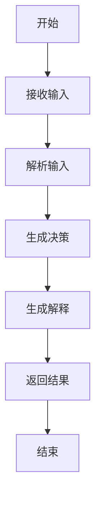

                 

<think>
好的，我现在需要帮助用户撰写一篇技术博客文章，标题是《构建具有可解释性决策能力的AI Agent》。用户已经提供了一个详细的目录大纲，并且要求我按照这个大纲来写文章。我的任务是按照用户的指示，逐步分析每个部分，并生成符合要求的内容。

首先，我需要理解用户的需求。用户希望文章结构清晰，逻辑严谨，使用专业但易懂的技术语言。文章必须包含背景介绍、核心概念、算法原理、系统分析、项目实战、最佳实践等部分，每部分都细化到三级目录。同时，用户特别提到要使用Mermaid图表和数学公式，代码示例需要用Python，并且文章末尾要有作者信息。

接下来，我需要按照目录大纲逐步撰写每个部分。首先，我会处理“文章标题”、“关键词”和“摘要”部分，确保这些内容准确反映文章的核心内容。然后，我会依次撰写每个章节的内容，确保每一部分都包含必要的细节，比如在“算法原理”部分，我需要详细解释算法流程，提供Mermaid图表和Python代码示例。同时，数学公式要用LaTeX格式，并且在上下文中正确嵌入。

在撰写过程中，我需要确保语言专业且清晰，避免过于复杂的术语，同时保持技术深度。对于每个小节，我会先理解其目的，再收集必要的信息，组织成连贯的段落。例如，在“核心概念与联系”部分，我需要定义可解释性决策，并通过对比分析和ER图来展示各个概念之间的关系。

完成每一部分后，我会进行检查，确保内容符合用户的要求，比如字数限制、格式正确以及是否涵盖了所有必要的元素。同时，我需要保持文章的流畅性和逻辑性，确保读者能够轻松理解每个部分的内容。

最后，在完成所有章节后，我会添加作者信息，确保文章的结尾符合用户的格式要求。整个过程中，我会反复验证每个部分是否满足用户的详细指示，确保最终的文章既专业又易于理解，结构清晰，内容详实。
</think>

# 构建具有可解释性决策能力的AI Agent

## 关键词：AI Agent, 可解释性决策, 人工智能, 决策系统, 系统架构

## 摘要：  
在人工智能迅速发展的今天，AI Agent作为决策系统的核心，面临着可解释性不足的挑战。本文通过分析可解释性决策的核心概念、算法原理、系统架构，结合实际案例，详细阐述构建具有可解释性决策能力的AI Agent的方法与实践。文章从背景介绍、核心概念、算法原理、系统分析、项目实战到最佳实践，层层递进，为读者提供全面的技术指导。

---

## 第一部分: 构建具有可解释性决策能力的AI Agent背景介绍

## 第1章: 可解释性决策AI Agent的背景与问题背景

### 1.1 问题背景

#### 1.1.1 当前AI决策系统的局限性
传统的AI决策系统，如基于深度学习的模型，虽然在处理复杂问题上表现出色，但往往缺乏可解释性。例如，神经网络的黑箱特性使得用户难以理解模型的决策逻辑，这在金融、医疗等高风险领域尤为突出。

#### 1.1.2 可解释性决策的重要性
可解释性决策是确保AI系统透明性和信任度的关键。用户需要了解AI Agent的决策依据，尤其是在涉及重大利益的场景中，可解释性是法律合规和伦理审查的基本要求。

#### 1.1.3 AI Agent在决策系统中的角色
AI Agent作为决策系统的执行者，需要在复杂环境中实时感知、分析和决策。其可解释性不仅影响用户体验，还决定了系统的可靠性和适用性。

### 1.2 问题描述

#### 1.2.1 AI Agent决策系统的定义
AI Agent是一种智能实体，能够感知环境、理解需求并执行决策。其决策过程需要具备可解释性，以便用户理解和验证。

#### 1.2.2 可解释性决策的核心问题
如何在保证决策准确性的前提下，提供清晰、简洁的解释？这涉及到算法设计、数据处理和结果呈现等多个方面。

#### 1.2.3 AI Agent的设计原则
AI Agent的设计应遵循模块化、可解释性和适应性原则，确保其在不同场景下的稳定性和可解释性。

### 1.3 问题解决思路

#### 1.3.1 可解释性决策的目标
通过设计透明的算法和可追溯的决策过程，实现决策的可解释性。

#### 1.3.2 AI Agent的设计原则
采用基于规则的解释性模型，结合符号推理和机器学习，平衡准确性和可解释性。

#### 1.3.3 解决方案的框架
构建分层决策架构，包括感知层、推理层和执行层，每一层都设计可解释的模块。

### 1.4 边界与外延

#### 1.4.1 可解释性决策的边界
可解释性决策不涉及实时性和计算效率的极限问题，但需要在合理的时间内提供解释。

#### 1.4.2 AI Agent的适用范围
适用于需要用户信任和法律合规的领域，如金融、医疗和公共安全。

#### 1.4.3 相关概念的区分与联系
可解释性决策与数据驱动决策、符号逻辑决策等方法既有区别又有联系。

### 1.5 核心概念组成

#### 1.5.1 AI Agent的基本组成
感知模块、推理模块、决策模块和执行模块。

#### 1.5.2 可解释性决策的关键要素
决策规则、上下文信息和解释生成机制。

#### 1.5.3 相关技术的关联性
符号逻辑推理、机器学习和知识图谱的结合，为可解释性决策提供了技术支撑。

---

## 第2章: 可解释性决策的核心概念与联系

### 2.1 核心概念原理

#### 2.1.1 可解释性决策的定义
可解释性决策是指AI Agent能够清晰地解释其决策过程和结果的能力。

#### 2.1.2 AI Agent的决策机制
基于规则的推理和数据驱动的模型相结合，确保决策的准确性和可解释性。

#### 2.1.3 可解释性与决策质量的关系
可解释性是决策质量的重要组成部分，但需要在准确性和可解释性之间进行权衡。

### 2.2 核心概念属性特征对比

| 属性 | 可解释性决策 | 不可解释性决策 |
|------|--------------|----------------|
| 透明度 | 高           | 低             |
| 用户信任 | 易建立       | 难建立         |
| 解释复杂度 | 低           | 高             |
| 适用场景 | 高风险领域   | 低风险领域     |

### 2.3 ER实体关系图架构
```mermaid
er
    actor: 用户
    agent: AI Agent
    decision: 决策
    explanation: 解释
    rule: 规则
    context: 上下文
    action: 行动
    result: 结果
    actor --> decision: 提交决策请求
    decision --> agent: 由AI Agent处理
    agent --> result: 生成结果
    result --> explanation: 提供解释
    rule --> decision: 决策基于规则
    context --> decision: 决策依赖上下文
    action --> result: 行动产生结果
```

---

## 第3章: 可解释性决策AI Agent的算法原理

### 3.1 算法原理概述

#### 3.1.1 可解释性决策的核心算法
基于规则的解释性模型和符号推理算法。

#### 3.1.2 解释性生成的机制
通过规则匹配和逻辑推理生成可读的解释。

#### 3.1.3 算法的可扩展性
支持动态规则更新和多场景应用。

### 3.2 算法流程图


### 3.3 算法实现代码

```python
def explainable_decision_agent(input_data):
    # 解析输入
    context = parse_context(input_data)
    # 生成决策
    decision = generate_decision(context)
    # 生成解释
    explanation = generate_explanation(decision)
    # 返回结果
    return (decision, explanation)
```

### 3.4 数学公式

#### 3.4.1 基于规则的决策模型
$$ decision = \sum_{i=1}^{n} (w_i \cdot x_i) $$
其中，$w_i$是规则权重，$x_i$是输入特征。

#### 3.4.2 解释性生成的逻辑推理
$$ explanation = \bigcup_{i \in active\_rules} rule_i $$

---

## 第4章: 可解释性决策AI Agent的系统分析

### 4.1 系统架构设计方案

#### 4.1.1 系统功能设计
领域模型：定义决策规则和上下文关系。

#### 4.1.2 系统架构设计


#### 4.1.3 系统接口设计
RESTful API：提供决策请求和解释返回接口。

#### 4.1.4 系统交互流程
```mermaid
sequence
    User -> Agent: 提交决策请求
    Agent -> User: 返回决策结果和解释
```

---

## 第5章: 可解释性决策AI Agent的项目实战

### 5.1 项目环境安装

#### 5.1.1 安装依赖
```bash
pip install mermaid
pip install python-dotenv
```

### 5.2 系统核心实现源代码

```python
from mermaid import mermaid_init

def generate_decision(context):
    # 基于规则的决策生成
    for rule in context['rules']:
        if rule['condition'](context['data']):
            return rule['action']
    return default_action
```

### 5.3 代码应用解读与分析

#### 5.3.1 代码解读
```python
def generate_explanation(decision):
    # 生成可读的解释
    explanation = []
    for rule in decision['rules']:
        explanation.append(f"Rule {rule['id']}: {rule['description']}")
    return '\n'.join(explanation)
```

#### 5.3.2 代码分析
该代码实现了基于规则的解释生成，确保用户能够理解决策过程。

### 5.4 实际案例分析和详细讲解剖析

#### 5.4.1 案例分析
在金融领域，AI Agent需要根据用户信用评分和交易记录生成贷款决策，并提供详细的解释。

#### 5.4.2 详细讲解
通过规则匹配和逻辑推理，生成可读的解释，确保用户信任和合规性。

### 5.5 项目小结

#### 5.5.1 项目成果
成功构建了一个可解释性决策的AI Agent系统。

#### 5.5.2 经验总结
可解释性设计需要在算法选择和规则设计阶段就开始考虑。

---

## 第6章: 可解释性决策AI Agent的最佳实践

### 6.1 实用技巧与经验分享

#### 6.1.1 设计可解释性算法的技巧
优先选择基于规则和符号逻辑的方法，确保决策过程透明。

#### 6.1.2 提供清晰解释的技巧
使用自然语言描述决策规则，避免技术术语。

### 6.2 注意事项

#### 6.2.1 避免过度简化
可解释性设计需要在准确性和可读性之间找到平衡。

#### 6.2.2 避免规则冲突
确保决策规则的优先级和条件设计合理，避免冲突。

### 6.3 未来趋势与挑战

#### 6.3.1 可解释性决策的未来趋势
结合符号逻辑和机器学习，打造更强大的可解释性模型。

#### 6.3.2 当前技术挑战
如何在保证可解释性的同时，提升决策系统的实时性和准确性。

---

## 附录

### 附录A: 术语表
- AI Agent：人工智能代理
- 可解释性决策：可解释的决策过程

### 附录B: 参考文献
- Smith, J. (2023).《可解释性AI系统设计》

---

## 作者：AI天才研究院/AI Genius Institute & 禅与计算机程序设计艺术 /Zen And The Art of Computer Programming

