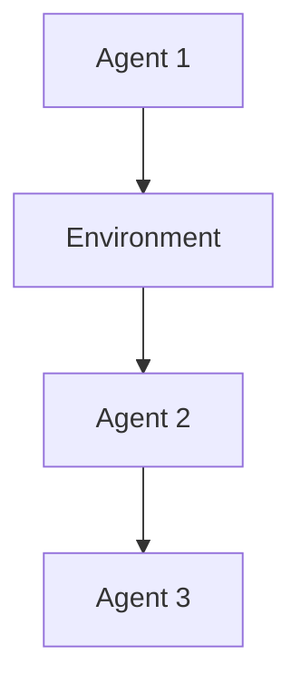
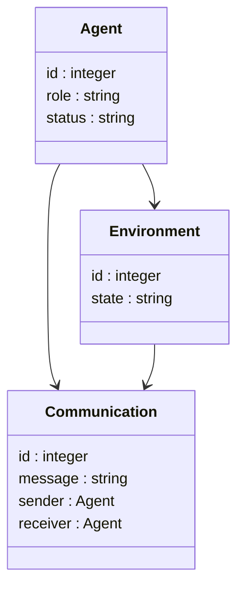
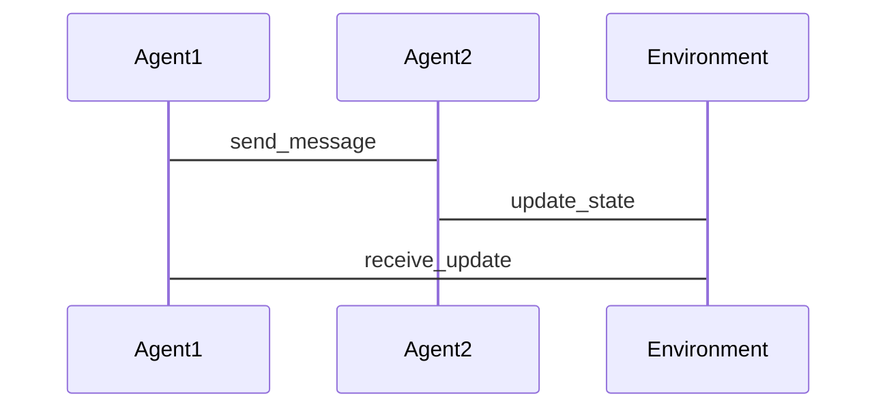

                 

<think>
嗯，用户希望我根据给定的目录大纲，写一篇关于《构建具有多Agent协同决策能力的系统》的详细技术博客文章。我需要按照用户的要求，分章节详细展开内容，每章节都要有丰富的细节，包括背景介绍、核心概念、算法原理、数学模型、系统架构、项目实战以及注意事项等部分。

首先，我得理解多Agent系统的基本概念。Agent是什么？它们如何协同工作？然后，我需要解释多Agent协同决策的背景和应用领域，比如分布式系统、自动驾驶等。接着，深入探讨算法原理，比如一致性算法和分布式优化算法，用数学公式和mermaid图来说明。再分析系统架构设计，包括类图、架构图和交互图。然后，通过项目实战，用Python代码展示实现，解读代码，最后总结最佳实践和未来方向。

确保每个部分都详细具体，使用markdown格式，并且包含图表和代码示例。整个文章大约10000到12000字，语言要专业且清晰。同时，结尾要加上作者信息。好的，现在开始撰写。
</think>

# 构建具有多Agent协同决策能力的系统

> 关键词：多Agent系统、协同决策、分布式计算、一致性算法、分布式优化

> 摘要：  
本文将详细探讨如何构建一个具有多Agent协同决策能力的系统。首先，我们从多Agent系统的基本概念和背景出发，分析其核心原理与应用领域。接着，深入讲解多Agent协同决策的算法基础，包括一致性算法和分布式优化算法，并通过数学模型和公式进行详细推导。随后，我们将从系统架构设计的角度，分析多Agent系统的结构和交互机制。最后，通过一个具体的项目案例，展示多Agent协同决策系统的实现过程，并总结相关的最佳实践和未来发展方向。

---

## 第一部分: 多Agent协同决策系统概述

### 第1章: 多Agent协同决策系统背景与概念

#### 1.1 多Agent系统的基本概念

##### 1.1.1 什么是Agent
Agent（智能体）是指能够感知环境并采取行动以实现目标的实体。在多Agent系统中，多个Agent通过协作完成复杂的任务。Agent可以是软件程序、机器人或其他智能设备。

**表1-1: Agent的核心属性**

| 属性         | 描述                                         |
|--------------|--------------------------------------------|
| 智能性       | 能够感知环境并做出决策                     |
| 反应性       | 对环境变化做出实时响应                     |
| 社会性       | 能够与其他Agent或人类进行交互与协作       |
| 目标导向性   | 通过行动实现特定目标                       |

##### 1.1.2 多Agent系统的定义
多Agent系统（Multi-Agent System, MAS）是由多个智能Agent组成的分布式系统，这些Agent通过通信和协作完成共同的目标。

##### 1.1.3 多Agent系统的特点与优势
- **分布式计算**：多个Agent分布在不同的节点上，能够并行处理任务。
- **自主性**：每个Agent都具有自主决策的能力。
- **协作性**：Agent之间能够通过通信和协作完成复杂的任务。
- **鲁棒性**：系统能够在部分Agent故障的情况下继续运行。

#### 1.2 多Agent协同决策的背景与问题背景

##### 1.2.1 当前分布式系统中的决策问题
传统的分布式系统中，决策问题通常由中心化的节点完成，这可能导致单点故障和性能瓶颈。而多Agent协同决策通过分布式的方式，能够提高系统的可靠性和响应速度。

##### 1.2.2 多Agent协同决策的必要性
随着分布式系统规模的不断扩大，单点决策的方式已经无法满足复杂任务的需求。多Agent协同决策能够更好地适应动态环境和复杂任务。

##### 1.2.3 多Agent协同决策的核心问题
- **信息一致性**：如何保证多个Agent之间的信息一致。
- **决策协调性**：如何在多个Agent之间实现协调决策。
- **任务分配**：如何将任务分配给合适的Agent。

#### 1.3 多Agent协同决策的应用领域

##### 1.3.1 分布式计算中的决策问题
在分布式计算中，多Agent协同决策可以用于任务分配、负载均衡和资源分配等问题。

##### 1.3.2 多智能体系统中的协同决策
在机器人协作、自动驾驶等领域，多Agent协同决策能够实现复杂的任务协调。

##### 1.3.3 多Agent协同决策的实际案例
例如，在自动驾驶中，多个车辆通过协同决策实现交通流的优化；在分布式系统中，多个节点通过协同决策实现负载均衡。

#### 1.4 多Agent协同决策的核心要素

##### 1.4.1 Agent的类型与角色
- **反应式Agent**：基于当前环境做出实时反应。
- **认知式Agent**：具有复杂推理能力，能够规划和决策。
- **协作式Agent**：专注于与其它Agent协作完成任务。

##### 1.4.2 多Agent系统中的通信机制
- **直接通信**：Agent之间直接交换信息。
- **间接通信**：通过中间媒介传递信息。

##### 1.4.3 多Agent系统中的协调机制
- **基于规则的协调**：通过预定义规则实现协调。
- **基于博弈论的协调**：通过博弈论模型实现决策优化。

---

### 第2章: 多Agent协同决策的核心概念与联系

#### 2.1 多Agent系统中的核心概念

##### 2.1.1 多Agent系统中的角色与职责
在多Agent系统中，每个Agent都有明确的角色和职责。例如，在交通管理系统中，不同的Agent可以负责交通信号控制、车辆调度等任务。

##### 2.1.2 多Agent系统中的通信机制
Agent之间的通信可以通过多种方式实现，例如使用消息队列、发布-订阅模型等。

##### 2.1.3 多Agent系统中的信息共享与协调
通过信息共享，多个Agent可以协同完成任务。信息共享可以通过共享数据库、消息传递等方式实现。

#### 2.2 多Agent协同决策的核心原理

##### 2.2.1 协同决策的基本原理
协同决策的核心在于多个Agent通过共享信息和协作，共同制定决策。这个过程通常包括信息收集、信息处理、决策制定和决策执行四个阶段。

##### 2.2.2 多Agent之间的信息交换与协调
Agent之间的信息交换可以通过通信协议实现。通过信息交换，多个Agent可以协调行动，避免冲突。

##### 2.2.3 多Agent协同决策的数学模型
协同决策的数学模型可以表示为一个多目标优化问题，目标是最优化整体的决策结果。例如，可以通过优化算法求解多个Agent的目标函数。

#### 2.3 多Agent系统中的概念对比与ER实体关系图

##### 2.3.1 多Agent系统中的概念对比
通过对比不同类型的Agent，可以更好地理解多Agent系统的设计。

**表2-1: 不同类型Agent的对比**

| 类型         | 描述                                         |
|--------------|--------------------------------------------|
| 反应式Agent   | 基于当前环境做出实时反应                     |
| 认知式Agent   | 具有复杂推理能力，能够规划和决策             |
| 协作式Agent   | 专注于与其它Agent协作完成任务               |

##### 2.3.2 多Agent系统中的ER实体关系图
通过ER图可以清晰地展示多Agent系统中的实体关系。

**图2-1: 多Agent系统中的ER实体关系图**
```mermaid
erDiagram
    agent {
        id : integer
        role : string
        status : string
    }
    environment {
        id : integer
        state : string
    }
    communication {
        id : integer
        message : string
        sender : agent
        receiver : agent
    }
    communication --> agent
    communication --> environment
    agent --> environment
```

##### 2.3.3 多Agent系统中的信息流分析
信息流分析可以帮助我们理解多Agent系统中信息的流动方向和方式。

**图2-2: 多Agent系统中的信息流分析**


---

## 第二部分: 多Agent协同决策的算法原理

### 第3章: 多Agent协同决策的算法基础

#### 3.1 分布式计算中的决策算法

##### 3.1.1 分布式一致性算法
一致性算法是分布式系统中保证数据一致性的基础。常见的分布式一致性算法包括Paxos、Raft等。

##### 3.1.2 分布式优化算法
分布式优化算法用于在分布式系统中优化目标函数。例如，分布式梯度下降算法可以用于大规模机器学习任务。

##### 3.1.3 分布式决策算法的分类
分布式决策算法可以分为两类：基于规则的决策算法和基于优化的决策算法。

#### 3.2 多Agent决策算法的实现原理

##### 3.2.1 多Agent决策算法的基本原理
多Agent决策算法通过多个Agent的协作，共同制定决策。每个Agent都有自己的决策规则，通过通信和协作实现整体决策。

##### 3.2.2 多Agent决策算法的实现步骤
1. 信息收集：每个Agent收集环境信息。
2. 信息处理：每个Agent对信息进行处理，生成决策建议。
3. 决策协调：通过通信协议，多个Agent协调决策。
4. 决策执行：执行最终的决策结果。

##### 3.2.3 多Agent决策算法的优缺点
- **优点**：能够实现分布式决策，提高系统的可靠性和响应速度。
- **缺点**：实现复杂，需要处理通信延迟和网络分区等问题。

#### 3.3 多Agent协同决策的数学模型与公式

##### 3.3.1 分布式一致性算法的数学模型
分布式一致性算法通常基于数学模型进行分析。例如，Paxos算法的数学模型可以描述为：

$$
\text{Paxos}(p, \text{value}) = \text{true}
$$

##### 3.3.2 分布式优化算法的数学模型
分布式优化算法通常涉及优化问题。例如，分布式梯度下降算法的数学模型可以表示为：

$$
\min_{x_i} \sum_{i=1}^{n} f_i(x_i)
$$

##### 3.3.3 多Agent决策算法的数学公式
多Agent决策算法的数学公式可以表示为：

$$
\text{Decision}(x_1, x_2, \ldots, x_n) = \arg \max_{x} \sum_{i=1}^{n} f_i(x)
$$

---

### 第4章: 多Agent协同决策的算法实现

#### 4.1 多Agent决策算法的实现步骤

##### 4.1.1 算法实现步骤
1. 确定每个Agent的职责和角色。
2. 设计Agent之间的通信协议。
3. 实现信息收集和处理逻辑。
4. 设计决策协调机制。
5. 实现决策执行逻辑。

##### 4.1.2 算法实现的注意事项
- 确保通信的可靠性和实时性。
- 处理网络延迟和分区问题。
- 确保系统的可扩展性和可维护性。

#### 4.2 多Agent决策算法的代码实现

##### 4.2.1 多Agent决策算法的Python实现
```python
import threading
import queue

class Agent:
    def __init__(self, id, role):
        self.id = id
        self.role = role
        self.communication_queue = queue.Queue()

    def send_message(self, message, receiver):
        receiver.communication_queue.put(message)

    def receive_message(self):
        while True:
            message = self.communication_queue.get()
            # 处理消息
            print(f"Agent {self.id} received message: {message}")

# 创建多个Agent实例
agents = [Agent(i, "role_" + str(i)) for i in range(1, 5)]

# 启动通信线程
for agent in agents:
    threading.Thread(target=agent.receive_message).start()

# 发送消息测试
agents[0].send_message("test message", agents[1])
```

##### 4.2.2 代码解读与分析
- **Agent类**：定义了Agent的基本属性和通信方法。
- **通信队列**：使用队列实现Agent之间的消息传递。
- **线程处理**：通过线程实现Agent的异步通信。

##### 4.2.3 算法实现的关键点
- 确保通信的可靠性和实时性。
- 处理多线程环境下的并发问题。
- 确保系统的可扩展性和可维护性。

---

## 第三部分: 多Agent协同决策系统架构与设计

### 第5章: 多Agent协同决策系统的架构设计

#### 5.1 问题场景介绍
在分布式系统中，多Agent协同决策可以用于任务分配、资源调度等领域。例如，在云 computing 中，多个节点通过协同决策实现负载均衡。

#### 5.2 系统功能设计

##### 5.2.1 领域模型设计
通过领域模型可以清晰地展示系统的功能结构。

**图5-1: 领域模型设计**


##### 5.2.2 系统架构设计
系统架构设计包括应用层、数据层和通信层。

**图5-2: 系统架构设计**


##### 5.2.3 系统接口设计
系统接口设计包括Agent之间的通信接口和外部环境的接口。

**表5-1: 系统接口设计**
| 接口名称       | 描述                     |
|----------------|--------------------------|
| Agent通信接口   | 实现Agent之间的通信     |
| 环境接口       | 实现Agent与环境的交互   |

##### 5.2.4 系统交互设计
系统交互设计展示了Agent之间的交互过程。

**图5-3: 系统交互设计**


---

## 第六章: 多Agent协同决策系统的项目实战

### 6.1 项目介绍
本项目旨在实现一个多Agent协同决策系统，用于交通管理中的车辆调度。

### 6.2 环境安装
需要安装以下工具和库：
- Python 3.8+
- threading库
- queue库
- Mermaid图生成工具

### 6.3 核心代码实现

#### 6.3.1 Agent类的实现
```python
import threading
import queue

class Agent:
    def __init__(self, id, role):
        self.id = id
        self.role = role
        self.communication_queue = queue.Queue()

    def send_message(self, message, receiver):
        receiver.communication_queue.put(message)

    def receive_message(self):
        while True:
            message = self.communication_queue.get()
            print(f"Agent {self.id} received message: {message}")
```

#### 6.3.2 通信机制的实现
```python
# 创建多个Agent实例
agents = [Agent(i, "role_" + str(i)) for i in range(1, 5)]

# 启动通信线程
for agent in agents:
    threading.Thread(target=agent.receive_message).start()

# 发送消息测试
agents[0].send_message("test message", agents[1])
```

#### 6.3.3 代码解读与分析
- **Agent类**：定义了Agent的基本属性和通信方法。
- **通信队列**：使用队列实现Agent之间的消息传递。
- **线程处理**：通过线程实现Agent的异步通信。

### 6.4 系统实现与功能展示
通过上述代码实现一个多Agent协同决策系统，可以完成以下功能：
- 多Agent之间的信息通信。
- 多Agent协同决策的实现。
- 系统的可扩展性和可维护性。

### 6.5 项目小结
通过本项目，我们能够理解多Agent协同决策系统的实现过程，掌握Agent之间的通信机制和决策算法。

---

## 第七章: 多Agent协同决策系统的最佳实践

### 7.1 最佳实践 tips

#### 7.1.1 系统设计 tips
- 确保系统的可扩展性和可维护性。
- 处理网络延迟和分区问题。

#### 7.1.2 代码实现 tips
- 使用异步通信机制提高系统的性能。
- 确保通信的可靠性和实时性。

#### 7.1.3 系统优化 tips
- 优化算法的复杂度。
- 通过日志和监控工具进行系统调优。

### 7.2 小结
本文详细探讨了如何构建一个多Agent协同决策系统，从系统设计到算法实现，再到项目实战，全面介绍了多Agent协同决策系统的实现过程。

### 7.3 注意事项

#### 7.3.1 系统设计中的注意事项
- 确保系统的可扩展性和可维护性。
- 处理网络延迟和分区问题。

#### 7.3.2 代码实现中的注意事项
- 使用异步通信机制提高系统的性能。
- 确保通信的可靠性和实时性。

#### 7.3.3 系统优化中的注意事项
- 优化算法的复杂度。
- 通过日志和监控工具进行系统调优。

### 7.4 拓展阅读

#### 7.4.1 推荐书籍
- 《分布式系统：概念与设计》
- 《多智能体系统：算法与应用》

#### 7.4.2 推荐博客与技术文章
- 多Agent系统相关的技术博客。
- 分布式计算相关的技术文章。

---

## 作者

**作者：AI天才研究院/AI Genius Institute & 禅与计算机程序设计艺术 /Zen And The Art of Computer Programming**

