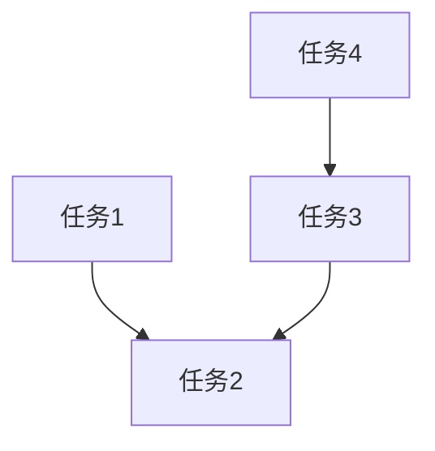
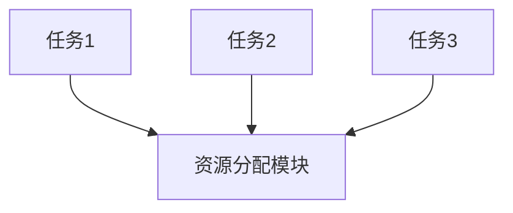

                 

<think>
嗯，我现在需要帮用户撰写一篇名为《构建具有多任务处理能力的AI Agent》的技术博客文章。用户提供了详细的目录结构和一些内容，我需要按照这个结构来逐步完成文章。首先，我需要理解用户的需求：用户希望文章结构清晰，内容专业，涵盖从基础到高级的各个方面，包括背景、理论、算法、系统架构、实战案例以及最佳实践。

开始的时候，我先看一下用户给的目录结构，看看每一章的内容。第一部分是AI Agent基础与多任务处理概述，包括两章。第一章是AI Agent的基本概念和多任务处理的重要性，第二章是多任务处理的核心概念和理论基础。我需要确保每一章的内容详细且有逻辑性。

在第一章中，我需要解释AI Agent的基本概念，包括定义、核心特征，然后介绍多任务处理的重要性。这部分需要让读者理解为什么多任务处理对于AI Agent来说是重要的。可能我还需要举一些实际的例子，比如智能助手或企业级应用，来说明多任务处理的应用场景。

接下来，第二章是多任务处理的核心概念与理论基础。我需要详细讲解多任务处理的理论，比如任务分解、优先级排序、资源分配等。这部分可能需要一些图表，比如ER图或流程图，来帮助理解。我还需要确保内容专业，同时保持易懂。

然后，我看到第三章是多任务处理的算法原理与实现。这里需要介绍不同的算法，如多任务学习、任务分解算法、资源分配与调度算法。这部分需要详细讲解每个算法的原理，可能需要用mermaid流程图来展示算法步骤，并附上Python代码示例，帮助读者理解。

第四章是多任务处理的数学模型与公式。这部分可能需要较深的数学知识，比如线性代数或优化理论。我需要用Latex公式来展示数学模型，并解释每个公式的含义和应用。例如，可能需要解释多任务学习中的损失函数和优化目标。

接下来是第五章，系统分析与架构设计。这部分需要分析AI Agent的系统架构，包括模块划分、功能设计、系统架构图等。我可能需要用mermaid架构图来展示系统的结构，以及序列图来展示模块之间的交互过程。

第六章是项目实战，这部分需要提供一个具体的案例，展示如何实现一个多任务处理的AI Agent。我需要详细说明项目环境的配置，核心代码的实现，以及功能的解读和实际案例分析。这可能包括任务分解、任务调度、资源分配等部分的代码实现。

最后，第七章是最佳实践、小结与展望。我需要总结整个项目的实现过程，提出一些注意事项和最佳实践，同时指出未来的发展方向。

在撰写过程中，我需要确保每一部分都符合用户的要求，包括使用专业且清晰的技术语言，逐步分析推理，逻辑严密。同时，注意格式的规范，比如使用markdown格式，数学公式用Latex表示，图表用mermaid语法。

可能遇到的困难包括如何将复杂的理论和算法用简单易懂的语言表达出来，以及如何设计合理的代码示例和图表。为了解决这个问题，我会先整理好每个部分的逻辑框架，再逐步填充内容，确保每一部分都详细且有条理。

总的来说，我需要按照用户提供的目录结构，逐步展开每一章的内容，确保每一部分都符合专业性和可读性的要求。同时，注意保持文章的连贯性和整体性，帮助读者系统地理解和掌握构建具有多任务处理能力的AI Agent的知识和技能。
</think>

# 构建具有多任务处理能力的AI Agent

## 关键词：AI Agent, 多任务处理, 人工智能, 系统架构, 机器学习

## 摘要：本文将深入探讨如何构建具有多任务处理能力的AI Agent。从基本概念到算法实现，从系统架构到项目实战，全面解析多任务处理的原理与应用。通过详细分析和实际案例，帮助读者掌握构建高效AI Agent的核心技术。

---

# 第1章: AI Agent的基本概念与多任务处理的重要性

## 1.1 AI Agent的定义与核心特征

### 1.1.1 AI Agent的定义

AI Agent（人工智能代理）是指能够感知环境、自主决策并执行任务的智能实体。它可以是一个软件程序、机器人或其他智能系统，通过传感器获取信息，并通过执行器与环境交互。

### 1.1.2 AI Agent的核心特征

- **自主性**：AI Agent能够自主决策，无需外部干预。
- **反应性**：能够实时感知环境并做出反应。
- **目标导向**：具有明确的目标，并根据目标执行任务。
- **学习能力**：能够通过经验优化自身的性能。

### 1.1.3 多任务处理能力的定义与意义

多任务处理能力是指AI Agent能够在同一时间或短时间内处理多个不同的任务，并根据任务优先级和资源分配高效完成目标。这种能力在复杂环境中尤为重要，能够提升AI Agent的实用性和适应性。

## 1.2 多任务处理的背景与挑战

### 1.2.1 当前AI Agent的发展趋势

随着人工智能技术的快速发展，AI Agent的应用场景越来越广泛，从智能家居到企业级系统，AI Agent需要处理的任务类型也日益多样化。

### 1.2.2 多任务处理在AI Agent中的重要性

在实际应用中，AI Agent往往需要同时处理多个任务，例如在智能助手中，同时处理用户的语音请求、日历管理、信息检索等任务。多任务处理能力能够显著提升AI Agent的效率和用户体验。

### 1.2.3 多任务处理的主要挑战

- **任务冲突**：多个任务之间可能存在资源竞争或目标冲突，需要进行协调和优化。
- **任务优先级**：如何动态调整任务优先级是多任务处理的关键挑战。
- **资源分配**：在有限的资源条件下，如何高效分配资源以保证任务完成质量。

## 1.3 多任务处理的典型应用场景

### 1.3.1 智能助手与个人任务管理

AI Agent可以作为个人智能助手，帮助用户管理日程、处理邮件、设置提醒等，同时处理多个任务。

### 1.3.2 企业级AI Agent的应用场景

在企业环境中，AI Agent可以同时处理多个业务流程，例如订单处理、客户支持、数据分析等。

### 1.3.3 多任务处理在复杂环境中的优势

在复杂环境中，多任务处理能力能够使AI Agent更高效地应对多种任务，例如自动驾驶汽车需要同时处理路径规划、障碍物避让、与周围车辆的通信等多个任务。

---

# 第2章: 多任务处理的核心概念与理论基础

## 2.1 多任务处理的理论基础

### 2.1.1 多任务学习的基本原理

多任务学习是一种机器学习方法，通过同时学习多个任务，共享部分参数，从而提高模型的泛化能力和学习效率。

### 2.1.2 多任务处理中的任务分解与协调

任务分解是将复杂任务分解为多个子任务，每个子任务由不同的模块处理，任务协调则需要确保各个子任务协同工作，避免冲突。

### 2.1.3 多任务处理的数学模型概述

多任务处理的数学模型通常包括多个损失函数和优化目标，通过联合优化多个任务的损失函数来实现多任务处理。

## 2.2 多任务处理中的任务关系分析

### 2.2.1 任务之间的依赖关系

任务之间的依赖关系是指一个任务的完成依赖于另一个任务的结果，例如翻译任务可能需要先进行语音识别。

### 2.2.2 任务之间的冲突与协调

任务之间的冲突可能需要资源分配或优先级调整来解决，例如在多任务调度中，优先处理紧急任务。

### 2.2.3 任务优先级的动态调整

任务优先级需要根据环境变化和任务目标动态调整，以确保重要任务优先完成。

## 2.3 多任务处理的实现机制

### 2.3.1 并行处理与串行处理的区别

并行处理是指同时处理多个任务，而串行处理是指按顺序处理任务。

### 2.3.2 资源分配与任务调度

资源分配需要根据任务需求动态分配计算资源，任务调度则需要根据任务优先级和资源可用性进行调度。

### 2.3.3 多任务处理中的状态管理

状态管理是确保多个任务之间的状态同步和共享，避免状态冲突和不一致。

---

## 图表：多任务处理的任务关系分析



---

# 第3章: 多任务处理的算法原理与实现

## 3.1 多任务学习的算法概述

### 3.1.1 基于神经网络的多任务学习

通过共享神经网络参数，同时学习多个任务，能够提高模型的泛化能力。

### 3.1.2 基于强化学习的多任务处理

通过强化学习算法，AI Agent可以在多任务环境中通过试错学习最优策略。

### 3.1.3 基于图模型的多任务处理

利用图模型表示任务之间的关系，进行任务分解和优化。

## 3.2 多任务处理中的任务分解算法

### 3.2.1 基于贪心算法的任务分解

贪心算法是一种贪心策略，每次选择当前最优的子任务进行分解。

### 3.2.2 基于动态规划的任务分解

动态规划算法通过分解问题为更小的子问题，逐步求解最优解。

### 3.2.3 基于遗传算法的任务分解

遗传算法通过模拟自然选择和遗传变异，优化任务分解的方案。

## 3.3 多任务处理的资源分配与调度算法

### 3.3.1 基于优先级的任务调度

根据任务优先级进行调度，确保重要任务优先完成。

### 3.3.2 基于负载均衡的资源分配

根据系统负载动态分配资源，避免资源浪费和任务延迟。

### 3.3.3 基于反馈机制的动态调整

根据任务执行情况动态调整资源分配和任务优先级。

---

## 图表：多任务处理的资源分配与调度算法



---

# 第4章: 多任务处理的数学模型与公式

## 4.1 多任务学习的数学模型

### 4.1.1 多任务学习的损失函数

$$ L = \lambda_1 L_1 + \lambda_2 L_2 + \cdots + \lambda_n L_n $$

其中，$L_i$ 是第i个任务的损失函数，$\lambda_i$ 是对应的权重系数。

### 4.1.2 多任务学习的优化目标

$$ \min_{\theta} \sum_{i=1}^{n} \lambda_i L_i(\theta) $$

其中，$\theta$ 是模型参数，$L_i(\theta)$ 是第i个任务的损失函数。

---

## 图表：多任务学习的数学模型

```mermaid
graph TD
A[输入] --> B[模型]
C[任务1] --> B
D[任务2] --> B
E[任务3] --> B
F[输出] <-- B
```

---

# 第5章: 系统分析与架构设计

## 5.1 系统架构设计

### 5.1.1 系统功能设计

系统功能包括任务接收、任务分解、任务调度、资源分配、任务执行和结果反馈。

### 5.1.2 系统架构图


### 5.1.3 系统接口设计

系统接口包括任务接收接口、任务分解接口、任务调度接口和结果反馈接口。

### 5.1.4 系统交互图

```mermaid
sequenceDiagram
参与者 用户
参与者 AI Agent
参与者 资源管理模块

用户 -> AI Agent: 发送任务
AI Agent -> 资源管理模块: 申请资源
资源管理模块 -> AI Agent: 分配资源
AI Agent -> 用户: 反馈结果
```

---

# 第6章: 项目实战

## 6.1 环境安装

安装所需的Python库，例如TensorFlow、Keras、scikit-learn等。

## 6.2 系统核心实现源代码

### 6.2.1 任务分解算法实现

```python
def task_decomposition(tasks):
    # 任务分解逻辑
    pass
```

### 6.2.2 任务调度算法实现

```python
def task_scheduling(tasks):
    # 任务调度逻辑
    pass
```

### 6.2.3 资源分配算法实现

```python
def resource_allocation(tasks):
    # 资源分配逻辑
    pass
```

## 6.3 功能解读与分析

详细解读每个模块的功能实现，并分析其对整个系统的影响。

## 6.4 实际案例分析

通过具体案例分析，展示如何应用多任务处理能力的AI Agent解决实际问题。

## 6.5 项目小结

总结项目实现的关键点和经验教训，为后续优化提供参考。

---

# 第7章: 最佳实践、小结与展望

## 7.1 最佳实践

### 7.1.1 系统设计中的注意事项

在系统设计中，需要注意任务优先级的动态调整和资源分配的优化。

### 7.1.2 代码实现中的注意事项

在代码实现中，需要注意多线程和多进程的安全性问题，避免资源竞争和死锁。

### 7.1.3 测试与优化

在测试阶段，需要进行全面的功能测试和性能优化，确保系统的稳定性和高效性。

## 7.2 小结

本文详细介绍了构建具有多任务处理能力的AI Agent的关键技术，包括基本概念、算法原理、系统架构和项目实战等内容。

## 7.3 未来展望

未来，随着人工智能技术的不断发展，AI Agent的多任务处理能力将更加智能化和高效化，应用场景也将更加广泛。

---

# 作者

**作者：AI天才研究院/AI Genius Institute & 禅与计算机程序设计艺术 /Zen And The Art of Computer Programming**

