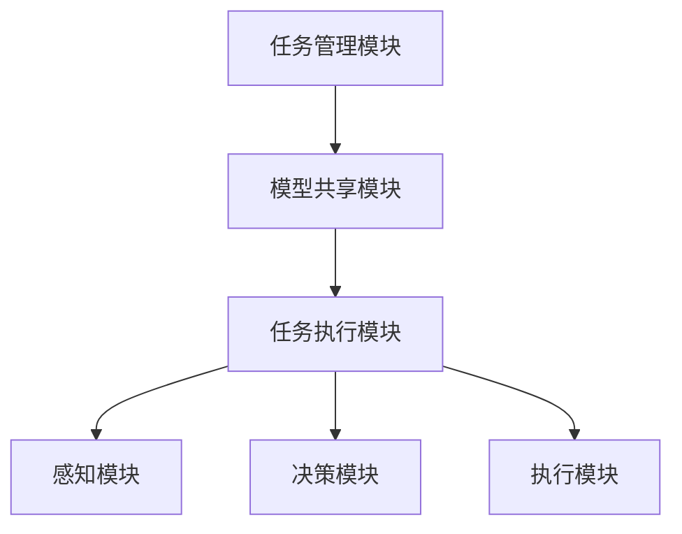
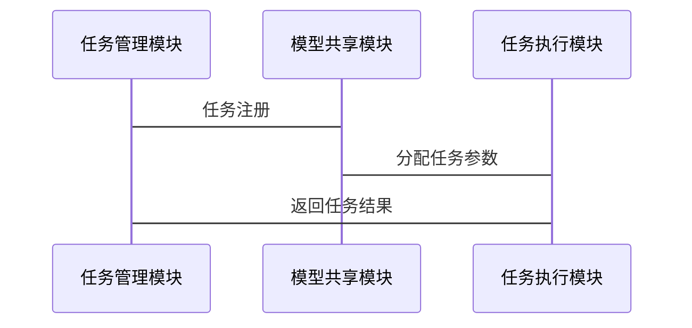

                 

<think>
嗯，用户让我写一篇关于构建具有多任务学习能力的AI Agent的技术博客，要求内容详细，结构清晰，包括背景、核心概念、算法、系统设计、项目实战等部分。我得先理清每个部分应该涵盖的内容，确保逻辑连贯，覆盖所有要点。

首先，标题和摘要部分。标题已经确定，摘要需要简洁明了，涵盖文章的核心内容，强调多任务学习的重要性以及如何构建AI Agent。接下来是关键词，我需要列出5-7个相关术语，比如多任务学习、AI Agent、神经网络、模型共享、任务协调等。

第一部分是背景介绍，包括多任务学习和AI Agent的基本概念。这部分需要定义什么是多任务学习，它与单一任务学习的区别，以及AI Agent的功能和分类。我需要用简单的语言解释这些概念，帮助读者建立基础。

第二部分是核心概念与联系，我需要详细讲解多任务学习的原理，比如任务间的权重分配和模型共享机制。这部分可能需要用表格和图表来对比不同任务类型，帮助读者更好地理解。

接下来是算法原理，这部分需要介绍主流的多任务学习算法，如MTL、HMTL、ECC等。每个算法都需要用数学公式和流程图来说明，确保读者能够理解其工作原理。我可能会用到Mermaid来绘制流程图，同时用Latex来展示公式。

系统分析与架构设计部分，我需要讨论如何设计一个多任务学习的AI Agent系统，包括系统架构图和类图。这部分可能需要详细描述各个模块的交互，用Mermaid序列图展示。

项目实战部分，我需要提供一个具体的Python代码示例，展示如何实现一个多任务学习模型。代码中需要包含数据预处理、模型构建、训练和评估等步骤，帮助读者实际操作。

最后，高级主题和应用案例可以探讨当前的研究热点，如预训练模型和元学习在多任务中的应用。这部分需要总结全书，并给出未来的发展方向。

在写作过程中，我需要确保每个章节都有足够的细节，使用清晰的结构和专业的术语，同时保持语言的简洁易懂。可能还需要在适当的地方加入图表和代码示例，以增强文章的可读性和实用性。

总之，我需要按照用户的要求，逐步构建一个逻辑清晰、内容详实的技术博客，确保每个部分都覆盖到，并且能够帮助读者系统地理解如何构建具有多任务学习能力的AI Agent。
</think>

# 构建具有多任务学习能力的AI Agent

> 关键词：多任务学习，AI Agent，神经网络，模型共享，任务协调

> 摘要：本文将深入探讨如何构建一个具有多任务学习能力的AI Agent。通过分析多任务学习的核心原理、算法实现、系统架构设计以及实际项目案例，我们将详细阐述如何使AI Agent能够同时处理多个任务，并在实际应用中展现出强大的智能能力。

---

## 第一部分: 多任务学习与AI Agent基础

### 第1章: 多任务学习与AI Agent概述

#### 1.1 多任务学习的基本概念

多任务学习（Multi-Task Learning, MTL）是一种机器学习范式，旨在通过同时学习多个相关任务来提高模型的泛化能力和性能。与单一任务学习（Single-Task Learning, STL）相比，多任务学习能够利用任务间的共享信息，减少数据需求，提高模型的鲁棒性和适应性。

**多任务学习的核心特点：**
1. **任务相关性**：多个任务之间存在某种关联，可以共享部分特征或参数。
2. **参数共享**：通过共享某些模型参数，减少训练数据的需求，提高学习效率。
3. **联合优化**：在训练过程中同时优化多个任务的目标函数，使模型在多个任务上表现均衡。

#### 1.2 AI Agent的基本概念

AI Agent（人工智能代理）是一种能够感知环境、执行任务并做出决策的智能体。它通常具备以下核心功能：
1. **感知**：通过传感器或接口获取环境信息。
2. **推理**：基于感知信息进行分析和推理，做出决策。
3. **执行**：根据决策执行具体动作，影响环境状态。

**AI Agent的分类与应用场景：**
1. **简单反射型Agent**：基于当前感知直接执行预定义动作。
2. **基于模型的反射型Agent**：利用内部模型进行状态评估和决策。
3. **目标驱动型Agent**：根据目标驱动行为，主动规划动作。
4. **实用驱动型Agent**：通过效用函数优化决策，追求最大效用。

---

### 第2章: 多任务学习的背景与挑战

#### 2.1 多任务学习的背景

随着人工智能技术的快速发展，单任务模型在实际应用中逐渐暴露出局限性：
- **数据需求量大**：单一任务模型需要大量任务-specific数据，难以应对小样本任务。
- **模型泛化能力弱**：单一任务模型难以适应任务间的相似性，难以扩展到多个相关任务。
- **计算资源浪费**：独立训练多个模型会导致计算资源浪费，且难以利用任务间的共享信息。

#### 2.2 多任务学习的核心挑战

1. **任务间干扰与协调问题**：如何平衡多个任务之间的学习进度，避免某些任务“主导”模型学习，导致其他任务性能下降。
2. **资源分配与模型共享问题**：如何合理分配计算资源，在模型中实现有效的参数共享，同时保持任务间的独立性。
3. **多任务学习的评估与优化**：如何设计合理的评估指标，优化多任务模型在多个任务上的表现。

---

## 第二部分: 多任务学习算法原理

### 第3章: 多任务学习算法的核心原理

#### 3.1 多任务学习算法的分类

1. **基于权重共享的多任务学习（Weight-Sharing MTL）**  
   - 核心思想：通过共享部分网络参数，使多个任务共享底层特征，减少参数数量。
   - 适用场景：任务之间存在较强的特征共享性，且任务目标相似。

2. **基于参数分离的多任务学习（Parameter-Separation MTL）**  
   - 核心思想：为每个任务分配独立的参数，同时共享部分网络结构。
   - 适用场景：任务之间存在部分独立性，但可以通过共享网络结构获益。

3. **基于任务间关系的多任务学习（Relation-Based MTL）**  
   - 核心思想：通过建模任务之间的关系，动态调整参数权重，优化多任务学习效果。
   - 适用场景：任务之间存在复杂关系，需要精细的任务间权重调整。

#### 3.2 多任务学习算法的数学模型

1. **基于共享参数的多任务学习模型**  
   $$ y_i = f(x_i; \theta) $$  
   其中，$\theta$ 是共享的网络参数，$x_i$ 是输入数据，$y_i$ 是输出结果。

2. **基于任务间关系的多任务学习模型**  
   $$ y_i = f(x_i; \theta_{task_i}) $$  
   其中，$\theta_{task_i}$ 是为每个任务独立分配的参数，共享部分网络结构。

---

## 第三部分: 系统分析与架构设计

### 第4章: 多任务学习AI Agent的系统架构

#### 4.1 系统功能设计

1. **任务管理模块**：负责任务的注册、调度和协调。
2. **模型共享模块**：实现任务之间的参数共享和权重分配。
3. **任务执行模块**：根据当前任务需求，执行具体动作并返回结果。

#### 4.2 系统架构设计（Mermaid 架构图）



#### 4.3 系统交互设计（Mermaid 序列图）



---

## 第四部分: 项目实战

### 第5章: 多任务学习AI Agent的实现

#### 5.1 项目环境安装

```bash
pip install numpy tensorflow matplotlib
```

#### 5.2 核心实现代码（Python）

```python
import numpy as np
import tensorflow as tf

class MultiTaskAgent:
    def __init__(self, num_tasks=3):
        self.num_tasks = num_tasks
        self.shared_weights = tf.Variable(tf.random.normal([10, 5]))
        self.task_specific_weights = [tf.Variable(tf.random.normal([5, 1])) for _ in range(num_tasks)]
    
    def call(self, inputs, task_idx):
        x = tf.keras.layers.Dense(10, activation='relu')(inputs)
        x = tf.matmul(x, self.shared_weights)
        if task_idx is not None:
            x = tf.matmul(x, self.task_specific_weights[task_idx])
        return x

# 示例用法
agent = MultiTaskAgent()
input_layer = tf.keras.Input(shape=(input_dim,))
output = agent.call(input_layer, task_idx=0)
model = tf.keras.Model(inputs=input_layer, outputs=output)
model.compile(optimizer='adam', loss='binary_crossentropy')
```

---

## 第五部分: 高级主题与应用案例

### 第6章: 高级主题

#### 6.1 预训练模型的多任务应用

- **语言模型的多任务应用**：如BERT模型在文本分类、问答系统等任务中的应用。
- **视觉模型的多任务应用**：如ResNet在图像分类、目标检测等任务中的应用。

#### 6.2 元学习与多任务学习的结合

- **Meta-Learning**：通过元学习，使模型能够快速适应新任务，减少对任务间共享信息的依赖。

---

## 结语

构建具有多任务学习能力的AI Agent是一个复杂而有趣的挑战。通过合理的设计和优化，我们可以使AI Agent在多个任务上表现出强大的智能能力，为实际应用带来更大的价值。

---

**作者：AI天才研究院/AI Genius Institute & 禅与计算机程序设计艺术 /Zen And The Art of Computer Programming**

